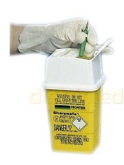
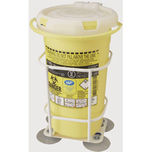
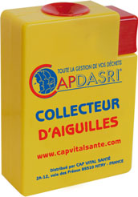

Tous les personnels de santé, d’intervention urgente ou de nettoyage sont exposés au risque de contact avec le sang contenant des agents infectieux. 
Les accidents d’exposition au sang (AES) sont potentiellement graves car ils exposent la victime à une transmission éventuelle d’agents infectieux, en particulier les virus des hépatites B ou C (HBV et HCV), ou du virus du SIDA (HIV), ces transmissions pouvant être associées. De nombreux autres agents pathogènes ont été mis en cause dans des cas de transmission, responsables d’infections au pronostic parfois grave. 
Le risque de « piqûre septique » est bien documenté. Tout patient peut transmettre un agent pathogène à un soignant,  par accident percutané (APC) ou par contact cutanéo-muqueux (CCM). 
Le risque pour les soignants de « rencontrer » un pathogène donné augmente avec sa prévalence (nombre de cas dans la population) parmi les patients soignés et avec le caractère chronique de l’infection. 
Le risque d’AES ne concerne pas seulement les personnels soignants mais toute personne en contact avec du sang ou des produits souillés par du sang. De nombreux cas ont été décrits chez des personnels de laboratoire, et quelques cas ont été relevés chez des personnels de secours d’urgence, des forces de police ou des personnels chargés de l’élimination des déchets de soins. Par ailleurs, les personnels travaillant au contact d’animaux encourent un risque d’infection après AES par des pathogènes zoonotiques.

## I. Définition

Un accident d'exposition au sang (AES) est défini comme tout contact avec du sang, ou du liquide biologique contenant du sang, à la suite :

- d’une effraction cutanée (piqûre, coupure, blessure, morsure…),
- d’un contact sur une peau lésée (eczéma, lésions antérieures),
- de la projection sur une muqueuse (bouche, œil…).

Soit tout contact d'une muqueuse ou d'une peau lésée avec du sang ou avec tout autre tissu ou fluide biologique susceptible de contenir un agent pathogène et de permettre la pénétration de cet agent.  
Les liquides biologiques concernés sont :

- le sang en premier lieu,
- mais aussi les urines, l’ascite, le liquide céphalorachidien,
- plus rarement le liquide gastrique ou le liquide pleural…

En effet, certains de ces pathogènes peuvent être concentrés dans d’autres liquides biologiques que le sang : VIH dans le liquide céphalo-rachidien ou le liquide spermatique, virus des hépatites dans le liquide d’ascite.

**Selon les circonstances de survenue des AES, on distingue :**

**Les AES dits professionnels (accidents de travail):**

- touchant essentiellement le personnel de santé exposé lors de la réalisation de soins plus ou moins invasifs mettant en jeu différents liquides biologiques, les personnels de laboratoire qui manipulent les échantillons.
- les personnels d’entretien sont également concernés : ils peuvent être en contact avec du matériel contaminé, en particulier par piqûre avec du matériel injectable jeté dans une poubelle…
- mais aussi  toute profession potentiellement exposante (sportifs, forces de police...).

**Les AES dits non professionnels qui concernent :**

- avant tout les rapports sexuels à risque non protégés,
- mais aussi les échanges de matériel injectable ou toute autre situation chez les usagers de drogue intraveineuse,
- les morsures.

<table>

<tbody>

<tr>

<td>Lors d’un accident d’exposition au sang, il existe un risque de transmission de germes : virus, bactéries, parasites … éventuellement présents dans le sang ou les liquides biologiques.</td>

</tr>

</tbody>

</table>

## II. Les agents infectieux transmissibles

En pratique, on craint essentiellement la transmission de 3 virus avec un risque de transmission variable selon le virus en cause et le mode de contamination :

- Le virus de l’hépatite B,
- Le virus de l’hépatite C,
- Le virus du SIDA.

<table>

<thead>

<tr>

<th scope="row">Virus</th>

<th scope="col">Risque après  
APC en %</th>

<th scope="col">Risque après  
CCM en %</th>

</tr>

</thead>

<tbody>

<tr>

<th scope="row">

VHB

VHC

VIH

</th>

<td>

30

0,5 à 3

0,3

</td>

<td>

?

?

0,03

</td>

</tr>

</tbody>

</table>

Il existe des cas documentés pour la transmission d'autres agents pathogènes : paludisme, syphilis, fièvres hémorragiques virales… (cf tableaux 1 à 4).

<table>
<caption>Tableau 1 : virus décrits comme ayant été transmis suite à un AES</caption>

<thead>

<tr>

<th scope="row">Pathogène</th>

<th scope="col">Exposition</th>

<th scope="col">Contexte</th>

</tr>

</thead>

<tbody>

<tr>

<th class="rteleft" scope="row">Dengue</th>

<td>Piqûre</td>

<td>Soins hospitaliers</td>

</tr>

<tr>

<th class="rteleft" scope="row"><em>Herpes simplex 1</em></th>

<td>Piqûre, peau lésée</td>

<td>Soins hospitaliers</td>

</tr>

<tr>

<th class="rteleft" scope="row">Virus amaril  
(fièvre jaune)</th>

<td>Peau lésée (suspecté)</td>

<td>Laboratoire hospitalier</td>

</tr>

<tr>

<th class="rteleft" scope="row">Virus de l'hépatite B</th>

<td>Piqûre, peau lésée</td>

<td>Soins hospitaliers</td>

</tr>

<tr>

<th class="rteleft" scope="row">Virus de l'hépatite C</th>

<td>Piqûre, peau lésée</td>

<td>Soins hospitaliers</td>

</tr>

<tr>

<th class="rteleft" scope="row">Virus de l'hépatite D</th>

<td>Piqûre</td>

<td>Soins hospitaliers</td>

</tr>

<tr>

<th class="rteleft" scope="row">Virus de  
l'Immunodéficience Humaine</th>

<td>Piqûre, peau lésée</td>

<td>Soins hospitaliers</td>

</tr>

<tr>

<th class="rteleft" scope="row">Virus de Lassa</th>

<td>Peau lésée</td>

<td>Soins hospitaliers</td>

</tr>

<tr>

<th class="rteleft" scope="row">Virus de Marburg</th>

<td>Piqûre, peau lésée</td>

<td>Soins hospitaliers</td>

</tr>

<tr>

<th class="rteleft" scope="row">Virus Ebola</th>

<td>Peau lésée</td>

<td>Soins hospitaliers</td>

</tr>

<tr>

<th class="rteleft" scope="row">Virus Zona Varicelle (VZV)</th>

<td>Piqûre</td>

<td>Soins hospitaliers</td>

</tr>

</tbody>

</table>

\$1<table>

<caption>Tableau 2 : bactéries décrites comme ayant été transmises suite à un AES</caption>

<thead>

<tr>

<th scope="row">Pathogène</th>

<th scope="col">Exposition</th>

<th scope="col">Contexte</th>

</tr>

</thead>

<tbody>

<tr>

<th class="rteleft" scope="row"><em>Corynebacterium diphteriae</em></th>

<td>Piqûre</td>

<td>Laboratoire hospitalier</td>

</tr>

<tr>

<th class="rteleft" scope="row"><em>Mycobacterium leprae</em></th>

<td>Piqûre</td>

<td>Soins hospitaliers</td>

</tr>

<tr>

<th class="rteleft" scope="row"><em>Mycobacterium marinum</em></th>

<td>Piqûre</td>

<td>Laboratoire hospitalier</td>

</tr>

<tr>

<th class="rteleft" scope="row"><em>Mycobacterium tuberculosis</em></th>

<td>Piqûre</td>

<td>Soins hospitaliers</td>

</tr>

<tr>

<th class="rteleft" scope="row"><em>Staphylococcus aureus</em></th>

<td>Piqûre</td>

<td>Nettoyage</td>

</tr>

<tr>

<th class="rteleft" scope="row">Streptocoque A (fasciite nécrosante)</th>

<td>Peau lésée</td>

<td>Soins hospitaliers</td>

</tr>

</tbody>

</table>

\$1<table>

<caption>Tableau 3 : parasites décrits comme ayant été transmis suite à un AES</caption>

<thead>

<tr>

<th scope="row">Pathogène</th>

<th scope="col">Exposition</th>

<th scope="col">Contexte</th>

</tr>

</thead>

<tbody>

<tr>

<th class="rteleft" scope="row"><em>Leishmania spp</em></th>

<td>Piqûre, peau lésée</td>

<td>Laboratoire hospitalier</td>

</tr>

<tr>

<th class="rteleft" scope="row"><em>Plasmodium falciparum</em></th>

<td>Peau lésée</td>

<td>Soins hospitaliers</td>

</tr>

<tr>

<th class="rteleft" scope="row"><em>Plasmodium malariae</em></th>

<td>Piqûre, peau lésée</td>

<td>Soins hospitaliers</td>

</tr>

<tr>

<th class="rteleft" scope="row"><em>Plasmodium vivax</em></th>

<td>Piqûre</td>

<td>Soins hospitaliers</td>

</tr>

<tr>

<th class="rteleft" scope="row"><em>Trypanosoma brucei</em></th>

<td>Piqûre</td>

<td>Laboratoire hospitalier</td>

</tr>

<tr>

<th class="rteleft" scope="row"><em>Trypanosoma cruzi</em></th>

<td>Projection</td>

<td>Laboratoire hospitalier</td>

</tr>

</tbody>

</table>

\$1<table>

<caption>Tableau 4 : agents fongiques décrits comme ayant été transmis suite à un AES</caption>

<thead>

<tr>

<th scope="row">Pathogène</th>

<th scope="col">Exposition</th>

<th scope="col">Contexte</th>

</tr>

</thead>

<tbody>

<tr>

<th class="rteleft" scope="row"><em>Cryptococcus neoformans</em></th>

<td class="rtecenter">Piqûre</td>

<td class="rtecenter">Soins hospitaliers</td>

</tr>

</tbody>

</table>

## III. Conduite à tenir devant un AES

Une conduite à tenir doit être définie dès qu’il existe un risque d’accident d’exposition au sang.  
Un protocole doit être affiché et porté à la connaissance des personnels exposés.  
Le personnel doit connaître à l’avance les règles de prise en charge de son pays et les structures de référence les plus proches de son lieu de travail. 

### 1. Premiers soins à réaliser immédiatement

En cas de piqûre, blessure, contact avec une peau lésée :

- Stopper l’activité en cours, laisser saigner, ne pas comprimer.
- Nettoyer rapidement à l’eau et au savon, rincer abondamment, sécher.
- Réaliser l’antisepsie de la plaie par trempage 10 minutes dans de l’hypochlorite de sodium ou l’alcool à 70°.
- En cas de projection sur les muqueuses ou l’œil, rincer abondamment à l’eau ou au sérum physiologique durant 10 minutes.

### 2. Rechercher le statut sérologique de la personne source

Par la réalisation des tests suivants, si cela est possible :

- tests rapides de dépistage du VIH ;
- sérologie VIH ;
- sérologie VHC ;
- sérologie VHB complète si la personne source n'est pas vaccinée.

Il est également souhaitable de connaître le statut sérologique de la personne exposée.  
Si la personne source est porteuse du VIH, adapter, si nécessaire, le traitement post-exposition (TPE) de la personne qui a été exposée.

<table>

<tbody>

<tr>

<td>Jamais de traitement si :<ul><li>le patient source a une sérologie VIH négative connue,</li><li>le personnel victime a une sérologie VIH positive avant l’AES.</li></ul></td>

</tr>

</tbody>

</table>

### 3. Contacter immédiatement un médecin référent

pour la prophylaxie de l’infection au VIH

Le risque infectieux est évalué selon plusieurs critères :

- type d’exposition ;
- profondeur de la blessure ;
- type d’aiguille ou de matériel en cause ;
- nature du liquide biologique ;
- si possible, le statut sérologique du patient source.

En cas d’exposition, le risque de transmission est d’autant plus grand que l’inoculum infectieux est élevé, soit par son volume (piqûre profonde, aiguille de gros calibre, surface de peau lésée exposée) soit par le nombre de particules infectieuses (charge virale, bactériémie ou parasitémie élevée).  
L’évaluation du risque doit donc tenir compte du type d’exposition, mais aussi du liquide potentiellement contaminant.  
En l’absence de ces données, il peut être difficile de savoir s’il est nécessaire de prescrire une chimioprophylaxie ou un traitement présomptif, ou d’établir un programme de suivi post-exposition.  
Les sérologies ne sont pas toujours disponibles, le patient source n’est pas toujours interrogeable.

Si un traitement est décidé, il doit être débuté dans les 48 heures ; les molécules seront choisies selon les recommandations nationales.  
Le traitement prophylactique sera accompagné de conseils pour les 6 mois suivants

- pas de grossesse : une contraception est nécessaire,
- rapports protégés,
- pas d’allaitement,
- pas de don du sang.

Un certificat médical initial est essentiel, qui permettra le suivi des personnes exposées : en effet, il peut être impossible d’établir *a posteriori* un lien avec un AES. Les personnels infectés peuvent être vus dans d’autres établissements de soins n’ayant accès à aucun document pouvant préciser l’exposition.

## IV - Surveillance

### 1. Pour le VIH

#### Si le patient source est séronégatif pour le VIH

- inutile d'effectuer une surveillance
- sauf en cas de risque de primo-infection chez la personne source.

#### Si le patient source est séropositif ou de statut inconnu pour le VIH

- surveilllance nécessaire jusqu'au 4ème mois en cas de traitement post-exposition.
- Puis, suivant l’instauration ou non d’un traitement prophylactique post-exposition (TPE):
  - si la personne n'a pas été mise sous traitement prophylactique, sérologie aux premier et troisième mois à compter de la date de l'accident;
  - si la victime a été mise sous traitement prophylactique, sérologie aux deuxième et quatrième mois à compter de la date de l'accident.

### 2. Pour le VHC

- Suivi effectué si le patient source est infecté par le VHC : diagnostic par recherche de l'ARN du VHC en cas d'anticorps anti-VHC positifs chez le patient source.
- Suivi effectué également si le statut sérologique VHC est inconnu.
- Le traitement post-exposition du VHC n’est pas indiqué.
- Il faut cependant dépister une éventuelle séroconversion qui serait une indication du traitement anti-VHC (interféron).

### 3. Pour le VHB

Pour les personnes non vaccinées et pour les personnes vaccinées mais non-répondeurs :

- sérovaccination par immunoglobulines anti-HBS et injection d'une dose de vaccin;
- la vaccination sera ensuite complétée suivant le schéma vaccinal recommandé.

## V. Prévention

Tout accident d’exposition au sang doit faire l’objet d’une enquête afin de mettre en place des mesures préventives, pour éviter toute récidive.  
La prévention des accidents d’exposition au sang, AES, est essentielle compte tenu de leur gravité potentielle. Eelle repose principalement sur le respect des précautions standard.

<table>

<tbody>

<tr>

<td><ul><li>Ne jamais recapuchonner les aiguilles.</li><li>Utiliser des collecteurs d’objets perforants pour éliminer le matériel (aiguilles, matériels coupants ou tranchants)</li></ul></td>

</tr>

</tbody>

</table>

### 1. Utilisation de matériels de sécurité

Certains matériels de sécurité permettent de réaliser les gestes de prélèvements, injections, dans de plus grandes conditions de sécurité :

- seringues, systèmes de prélèvements, scalpels, pourvus d’un manchon de protection qui vient recouvrir l’aiguille ou la lame, après le geste ;
- aiguilles de suture à bout mousse, qui sont moins dangereuses pour l’opérateur que les aiguilles classiques ;
- autopiqueurs autorétractables pour les prélèvements effectués en capillaire ;
- systèmes de prélèvement sous vide,
- pour les stylos-injecteurs d'insuline, il existe une aiguille de sécurité : aiguille universelle qui s'adapte sur tous les modèles de stylos. Lorsque l'injection est effectuée, l'aiguille se rétracte automatiquement.  
  Elle permet la prévention d'une des causes majeures d'AES en milieu hospitalier.  
  Son coût est par contre dix fois supérieur à celui d'une aiguille classique:

### 2. Mesures de précautions standard

pour la prévention des Accidents d'Exposition au Sang

#### Lavage, désinfection des mains, avec des solutions hydro alcooliques

- systématiquement entre l'examen de deux patients, entre deux activités,
- immédiatement en cas de contact avec des liquides potentiellement contaminants.

#### Port de gants

Les gants doivent être changés entre deux patients, entre deux activités, à l'occasion de soins à risque de piqûres, lors de la manipulation de tubes de prélèvements biologiques, de linge et de matériel souillés, et systématiquement lors des soins lorsque les mains du soignant comportent des lésions.

#### Port de lunettes, masques, surblouses

Si les soins exposent à un risque de projection ou d'aérosol de sang, ou de tout autre produit d'origine humaine (intubation, aspiration, endoscopie, acte opératoire, autopsie.....).

#### Matériel

Matériel souillé : pour tout matériel piquant ou tranchant à usage unique :

- ne jamais recapuchonner les aiguilles,
- ne pas les désadapter à la main,
- déposer dans un conteneur adapté, situé au plus près du soin, immédiatement après usage. Le niveau maximal du conteneur de remplissage doit être vérifié : le conteneur ne doit jamais être totalement rempli.
- Matériel réutilisable : manipuler avec précaution ce matériel souillé.

#### Surfaces souillées

Nettoyer, puis désinfecter, avec de l'eau de javel à 9% fraîchement diluée au 1/5ème, ou tout autre désinfectant approprié, les surfaces souillées par du sang ou tout autre produit d'origine humaine.

#### Transport du linge et des matériels souillés

Les linges et instruments souillés par le sang doivent être évacués du service dans un emballage fermé étanche.

#### Au laboratoire

Les précautions doivent être prises pour tous les prélèvements.  
L'identification de prélèvements «à risque» est une mesure qui peut être dangereuse car elle apporte une fausse sécurité; tous les prélèvements doivent être transportés dans des tubes ou flacons hermétiques, sous emballage étanche.  
Ne jamais pipeter à la bouche.  
Porter des gants.

#### Au bloc opératoire

- Changer régulièrement de gants, porter 2 paires de gants, notamment pour l'opérateur principal, lors de la suture des plans pariétaux.
- Porter des masques à visière, ou des lunettes de protection.
- Utiliser des techniques opératoires limitant les risques (coordination, protection de la main controlatérale, aiguilles à bout mousse quand c'est possible).

<table>
<caption>Tableau 5 : conduite à tenir devant un AES</caption>

<tbody>

<tr>

<td>

A - Conduite à tenir :

<ul><li>procéder aux soins locaux antiseptiques immédiats ;</li><li>évaluer le risque infectieux du patient source ;</li><li>contacter le référent médical pour la prise en charge de la personne exposée ;</li><li>mettre en place des mesures préventives, pour éviter toute récidive.</li></ul>

B -  Les antiseptiques recommandés :

<ul><li>chlorhexidine alcoolique, povidone iodée alcoolique, alcool à 70 %, Biseptine® pour le traitement d’une peau saine ;</li><li>povidone iodée aqueuse, chlorhexidine aqueuse, Biseptine® pour  
une peau lésée ;</li><li>povidone iodée aqueuse pour les muqueuses.</li></ul>

Le soluté d’hypochlorite de sodium est adapté aux 3 cas.

</td>

</tr>

</tbody>

</table>

\$1<table>

<caption>Tableau 6 : prévention des AES</caption>

<tbody>

<tr>

<td>

#### Précautions universelles de soins

Lors de tout contact ou risque de contact :

<ul><li>se laver les mains,</li><li>couvrir toute plaie par un pansement,</li><li>porter des gants, en particulier lors de la manipulation d’objets coupants ou contaminés,</li><li>ne jamais plier ni recapuchonner une aiguille, jeter immédiatement tous les instruments piquants ou coupants dans un collecteur spécifique (utiliser des conteneurs adaptés pour déchets contaminés),</li><li>se protéger des projections,</li><li>utiliser des systèmes de prélèvements et de cathéters protégés.</li></ul></td>

</tr>

</tbody>

</table>

**Exemples de conteneurs pour  
Déchets d'Activités de Soins à Risques Infectieux (DASRI)**

