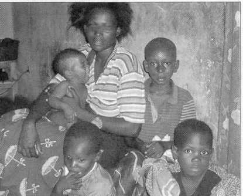

Le Service de Pédiatrie compte 98 lits. Sont hospitalisés et suivis tous les enfants âgés de 1 mois à 15 ans, toutes affections confondues.

Dans notre service, en Décembre 2004, 34 enfants vivant avec le VIH sont régulièrement suivis, parmi lesquels :

*   15 enfants sous traitement anti-rétroviral,
*   2 enfants en attente de traitement,
*   17 enfants suivis biologiquement et cliniquement.

Parmi ces 34 enfants, plus de la moitié ont perdu l'un de leurs parents ou les deux :

*   13 sont orphelins de mère,
*   8 orphelins de mère et de père,
*   1 orphelin de père,
*   12 ont leurs parents vivants.

## I. Conditions de vie des familles

La majorité des familles se trouve dans une situation de précarité économique et matérielle, souvent avec une nombreuse fratrie et des collatéraux à leur charge.

### 1. Organisation de la prise en charge psycho-sociale des enfants et leur famille

#### Au niveau du Service de Pédiatrie

La gratuité des consultations est accordée aux enfants dès lors que leur séropositivité est établie. Le pré et post test se font dans le service par un médecin formé et responsabilisé pour ce programme.

Le test de dépistage se fait au laboratoire du Centre de Traitement Ambulatoire, équipé du matériel nécessaire au suivi immunitaire et virologique. Après l'annonce, un dossier est ouvert dans le service permettant la prise en charge de l'enfant par le médecin responsable, le chef de service et l'équipe soignante.

En plus de la surveillance médicale et des traitements spécifiques, les enfants bénéficient de suppléments alimentaires par l'unité de récupération nutritionnelle du service avec un appui du PAM (Programme Alimentaire Mondial) et de l'Appel (ONG française qui a une antenne locale).

L'assistante sociale reçoit les familles individuellement, sur demande du médecin. Elle procède à un entretien initial au cours duquel les difficultés familiales, économiques, scolaires, relationnelles, etc... sont examinées. Une prise en charge sociale, toujours délicate et complexe, est proposée, comportant un entretien à chaque visite médicale et une visite à domicile mensuelle, si la famille en donne l'autorisation, et de toutes façons, en cas de rupture du suivi.

#### Les visites à domicile

En effet, le suivi de l'enfant est grandement amélioré par une pratique régulière des visites à domicile. Celles-ci ont pour but de favoriser :

*   l'éducation des parents afin qu'ils puissent mieux comprendre la maladie et accompagner leur enfant ;
*   l'adhésion des parents à cette prise en charge multi-disciplinaire ;
*   la compréhension des parents au sujet des règles d'hygiène et du suivi de la croissance des enfants ;
*   l'encouragement au suivi médical régulier. Il s'agit d'inciter les parents à amener l'enfant à la consultation médicale dans le service pour les rendez-vous fixés ou au moindre signe d'alerte ;
*   l'observance des traitements par les enfants ; l'établissement d'un climat de confiance entre les parents et les enfants ainsi que l'entourage (personnel médical - parents, amis) ;
*   la lutte contre la précarité financière et matérielle par un programme d'aide associative au développement d'activités génératrices de revenus (AGR).

Sur ce point, un pécule et un fond de roulement est alloué aux parents par l'Association l'Appel. Ceux-ci permettent de développer une activité de salage et séchage du poisson sous serre ou financent une formation à la couture et à la broderie dans un atelier-école associatif. Ces activités apportent des revenus modestes mais réguliers. Elles permettent aux familles de retrouver une certaine autonomie et de mieux faire face aux besoins de l'enfant.

### 2. Difficultés rencontrées

Malgré le conseil pré et post test, il est encore difficile d'obtenir le consentement des parents ou des tuteurs pour faire le test de dépistage. Quand l'enfant est dépisté, beaucoup de parents continuent à lier la maladie à la malédiction et à la sorcellerie, d'où le refus de prise en charge qui entraîne la perte de vue ou une mauvaise observance de traitement.

### 3. Suggestions

*   Intensifier la vulgarisation de l'information sur l'infection à VIH/SIDA par les associations, les médias, le personnel médical.  
*   Former la majorité du personnel aux techniques de counselling.  
*   Promouvoir la lutte contre la précarité financière et matérielle par la création des activités génératrices de revenus (AGR) dans toutes les familles suivies.  
*   Organiser les parents des enfants vivant avec le VIH en association pour leur permettre de s'exprimer, de partager leur expérience et aussi améliorer la prise en charge globale de leur enfant.

## II. Conclusion

Si le budget de cette prise en charge sociale et la gratuité du suivi et du traitement ont pu être jusque-là assurée aux parents par le soutien associatif et la réduction des coûts des ARV, il reste encore beaucoup de frais à la charge des familles. Les mères seules ou conjointes d'un homme malade, incapable de travailler, sont les plus vulnérables car elles peuvent difficilement se soigner elles-mêmes et garder les forces pour faire face aux problèmes de tous ordres qui se posent à elles : rejet, exclusion, pauvreté, santé et éducation de leurs enfants, faible niveau d'instruction et de compétences professionnelles, etc... Les enfants et surtout les orphelins accueillis par des tuteurs intra ou extra-familiaux sont parfois privés de scolarisation, à cause des frais d'écolage trop élevés. Enfin, le financement associatif est très dépendant de bailleurs de fonds qui ne sont pas tous encore persuadés de la nécessité d'une prise en charge globale des enfants atteints de maladies telles que l'infection à VIH/SIDA. La pérennité des actions sociales en faveur des enfants atteints et des orphelins est donc fragile, alors qu'elle a des conséquences directes sur leur survie, leur qualité de vie, et surtout la qualité de l'observance aux ARV, seule garante de leur efficacité, à court et à long terme.

_Développement et Santé, n°173, octobre 2004_