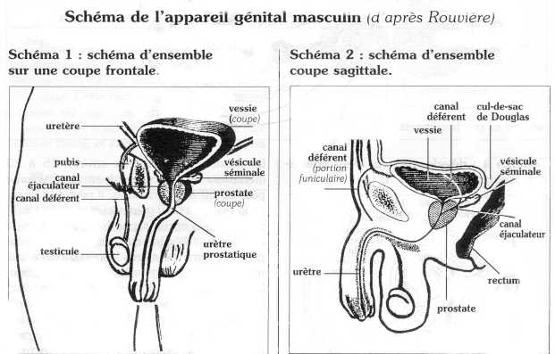
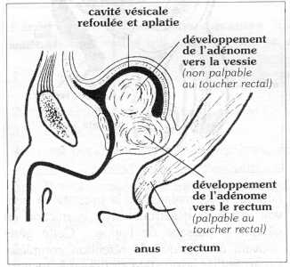
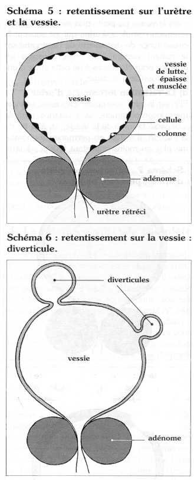
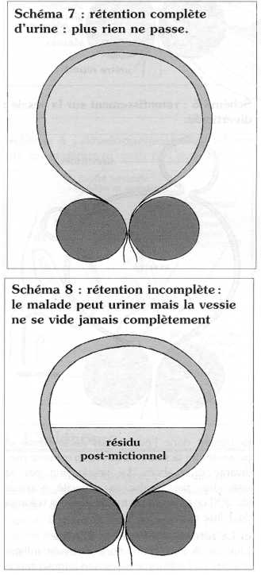
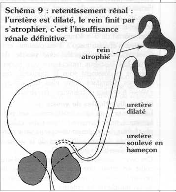

**La prostate** est une glande sexuelle **n'existant que chez l'homme**, ses sécrétions entrent dans la composition du sperme, elle sécrète aussi des hormones.

Elle est située juste sous la vessie et **entoure l'urètre** ; à son niveau, les canaux éjaculateurs viennent se jeter dans l'urètre et y déversent le sperme au moment de l'éjaculation. Sous la prostate, autour de l'urètre, se trouve le sphincter strié qui permet la commande volontaire de la miction _[action d'uriner]_ (en s'ouvrant au moment où l'on désire uriner, en restant fermé le reste du temps). La prostate est donc située au carrefour des voies génitales et urinaires chez l'homme.

On comprend donc facilement que, entourant l'urètre, toute maladie de la prostate va pouvoir entraîner des troubles de la miction en gênant le passage de l'urine... Cette gêne pouvant aller jusqu'à la rétention complète. En arrière de la prostate se trouve le rectum. On pourra donc aisément palper la prostate lors du toucher rectal.

Trois maladies peuvent intéresser la prostate :

*   l'infection de la prostate ou prostatite : complication de la blennorragie (gonocoque), mais aussi la tuberculose ;
*   le cancer de la prostate ;
*   l'adénome de la prostate.

## I. L'adénome

C'est une tumeur bénigne, c'est-à-dire qu'une partie des tissus constituant la prostate va augmenter de volume. Mais, à la différence du cancer, la tumeur reste limitée à la prostate, elle ne récidivera pas après traitement et ne se disséminera pas dans le reste du corps sous forme de métastases _(voir schéma 4)._

**Schéma 4 : développement d'un**  
**adénome prostatique** (d'après R. Couvelaire)

La prostate normale pèse environ 15 à 20 grammes, un adénome de moyen volume pèse de 60 à 80 grammes, il peut être beaucoup plus gros (200 grammes et plus, parfois !), mais il n'y a aucun rapport entre la taille de l'adénome et la gêne qu'il peut entraîner : un petit adénome peut très bien provoquer une rétention et un très gros être très bien supporté. L'adénome prostatique se développe chez l'homme vers l'âge de 60 ans avec une **extrême fréquence**, près de 80 % des hommes en sont atteints à 60 ans ! Mais, sur ce grand nombre d'adénomes, peu vont entraîner des troubles et, parmi ceux-ci, 10 % seulement nécessiteront une intervention chirurgicale.

Tout porteur d'adénome n'est pas forcément malade. Tout malade porteur d'adénome n'est pas forcément à opérer ! L'adénome se développe le plus souvent latéralement, de chaque côté de l'urètre, sous forme de deux lobes qui sont aisément palpés au toucher rectal, mais parfois aussi sous forme d'un lobe médian dont le développement se fera surtout à l'intérieur de la vessie et qui, bien que parfois très volumineux, ne sera pas toujours palpable au toucher rectal _(voir schéma 3)._

## II. Le retentissement de l'adénome

La situation anatomique de la prostate explique que l'adénome peut retentir, en diminuant le calibre de l'urètre, sur la vessie et, même, plus tardivement, sur les uretères et les reins. Mais, répétons-le, beaucoup d'adénomes n'auront pas ou très peu de conséquences. D'autres, plus rares, gêneront la vessie et le haut appareil.

### 1. Retentissement sur l'urètre

La prostate entoure l'urètre sous la vessie et, en augmentant de volume, va donc l'étirer et diminuer son calibre, gênant ainsi l'évacuation de l'urine. Cette gêne à la miction va être à l'origine du retentissement de l'adénome sur la vessie et le reste de l'appareil urinaire (uretères et reins), et explique les signes cliniques.

### 2. Retentissement sur la vessie

#### a. La vessie de lutte

La vessie n'est pas un sac à urine mais un **muscle** creux destiné à recueillir l'urine secrétée continuellement par les reins et à l'évacuer volontairement à intervalle régulier. L'urètre est plus fin, l'effort à fournir pour évacuer l'urine va donc être plus grand, et comme tout muscle qui travaille contre une résistance accrue, la vessie va s'épaissir (comme le biceps d'un sportif) de 3 à 4 mm en temps normal, elle peut s'épaissir jusqu'à 1 ou plusieurs cm. C'est une vessie musclée, une **vessie de lutte**. Les faisceaux musculaires sont hypertrophiés et dessinent sous la muqueuse des colonnes délimitant entre elles des cellules - vessie à cellules et colonnes - _(schéma 5)._

#### b. Les diverticules de vessie

La vessie ne peut lutter indéfiniment, entre les faisceaux musculaires au niveau des cellules plus faibles, la muqueuse vésicale va venir faire hernie, faisant saillie hors de la vessie : c'est un diverticule _(schéma 6)._  
Ces diverticules sont de taille variable et, si leur collet est étroit, une fois remplis d'urine, ils peuvent avoir du mal à s'évacuer puisque aucun muscle ne les entoure.

Ils gênent donc l'évacuation de la vessie et peuvent être la source d'infection urinaire récidivante ou d'abcès. La vessie finit par se distendre, par perdre sa capacité normale (de 300 cc environ) pour atteindre des volumes de 1 litre et plus.

#### c. La rétention complète d'urine

L'urètre, à l'occasion d'une poussée inflammatoire de l'adénome ou de son augmentation de volume, peut se trouver totalement obstrué, alors la vessie ne peut plus se vider. C'est la rétention complète d'urine qui est souvent la circonstance de découverte de l'adénome car le patient viendra alors vous consulter en urgence pour être soulagé de cette envie d'uriner impossible à soulager.

#### d. La rétention incomplète d'urine

Elle est la plus sournoise. La vessie se vide, mais incomplètement, la résistance urètrale a dépassé la force de la vessie, et, à la fin de la miction, il restera en permanence un volume plus ou moins important (300cc, 1 litre, et parfois plus). La vessie est distendue, a perdu sa capacité normale et ne récupérera pas une force de contraction normale après traitement.

#### e. La lithiase vésicale

La stase d'urine dans la vessie peut favoriser la formation de calculs vésicaux.

### 3. Le retentissement urétéral et rénal

Les uretères se trouvent gênés dans leur évacuation lorsque le muscle s'hypertrophie ou que la vessie reste en rétention, ils ne tardent pas alors à se distendre, l'urine peut refluer de la vessie vers les reins.

Les reins peuvent alors souffrir par gêne à l'évacuation de l'urine, avec risque d'infection du rein par reflux d'une urine infectée (souvent par des sondages intempestifs). A ce stade, l'insuffisance rénale s'installe peu à peu et peut entraîner la mort du malade... alors que, cliniquement, il ne se plaignait de rien tant il s'était habitué à des difficultés pour uriner, installées depuis des années et mises sur le compte de l'âge !

Mais, répétons-le "le retentissement de l'adénome sur l'appareil urinaire n'est ni obligatoire, ni progressivement croissant", un grand nombre d'adénomes n'entraîneront aucun trouble.

## III. Signes révélateurs

Ils surviennent **chez un homme à partir de la soixantaine** (pratiquement jamais avant 50 ans). Les signes se sont installés peu à peu, au fil des années, ce qui explique que, souvent, le malade s'est habitué à ses difficultés pour uriner et spontanément, il ne s'en plaindra pas, il faudra savoir rechercher ces signes par un interrogatoire très précis.

### 1. La dysurie (ou difficulté pour uriner)

Le malade s'en plaint parce qu'elle s'est accentuée récemment, ou, habitué à cette gêne, il ne s'en plaint pas, c'est votre interrogatoire qui la révèlera.

L'obstacle que constitue l'adénome à l'écoulement de l'urine explique facilement ces signes. Il existe un retard au début de la miction, entre le moment où le malade ressent le besoin d'uriner et le moment où l'urine s'écoule réellement.

*   le jet d'urine est faible, fin, parfois dédoublé ;
*   la miction est lente, interminable ;
*   le malade est obligé de pousser pour évacuer la vessie, parfois en s'aidant de ses mains pour appuyer sur son bas ventre ;
*   la fin de la miction n'est pas franche, des gouttes retardataires continuent à s'écouler alors que le malade a décidé d'arrêter d'uriner ;
*   il a la sensation de ne pas avoir évacué totalement sa vessie, qu'un résidu vésical persiste.

### 2. La pollakiurie

"Urinez-vous bien ? Oh oui, 15 fois par jour"

Voilà la réponse que vous obtiendrez souvent. Uriner bien n'est pas uriner souvent ! La vessie se vide mal, reste remplie par un résidu en fin de miction, elle a donc perdu sa capacité normale, le malade va donc uriner plus souvent que d'habitude pour éliminer en fait la même quantité d'urine : c'est la pollakiurie. Pendant la journée, le malade ne peut souvent pas chiffrer précisément le nombre de ses mictions (5 fois, 10 fois), mais par contre, demandez-lui combien de fois il doit se lever la nuit pour aller uriner (pollakiurie nocturne). Si ces mictions n'existent pas, c'est que bien souvent la pollakiurie n'existe pas. Si le malade est pollakiurique, il peut se lever 2, 3 et jusqu'à 10 fois par nuit !

### 3. L'hématurie

La présence de sang dans les urines peut être due à un adénome prostatique, les urines sont alors sanglantes en début de miction pour s'éclaircir à la fin (hématurie initiale) ou la totalité des urines est sanglante si le saignement est important (hématurie totale). Mais, avant d'accuser l'adénome, il faut rechercher une autre cause d'hématurie (bilharziose, calcul, tumeur .. ), car l'adénome saigne rarement et peut s'associer à d'autres maladies urinaires.

### 4. La rétention vésicale complète

C'est bien souvent elle qui amènera le malade à consulter, car le trouble est évident, il a envie d'uriner et il ne peut le faire, il a mal, il existe un globe vésical. Il faudra soulager le malade en rétablissant l'évacuation de l'urine, soit par sondage, soit par cathétérisme sus-pubien. Une fois la vessie vidée, le toucher rectal vous permettra de découvrir l'adénome (le toucher rectal, vessie pleine, ne permet pas d'apprécier le volume réel de la prostate).

### 5. L'incontinence d'urine

L'urine coule par la verge en permanence, le malade ne plus contrôler volontairement cet écoulement. Il s'agit aussi d'une rétention d'urine, la vessie est pleine en permanence, elle déborde ! La pression est telle qu'elle force le passage en permanence puisque l'urine vient du rein en permanence. Il s'agit d'une " incontinence par regorgement " _(voir schéma 10_).

### 6. Les accidents infectieux

Cystites, épididymites peuvent traduire l'infection de l'adénome ou une de ses complications, lithiase vésicale, diverticule.

### 7. L'insuffisance rénale

Des signes généraux traduisant l'insuffisance rénale : anémie, inappétence, vomissements, douleur abdominale, découverte d'une urée sanguine élevée doivent faire rechercher un cause dont l'adénome prostatique est une cause fréquente.

### 8. L'adénome de découverte fortuite

Il peut être découvert à l'occasion d'un examen pour une autre cause : hernie inguinale, toucher rectal; d'un examen clinique systématique ; d'une urographie intraveineuse pour une autre cause. Il faudra alors en rechercher l'éventuel retentissement.

### 9. Enfin et surtout aucun signe clinique anormal n'existe

Soit parce que l'adénome ne retentit pas su l'appareil urinaire, soit parce que le malade s'est habitué à de petites difficultés pour uriner depuis des années et ne songe pas à s'en plaindre. Bon nombre d'adénomes ne seront donc jamais vus. Mais si vous en découvre un, vous devez vous assurer, même si la gêne clinique n'existe pas, qu'il n'a pas entraîné une insuffisance rénale (examen de sang, radio).

## IV. Examen clinique

Aucun des signes cliniques n'est spécifique de l'adénome prostatique, ils traduisent seulement une gêne à l'écoulement de l'urine. L'examen clinique permettra de découvrir l'adénome.

### 1. Examen de la miction

Demandez au malade d'uriner devant vous, dans un verre, la dysurie est souvent évidente : retard au début, jet faible, poussée, goutte retardataire qui en disent mieux qu un long discours.

Examinez l'urine :

*   limpide, transparente : il n'existe pas d'infection;
*   trouble, ne s'éclaircissant pas après avoir ajouté quelques gouttes d'acide acétique (vinaigre) : il y a une infection urinaire.

### 2. Palpation

Palpez le bas du ventre à la recherche d'un globe vésical.

### 3. Toucher rectal

C'est le geste essentiel. La prostate ne pourra être bien palpée que si la vessie est vide. En avant, à 5 cm de l'anus environ, vous palperez la prostate ; habituez-vous à ce geste, seule l'expérience vous permettra de juger.

En cas d'adénome, la prostate tombe dans le rectum. Elle est grosse, arrondie, bilobée, élastique (comparée à la consistance d'une balle de tennis). Avec un peu d'habitude, le diagnostic ne fait aucun doute.

### 4. Etude des antécédents

Recherchez des antécédents d'urétrite-blennorragie qui peuvent faire suspecter un rétrécissement urétral associé.

### 5. Examen général

Appréciez l'état général, recherchez une hernie.

L'**interrogatoire** et le **toucher rectal** vous auront permis de faire le diagnostic dans la majorité des cas. Mais si l'adénome ne s'est développé qu'au niveau du "lobe médian", le toucher rectal peut être normal.

## V. Examens complémentaires

Leur but est de préciser le retentissement de l'adénome.

### 1. Dosage de l'urée sanguine, ou mieux, de la créatinine

Son élévation traduit l'insuffisance rénale qui peut parfois être réversible.

### **2. Examen cytobactériologique des urines**

Pour rechercher l'existence d'une infection surajoutée.

### 3. Urographie intraveineuse

Cette radiographie permet d'opacifier les voies urinaires, elle va montrer l'adénome et son éventuel retentissement :

*   au niveau de la vessie, on voit la saillie de l'adénome et, éventuellement, des signes de lutte (cellules et colonnes, diverticule). On apprécie le degré de distension de la vessie et l'existence d'un résidu après miction, d'une éventuelle lithiase;
*   au niveau des uretères : leur extrémité est soulevée (en hameçon) par l'adénome. On apprécie leur degré de dilatation, l'existence éventuelle d'un reflux;
*   Au niveau des reins : leur valeur fonctionnelle peut être appréciée (retard des sécrétions, épaisseur du parenchyme, état des calices);

### 4. D'autres examens

Ils sont plus rarement utilisés :

*   urétro-cystoscopie qui, grâce à un appareil optique, permet de voir directement l'urètre et la vessie;
*   urétro-cytographie rétrograde : opacification radiographique de l'urètre en y injectant directement un produit opaque.

Ainsi l'examen clinique et la radiographie auront permis de différencier l'adénome des autres causes de dysurie :

*   le rétrécissement urétral (mais il peut être associé à l'adénome);
*   le cancer de la prostate (prostate dure au toucher rectal);
*   la prostatite (fièvre et douleur au toucher rectal).

## VI. Evolution

Elle est très variable d'un malade à l'autre.

**1.** Certains adénomes ne donneront lieu à aucune gêne pour uriner ni à aucun retentissement.

**2.** D'autres entraîneront une dysurie plus ou moins importante sans retentir sur la vessie et les uretères.

**3.** Certains peuvent s'infecter passagèrement (adénomite) et majorer la dysurie quelques jours ou même provoquer une rétention d'urine. Une fois cette poussée inflammatoire guérie, tout peut rentrer dans l'ordre.

**4.** D'autres retentiront progressivement sur la vessie et les uretères jusqu'à provoquer l'insuffisance rénale et la mort.

**5.** Cancer et adénome de la prostate peuvent s'associer, mais un adénome ne dégénère pas en cancer.

## VII. Traitement

**1.** Un adénome bien toléré cliniquement et n'entraînant pas de retentissement urinaire ne nécessite aucun traitement.

**2.** Il existe de nombreux médicaments pour "soigner" l'adénome de la prostate : ils sont chers et aucun ne guérira l'adénome. Ils peuvent cependant avoir une certaine utilité lors des poussées inflammatoires, en agissant sur l'oedème qui gonfle passagèrement l'adénome; ils peuvent soulager une dysurie majorée passagèrement ou aider à faire régresser une rétention due à une adénomite (en plus du sondage).

Aucun médicament ne fera disparaître l'adénome lui-même. De petits moyens peuvent aussi soulager : bain de siège, lavements tièdes.

Citons quelques médicaments anti-inflammatoires: Tadenan®, Pelvomagnésium®, Kaviase®, Prostati Dausse®...

**3.** Une rétention complète doit être soulagée par sondage ou cathétérisme sus-pubien ; le malade, après quelques jours, pourra récupérer des mictions normales si sa rétention était due à un simple oedème passager de la prostate. Mais cette rétention pourra récidiver quelque temps plus tard.

**4.** Le traitement curatif des adénomes est chirurgical mais il ne doit s'appliquer qu'aux adénomes mal tolérés, c'est-à-dire :

*   Ceux entraînant un grand inconfort pour le malade : dysurie importante, pollakiurie nocturne fréquente. C'est le malade lui-même qui demande à être soulagé et, même en l'absence de retentissement rénal, l'opération est alors justifiée.  
*   L'existence d'un retentissement vésical important (résidu post-mictionnel important, incontinence par regorgement, rétention complète d'urine ne régressant pas), _a fortiori_ un retentissement rénal, une insuffisance rénale, imposent l'opération. Si l'adénome est vu assez tôt, l'insuffisance rénale peut régresser.

## VIII. Technique chirurgicale

L'adénome peut être opéré à ventre ouvert ou par les voies naturelles (endoscopie).

### 1. La résection endoscopique

Elle consiste à introduire par l'urètre un appareillage optique muni d'un bistouri électrique qui permettra, sous contrôle de la vue, de réséquer l'adénome.

Cette technique demande un grand entraînement, elle ne s'adresse qu'aux petits adénomes... et nécessite de posséder l'appareillage.

### 2. L'ablation à ventre ouvert

De nombreuses techniques existent, mais, la plus utilisée consiste à ouvrir la vessie et à énucléer l'adénome au doigt car cette tumeur est facilement clivable du reste de la glande.

Quelle que soit la technique utilisée, les risques sont les mêmes : l'hémorragie postopératoire est fréquente, contrôlée par des sondes urinaires et des lavages vésicaux. C'est dire que cette chirurgie ne peut être entreprise que si on a la possibilité de transfuser la malade et de le surveiller continuellement pendant les premiers jours postopératoires, le rôle de l'infirmier en chirurgie est ici essentiel.

A part l'hémorragie, les complications sont rares fistule vésicale, incontinence en cas de lésion de sphincter strié, épidymite. A la suite de cette intervention, le malade 'ne sera pas impuissant, mais il sera stérile car ses éjaculations se feront vers la vessie. De plus, bien souvent l'intervention est complétée par la section des canaux déférents, de peu d'incidence en pratique car cette maladie touche des gens âgés.

Chez les vieillards ne pouvant supporter l'intervention, mais dont l'état nécessite de rétablir une possibilité d'évacuation vésicale, il est justifié de poser une sonde urinaire à demeure ou une cystostomie.

Ainsi, l'adénome de la prostate est fréquent à partir de la soixantaine, il faut savoir le rechercher à l'interrogatoire et le diagnostiquer au toucher rectal. Le malade s'est souvent habitué à cette gêne très progressive, il faudra savoir déceler ceux dont l'adénome retentit sur la fonction rénale afin d'éviter l'insuffisance rénale mortelle.

_Développement et Santé, n° 165, juin 2003_