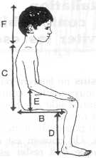
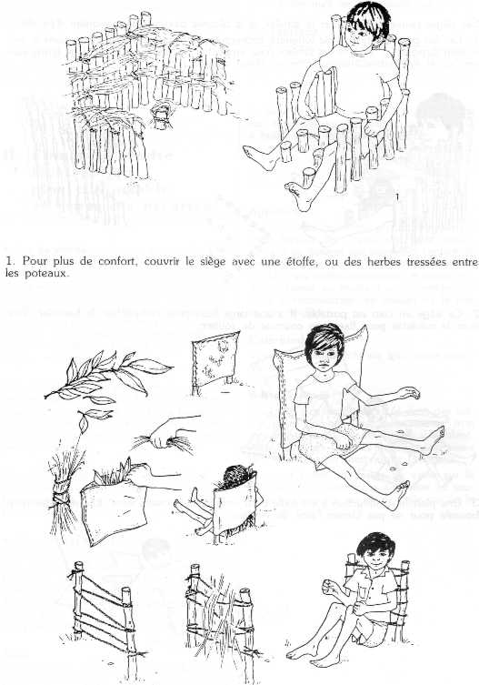
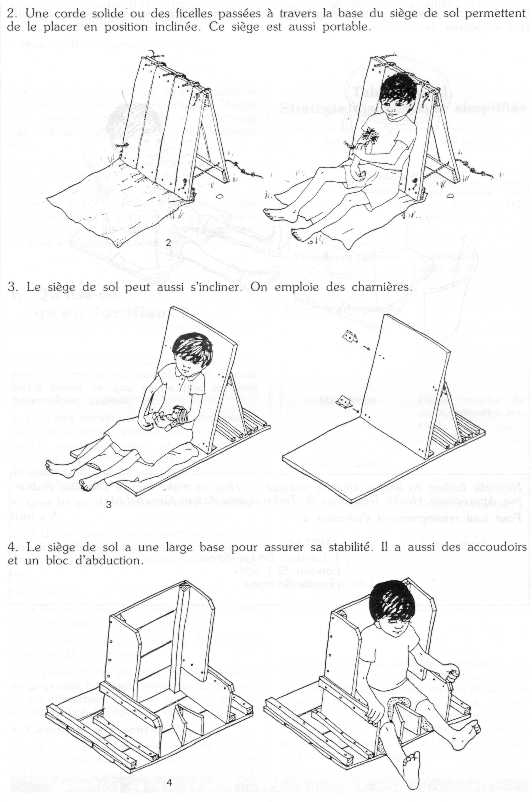
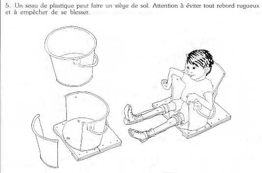

## I. Prendre les mesures pour fabriquer un siège

Avant tout, il faut choisir le siège qui répondra le mieux aux besoins de l'enfant et déterminer exactement le nombre de supports nécessaires (pour le dos, le cou et la tête, les bras et les pieds). Il serait bon de prendre un avis médical pour cela.

- Si l'enfant peut s'asseoir, le placer dans une chaise à dossier droit.

- Utiliser un centimètre de couturière ou à défaut un morceau de ficelle ou de corde. Toujours mesurer selon une ligne droite. Pour une chaise, il ne faut pas mesurer le long des contours du corps.

### A. Largeur du siège

Mesurez l'enfant selon la plus grande largeur des hanches lorsqu'il est assis. Ajouter alors 25 centimètres pour obtenir la largeur du dossier au niveau des épaules.

### B. Profondeur du siège

Prendre la mesure de l'enfant du dos à la partie postérieure des genoux. Enlever 3,5 centimètres pour obtenir la profondeur du siège. Le bord du siège ne doit pas atteindre le creux arrière des genoux, ce serait inconfortable et pourrait occasionner des escarres. Il faut se rappeler que la plupart des gens ne s'assoient pas tout droit et en tenir compte.

### C. Hauteur du dossier

Mesurer de la base du siège au sommet des épaules (à moins que les médecins ne vous recommandent autre chose, toujours encourager l'enfant à se redresser à partir de la taille).

### D. Distance de la chaise au sol

Mesurer depuis le creux arrière des genoux jusqu'au bas des talons. Si des cale-pieds sont prévus, leur hauteur doit être prise en compte dans la mesure.

### E. Accoudoirs

Mesurer la distance du coude au siège et l'augmenter de la longueur des mains pour un éventuel appui.

### F. Appuie-tête

Il peut être ajouté au dossier. Mesurer à partir des épaules comme sur le schéma.

## II. Comment rendre l'installation

plus confortable et éviter les escarres

### 1. Les coussins

Les **coussins** ne figurent pas sur les dessins pour mieux montrer comment réaliser les équipements d'aide aux handicapés. Il est important de rembourrer toutes les surfaces ou angles qui pourraient frotter sur une partie du corps. Un coussin est indispensable pour quiconque doit rester assis de façon durable. Les escarres surviennent très vite et sont très difficiles à traiter. Elles se sur infectent rapidement.

Des coussins ou des rembourrages peuvent être faits en remplissant des sacs de plastique de copeaux ou de sciure, de feuilles ou d'herbe sèche ou d'autres matériaux appropriés. Si les sacs sont trop remplis, ils seront peu confortables.

Le coussin doit pouvoir être déplacé, et recouvert d'une matière facile à nettoyer et bien tendue. Les faux plis peuvent, par frottement contre la peau, provoquer des plaies.

Pour les **sacs en plastique** scellés, placer le côté ouvert entre deux morceaux de bois avec 3 millimètres du sac coincés à l'extérieur. Bien maintenir les deux morceaux ensemble. Faire rapidement courir une petite flamme sur les deux bords que vous voulez sceller. Faire quelques trous sur les bords du sac pour empêcher qu'il n'éclate.

### 2. Les sacs

On peut aussi utiliser de vieux sacs pour les dossiers et les sièges. Il faut alors laisser un intervalle d'au moins 7,5 centimètres entre le siège (ou le sol) et le dossier de la chaise pour éviter qu'il ne soit souillé par l'urine.

### 3. Adaptations

Il est important que certaines parties du siège soient ajustées le mieux possible (I'appuie-tête, le cale-pied, l'accoudoir, l'angle entre le dossier et le siège). Pour cela on peut :

- forer une série de trous à intervalle régulier, et les joindre par boulons-écrous ou vis à bois ; il ne faut pas coller,
- creuser des fentes d'au moins 5 centimètres de long. Elles s'agenceront avec le boulon ou la tête du boulon qui glissera au travers.

### 4. Appuie-tête

Si l'enfant ne maintient pas sa tête, il peut avoir besoin d'un appui-tête avec bords. Ceux-ci ne doivent pas empêcher l'enfant de regarder autour de lui. L'appuie-tête doit être ajusté à ses parties supérieure et inférieure. Il faut laisser au moins 1 ou 2 centimètres pour le rembourrage au niveau de la tête et des oreilles.

### 5. Cale-pieds

Ils sont surtout utilisés sur les chaises mobiles.

### 6. Boîte à pieds

Les pieds peuvent être placés dans des boîtes pour prévenir les mouvements trop importants et les ennuis qui en découlent. Attention à ce que ces boîtes soient assez larges. Il faut en rembourrer l'intérieur.

On peut coller du papier de verre sur le cale-pied pour empêcher de glisser ou saupoudrer du sable sur de la colle ou de la peinture fraîche.

## III. Sièges en coin

## IV. Sièges de sol

*Développement et Santé, N° 102, décembre 1992*
