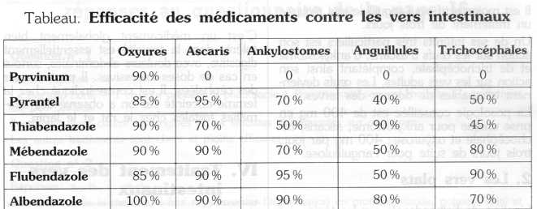

L'albendazole (Zentel®) est un puissant médicament actif contre les vers intestinaux. Il est proche du mébendazole, du flubendazole, du thiabendazole avec qui il constitue le groupe des benzimidazolés.

## I. Caractéristiques du médicament

- Il existe en pays francophone sous forme de comprimés (400 mg) et de suspension buvable (400 mg pour 10 ml).
- Après ingestion, une faible partie est absorbée et transformée en un dérivé (sulfoxyde) actif sur les vers. Son absorption est augmentée si l'ingestion se fait avec des aliments gras (huile, beurre).

## II. Actions anti-parasitaires

L'albendazole est efficace sur de nombreux vers intestinaux.

### 1. Les vers ronds

Après la prise d'un comprimé chez l'adulte, le médicament élimine les oxyures dans 100 % des cas.

Il a une bonne efficacité (près de 90 %) sur l'ascaris et l'ankylostome.

C'est un des médicaments les plus actifs sur le trichocéphale.

Il est moins actif sur l'anguillule, qui réclame un traitement de trois jours.

Un de ses intérêts très particuliers est son action sur les œufs d'ascaris, d'ankylostome et de trichocéphale, complétant ainsi son action sur les vers adultes. Les œufs deviennent incapables de donner des larves.

La posologie conseillée est de 400 mg en prise unique pour ankylostome, ascaris, trichocéphale et oxyurose; 400 mg par jour, trois jours de suite pour l'anguillulose.

### 2. Les vers plats

L'action de l'albendazole sur les ténias est moins spectaculaire. Elle est faible en cas d'Hymenolepis. Elle est de l'ordre de 60% pour le ténia du bœuf pour une dose de 400 mg par jour pendant trois jours à partir de l'âge de deux ans.

### 3. Larves des vers intestinaux

L'albendazole est le composé benzimidazolé dont l'absorption est la plus grande. Il a une certaine efficacité sur les larves de vers que l'on peut trouver dans l'organisme.

- Les *larva migrans* cutanées dues à des ankylostomes de chiens parvenus sous la peau (400 mg en prise unique).

- Les *larva migrans* viscérales dues à des ascaris de chat ou de chien, que l'on peut trouver chez l'enfant au niveau du foie ou du poumon (400 mg/jour pendant quatre jours).

- Le kyste hydatique, qui est une larve du ténia du chien, incluse dans le foie ou le poumon le plus souvent (10 mg/kg/jour en cure de trente jours).

- Les cysticerques qui sont des larves de ténia du porc enkystées dans le cerveau ou les muscles (15 mg/kg/jour pendant trente jours).

L'albendazole est efficace sur de nombreux vers intestinaux. Il apparaît à l'heure actuelle comme le seul ou un des meilleurs médicaments efficaces vis-à-vis de ces larves, le plus souvent en traitement prolongé.

## III. Effets secondaires, toxicité

C'est un médicament globalement bien toléré, dont la toxicité est essentiellement digestive, avec douleurs abdominales, surtout en cas de doses excessives. Il peut donner des céphalées. Il est contre-indiqué chez la femme enceinte car on a observé des anomalies fœtales chez le rat et le lapin.

## IV. Traitement des vers intestinaux

On possède actuellement tout un ensemble de médicaments très efficaces sur les vers intestinaux et bien tolérés. Les indications dépendent essentiellement de la disponibilité des produits et de leur prix. En médecine de masse, la notion de prix peut être encore plus importante et l'on choisit les produits actifs sur le plus grand nombre de vers (*voir* *tableau).*

L'albendazole a donc une grande efficacité sur l'ensemble des vers ronds intestinaux. Il est cependant plus coûteux que d'autres médicaments aussi efficaces sur certains parasites. Il a un double intérêt:

- c'est celui qui a probablement l'efficacité la plus grande sur le plus grand nombre de vers ;

- il a une activité que d'autres n'ont pas sur les larves et les œufs (nécator, ankylostome, ascaris, trichocéphale) s'opposant ainsi à la dissémination des formes infestantes.

Il a donc une place de premier plan, en santé publique, en médecine de masse, à la dose de 400mg en prise unique.

## V. Autres indications

L'albendazole, en raison de son passage, même partiel, dans le sang, est proposé dans le traitement de certaines formes larvaires de vers intestinaux que l'on peut trouver dans divers organes.

- Les *Larva migrans* cutanées et viscérales.

- Le kyste hydatique: le traitement est chirurgical mais l'albendazole est le seul médicament à avoir une action sur les kystes de petit volume.

- La cysticercose: tant que ces formes larvaires, dans le tissu cérébral, restent actives, elles sont sensibles à l'albendazole qui est le médicament le plus efficace et le mieux toléré.

**Conclusion**

L'albendazole a sa place dans la gamme des médicaments antiparasitaires. Il parait surtout utile en médecine de masse dans les régions où un poly parasitisme a été prouvé. Dans ces conditions, l'amélioration des données nutritionnelles de l'ensemble des enfants traités est un argument important à la fois pour la responsabilité des vers intestinaux dans l'équilibre nutritionnel des enfants, et pour l'efficacité d'une thérapeutique globale.

Son utilisation sur les kystes hydatiques et la cysticercose reste à adapter à chaque situation particulière.

*Développement et Santé, n°117, juin 1995*
