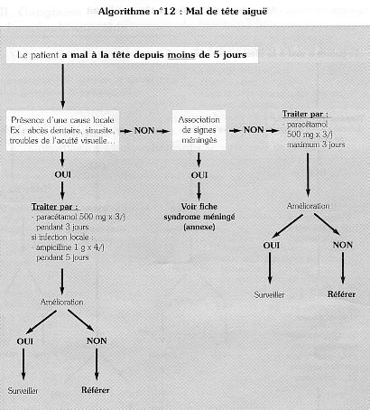
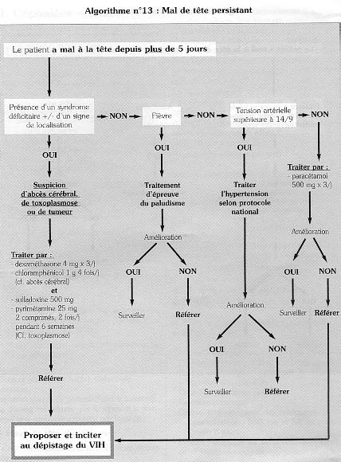

## I. Définition

Maux de tête sévères ou persistants dont l'intensité augmente de manière croissante et/ou qui ne cèdent pas aux antalgiques habituels.

**Face à un patient qui se plaint de céphalées, l'infirmier doit rechercher des signes associés :**

*   signes neurologiques (troubles de la conscience, paralysie, convulsions...)
*   fièvre (> 38°C)
*   vomissements...

## II. Causes

Infectieuses, traumatiques, locales...

## III. Classification

Les maux de tête peuvent être classés de la manière suivante afin d'orienter l'infirmier vers une cause probable :

### 1. Maux de tête aigus et inhabituels

Souvent associés à des signes méningés ou à des écoulements de nez....

### 2. Maux de tête aigus et récidivants (type migraine)

#### Signes cliniques :

*   douleur intense (pulsatile), unilatérale,
*   nausées,
*   troubles visuels (le patient craint la lumière),
*   la douleur est calmée par le repos et le sommeil et a contrario aggravée par l'activité.

### 3. Maux de tête chroniques

Il s'agit de douleurs à la tête qui dure depuis plus de 2 semaines.

### 4. L'importance du recueil de données

En ce qui concerne les maux de tête, l'infirmier doit s'attacher à recueuillir un maximum d'informations sur les circonstances d'apparition des douleurs, leur intensité et leur siège.

#### Intensité de la douleur :

l'intensité peut être jugée sur : les pleurs, les attitudes antalgiques (ex. le patient se cache de la lumière, il se roule en boule dans son lit, se tient la tête entre les mains...), l'arrêt des activités quotidiennes...

#### La localisation :

Points douloureux, douleur diffuse, en casque...

#### A quel moment de la journée les douleurs surviennent- les douleurs ?

Matin, fin de journée, nuit.

#### Signes cliniques associés ?

Troubles de la conscience, convulsions, nausées, vomissements, fièvre...

#### Signes cliniques de l'hypertension intracrânienne :

*   Douleurs à la tête matinales
*   Nausées
*   La douleur est soulagée par les vomissements et aggravée par les efforts.

## IV. Actions et surveillance infirmières

### Mise en observation au dispensaire pendant 1 jour

*   Allonger le patient dans un endroit calme.  
*   Prendre la tension, le pouls, la température.  
    Rappel une tension supérieure à 140/90 = hypertension artérielle
*   Chercher des signes associés.  
*   Rassurer le patient.  
*   Calmer la douleur avec des antalgiques paracétamol : 500 mg x 3/j au maximum 3 jours.  
*   Evaluer l'efficacité du traitement antalgique en observant les attitudes du patient et en le questionnant.

