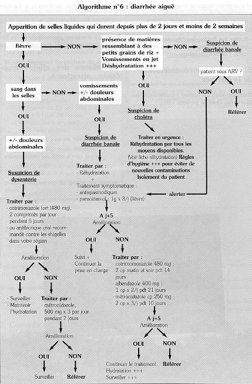
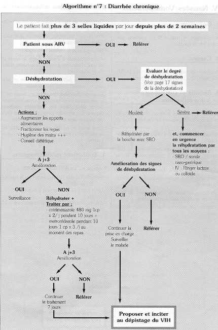

## I. Définition

- **Diarrhée aiguë** : au moins trois selles liquides par jour, pendant plus de deux jours.
- **Diarrhée chronique** : au moins 3 selles liquides par jour, pendant plus d'un mois.

Elle est responsable d'une **dégradation physique** importante et a un impact sur la vie sociale.

Elle entraîne :

- dénutrition ;
- déshydratation ;
- dépendance physique ;
- grabatisation.

**La diarrhée touche 60 % des personnes séropositives**, elle est souvent accompagnée de nausées/vomissements, de crampes abdominales, de flatulence, et d'amaigrissement.

## II. Causes

Elles sont nombreuses : infections, sarcome de Kaposi, VIH, traitements antirétroviraux...

## III. Actions et surveillance

- Préciser **le nombre** de selles par jour et la date de début des troubles.
- Regarder **l'aspect** des selles : liquides, molles, présence de sang, de glaires.
- Relever les constantes : température, pouls, tension.
- Peser la personne et suivre la courbe de poids.

**Lorsque l'infirmier a la possibilité de garder la personne pendant 24 h en observation :**

**Faire un bilan entrées/sorties**.  
Tracer sur une feuille deux colonnes. Dans la première colonne marquer tout ce que le patient boit (quantité ml) : eau, jus, soupe, SRO...+ perfusion et dans la deuxième colonne noter tous ce qui sort du patient : urines, selles... (quantité ml). Le recueil des informations se fait sur 12h, ou mieux sur 24 h.

**Ex.**1e colonne = entrée  
150 + 200 + 100+ 500 = 950 ml

2 e colonne = sortie  
300 + 100 + 200 + 150 + 250 = 1000 ml

- Il faut que les deux chiffres entrée/sortie soient proches, cela prouve un bon équilibre entre les apports et l'élimination. En cas de problème dans le bilan entrée/sortie = **référer.**

Le risque majeur est la déshydratation.

Il faut donc évaluer les signes de déshydratation

## IV. Signes cliniques de la déshydratation

### 1. Déshydratation modérée

- Perte de poids entre 5 à 10 %
- La personne a soif
- Elle présente un pli cutané qui s'efface
- Elle respire plus vite
- Elle somnole ou s'agite
- Elle urine moins, ses urines sont foncées
- Elle peut avoir les yeux enfoncés
- La langue est sèche

### 2. Déshydratation sévère

- Perte de poids égale ou supérieur à 10 %
- La personne est angoissée, elle a froid ou elle est apathique, plus ou moins inconsciente
- Son pouls est irrégulier, rapide, il est difficile à prendre
- Sa bouche est très sèche
- Le pli cutané est très important et persiste plusieurs minutes
- Elle n'urine plus

**Une fois les signes reconnus, il faut agir vite et commencer une réhydratation.**

### 3. Réhydratation par la bouche

**SRO** **(sels de réhydratation par voie orale)**

**Si vous disposez de sachets de sachets de SRO déjà prêts :**

- diluer 1 sachet dans un litre d'eau pure
- donner à boire des petites quantités, fréquemment
- à partir de 15 ans, faire boire de 2 à 4 litres par 24 heures.
- conseiller à la personne de boire de l'eau propre

**Si vous n'avez pas de SRO en sachet**

**Préparer la SRO vous-même.   
Verser dans un litre d'eau pure :**

- 1/2 cuillère à café de sel (3,5 g)
- 4 cuillères à soupe de sucre (40 g)

**Pour compenser la perte en potassium :**

- manger des bananes
- boire du lait de coco
- boire des sodas (quantités modérées après avoir enlevé le gaz)

PS : Si la réhydratation entraîne des vomissements, elle peut être conduite par sonde naso-gastrique.

### 4. Réhydratation par voie veineuse

Colloide ou Rinqer lactate. A défaut solutés salins.

- 100 ml/kg en 3 heures
- commencer rapidement 30 ml/kg les 30 premières minutes puis ralentir
- 200 ml/kg les 24 premières heures

Evaluer régulièrement l'état général du malade. Les signes cliniques doivent s'améliorer.

**Si on ne constate pas d'amélioration -> Référer**

### 5. Conseils sur l'hygiène et la diététique

pour un patient atteint de diarrhée

Le patient **doit continuer a s'alimenter**. L'infirmier doit **l'aider.**

- Le malade doit manger des aliments, **hypercaloriques,** par exemple, **soupe de riz** (eau de cuisson), **carotte cuite, manioc, bananes...**
- Le patient peut boire du soda à base de cola auquel on aura retiré les bulles en remuant avec une cuillère.
- Il faut dire au malade de **bien se laver les mains** après chaque diarrhée et avant de manger.
- Les fesses et l'anus du malade doivent rester propres et secs.
- Si absence de gants, se protéger les mains avec un sac en plastique et, pour attraper les objets souillés, utiliser des grandes feuilles d'arbre (bananier...) puis les jeter dans un endroit prévu à cet effet ou les brûler. Si elle est souillée, la literie sera changée et nettoyée en respectant les rèqles d'hyqiène.
- Les endroits tachés de sang, de selles ou de tout autre liquide biologique devront être nettoyés à l'eau de Javel ou un produit similaire.

**ATTENTION**

Eviter les fruits, les légumes crus, les produits laitiers, les aliments épicés, le café, l'alcool, le tabac.

### 6. Traitement médicamenteux de la diarrhée

#### Ralentisseurs du transit : traitement des diarrhées chez le patient VIH+

- lopéramide : gélule de 2 mg (1 à 4 gélules par jour)
- diphénoxylate : comprimés de 2.5 mg (2 à 6 comprimés par jour).

Pour les douleurs abdominales

**Douleurs abdominales** en lien avec les coliques, donner de la codéine 30 mg toutes les 4 heures ou hyoscine 10 mg x3/j.

Surveillance des effets secondaires : attention à,

- somnolence
- bouche sèche.

