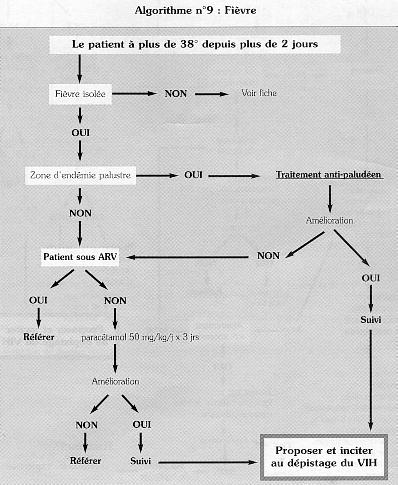
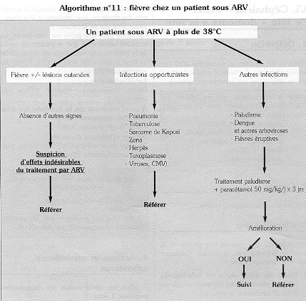

## I. Définition

Température du **corps supérieure** à 38° depuis au moins **3 jours**.

La fièvre est due à un dérèglement de la régulation thermique, il s'agit d'un moyen de défense de l'organisme.

**La fièvre peut être un effet secondaire du traitement par ARV.**

## II. Causes

Paludisme, tuberculose, salmonellose, viroses, grippe, dengue...

## III. Signes cliniques

La fièvre s'accompagne :

*   D'une impression de chaleur ou de froid

 "Corps chaud"

*   D'agitation ou apathie (troubles de la conscience)
*   De sueurs avec plus ou moins frissons...

Le syndrome infectieux se caractérise par :

*   Fatigue ;
*   Douleurs musculaires ;
*   Pouls rapide = tachycardie;
*   Respiration rapide = dyspnée;
*   Peu d'urine = oligurie.

<table>
<caption>Valeurs normales du pouls : pulsations/minute</caption>

<thead>

<tr>

<th scope="col" style="width: 274px;" valign="top">Les valeurs normales pour le pouls</th>

<th scope="col" style="width: 103px;" valign="top">Sur 1 mn</th>

</tr>

</thead>

<tbody>

<tr>

<td style="width: 274px;" valign="top">Nouveau-né</td>

<td style="width: 103px;" valign="top">130 à 150</td>

</tr>

<tr>

<td style="width: 274px;" valign="top">Enfant de 1 an</td>

<td style="width: 103px;" valign="top">100</td>

</tr>

<tr>

<td style="width: 274px;" valign="top">Adulte</td>

<td style="width: 103px;" valign="top">de 60 à 80</td>

</tr>

</tbody>

</table>

**La fréquence respiratoire normale d'un adulte est de 15 à 20 mouvements par minute et plus rapide chez enfant (20 à 25).**

## IV. Actions et surveillance infirmières

Réalisables dans le cadre d'une mise en observation de 24 heures au dispensaire ou de soins à domicile :

*   faire préciser au patient depuis combien de temps il a de la fièvre.
*   prendre les constantes vitales (pouls, tension, température).
*   dévêtir au maximum le patient tout en respectant sa pudeur (le couvrir d'un simple drap)
*   veiller à la bonne ventilation des locaux.
*   réhydrater si nécessaire.
*   rafraîchir la peau (exemple : enveloppement dans un linge humide, vessie de glace...), si possible faire prendre un bain (température de l'eau de 2°C plus basse que la température du patient).
*   si l'état de conscience le permet, faire boire le patient +++.
*   chez les patients couchés surveiller l'état de la peau et mettre en oeuvre les actions préventives de l'apparition d'escarres (changements de position, frictions, hygiène de la peau).

### 1. Traitement

**Antipyrétiques :** paracétamol 50 mg/kg/j ou AAS 1,5 g par jour en 3 prises.

### 2. Mesure de la température

Par voie :

*   rectale (thermomètre dans l'anus), mesure très fiable mais à éviter car risque de lésion anale.
*   cutanée (thermomètre sous le bras, dans le creux axillaire), le patient doit garder le bras le long du corps. Le thermomètre reste en place 10 mn et il faut ajouter 0.5°C au résultat trouvé.
*   orale si le patient est conscient (thermomètre sous la langue, bouche fermée).

Les thermomètres doivent être utilisés pour un seul patient ou être nettoyés de manière rigoureuse.

**ATTENTION :** Choisir le mode de mesure le plus adapté au patient et ne pas changer de méthode de mesure.

### 3. Le choc septique

Il est le résultat d'une infection bactérienne, il se caractérise par la libération de substances toxiques dans le sang.

**Il s'agit d'un événement très grave, d'une urgence thérapeutique.**

Les signes cliniques sont :

*   fièvre très élevée (supérieure à 38.5 ° C);
*   froideur de la peau ;
*   veines plates ;
*   tension artérielle basse (inférieure à 90/50) ;
*   pouls faible (on a des difficultés pour le mesurer) ou très rapide ;
*   augmentation de la fréquence respiratoire ;
*   peu d'urine, de couleur marron ;
*   nausées/vomissements ;
*   présence d'hématomes sur le corps.

**En présence de ces signes cliniques l'infirmier doit prévenir un médecin ou organiser le transfert du malade vers un centre de traitement adapté.**

* En cas d'inconscience, c'est-à-dire face à un malade ne répondant pas à des ordres simples :

*   placer le patient sur le coté (position latérale de sécurité),
*   libérer les voies aériennes,
*   surveiller les constantes vitales : pouls, tension, fréquence respiratoire toutes les 5 minutes.

** Si suspicion de dengue (mêmes signes que grippe) ne pas utiliser l'AAS mais le paracétamol.