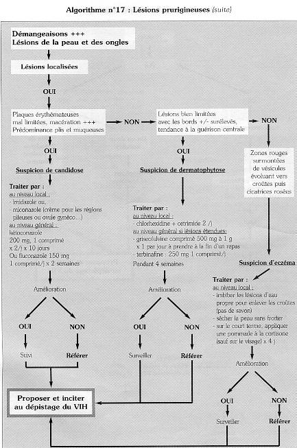

Les lésions cutanés associés au VIH  
Guide pour la prise en charge clinique de l'infection à VIH chez l'adulte", OMS, décembre 1991 (programme de lutte contre le sida).
## I. Définition

Ensemble des pathologies au niveau de la peau et des muqueuses.

## II. Causes

*   **infections bactériennes**(ex. furonculose, folliculite...),
*   **infections virales** (ex. zona, herpès...),
*   **infections fongiques** (ex. candidose...),
*   **infections parasitaires** (ex. gale...),
*   **réaction allergique à des médicaments** (ARV...).

L'observation des lésions est primordiale. L'infirmier doit pouvoir les reconnaître en se fondant sur leur aspect et leur localisation. Il s'agit là de toutes lésions non provoquées par un traumatisme récent.

### 1. Lésions prurigineuses

_Définition :_  
Lésions qui s'accompagnent d'une envie de se gratter permanente et que l'on ne peut réfréner.

### 2. Lésions suppurées

_Définition :_  
Lésions inflammatoires, tuméfactions chaudes et douloureuses d'origine microbienne évoluant vers la suppuration.

### 3. Lésions squameuses

_Définition :_  
Squame : petite pellicule de peau qui se détache +/- facilement.

### 4. Lésions vésiculeuses

_Définition :_  
Petites élévations plus ou moins sphériques sur la peau contenant un liquide clair.

## III. Les objectifs infirmiers

### Lors des consultations au dispensaire

*   Réaliser des soins adaptés aux lésions ;
*   Administrer le traitement en lien avec la pathologie ;
*   Observer l'évolution des lésions, noter les éléments significatifs.

### Si le patient est gardé en observation pendant 24 heures

*   Favoriser la bonne hygiène corporelle du patient ;
*   Prévenir l'apparition d'escarres si le patient est alité.

### Dans le cadre de l'éducation à la santé

Conseiller au malade :

*   d'utiliser du savon doux lors de la toilette quotidienne ;
*   de porter des vêtements en coton ;
*   de nettoyer et de désinfecter la literie régulièrement ;
*   de préférer une alimentation riche en protéines et en vitamines A et E.

#### Mode d'administration de certains médicaments

*   _Comment utiliser Benzochloryl solution ?_ Badigeonner tout le corps sauf le visage après la toilette du soir, laisser sécher, rebadigeonner, laisser sécher et se coucher. Ne se laver que le soir suivant. Répéter l'opération 2 semaines après.
*   _Comment utiliser DDT en poudre ?_ Saupoudrer le linge et les draps de produits et enfermer le tout dans une caisse propre pendant 24 heures.

