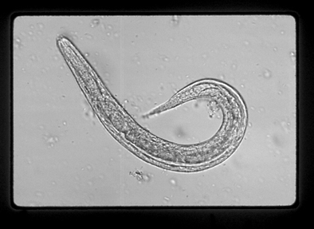

## I. Epidémiologie

L’anguillulose est une helminthiase très fréquente en milieu tropical. Les vers adultes, situés dans le duodénum, émettent des œufs qui donnent très rapidement naissance à des larves. Celles-ci, émises avec les selles, vont se transformer, selon les conditions climatiques, soit directement en larves infestantes (milieu défavorable) soit en adultes qui vont émettre à leur tour des milliers de larves (température supérieure à 20°C et humidité élevée). Ces larves traversent la peau, gagnent la circulation, arrivent au poumon, passent dans les voies aériennes et rejoignent le duodénum.

Il existe, en outre, un cycle d’auto-infestation qui peut perpétuer la maladie pendant plusieurs dizaines d’années après avoir quitté les zones d’endémie.

## II. Clinique

La pénétration peut provoquer un prurit. Plus tard, un sillon cutané érythémateux, prurigineux et mobile de plusieurs millimètres par heure (larva currens) est assez caractéristique. Mais il est plus fréquent sur la peau blanche que sur la peau noire.

La phase pulmonaire est fugace : toux, hémoptysie. Les troubles digestifs, les plus fréquents, ne sont pas significatifs : douleurs épigastriques, nausées, vomissements, diarrhées parfois abondantes.

Ces troubles sont plus accentués chez les enfants dénutris, immunodéprimés (traitements anticancéreux, SIDA), sous antibiothérapie ou corticothérapie. Il peut s’agir de diarrhées aiguës hémorragiques entraînant un collapsus, ou encore de diffusion de la parasitose dans tous les organes, engageant le pronostic vital.

## III. Diagnostic 

Classiquement, l’hémogramme montre une hyperéosinophilie oscillante, en raison du cycle de réinfestation par les anguillules.

Le diagnostic est affirmé par l’examen parasitologique des selles, avec technique spéciale de recherche des anguillules basée sur l’hydrotropisme et le thermotropisme des larves (méthode d’extraction de Baermann) : larve rhabditoïde (double renflement oesophagien) de 300 µ de long (figure). Le sérodiagnostic n’est pas une technique de routine.

  
 ***Larve rhabditoïde d'anguillule***

## IV. Traitement

Le traitement classique par l'albendazole, le flubendazole ou le mebendazole qui avait une activité relativement faible sur ce parasite (tableau VII) a été avantageusement remplacé par l’ivermectine. La prophylaxie est identique à celle de l’ankylostomose.

<table>
<caption>Traitement de l'anguillulose</caption>

<thead>

<tr>

<th scope="col">Nom chimique</th>

<th scope="col">Posologie</th>

<th scope="col">Présentation</th>

</tr>

</thead>

<tbody>

<tr>

<th class="rteleft" scope="row" style="">Ivermectine</th>

<td>200 µg / kg / j / 1 j</td>

<td>Cp à 3 mg</td>

</tr>

<tr>

<th class="rteleft" scope="row" style="">Flubendazole</th>

<td>2 cp / j / 3j  
2 cuillères / j / 3 j</td>

<td>Cp à 100 mg  
Susp. à 25 mg/ml</td>

</tr>

<tr>

<th class="rteleft" scope="row" style="">Mébendazole</th>

<td>2 cp / j / 3 j  
2 cuillères / j / 3 j</td>

<td>Cp à 100 mg  
Susp. à 20 mg/ml</td>

</tr>

<tr>

<th class="rteleft" scope="row" style="">Albendazole</th>

<td>1 cp / j / 3 j  
10 ml susp. / j / 3 j</td>

<td>Cp à 400 mg  
Susp. à 4 %</td>

</tr>

</tbody>

</table>
