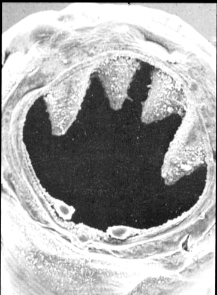

## Epidémiologie

Il existe deux espèces d’ankylostomes : _Ankylostoma duodenale_ en zone subtropicale et _Necator americanus_ en région tropicale.

_**Necator                                    Ankylostoma**_

Les vers adultes, mesurant environ 1 cm de long, sont situés dans le duodénum et s’accrochent sur la muqueuse duodénale par leur crochets buccaux. Ils pondent des oeufs qui sont éliminés avec les selles. Dans la nature, les oeufs éclosent et les jeunes larves rhabditoïdes se transforment en larves strongyloïdes infestantes, qui traversent la peau des enfants qui marchent ou jouent en terrain boueux.

Après un circuit complexe dans l’organisme, les parasites deviennent adultes dans le duodénum en 40 jours. Ces nématodes sont hématophages. Une infestation massive et chronique, fréquente en pays tropical, entraîne donc une **anémie** par carence martiale.

## Clinique

Les phases cutanée (ou "gourme des mineurs") et aérienne ("catarrhe des gourmes") sont très rares chez l’enfant. Les troubles digestifs sont fréquents mais non spécifiques : douleurs abdominales, diarrhées, nausées, vomissements. Une malnutrition est fréquemment associée.

Non traitée, l’ankylostomose aboutit à un syndrome anémique : pâleur cireuse, asthénie, œdème du visage et des membres. L’examen clinique constate une tachycardie, une hypotension, un souffle systolique, puis une hépatomégalie douloureuse avec reflux hépato-jugulaire. Une radiographie du thorax montre une cardiomégalie.

## Diagnostic

L’hémogramme révèle une hyperéosinophilie, non spécifique, en zone tropicale, mais surtout une anémie ferriprive, microcytaire, hyposidérémique et non régénérative. Cette anémie s’étant installée très progressivement est souvent bien supportée, malgré des chiffres relativement bas d’hémoglobine, d’autant plus qu’il peut y avoir une association avec une drépanocytose ou un déficit en G6PD. Cependant, des hémorragies intestinales massives ont déjà été rapportées à l’ankylostomose.

L’ankylostomose est affirmée par la mise en évidence des œufs à l’examen parasitologique des selles (œufs ovoïdes, clairs, de 70 x 50 µ contenant 4 ou 8 blastomères). Une numération des œufs permet de rattacher l’anémie à l’ankylostomose, s’il y a plus de 10 000 œufs/g de selles. Mais il faut savoir qu’en cas de malnutrition, la fécondité des vers diminue et le nombre d’œufs sera artificiellement diminué. Le sérodiagnostic n’a pas d’indication ici.

## Traitement

Le traitement est basé sur le pyrantel et les dérivés imidazolés (tableau).Habituellement, le seul traitement antiparasitaire suffit à faire disparaître l’anémie en un mois. Le traitement régulier par albendazole permet de réduire l’incidence des diarrhées des enfants et d’améliorer leur croissance. L’OMS a proposé de traiter les enfants par une association de dérivés imidazolés et de praziquantel. Si l’anémie est très importante et risque de mettre en jeu la vie de l’enfant, une transfusion (culot globulaire) s’impose, avec un traitement martial pendant deux mois.

Traitement de l'ankylostomose

<table>

<thead>

<tr>

<th scope="col">Nom chimique</th>

<th scope="col">Présentation</th>

<th scope="col">Posologie</th>

</tr>

</thead>

<tbody>

<tr>

<td>Pamoate de  
pyrantel</td>

<td>cp à 125 mg  
susp.à 3 %</td>

<td>2 cp/10 kg/3 j</td>

</tr>

<tr>

<td>Flubendazole</td>

<td>cp à 100 mg  
susp. à 25 mg/ml</td>

<td>2 cp/j/3 j  
ou 2 cuillères mesure/j/3 j</td>

</tr>

<tr>

<td>Mébendazole</td>

<td>cp à 100 mg  
susp. à 20 mg/ml</td>

<td>2 cp/j/3 j  
ou 2 cuillères mesure/j/3 j</td>

</tr>

<tr>

<td>Albendazole</td>

<td>cp à 400 mg  
susp. à 4 %</td>

<td>1 cp ou 10 ml de susp./1 j</td>

</tr>

<tr>

<td colspan="3">En outre : sels ferreux, vitamines, voire transfusions (exceptionnelles)</td>

</tr>

</tbody>

</table>

La prophylaxie est difficile : lutte contre le péril fécal et interdiction de la marche pieds nus en terrain boueux. Ainsi, à titre d’exemple, une campagne d’information avec construction de latrines a permis de faire régresser considérablement la morbidité de l’ankylostomose à la Réunion.