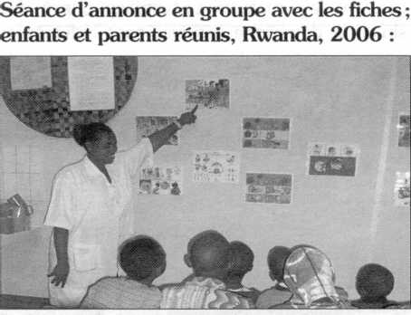
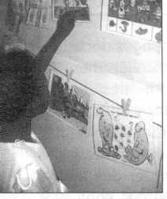
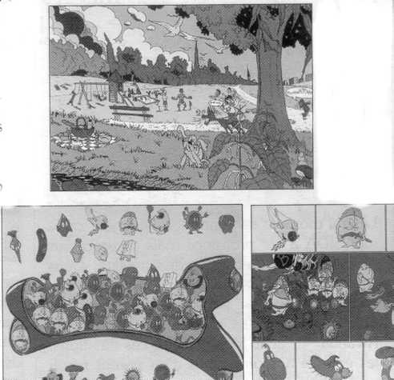
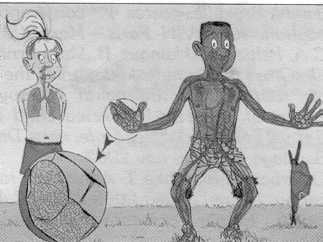

Proposition d'une méthode d'annonce et d'outils didactiques utilisés depuis 1999 dans de nombreux pays

La prise régulière stricte des antirétroviraux est difficile mais indispensable pour éviter l'émergence de résistance. Une bonne adhésion au traitement antirétroviral est encore plus difficile à obtenir chez l'enfant car il dépend des adultes ainsi que de sa compréhension de l'importance de cette prise médicamenteuse très régulière (1,2). Le plus souvent, l'enfant ne connaît pas son diagnostic et ne saisit pas l'enjeu vital des médicaments malgré leurs effets secondaires (3). Ensuite, lors de la compréhension de la gravité de la pathologie, l'enfant doit traverser les difficultés liées à la période de l'adolescence où les traitements sont particulièrement difficiles à accepter (4-5). Les effets à long terme des antirétroviraux touchent l'intégrité de l'image corporelle et la projection dans le futur de l'enfant et de l'adolescent"' compliquant l'acceptation de la maladie.

## I. Historique du projet

Des outils didactiques pédiatriques spécifiques ont été créés au CHU Saint-Pierre à Bruxelles (service de pédiatrie du professeur Lévy) grâce à un prix Johnson & Johnson obtenu en 1998. Cette création est le fruit d'une réflexion globale, multidisciplinaire et pratique de la prise en charge de l'enfant infecté par le VIH (7-8). Les outils ont été conçus avec des professionnels de différents horizons afin de vulgariser ces messages médicaux (9). Pédiatres, infirmières, psychologues, pédopsychiatres, romancier, dessinateur, conteur, informaticien ont participé à ce projet durant 12 mois consécutifs. Ces dessins et explications ont été au fur et à mesure testés sur des enfants sains puis infectés, modifiés en fonction des réactions et commentaires des utilisateurs (10).

## II. Rôle des outils

L'adulte (parent ou même soignant) est très angoissé à l'idée d'annoncer le diagnostic de séropositivité. Les outils sont donc aussi un soutien pour l'adulte qui s'appuie sur une méthode déjà largement utilisée et illustrée par des outils colorés et ludiques. Le fait de parler de la maladie en présence de proches diminue la lourdeur du secret dans les familles, lourd secret compromettant l'évolution psychologique harmonieuse de ces enfants. Ces outils sont l'intermédiaire dédramatisant cette annonce, sans minimiser la gravité de la maladie et l'importance des traitements.

## III. Pour qui sont créés les outils ?

Ces outils sont spécifiquement crées pour expliquer la maladie aux enfants infectés ou affectés par la maladie (fratrie) ; ils ne sont pas conçus pour faire de la prévention pour des enfants non concernés. Les frères et sueurs non infectés, vivant dans une famille où un ou plusieurs membres sont infectés par le VIH/SIDA peuvent bénéficier d'explications grâce aux outils, en évitant de les mettre à l'écart de cette maladie qui touche la famille. Ce secret peut avoir un effet délétère sur le développement psychologique de ces enfants non infectés par le VIH/SIDA (11). Ces enfants imaginent, par les non-dits, le pire pour leurs proches et se sentent seuls comparés aux enfants infectés pouvant bénéficier d'attention et de soins. Les groupes de soutien s'adressent rarement aux fratries qui en ont pourtant bien besoin.

## IV. Méthodologie de l'annonce du diagnostic

Cette annonce s'accompagne d'informations optimistes sur les immenses progrès médicaux, sans nier la difficulté de vivre avec cette grave maladie. Le fait de rappeler l'avancée de la médecine rassure et explique la raison de la mort qui a déjà souvent touché des membres de la famille avant l'accès aux trithérapies antirétrovirales. Sans cette précision, l'enfant fera directement le lien entre ces morts et son propre risque de mort. Cette réalité ne doit pas être occultée et il faut expliquer que cette maladie auparavant systématiquement fatale, est devenue une maladie chronique difficile à vivre mais gérable à très long terme. L'enfant sera prévenu de la difficulté d'entendre à l'école des propos insultants sur le VIH/SIDA ainsi que des messages de prévention très alarmistes non adaptés à l'enfant déjà infecté.

L'ordre choisi des explications est très important. Les premières fiches vont parler de la santé en général avant de rentrer dans le vif du sujet. On aborde ensuite les éléments sanguins, l'infection touchant les globules blancs (comparée aux soldats qui défendent le corps). Cette vérité concernant le futur à long terme peut être répétée à de multiples reprises afin que cette annonce ne soit pas simplement la chronique d'une mort annoncée sans pour autant minimiser la gravité de la maladie, ce qui rendrait cette annonce non crédible. On explique donc le rôle efficace des médicaments récents permettant d'empêcher cette multiplication des microbes avant de parler même de virus et avant d'aborder les modes de contamination (certains enfants comprennent parfaitement qu'il s'agit du VIH/SIDA à ce moment là). Il est bien sûr essentiel d'aborder la difficulté de prendre ces médicaments qui sont efficaces mais exigeants, en expliquant déjà les mécanismes d'apparition des résistances et d'effets secondaires éventuels. Il demeure étonnant de constater que de nombreux enfants ne connaissent pas leur diagnostic tant que ceci n'est pas clairement énoncé et dit avec le mot SIDA"". Souvent la famille a menti pendant des années sur la raison de ces traitements et a laissé l'enfant dans une ambigûité de diagnostic très loin de la réalité : "Prends tes médicaments pour ta toux", "pour grandir", "tes vitamines".

## V. Age d'annonce du diagnostic

On peut aborder la symbolique de la maladie à partir de l'âge de 3 ans en s'appuyant sur le conte facile à écouter ; l'enfant, qui n'est pas prêt à saisir les métaphores écoute le conte agréable, sans conséquence. Il pourra le relire plus tard et faire les liens entre lui et le lionceau Bekhi à ce moment là. Le deuil est abordé à travers la mort de la lionne ; le traitement, pris courageusement par le lionceau devenu malade, est représenté par trois éléments naturels. A aucun moment, le mot médicament, virus ou contamination n'est cité et seule la poésie, le refrain de la nécessité de prendre chaque jour courageusement ces trois éléments berce le rythme du conte.

L'annonce du diagnostic à l'aide des fiches médicales est idéale entre 8 et 12 ans selon la maturité de l'enfant. Cette annonce de diagnostic avant l'âge de l'adolescence est importante car l'adolescent a plus de mal à accepter son diagnostic qui touche sa projection du futur et de sa sexualité"',"'. De plus le fait d'avoir été maintenu dans l'ignorance de la vérité de sa maladie est déjà un grand sujet de révolte et de perte de confiance en l'adulte qui lui a menti jusque là (15).

## VI. Qui doit annoncer le diagnostic à l'enfant ?

Quand on parle d'annonce au diagnostic, il ne s'agit pas de se perdre dans la complexité de termes et de mots. Le mot VIH ou HIV ne dit parfois rien à l'enfant mais le mot SIDA doit être clairement cité sans ambiguïté de terme(16). On utilise les fiches pour expliquer l'historique et l'évolution naturelle de la maladie, désormais bien différente avec les antirétroviraux qui permettront aux enfants de vivre longuement avec la maladie en collaboration avec l'équipe soignante, parents, amis(17)... La plupart des adultes gardent la crainte de l'infection par contact et pensent encore trop souvent qu'un enfant contaminé dans une classe reste un danger potentiel pour les autres enfants. Il est important de demander aux "parents" en présence de l'enfant, qui, dans l'entourage, connaît le diagnostic de l'enfant. L'enfant sait ainsi clairement à qui s'adresser. Une des responsabilités des soignants est d'aider les parents dans cette démarche d'annonce de diagnostic et d'intégrer naturellement cette annonce dans la prise en charge de la maladie et de la famille. Il faut proposer des explications progressives à chaque consultation. Il est sain que ce soit le soignant de référence qui donne les explications médicales et le diagnostic. Les "parents" pourront ensuite s'appuyer sur les mêmes mots et explications pour détailler l'histoire de la maladie familiale et répondre aux questions des enfants qui suivront ces explications données dans un cadre médical (18).

## VII. Adaption de la communication des outils selon les contextes culturels et sociaux

Au verso des fiches et pour tous les outils, une indication précise d'une méthode de dialogue est détaillée. Il faut dédramatiser ce moment pour l'adulte qui fait l'annonce, moment aggravé par l'interprétation de la maladie de l'adulte (19).

Le vrai moment de l'annonce est le jour où le mot SIDA a été prononcé mais ce processus prend du temps et de la disponibilité. Dans certains contextes d'accès aux soins difficiles ou de manque de personnel, l'annonce de diagnostic peut se passer en groupe au Rwanda (20-21) et au Mali (22). Dans ces situations, les enfants acccompagnés d'un parent reçoivent l'annonce de diagnostic par une personne formée à effectuer cette annonce (durée : 1 heure 30). Cette émulation de groupe est constructive, rassurante (23). Cette approche d'annonce en groupe a été proposée lors de l'utilisation de l'outil au Treatment Research AIDS Center plus à Kigali (Rwanda) depuis mai 2005, afin de pouvoir annoncer le statut sérologique à des centaines d'enfants qui devaient commencer ou prenaient sans comprendre des antirétroviraux. Les premières annonces ont été faites avec des traducteurs. Ces explications furent ensuite reprises en langue originale par les utilisateurs (médecins, infirmières, "counselors", animateurs de groupe au sein d'associations) qui ont adapté des termes pour communiquer les outils proposés. L'adaptation et l'appropriation des outils consistent surtout à savoir comment communiquer en trouvant les mots en langue locale les plus adéquats pour parler du message à faire passer à travers l'image.

## VIII. Caractéristiques et limites des outils en général

Les outils décrits ci dessus ne sont que des supports à la communication et c'est donc surtout la communication qui fait le travail du vécu de cette annonce. C'est la raison pour laquelle il n'est pas indispensable de refaire des outils pour tous les contextes, la démarche à suivre est la même.

**Reprise individuelle des explications****Rwanda, 2006**

Depuis l'existence de ces outils, le leitmotiv des personnes les plus réticentes à les utiliser ou à annoncer le diagnostic est de dire qu'il faut refaire des outils adaptés au contexte ; ceci n'est qu'une excuse pour justifier de ne pas faire l'annonce sous prétexte d'outils "non adaptés". D'autres outils ne changeront pas cette réticence. Nous avons vécu ces situations à maintes reprises. Par contre quand le désir d'informer les enfants est là, ces outils ont été utilisés d'emblée aussi bien en Afrique, en Asie, en Amérique et dans de nombreux pays européens où la plupart des enfants proviennent d'origines très variées. Avant que ces outils existent, on expliquait la maladie avec n'importe quel dessin, même fait à la main devant l'enfant ; il n'est même pas nécessaire d'avoir les outils pour communiquer et commencer à systématiser l'annonce mais ça encourage. D'autres outils ont été créés par MSF (Rwanda, Thaïlande), ainsi que sans doute beaucoup d'autres. L'intérêt d'utiliser des outils déjà utilisés et testés est de gagner du temps en attendant d'avoir l'expérience personnelle de cette annonce (24).

## IX. Communication avec l'enfant

La façon d'intéresser les enfants à ces explications, d'animer une séance de groupe, de communiquer et interagir avec l'enfant est plus difficile à acquérir et ne dépend pas que des outils de communication. La formation, le professionnalisme et le caractère du soignant a un rôle pour cette communication. Il est vrai que certains y parviendront très vite avec quelques conseils alors que d'autres n'y parviendront jamais malgré des formations répétées. Le fait de participer à ces séances ou de voir un film montrant cette interaction permet à l'utilisateur d'être à l'aise avec ces outils et d'améliorer sa technique de communication.

**En résumé, la valise didactique comprend**

### 1. Conte Bekhi

Le conte de 22 pages dont 10 dessins est un outil particulièrement utile aux animateurs pour des activités de groupes de jeunes enfants de moins de 8 ans. Il permet aussi d'effectuer une prise en charge individuelle pour aborder des thèmes délicats. Ces thèmes sont abordés avec le jeune enfant à travers l'histoire de ce lionceau au pelage qui devient grisâtre comme celui de sa maman qui vient de mourir. Il doit courageusement traverser l'océan pour trouver 3 éléments difficiles à avaler (feuille de l'arbre à sourire, rayon du grand soleil d'or, gouttes de la mer rouge), mais indispensable pour se soigner au prix d'une prise très régulière, sans oubli, toute sa vie. A la fin du conte, Becki va mieux et veut rentrer pour aider les autres lions malades à se soigner en ramenant chez lui des graines de l'arbre à sourire. La symbolique de la différence, de l'exil, du deuil, de la maladie, de la difficulté des traitements est ainsi abordée en douceur avec beaucoup d'humour et de tendresse dans un cadre de dessins lumineux. Une version papier est accompagnée d'une version orale contée par un professionnel en version CD ou sur cassette audio. La version orale est aussi reprise dans le CD-Rom et les images défilent automatiquement sur l'écran de l'ordinateur.

### 2. Les fiches médicales

Les treize fiches médicales sont des minicours de médecine adaptés à l'enfant afin de mieux comprendre les mécanismes de la multiplication virale et le rôle des antirétroviraux. Ces fiches sont colorées, amusantes et indépendantes les unes des autres (bien qu'ayant une suite logique). Elles sont une façon de garder l'attention de l'enfant et de guider le personnel soignant dans la démarche d'annonce progressive de la maladie. Les explications du dessin et la démarche à suivre sont indiqués au verso. Les trois premières fiches abordent les thèmes généraux de la santé sur la respiration et la circulation sanguine en détaillant les différents éléments sanguins. La quatrième fiche explique l'immunité et le rôle des différents globules blancs ainsi que l'existence de microbes différents (virus, bactéries, parasites, champignons). A partir de la cinquième fiche (5 à 8), on explique la multiplication virale et le rôle des médicaments ainsi que le mécanisme d'apparition des résistances. La fiche 9 est un dessin représentant une scène scolaire rappelant que la contagion n'a pas lieu dans la vie quotidienne de l'école. La fiche 10 reprend le mode de transmission du virus. La fiche 11 représente la difficulté du secret. La fiche 12 montre l'importance de la prévention et le rôle des préservatifs et la fiche 13 représente les chiffres de l'épidémie de la maladie.

### 3. La bande dessinée

Le dessinateur a repris les mêmes personnages que ceux des fiches et a créé avec le romancier une histoire reprenant essentiellement le mode d'apparition des résistances. Cette courte bande dessinée (4 pages) permet de sensibiliser l'enfant et l'adolescent au suivi du traitement et à la surveillance régulière de la charge virale et de son immunité.

### 4. Le carnet de traitement

Afin d'impliquer l'enfant dans sa propre santé et de faciliter la prise des antirétroviraux, un carnet de traitement spécifiquement pédiatrique a été développé. Le carnet appelé "carnet secret" est le médiateur entre la maison et l'équipe médicale. Il comporte aussi les dessins des fiches médicales et des pages blanches afin que l'enfant puisse poser ses questions. Cette façon de personnaliser ce carnet permet à l'enfant de mieux s'approprier la maladie. Le but est d'adapter le traitement au rythme de vie de l'enfant et d'associer la prise de médicaments à un geste déjà habituel. L'enfant crée sa fiche de traitement et ses horaires de prises de médicaments sur ordinateur avec une infirmière. L'enfant note les médicaments difficiles à prendre pour lesquels on peut essayer de trouver des solutions (reconditionnements, changement d'horaires, changements de traitements, explications et rappels du rôle des médicaments).  
La création de ce carnet est réalisable sur ordinateur grâce au CD-Rom.

## X. Conclusion

La connaissance du diagnostic d'infection au VIH/SIDA permet à l'enfant et à l'adolescent de connaître l'enjeu du traitement antirétroviral difficile à accepter. Le dialogue permet d'insister ouvertement sur l'observance, la sexualité et la prévention. La connaissance du diagnostic par les enfants permet d'organiser des groupes de soutien d'enfants et d'adolescents ayant la même pathologie qui partagent les mêmes interrogations et épreuves de vie. Ces moments d'échange impliquent l'écoute de leurs besoins, améliorant ainsi notre méthode de communication.

**_Bibliographie :_**

1. Stephenson & al: Strict adherence to ARV medication is necessary to sustain viral suppression or "virologic success". JAMA ; 281(12), 1999.  
2. D. Gibb, R. Goodall, V Giacomet et al. Adherence to prescribed ART in HIV-infected children in the PENTA 5 trail. _Pediatr Infect. Dis. J, 22 :56-62, 2003_  
3. Pradier C, Bentz L, Spire B et al. Efficacy of an educational and counseling intervention on adherence to HAART: _French prospective controlled study. HIC clin trials: 4(2): 121-131, 2003._  
4. N. Trocmé, G. Vaudre, C. Dolfus. Observance du traitement antirétrouiral de l'adolescent séropositif pour le VIH. _Archives de pédiatrie. 9:1241-47, 2002._  
5. M. Goode, A. Mc Maugh, J. Wales, JB. Ziegler. Adherence issues in children and adolescents receiving HAART AIDS Care; 15(3):403-8, 2003 Jun.  
6. Haven B, Wiener L. from adolescence through Young adulthood: Psychological adjustment associated with long term suruiual of HIV. J of adol. health; 30: 161-168, 2001.  
7. Dr C.A. Peltier. Présentation orale. Management of children moving from adolescent care to adult clinics. 8th congress on drug therapy in HIV infection Glasgow, 12-16 nou. 2006.  
8. Dr C.A. Peltier - Présentation orale. Adhésion au traitement ARV: Un défi de tous les jours"De la mère à l'enfant, les défis pour l'avenir"1" colloque francophone médical international - Bruxelles, mars 2003.  
9. C.A. Peltier, M. Hainaut, S. Wibaud, S. Moulinier, C. Bachelerie, J. Leuy. Didactic tools to improve adherence to HAART for children. Poster- 8th European Conference on Clinical Aspects and Treatment of HIV-infection - Athènes/ Grèce, Octobre 2001.  
10. C.A. Peltier M. Hainaut, S. Wibaut, C. Bachelerie, J. Leuy. Specific pediatric educational program for children infected with HIV-1 to improue adherence to treatment. Poster-3rd world congress of Pediatric Infectious Diseases - Santiago de Chili, Nov 2002.  
11. Rueda S, Park-Wyllie LY, Bayoumi AM, Tynan AM. Patient support and education for promoting adherence to HAART for HIU/AIDS. Cochrane database Syst Reu, 19; 3: CD001442, 2006 ju l.  
12. Martin S, Elliot-DeSorbo DK, Wolters PL, Toledo-Tamula MA et al. Patient, caregiver and regimen characteristics associated with adherence to HAART among HIV-infected children and adolescents. Pediatr. Infect. Dis, 26 (1):61-7, 2007 Jan  
13. Dr A. Waelbrouck, Dr C.A. Peltier, S. Wibaut, P Cyaga, C. Ornes. Prise en charge des adolescents infectés par le VIH au Rwanda et à Bruxelles-poster. 4ème conférence francophone sur le VIH- Paris - Mars 2007.  
14. C.A. Peltier, M. Hainaut, B. Vantournhout et al . Cross sectionnal eualuation of the virologic results of antiretroviral therapy in a cohort of 118 HIV-1 Infected child Poster3rd wd congress of Ped. Infectious DiseasesSantiago de Chili, nou 2002.  
15. Osterberg L,Blaschke T Adherence to medication. N Engl J med 2005;353:487-497.  
16. Dr A. Peltier, Présentation orale-.Outils didactiques créés spécifiquement pour le counseling enfants affectés et infectés par le VIH utilisés au TRAC et en salle de pédiatrie au CHU de Kigali. _International Symposium on Infectious Diseases. Kigali -Août 23-26, 2005._  
17. Dr A. Peltier- Présentation orale- Prise en charge des adolescents infectés par le VIH2è"1e conférence pédiatrique national organisé par le CNLS à Kigali- 21 au 22 nou 2006.  
18. Flynn M, Bret J, Douglas S et al. Virologic and Immunologic outcomes after 24 weeks in HIV Type 1 Infected adolescents receiuing HAART JID 2004; 190:271-279 Ann Allergy Asthma Immonul. 95(5):40512; quiz 413-5, 463, 2007 Mai.  
19. Dr A. Peltier, S. Wibaut, Jeanine Gato, J.Mugabo, J. Nzibizi, F. Ndamage. Specific pediatric educational program for children infected with HIV to improue adherence to follow-up and treatment. Poster- ls' National Conference on Paediatric Treatment Care and Support, Rwanda 2005.  
20. S. Wibaut, G. André, M. Muhizi, J. Mukakalisa et al. "Support the CD4's" Didactic tools to improue a psychosocial approach with families living with HIV/AIDS. A pilot project in the Clinic TRAC, Rwanda. Présentation orale. PATA Nairobi.  
21. S. Wibaut, A. Majyambere, J. Mugabo, J. Mukakalisa, C. Karasi-Omes. Groupes de soutien et de parole pour les familles vivant avec le VIH/SIDA, un projet pilote à la clinique du TRACplus - 4- conf. francophone sur le VIH- Paris - Mars 2007.  
22. Annonce au diagnostic aux enfants infectés par le VIH à l'hôpital Gabriel Touré- Information UNICEF- Mission d'expertise à Bamako (Mali)- Décembre 2006.  
23. Dr C.A.Peltier- Présentation orale Adherence to antiretroviral therapy in HIV infected children. PENTA (Paediatric European Network for Treatment of AIDS) Investigators Meeting Camogli-Italy - Feb. 28th-march 2nd 2003.  
24. Lancet 2002; 359 :733-40.

_Développement et Santé, n°187, 2007_