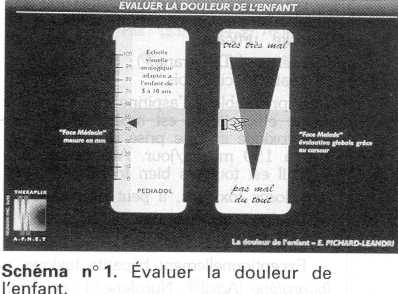
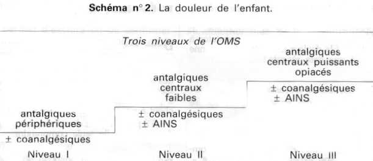

Si, depuis longtemps, on redoute la fièvre chez l'enfant par crainte des convulsions hyperthermiques et de la déshydratation, c'est une triste réalité que de constater à quel point la douleur n'a intéressé personne jusqu'à une date récente!

_Certaines fausses croyances ont la vie dure:_

- "A pathologie égale, l'enfant souffre moins que l'adulte "

- " Le nouveau-né ne souffre pas car son système nerveux est immature "

- " Le nouveau-né est incapable de communiquer son expérience douloureuse "

- " Les enfants oublient vite leur douleur "

- " Il est impossible d'évaluer la douleur du bébé "

- " La morphine est à proscrire chez l'enfant "

Il s'agit là de six erreurs qui ont été responsables de beaucoup de souffrances évitables chez nos enfants.

On sait maintenant que le nouveau-né et le nourrisson souffrent plus que l'adulte (seuil de la douleur plus bas) et que le nourrisson a une très bonne mémoire!

_Voyons maintenant quelques exemples fréquents de douleurs pédiatriques:_

*   Accouchements par forceps
*   Coliques du premier trimestre
*   Percées dentaires
*   Otites, mastoïdites
*   Pneumopathies
*   Blessures et traumatismes (fractures)
*   Brûlures
*   Et surtout crises douloureuses drépanocytaires (articulaires, abdominales, thoraciques)
*   Myalgies et céphalées du paludisme.

Quel que soit l'âge, quelle que soit la cause, il ne faut pas oublier le précepte :

_" Guérir rarement,_ _Soulager parfois, Consoler toujours_.... " Ambroise Paré (1580)

## **I. Évaluer la douleur**

**Dans les situations aiguës**

- Avant l'âge de la parole, l'enfant pousse des cris, pleure, se contorsionne; il est inconsolable malgré le sein ou le biberon. Il peut avoir des gestes répétés qui cherchent à nous montrer la cause douloureuse.

- S'il parle, il peut dire d'abord à sa mère des mots qu'elle seule comprendra.

**Dans les douleurs chroniques**

- Avant cinq ans, il devient trop calme, n'a plus la force de pleurer, il se fige dans des positions antalgiques en cachant son visage.

- Après cinq ans, il peut en parler et évaluer, par exemple avec " le thermomètre de la douleur " _(schéma 1)._ Il s'agit d'une réglette à deux faces: l'enfant peut déplacer le curseur de la position " pas mal " à " très mal ". On peut ainsi mesurer l'intensité de 0 à 100, répéter l'examen et juger du traitement (chez l'enfant drépanocytaire hospitalisé, ce moyen simple nous sert chaque jour).

## **II. Quels médicaments utiliser**

Selon l'Organisation Mondiale de la Santé, on définit trois niveaux d'analgésie devant conduire à des traitements spécifiques _(schéma 2)._

**Niveau I**

Douleurs banales _a priori_ de brève durée.

*   **Antalgiques périphériques**

_Aspirine:_ 30 à 70 mg/kg/jour en quatre à cinq fois par jour.

En cas de douleurs articulaires vives, les doses de 100 mg/kg/jour peuvent être atteintes.

Très utilisée, l'aspirine antalgique antithermique est un médicament dangereux car il peut provoquer des hémorragies par deux mécanismes :

- Lésion de la muqueuse digestive: hémorragie digestive aiguë ou chronique, fréquemment des douleurs épigastriques.

- Troubles de l'hémostase par allongement du temps de saignement (épistaxis, règles hémorragiques, saignements digestifs).

- De plus en plus, il peut exister une véritable allergie à l'aspirine (oedème de Quincke, urticaire).

_Paracétamol_ (Doliprane®): 50 mg/kg/jour en quatre à cinq fois.

Il est préférable à l'aspirine car, pour une même efficacité, il est moins toxique -. le seuil toxique en une prise est en effet de 100 à 150 mg/kg/jour. Aux doses standard, il est toujours bien toléré.

Aux doses toxiques, il peut provoquer:

- Douleurs abdominales.

- Vomissements.

- Exceptionnellement hépatite toxique.

_Ibuprofène_ (Advil®, Nurofène®): ces anti-inflammatoires très utilisés chez l'adulte en rhumatologie sont bien tolérés aux doses recommandées. Il semble en fait que l'ibuprofène (Advil@), administré aux doses de 8 mg/kg x 3/5 fois ait les mêmes propriétés antalgiques et antipyrétiques que l'aspirine et le paracétamol : sa durée d'action est plus longue, les intolérances étant exceptionnelles. Son coût est cependant plus élevé.

*   **Coanalgésiques**

Ils n'ont pas d'action analgésique propre mais ils potentialisent l'action de l'aspirine et du paracétamol.

Chez l'enfant, le Valium® gouttes est le plus utilisé à la posologie de 1 mg/kg/jour à répartir en trois prises (soit une goutte/kg/3 fois par jour).

Au besoin, les antihistaminiques peuvent être aussi utilisés (Phénergan®, théralène®) mais aussi les antispasmodiques en cas de douleur abdominale.

**Niveau Il**

Les antalgiques agissent ici sur les centres de la douleur du cerveau.

Il s'agit de la codéine, du Di-Antalvic®. En principe réservé à l'adulte, difficilement administrables à l'enfant (gélules), ils sont quelquefois administrés chez le drépanocytaire de plus de dix ans aux posologies suivantes:

- Di-Antalvic® : 1 gélule matin, midi et soir.

- Codéine (associée au paracétamol) : 3 à 10 mg/kg/jour.

**Niveau III**

Il s'agit des morphiniques. La crainte d'une dépression respiratoire, voire d'une toxicomanie, doit en limiter l'usage.

Cependant, dans les douleurs cancéreuses et la drépanocytose, après échec des niveaux I et II, ils sont tout à fait justifiés et peu chers.

_Morphine sirop_ (dilution 1 mg/ml):

- 1 ml/kg/jour réparti en six prises.

Dolosal® intramusculaire: 1 mg/kg à renouveler toutes les douze heures.

**Conclusion**

Chez un enfant douloureux, il faut d'abord s'efforcer de trouver la cause et la traiter, mais aussi prendre en charge d'emblée la douleur en écoutant, rassurant, "câlinant" tout en débutant l'antalgique approprié.

_Développement et Santé, n°115, février 1995_