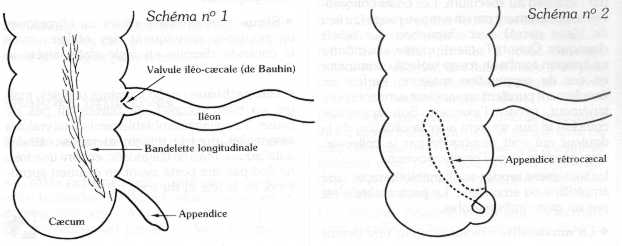
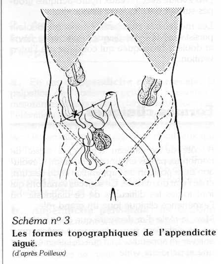
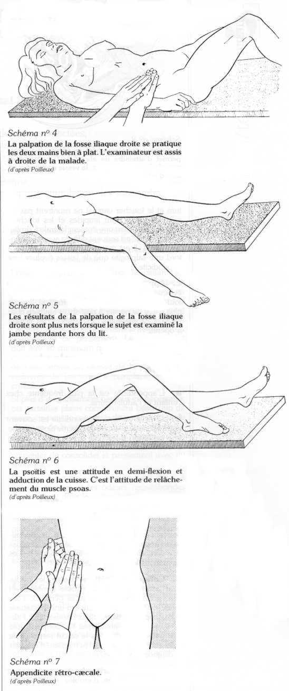
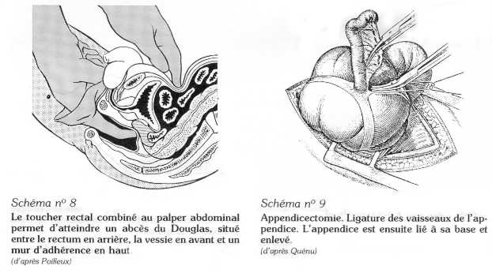

L'appendicite, inflammation de l'appendice iléo-cæcal, est une maladie très fréquente en Europe, un peu plus rare en Afrique, elle demeure cependant l'une des causes les plus habituelles de péritonite. Non reconnue à temps, elle évolue le plus souvent vers une péritonite mortelle. 
Le diagnostic n'est pas toujours facile, mais le moindre doute doit faire surveiller attentivement le malade pour l'opérer au plus tôt si le diagnostic se confirme.

## I. Qu'est-ce que l'appendice ?

L'appendice est un organe non indispensable à la vie, formation tubulaire appendue au cæcum. Sa structure histologique est riche en tissu lymphoïde (semblable aux ganglions).  
L'appendice réagit à toute infection intestinale par une inflammation qui évolue souvent vers l'abcédation.

## II. Rappel anatomique

Il existe de nombreuses variations physiologiques concernant:

- la longueur de l'appendice,
- sa position par rapport au cæcum,
- la position du cæcum lui-même dans l'abdomen,

ce qui explique la difficulté du diagnostic dans les cas, fréquents, où l'appendice ne se trouve pas tout à fait là où l'on pense qu'il devrait se trouver!

### 1. Taille de l'appendice

La longueur moyenne est de huit centimètres chez l'adulte, mais elle peut varier entre deux à vingt centimètres. Dans les cas de long appendice, sa pointe peut donc siéger très à distance: dans le pelvis, en meso-coeliaque (au milieu des anses grêles), ou dans la région sous-hépatique.

### 2. Position de l'appendice par rapport au cæcum

L'appendice s'implante :

- à la face interne du bas fond cæcal,

- au point de convergence des trois bandelettes musculaires longitudinales qui parcourent le cæcum (ce qui permet au chirurgien, dans les cas difficiles, de le retrouver en suivant les bandelettes),

- sous la valvule iléo-cæcale, point d'arrivée de l'iléon (terminaison de l'intestin grêle) dans le cæcum *(schéma n° 1).*

Mais, la position de l'appendice par rapport au cæcum peut varier selon les sujets. La variation la plus fréquente est l'appendice rétro-caecale: derrière le cæcum sous la séreuse colique. Dans ce cas, les signes cliniques sont plus difficiles à reconnaître car l'appendice est située profondément, l'intervention moins aisée car il faut décoller le cæcum *(schéma n° 2).*

### 3. Position du cæcum dans l'abdomen

Le cæcum est le début du côlon, il est situé dans la fosse **iliaque droite,** et lors d'une appendicite, c'est dans cette fosse iliaque droite (FID) que siégeront les douleurs spontanées et à la palpation. Mais il peut être plus haut placé notamment en position sous-hépatique rendant plus trompeurs les signes cliniques (on pense à la vésicule biliaire) *(schéma n° 3).*

Ainsi, ces variations anatomiques fréquentes expliquent la difficulté du diagnostic dans bien des cas:

- siège pelvien ou péri-ombilical des douleurs en cas d'appendice long,
- douleur irradiant en arrière ou à la cuisse en cas d'appendice rétro-caecal,
- douleur sous-hépatique, péri-ombilicale en cas de cæcum en position inhabituelle.

L'appendicite aiguë est donc un diagnostic toujours évoqué devant un syndrome douloureux abdominal. Fort heureusement, dans la majorité des cas, l'appendice, et les signes qu'entraîne l'appendicite, siègent dans la fosse iliaque droite.

## III. Histoire naturelle de l'appendicite

### 1. Physiopathologie

L'inflammation de l'appendice est souvent due à une infection intestinale banale, l'appendice réagissant alors comme le ferait un ganglion. Parfois, l'obstruction de l'appendice est due à la présence d'un stercolithe (petite masse dure de matières fécales) ou à des parasites (oxyures, ascaris). La typhoïde peut aussi se localiser à ce niveau.  
Une fois infecté, l'appendice va évoluer par les étapes habituelles de l'infection: inflammation, suppuration avec constitution d'un abcès, cloisonnement ou rupture de l'abcès. La gravité de cette évolution étant bien sûr due à la situation intra-abdominale de cette infection qui provoque une péritonite aiguë.

### 2. Au début

Au stade inflammatoire correspondra le tableau de l'appendicite aiguë au début. L'appendice est turgescent, tendu, entraîne une réaction inflammatoire autour de lui au niveau du péritoine et des anses grêles.

### 3. Evolution

Non traitée, l'évolution se fait vers l'abcédation, avec des signes cliniques encore plus évidents, la réaction péritonéale est plus importante, avec souvent déjà un début de péritonite.

Cet abcès peut évoluer de trois façons :

- donner lieu immédiatement a une péritonite généralisée,
- former un abcès d'abord bien cloisonné qui se rompt brutalement dans un deuxième temps provoquant la péritonite,
- se cloisonner par une agglutination des anses grêles et de l'épiploon autour de lui formant le plastron appendiculaire, ce mode de cloisonnement naturel est souvent efficace contre l'évolution vers la péritonite, mais pas toujours. Il provoque une suppuration intra-abdominale traînante. A ce stade, on préférera souvent recourir à l'antibiothérapie, plutôt qu'à l'intervention immédiate.

L'évolution naturelle se fait souvent vers la mort par péritonite généralisée.

## IV. Clinique *(schémas n° 4, 5, 6, 7, 8)*

L'appendicite aiguë au début, si elle est située dans la position habituelle iliaque droite est facile à reconnaître.

### 1. Symptômes

**a. La douleur abdominale** peut débuter, surtout chez l'enfant, dans la zone péri-ombilicale ou épigastrique, puis en quelques heures, elle se localisera dans la fosse iliaque droite où elle devient alors **permanente.**

**b.** Elle s'accompagne de **signes digestifs:** nausée, voire vomissements au début, perte de l'appétit, langue saburrale (épaisse) et, si le diagnostic tarde, état subocclusif

**c. La fièvre** au début est peu élevée entre 37°8 et 38°2, une fièvre très élevée d'emblée doit faire douter du diagnostic d'appendicite (penser alors plutôt à une salpingite ou à une pyélonéphrite). Mais, si l'appendicite évolue depuis quelques jours, la fièvre atteint alors progressivement 39°.

### 2. Examen physique

La recherche de tous les signes doit être soigneuse car leur découverte dans les cas difficiles permet d'orienter le diagnostic et surtout **l'évolution** de ces signes au cours de la surveillance permettra souvent d'affirmer qu'il y a ou non indication opératoire.

**a.** Lorsque l'appendicite évolue déjà vers l'abcès, le malade trouve **une position antalgique** allongée, évitant tout mouvement, la douleur est accentuée par les mouvements brusques (toux ... ) .

**b. La palpation :** est pratiquée avec douceur en commençant, surtout chez l'enfant, par les zones les moins douloureuses *(cf. article* "*Examen de l'abdomen"*). C'est dans la fosse iliaque droite que l'on retrouvera les signes maximum: douleur provoquée à la palpation avec défense, voire contracture, une décompression brutale de la zone palpée accentue la douleur *(schémas n°4 et 5).*

La douleur provoquée est encore plus nette lorsque le malade maintient son membre inférieur droit en l'air, ce qui tend le muscle psoas, la palpation alors comprime la zone appendiculaire entre la paroi abdominale en avant et ce muscle en arrière, la douleur est alors beaucoup plus vive en particulier lorsque l'appendice est profond, en position rétro cæcale.

**c.** Le toucher rectal retrouve la douleur provoquée à bout de doigt à droite.

**d.** Le reste de l'examen est négatif : urines limpides, auscultation pulmonaire normale, orifices herniaires libres, pas d'écoulement vaginal purulent, absence de cicatrice abdominale pouvant évoquer une appendicectomie quelques années auparavant !

### 3. Examens complémentaires

Aucun examen complémentaire ne permet d'affirmer l'appendicite, ce sont surtout les signes cliniques et leur évolution qui orientent, mais certains examens, lorsqu'ils sont possibles, apportent des éléments supplémentaires:

- hyperleucocytose sur la numération-formule sanguine: 10 000 à 12 000 globules blancs au début, puis 20 000 et plus au stade d'abcès,
- la radiographie d'abdomen sans préparation (face debout et couché) est normale au début, puis montre des signes d'occlusion à un stade plus évolué avec niveaux hydro-aériques groupés surtout dans la fosse iliaque droite.

Les meilleurs signes restent donc une douleur persistante en fosse iliaque droite avec fièvre et douleur provoquée qui conduisent à l'intervention.

## V. Formes cliniques

A côté de ce tableau typique, il existe de nombreux pièges en fonction du stade d'évolution de la position de l'appendice et du cæcum, et de l'état du malade. Ce sont ces variations qui font toutes les difficultés de ce diagnostic où l'expérience clinique joue un grand rôle.

Mais, la règle d'or demeure que dans le doute, on ne s'abstient pas, mieux vaut opérer pour enlever un appendice sain que de laisser évoluer une appendicite vraie.

### 1. Aspects cliniques en fonction de l'évolution

#### a) Au stade d'abcès appendiculaire

Les signes sont alors très francs, avec fièvre à 39°-40°, douleur permanente en fosse iliaque droite, arrêt des gaz et des matières, défense voire contracture abdominale.

#### b)  Au stade de péritonite

*(cf. article* *"Péritonite aiguë généralisée et examen de* *l'abdomen "),* le diagnostic est évident avec une contracture abdominale généralisée, vue à ce stade on porte le diagnostic de péritonite, l'origine appendiculaire peut être suspectée par un début des signes à droite et maximum de douleurs de ce côté. Mais c'est souvent l'intervention chirurgicale, de toute façon nécessaire, qui découvrira l'origine de cette péritonite.

#### c) Le plastron appendiculaire

C'est une évolution plus rare, l'abcès appendiculaire se trouve, dans ce cas, naturellement cloisonné par une agglutination des anses grêles et de l'épiploon. Après plusieurs jours d'évolution d'une appendicite typique, on se trouve devant un malade à l'état général très altéré par cette suppuration profonde, fébrile et l'on palpe une tuméfaction douloureuse et mal limitée de la fosse iliaque droite. A ce stade, l'intervention peut être différée, car il est souvent plus prudent de " refroidir " le plastron par l'antibiothérapie par voie générale sous étroite surveillance chirurgicale.

### 2. Aspects cliniques en fonction de la position de l'appendice

#### a) En cas d'appendicite retro-caecale

La palpation de l'abdomen peut être faussement rassurante. Mais la mise en tension du psoas par l'élévation de la jambe et le toucher rectal permettent de retrouver la douleur. C'est souvent la surveillance des signes abdominaux qui emportent la décision. Au stade d'abcès, on retrouve parfois une psoïtis (contraction douloureuse de la hanche dû à l'inflammation du psoas) qui peut faire croire à une arthrite de hanche *(cf. schémas n° 6 et 7).*

#### b) Appendicite pelvienne

Les douleurs peuvent faussement orienter chez la femme vers une affection gynécologique, ou urinaire car l'abcès est proche de la vessie et peut entraîner de faux signes de cystite. L'examen au spéculum et le toucher vaginal ne montrent pas de pus, les urines sont limpides et les touchers pelviens montrent une douleur latérale à droite. Le diagnostic est souvent difficile avec la salpingite droite. Il est moins dangereux d'opérer à tord une salpingite que de laisser évoluer une appendicite !

#### c. Appendicite sous-hépatique

**Les signes** évoquent une cholécystite chez l'adulte. De toute façon le traitement est chirurgical. Il serait plus grave de penser à une abcès amibien chez l'enfant, l'aggravation rapide des signes incitant à opérer.

### 3. Aspect clinique selon le terrain

**a.** L'appendicite est la plus fréquente chez l'enfant et l'adulte jeune.

**b.** Chez le vieillard, l'appendicite est souvent vue à un stade tardif et se présente alors comme une occlusion intestinale fébrile avec défense abdominale.

## VI. Diagnostic différentiel

Souvent évoquée devant une douleur abdominale, l'appendicite, surtout au début, ne doit pas être confondue avec une autre affection. Les discussions les plus fréquentes sont:

### 1. Colique néphrétique droite

Les irradiations ascendantes vers la fosse lombaire, et descendantes vers les organes génitaux, l'absence de fièvre, la présence d'une hématurie microscopique (examen aux bandelettes), l'absence de position antalgique, l'abdomen souple à la palpation et parfois le calcul responsable visible sur la radiographie permettent d'orienter le diagnostic.

### 2. La pyélonéphrite droite

La fièvre est souvent plus élevée d'emblée (39°-40°), les urines sont troubles, la fosse lombaire est douloureuse.

### 3. La salpingite droite

La notion d'infection génitale, un écoulement de pus par le vagin orientent, mais souvent il est bien difficile de faire la différence.

### 4. L'arthrite de hanche droite

Elle peut être discutée devant un psoïtis, mais un examen doux retrouvera en fait une articulation normale et des signes abdominaux.

## VII. Traitement

Au stade d'appendicite aiguë, le traitement est chirurgical, il faut enlever l'appendice (appendicectomie, ce qui amène rapidement la guérison au prix d'une intervention simple et menée le plus souvent par une voie d'abord élective d'assez petite taille (voie de Marc Burney) *(schéma n° 9).*

L'intervention peut retrouver un appendice sain qui sera de toute façon enlevé, le chirurgien poursuivra alors l'exploration en recherchant: un diverticule de Meckel (diverticule congénital situé à quatre-vingt centimètres de l'iléon terminal sur l'iléon), une adénolymphite mésentérique (inflammation des ganglions du mésentère secondaire à une infection intestinale, cas fréquent chez l'enfant et sans gravité). Il faudra aussi vérifier l'état de l'ovaire et de la trompe droite (salpingite, GEU).

A la moindre difficulté, le chirurgien agrandira l'incision, et si la péritonite existe déjà et ne peut être traitée correctement par une petite voie d'abord, il passera alors par une incision médiane.

L'évolution de l'appendicite vers la péritonite justifie que l'on opère tôt toute suspicion d'appendicite. Les signes sont souvent trompeurs et tout chirurgien se trompe régulièrement dans un sens ou dans un autre. La sagesse consiste à opérer dès que l'évolution des signes y incite.
