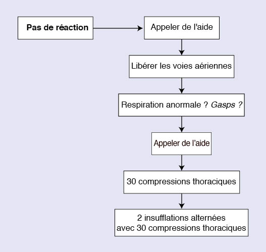
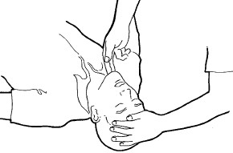
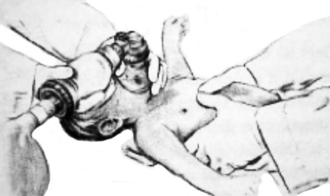
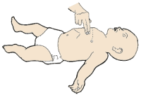
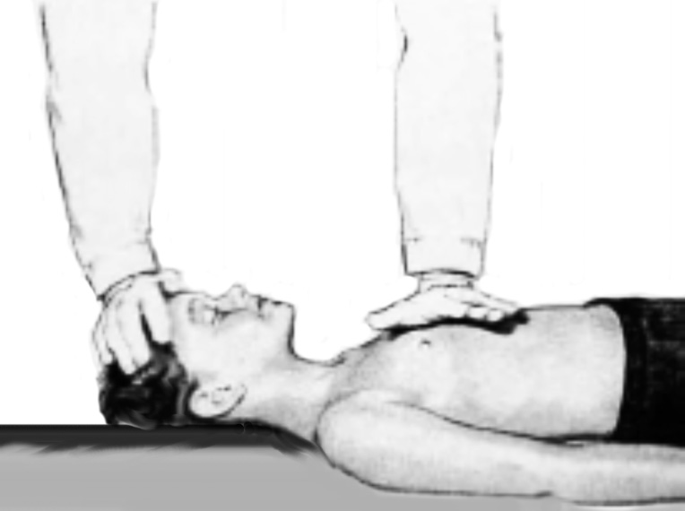
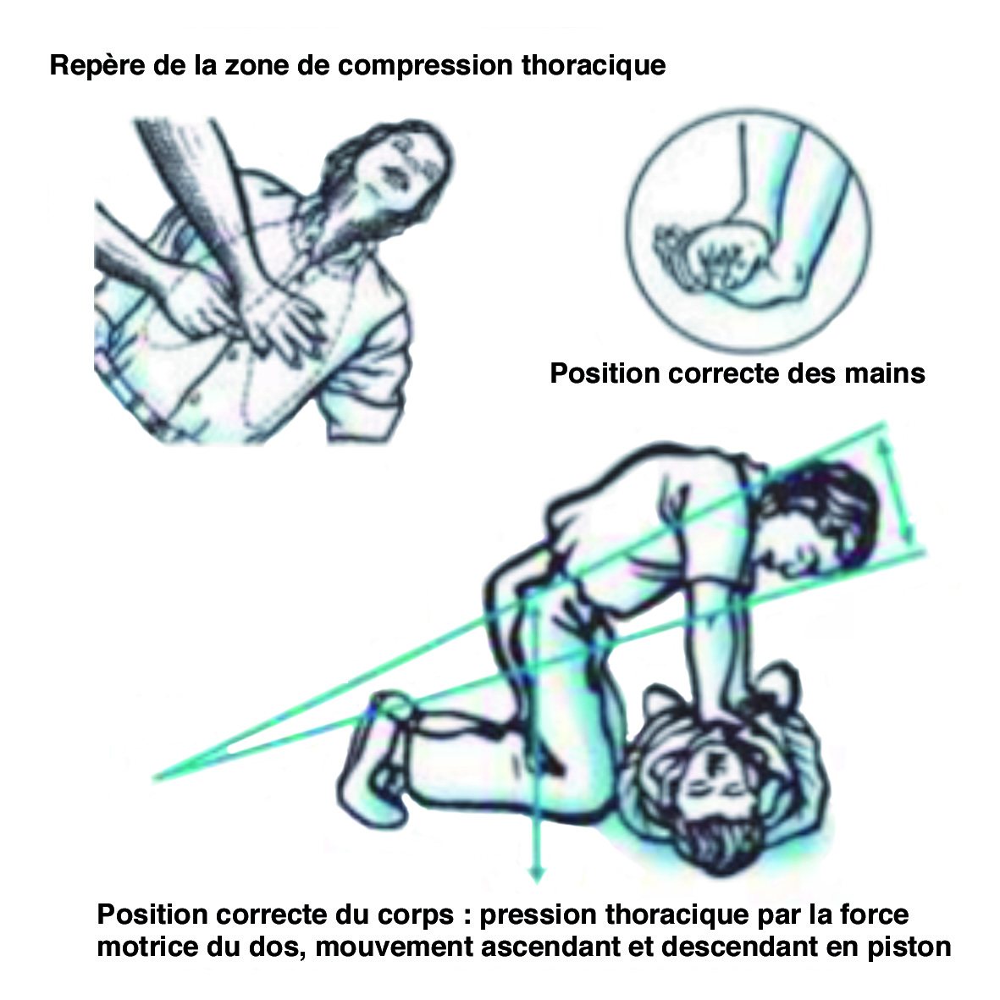
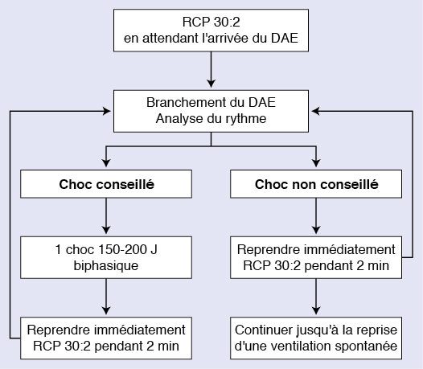
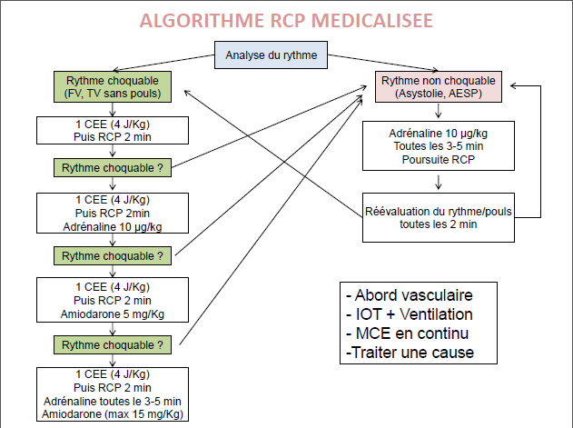

Les causes et la prise en charge de l'arrêt cardiaque de l'enfant et de l’adulte sont différentes. L'arrêt cardiaque de l'enfant (tableau 1) est le plus souvent la conséquence d'une hypoxie, et il s’agit dans plus de 75 % des cas d'une asystolie<em>. L'arrêt cardiaque de l'adulte est dans la grande majorité des cas la conséquence d’une ischémie coronarienne, et il s’agit dans plus de 40 % des cas d’une fibrillation ventriculaire</em> (FV).

Le pronostic à court et moyen termes de l'arrêt cardiaque est sombre. Les chances de survie des victimes d’arrêt cardiorespiratoire survenant hors de l’hôpital sont nulles en l’absence d’un témoin lors de l’arrêt cardiorespiratoire, de mise en oeuvre des gestes de survie par un témoin et de reprise d’une activité circulatoire spontanée avant le transport.

Un effort important doit porter sur sa prévention, c'est-à-dire sur l'identification précoce des situations à risque.

Le concept de “chaîne de survie” décrit les actions nécessaires pour améliorer la survie des arrêts cardiaques à l'extérieur de l'hôpital. Cette chaîne comprend quatre maillons :

<ul>
<li>l'alerte immédiate ;</li>
<li>la réanimation cardiopulmonaire (RCP) de base ;</li>
<li>la défibrillation précoce ;</li>
<li>la réanimation médicalisée.</li>
</ul>

Le pronostic à court et moyen terme de l'arrêt cardiaque est sombre. Les chances de survie des victimes d’arrêt cardiorespiratoire survenant hors de l’hôpital sont nulles en l’absence d’un témoin lors de l’arrêt cardiorespiratoire, de mise en œuvre des gestes de survie par un témoin et de reprise d’une activité circulatoire spontanée avant le transport.  
Un effort important doit porter sur sa prévention, c'est-à-dire sur l'identification précoce des situations à risque.

**Tableau I : étiologies de l'arrêt cardio-respiratoire chez l'enfant**

<table>

<thead>

<tr>

<th scope="col" style="width:164px">Etiologies</th>

<th scope="col" style="width:93px">Fréquence</th>

</tr>

</thead>

<tbody>

<tr>

<td style="width:168px">Mort subite du nourrisson</td>

<td style="width:97px">23 %</td>

</tr>

<tr>

<td style="width:168px">Traumatique</td>

<td style="width:97px">20 %</td>

</tr>

<tr>

<td style="width:168px">Respiratoire</td>

<td style="width:97px">16 %</td>

</tr>

<tr>

<td style="width:168px">Noyade</td>

<td style="width:97px">12 %</td>

</tr>

<tr>

<td style="width:168px">Cardiaque</td>

<td style="width:97px">8 %</td>

</tr>

<tr>

<td style="width:168px">Neurologique</td>

<td style="width:97px">6 %</td>

</tr>

<tr>

<td style="width:168px">Brûlure</td>

<td style="width:97px">1 %</td>

</tr>

<tr>

<td style="width:168px">Intoxication</td>

<td style="width:97px">1 %</td>

</tr>

</tbody>

</table>

## I. Diagnostic ou reconnaissance de l’Arrêt Cardio-Respiratoire (ACR)

C’est un arrêt brutal de la circulation et de la ventilation qui se manifeste par une absence de signe de vie. Le patient inconscient ne répond pas aux stimulations et ne ventile pas ou présente une respiration agonique (gasp). Le témoin non secouriste n’a pas à rechercher l’absence de pouls. La rapidité du diagnostic d’arrêt cardiorespiratoire est primordiale (moins de 10 secondes).

## II. Réanimation cardio-pulmonaire (RCP) de base

C’est une assistance cardio-respiratoire réalisée sans matériel par les témoins de l’arrêt cardiaque. Sa précocité conditionne le pronostic.

### 1. Séquence de base

Chez un enfant, une cause respiratoire est la plus probable.

La séquence consiste successivement et dans l'ordre suivant à :

- libérer les voies aériennes,
- faire cinq insufflations puis, en l’absence d’une reprise d’une ventilation spontanée après 5 insufflations efficaces,
- entreprendre la RCP pendant 1 minute, soit quatre à cinq séquences compression et ventilation alternées, au terme desquelles on alerte les secours,
- après l'appel téléphonique, le sauveteur reprend les séquences compression et ventilation  lternées jusqu'à l'arrivée des secours,
- lorsque deux sauveteurs sont sur place d'emblée, l'un débute cette séquence pendant que le second alerte les secours.

Chez un sujet âgé, un trouble du rythme est le plus probable et on débute la séquence compression-ventilation par les compressions.

***Figure 1***

### 2. Séquence de réanimation de base pédiatrique

Elle concerne les enfants prépubères, victimes de noyade, de traumatisme ou d’intoxications.

#### a) Libération des voies aériennes (LVA)

Après avoir diagnostiqué l’absence de ventilation, mettre la tête en hyperextension ou subluxer la mandibule (figure 2).

***Figure 2***

#### b) Ventilation

Le sauveteur fait 5 insufflations par bouche à bouche chez les enfants âgés de plus de 1 an  
(figure 3), ou bouche à bouche + nez chez les enfants âgés de moins de 1 an. Les insufflations durent 1 à 1,5 s, avec une pression suffisante pour soulever le thorax.

La ventilation est efficace quand il y a une expansion thoracique lors des insufflations. En cas de ventilation inefficace, une obstruction des voies aériennes par un corps étranger est à envisager.

                                                                                ***Figure 3***

#### c) Massage cardiaque externe (MCE)

Il est débuté après une prise de pouls par un soignant ; la recherche du pouls doit durer moins de 10 s mais elle est abandonnée pour le non secouriste. La prise de pouls se fait au niveau brachial ou fémoral chez le nourrisson, carotidien ou fémoral chez le grand enfant.

**La technique du MCE varie selon l’âge :**

- chez le nourrisson et jusqu’à l’âge de 1 an, on peut utiliser la “technique des 2 pouces encerclant le thorax” (figure 4) ou la “technique des 2 doigts d’une main” (figure 5).
- chez les enfants âgés de plus de 1 an, on utilise la “technique à 1 main” (figure 6) ou la “technique à 2 mains” (figure 7).

***Figure 4***

***Figure 5***

***Figure 6***

***Figure 7***

<table>

<tbody>

<tr>

<td>

Le MCE se fait sur un plan dur avec une dépression de 1/3 du diamètre antéro-postérieur du thorax et à une fréquence de 100/minute. La relaxation passive est complète et l’on évitera toute interruption prolongée du MCE. Le cycle compression et ventilation est identique pour le nourrisson, l’enfant, et l’adulte si le sauveteur est seul, 30/2.

</td>

</tr>

</tbody>

</table>

### 3. Séquence de réanimation de base adulte

- Elle s'applique aussi aux enfants pubères, aux enfants porteurs d'une cardiopathie connue et à ceux qui s'écroulent brutalement devant témoin, sans notion de traumatisme.
- Du fait de l'âge ou des circonstances brutales de l'arrêt cardiaque, l'hypothèse d'un trouble du rythme ventriculaire est privilégiée. La séquence consiste donc, dans un premier temps, à appeler les secours, à libérer les voies aériennes puis à commencer les compressions thoraciques alternées avec les insufflations selon un rythme 30 compressions-deux insufflations et cela jusqu'à l'arrivée des secours.

#### a) Libération des voies aériennes

La libération des voies aériennes d’une victime d’arrêt cardiorespiratoire nécessite de l’allonger à plat dos sur un plan dur, vêtements dégrafés. Le mieux est de se mettre à genoux à côté de son épaule. Dans cette position, le secouriste recherche d’abord un éventuel corps étranger intrabuccal en introduisant un index replié en crochet dans la bouche. Il ôte aussi les éventuelles prothèses dentaires.

#### b) MCE et ventilation

La priorité absolue est aux compressions thoraciques qu’il faut débuter le plus rapidement possible. En cas de réticences à réaliser le bouche à bouche, notamment par crainte d’une contamination par le virus de l’immunodéficience humaine (HIV) - dont la transmission n’a pas été rapportée alors que le risque de tuberculose a été décrit -, le secouriste réalise le massage

cardiaque seul en attendant l’arrivée des secours.

## III. Défibrillation ou choc électrique externe (CEE)

La défibrillation appelée aussi choc électrique externe, consiste à faire passer volontairement et de manière brève un courant électrique dans le coeur lorsque celui-ci présente des troubles

du rythme appelés fibrillation ou tachycardie ventriculaire. Ce courant est destiné à rétablir un rythme cardiaque normal (sinusal). Pour effectuer ce geste le plus rapidement possible,

il existe des appareils nommés défibrillateurs entièrement automatiques (DEA) ou défibrillateurs semi-automatiques (DSA). Ces appareils procèdent automatiquement au diagnostic de la

fibrillation ventriculaire grâce à un logiciel d'analyse de tracé électrocardiographique.

L’utilisation d’un défibrillateur automatisé externe (DAE) permet une analyse automatique de l’activité électrique du coeur afin de délivrer, après avoir établi le diagnostic de fibrillation ou

de tachycardie ventriculaire, un choc électrique. Celui-ci peut être réalisé par des non professionnels ayant bénéficié d’une formation. La précocité de ce geste conditionne le pronostic

des fibrillations ventriculaires et des tachycardies ventriculaires.

La RCP est commencée ou continuée pendant la mise en place du défibrillateur automatisé externe.

Les étapes de mise en place d’un défibrillateur automatisé externe sont toujours les mêmes : mise en marche de l’appareil, préparation de la zone d’application des électrodes, mise en place des électrodes, analyse du rythme cardiaque.

Le tracé électrocardiographique permet de distinguer les rythmes “défibrillables” (fibrillation ventriculaire, tachycardie ventriculaire) des rythmes “non défibrillables” (asystolie, activité

électrique sans pouls). Cette distinction conditionne la suite de la prise en charge comme le montre l’arbre décisionnel de défibrillation (figure 8).

***Figure 8***

Les défibrillateurs automatisés externes ne sont pas recommandés pour l’enfant de moins de 1 an mais ils sont actuellement fiables chez l'enfant âgé de plus de 1 an. Chez les enfants de

moins de 8 ans, le défibrillateur doit être utilisé chaque fois que possible avec un atténuateur d'énergie pour délivrer des chocs de l'ordre de 50 à 75 J. Faute d'atténuateurs d'énergie, les règles d’utilisation d’un défibrillateur automatisé externe sont les mêmes que chez les adultes. Les palettes sont appliquées, l'une sous la clavicule droite, l'autre à la pointe du coeur. Chez les tout petits enfants, une palette est placée sur la face antérieure du thorax et la seconde dans le dos, l’enfant étant maintenu par les palettes en décubitus latéral. Un gel de contact facilite la

transmission de l'onde électrique.

Tout choc électrique externe (CEE), avant d’administrer un autre choc, doit être suivi de 2 minutes de RCP sans vérifier le pouls, le temps que le rythme se stabilise, car il est rare qu’il réapparaisse immédiatement chez l’adulte.

## IV. Prise en charge : RCP médicalisée (figure 9)

### 1. Ventilation

La ventilation au masque lié à un ballon autogonflable et, au mieux, raccordé à une source d’oxygène, précède l’intubation endotrachéale.

L’intubation ne doit pas faire perdre temps, la ventilation au masque permet l’oxygénation mais elle ne protège pas de l’inhalation du liquide gastrique.

### 2. Circulation

On poursuit le massage cardiaque externe en continu après le contrôle des voies aériennes et si possible en changeant fréquemment de masseur. La mise en place d’une voie veineuse périphérique est réalisée par ponction d’une veine de l’avant bras ou du pli du coude à l’aide d’un cathéter intraveineux court. Ce geste est réalisable tout en poursuivant le MCE et la ventilation. Le chlorure de sodium à 0,9 % est la solution de perfusion généralement recommandée.

#### a) En cas de rythmes non défibrillables : asystolie

La prise en charge consiste à poursuivre les compressions thoraciques et la ventilation et à administrer de l'épinéphrine (adrénaline) toutes les 3 à 5 minutes, par voie intraveineuse, à la dose de 10 μg/kg, soit 0,1 ml/kg d'une solution à 1/10 000 (soit une ampoule de 1 ml = 1 mg diluée avec 9 ml de sérum physiologique).

En l'absence de voie intra-osseuse ou intraveineuse, la voie endotrachéale peut être utilisée avec une posologie d'adrénaline de 100 μg/kg (soit 0,1 ml/kg d'une solution à 1/1 000).

L'analyse du rythme sur le scope est faite 2 minutes après l'injection.

Si le rythme non défibrillable persiste, les manoeuvres sont poursuivies pendant 2 minutes avant une nouvelle analyse. Si le rythme devient un rythme défibrillable (fibrillation ventriculaire, tachycardie ventriculaire), le traitement repose sur la défibrillation.

#### b) Rythmes défibrillables : fibrillation ventriculaire, tachycardie ventriculaire

Le traitement de ces troubles du rythme repose sur la défibrillation. Les médicaments sont à utiliser en cas d’échec ou d’impossibilité de recourir à la défibrillation. Les palettes pédiatriques (diamètre 4,5 cm) sont utilisées pour les nourrissons âgés de moins de 1 an ou jusqu'à 10 kg. Passé cet âge, il faut utiliser les palettes adultes (diamètre 8 à 13 cm).

La pression des palettes sur le thorax doit être forte afin de minimiser l'impédance transthoracique. Chez l’enfant, la dose d'énergie recommandée est de 4 J/kg. Le choc électrique est suivi de 2 minutes de RCP (30 compressions thoraciques-deux insufflations).

Après défibrillation le rythme est analysé au terme de ces 2 minutes de RCP. S'il reste identique, un second choc est réalisé, suivi de 2 minutes de RCP avant une nouvelle analyse du rythme. S'il est toujours identique, un troisième choc est réalisé suivi de 2 minutes de RCP. Avant le troisième choc, puis toutes les 5 minutes, une injection intraveineuse d'adrénaline (10 μg/kg, soit 0,1 ml/kg de la solution à 1/10000) est faite. Si les troubles persistent une injection d'amiodarone 5 mg/kg

en bolus est faite.

***Figure 9***

#### c) Autres traitements

Au cours de cette séquence, les causes traitables d'arrêt cardiaque doivent être recherchées (tableau 2). Le traitement de la cause peut être (tableau 3) : un remplissage, l’administration d’adrénaline, d’amiodarone, d’atropine, de sulfate de magnésium, de chlorure de calcium, de bicarbonates.

## V. Prise en charge post arrêt cardiaque en réanimation

Une fois un rythme sinusal restauré, il est indispensable :

- de confirmer la reprise d'une circulation efficace par la recherche d'un pouls central palpable,
- de traiter une dysfonction myocardique, fréquente après ACR, par l’introduction d’adrénaline en continu,

Le patient est ventilé en normoxie (FiO2 minimale pour SpO2 > 94 %) et normocapnie. Il faut lutter contre l’hyperthermie et une hypothermie (32 à 34°C) est proposée pendant 12 à 24 h. Il faut

monitorer la glycémie pour maintenir une normoglycémie.

## VI. Décision d’arrêt de la réanimation cardio-pulmonaire

Elle dépend de la cause de l’arrêt cardio-respiratoire, des conditions pré-existantes, de la présence ou non de témoins, de la durée de l’arrêt cardio-respiratoire non traité et de la durée

de la réanimation cardio-pulmonaire et de son efficacité. Il est admis d’arrêter une réanimation cardio-pulmonaire après 30 minutes sans reprise d’activité circulatoire spontanée.

On peut décider de poursuivre la réanimation au-delà de 30 minutes jusqu’à l’arrivée d’un médecin en informant l'entourage de la gravité du pronostic. Décider d’arrêter la réanimation

cardio-respiratoire équivaut à prononcer le décès de la personne.

En cas de signes de mort irréversible (rigidité cadavérique, par exemple), de conditions de mise en danger des secours, ou d’arrêt cardio-respiratoire chez un malade en phase terminale,

la mise en oeuvre d’une réanimation n’est pas recommandée.

## VII. Arrêt cardio-respiratoire au bloc opératoire

L’algorythme est inchangé : libération des voies aériennes, ventilation, circulation. Il existe des étiologies spécifiques : hypoxie à l’induction, causes hémodynamiques, choc hémorragique,

anaphylactique.

## Conclusion

L’arrêt cardio-respiratoire de l’enfant est dans la majorité des cas d’origine respiratoire et, pour cette raison, les recommandations de prise en charge sont différentes de la prise en charge de l’arrêt cardio-respiratoire chez l’adulte et donnent la priorité à la ventilation. Le pronostic, chez l’enfant comme chez l’adulte, est sombre.

La prévention repose sur l’identification des situations à risque avec le rôle primordial du maintien de l’oxygénation.

## Annexes

### Définitions

- **Asystolie** : tracé plat ou absence d’activité cardiaque électrique.
- **Défibrillateur monophasique ou biphasique** : l’efficacité du défibrillateur biphasique est meilleure. Il agit non seulement plus rapidement, mais réduit les risques de traumatisme. Il a été reconnu que la défibrillation par onde biphasique est bien plus pratique que celle qui envoie une onde monophasique. En effet, lors de l’action de défibrillation, certaines cellules sont susceptibles d’être stimulées, tandis que d’autres qui sont déjà stimulées, ne sont plus excitables. Avec une onde monophasique, ces cellules non excitables ne réagissent pas à un seul choc. Par contre, si un autre choc de sens contraire succède immédiatement au premier, un phénomène de repolarisation peut être suscité. C’est le but de la défibrillation par onde biphasique qui, comme son nom le démontre, s’effectue en deux phases.
- **Fibrillation ventriculaire** (figure 10) : trouble du rythme cardiaque correspondant à la contraction rapide, désorganisée et inefficace des ventricules cardiaques. A l’électrocardiogramme (ECG), on observe des ondulations anarchiques, d’amplitude et de fréquence variables. Une FV démarre généralement comme une salve de tachycardie ventriculaire rapide et régulière avec des complexes QRS larges qui se fragmentent ensuite, prenant un aspect d'ondulations rapides et désordonnées. En l’absence de défibrillation immédiate, ces ondulations se raréfient et disparaissent jusqu’à un tracé plat.

                    
  
 ***Figure 10. Tracé ECG de fibrillation ventriculaire***

- **FiO2** ou fraction inspirée d’oxygène : elle est exprimée en pourcentage ou en fraction de 1. Dans l’air ambiant, elle est de 21% ou 0,21. Un apport d’oxygène par des lunettes ou un masque facial permet d’enrichir cet apport qui est généralement adapté pour obtenir une saturation percutanée en oxygène supérieure (SpO2) à 95%.
- **Gasp ou respiration agonique** : respiration bruyante pendant quelques dizaines de secondes, qui précède l’arrêt respiratoire où on ne perçoit plus la respiration, on ne sent pas le souffle avec la joue, on ne voit pas la poitrine ou le ventre se lever ni se baisser.
- **SpO2** ou mesure percutanée de la saturation en oxygène de l’hémoglobine : la SpO2 est très proche de la SaO2, qui est la saturation artérielle en oxygène. La SpO2 normale mesurée en air ambiant par un oxymètre de pouls est comprise entre 96 % et 100 %.
- Tamponnade péricardique : épanchement liquidien de grande abondance dans le péricarde, entraînant une compression aiguë du coeur et une inefficacité cardiaque.
- Torsade de pointe : type particulier de tachycardie ventriculaire avec des complexes QRS qui changent d’axe, donnant un aspect de torsion autour de la ligne isoélectrique.

<table>

<tbody>

<tr>

<td>

Présentation et dilution de l’épinéphrine ou adrénaline

<ul><li>Distinguer les différentes dilutions d’adrénaline avant de l’administrer. Il existe des ampoules</li><li>de1 ml contenant 0,25 mg, 0,5mg, 1 mg, 5mg.</li><li>Dilution 1/1000 soit 1 ampoule 1ml = 1mg.</li><li>Dilution 1/10 000 soit une ampoule de 1 ml = 1 mg diluée avec 9 ml de sérum physiologique.</li><li>1mg = 1/1000 g et 1 μg ou microgramme = 1/1 000 000 g.</li></ul></td>

</tr>

</tbody>

</table>

<table>
<caption>Tableau 2 : causes réversibles des arrêts cardiaques de l'enfant</caption>

<tbody>

<tr>

<td>5 H</td>

<td>5 T</td>

</tr>

<tr>

<td>

Hypoxie 

Hypovolémie 

Hyper/hypokaliémie 

Hypothermie 

Hydrogène (acidose)

</td>

<td>

Pneumothorax sous tension

Tamponnade péricardique

Toxiques

Thrombose (embolie pulmonaire, thrombose coronaire)

Température

</td>

</tr>

</tbody>

</table>

<table>
<caption>Tableau 3 : médicaments de la RCP</caption>

<thead>

<tr>

<th scope="col">Traitement</th>

<th scope="col" style="width:196px">Indications</th>

<th scope="col" style="width:152px">Posologie</th>

</tr>

</thead>

<tbody>

<tr>

<td>

Perfusion de sérum physiologique

associée à un remplissage

</td>

<td style="width:200px"> Hypovolémie </td>

<td style="width:156px">20 ml/kg cristalloïdes  
voie IV rapide (débit libre)</td>

</tr>

<tr>

<td>Adrénaline +++</td>

<td style="width:200px">

Rythmes non défibrillables : asystolie, ou activité électrique sans pouls (AESP)

Rythmes défibrillables : FV, TV

</td>

<td style="width:156px">

10 µg/kg (1 mg chez l'adulte)  
voie IV ou IO

100 µg/kg voie IT  
toutes les 3 à 5 min

</td>

</tr>

<tr>

<td>Amiodarone</td>

<td style="width:200px">

FV/TV résistantes au CEE,

TSV et TV hémodynamiquement satbles

</td>

<td style="width:156px">5 mg/kg jusqu'à dose maximale : 15 mg/kg voie IVL</td>

</tr>

<tr>

<td>Atropine</td>

<td style="width:200px">ACR par bradycardie</td>

<td style="width:156px">20 µg/kg voie IV (ou IO)</td>

</tr>

<tr>

<td>Magnésium (sulfate)</td>

<td style="width:200px">Hypomagnésémie, torsades de pointe</td>

<td style="width:156px">25-50 mg/kg voie IV  
sur 10-20 min (max 2 g)</td>

</tr>

<tr>

<td>Calcium (chlorure)</td>

<td style="width:200px">Hyperkaliémie, hypermagnésémie, intoxication aux inhibiteurs calciques</td>

<td style="width:156px">20 mg/kg voie IV</td>

</tr>

<tr>

<td>Lidocaïne</td>

<td style="width:200px">Si l'amiodarone est non disponible, la lidocaïne ayant été remplacée par l'amiodarone dans les FV/TV résistantes au CEE</td>

<td style="width:156px">1 mg/kg voie IV</td>

</tr>

<tr>

<td>Bicarbonate de sodium</td>

<td style="width:200px">Hyperkaliémie, intoxication aux tricycliques, ACR > 15 min après ventilation, MCE, adrénaline</td>

<td style="width:156px">1 meq/kg voie IV</td>

</tr>

</tbody>

</table>
