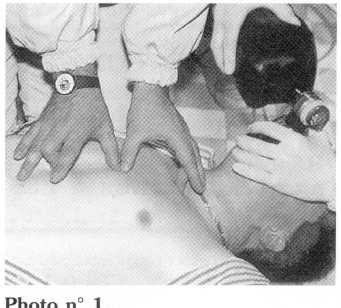
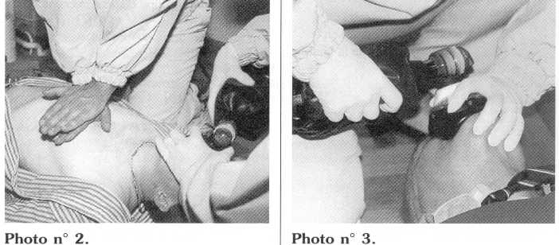
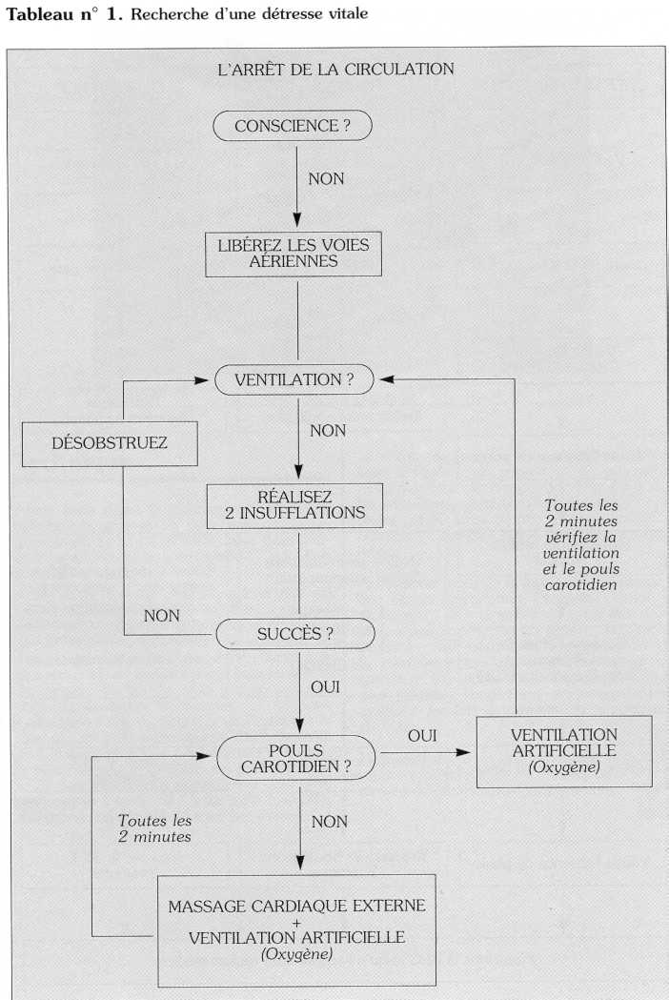
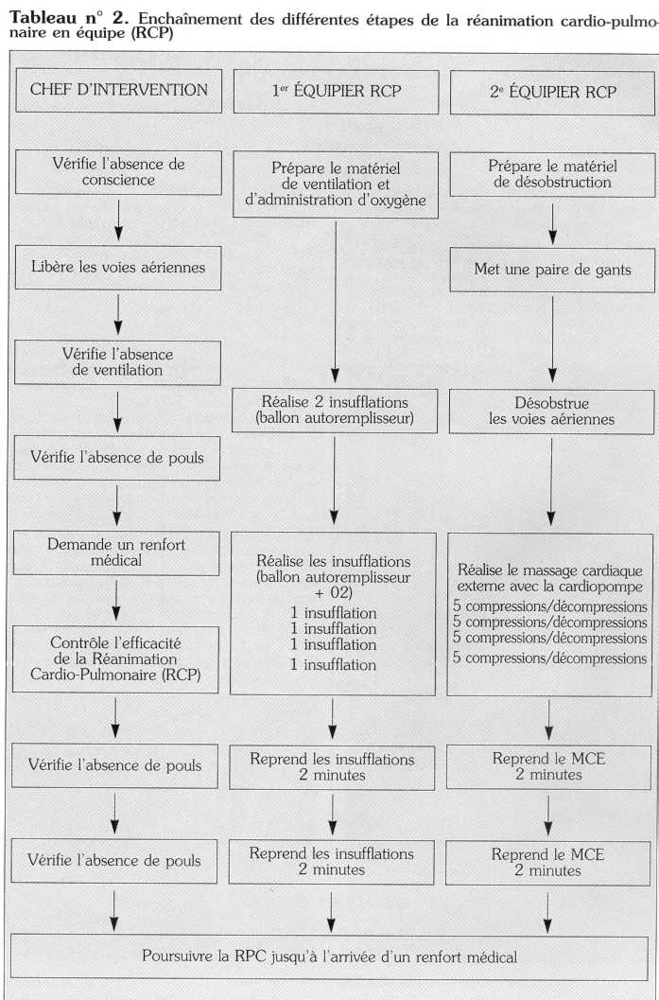
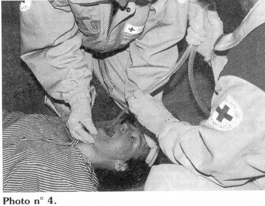

Après avoir vu la technique et l'attitude à adopter par un secouriste isolé dépourvu de matériel face à un arrêt cardio-respiratoire, nous traitons, dans cet article, de la conduite à tenir face au même problème par des secouristes agissant en équipe organisée.

## I. Conduite à tenir

Examiner rapidement la victime : vérifier la présence ou non d'hémorragie, puis faire le bilan des fonctions vitales. La victime étant inconsciente, en arrêt ventilatoire, le pouls carotidien absent, il est nécessaire de démarrer la réanimation cardio-pulmonaire _(tableau_ _n° 1_), le plus rapidement possible.

L'alerte des secours médicalisés doit être immédiate. En équipe, la technique du massage cardiaque externe (MCE) + ventilation artificielle s'effectue à deux sauveteurs : un sauveteur pratique le massage cardiaque externe tel que décrit dans _Développement et Santé n° 135_, un second pratique la ventilation artificielle à l'aide d'un insufflateur manuel de type ballon autoremplisseur à valve unidirectionnelle, relié à un obus d'oxygène _(photos_ _n° 1 et 2)._ La désobstruction des voies aériennes est assurée à l'aide d'un aspirateur de mucosités.

D'une manière générale, un premier équipier examine la victime afin de déterminer l'état des fonctions vitales, il déclenche ensuite l'alerte, tandis que les deux autres pratiquent la réanimation cardio-pulmonaire proprement dite _(tableau n° 2),_ selon le rythme de 5 appuis sternaux pour 1 insufflation.

## II. Technique

Après avoir décrit la technique du MCE, du bouche-à-bouche et du bouche-à-nez_,_ nous nous intéressons à la ventilation artificielle à l'aide d'un insufflateur manuel.

Après avoir basculé prudemment la tête en arrière, munissez-vous d'un insufflateur manuel avec masque adapté à la dimension du visage de la victime. Commencez par appliquer le masque en plaçant le sommet de celui-ci à la racine du nez, en finissant par la base au niveau du menton. La bouche et le nez doivent être englobés de façon hermétique. Le maintien s'effectue à l'aide du pouce et d l'index sur le masque, les trois autres doigts étant disposés sous le menton. Celui-ci est tiré vers le haut et la tête maintenue basculée en arrière _(photo n° 3)._ Les insufflations doivent être douces et progressives à raison de 15 par minute, le débit d'oxygène doit être de 15 litres par minute.

La désobstruction des voies aériennes est réalisée à l'aide d'un aspirateur de mucosités muni d'une canule d'aspiration afin d'évacuer les sécrétions, vomissements, sang qui pourraient gêner, voire empêcher une ventilation correcte. L'équipier porte des gants à usage unique.

Après avoir raccordé le tuyau de l'aspirateur à une canule d'aspiration, l'équipier clampe le tuyau avant de " faire le vide ". La tête de la victime est maintenue en arrière, la bouche ouverte pour permettre l'introduction de la canule jusqu'au fond de la gorge _(photo n° 4)_ ; après avoir déclampé, l'équipier pratique l'aspiration en remontant la canule à laquelle il imprime un mouvement circulaire.

Nous verrons, dans un prochain article, le matériel utilisé par les secouristes dans le traitement de l'arrêt cardio-respiratoire.

_Développement et Santé, n° 136, août 1998_