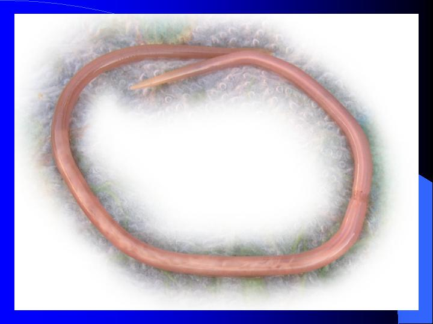
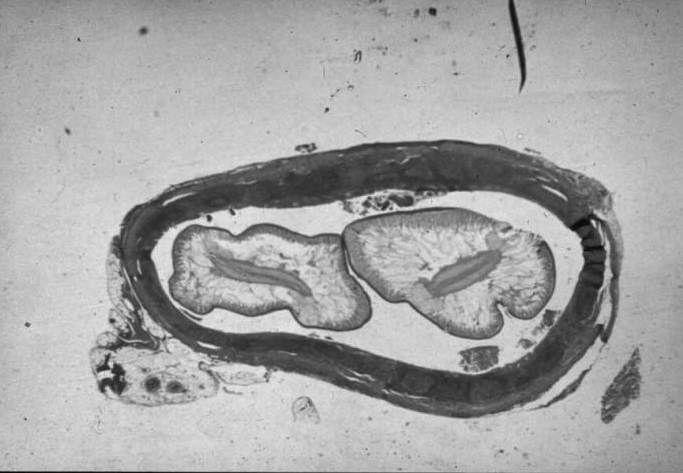

## I. Epidémiologie

L’ascaris (_Ascaris lumbricoïdes_) est un nématode cosmopolite, mais très fréquent en zone tropicale. Il mesure de 10 à 20 cm de long et est situé dans l’intestin grêle.

_                       ** Ascaris adulte**_                **_Coupe d'ascaris dans un intestin_**

La contamination s’effectue par ingestion d’aliments souillés de matières fécales contenant les oeufs. Après ingestion, les larves traversent la paroi du tube digestif, gagnent le foie puis les veines sus-hépatiques, le cœur, les poumons, remontent l’arbre trachéo-bronchique et retombent dans le tube digestif où ils deviennent adultes et pondent les œufs qui sont éliminés avec les selles. Ce circuit s’effectue en deux mois.

_**Cycle de l'ascaris**_

## II. Clinique

La maladie peut rester latente en cas de pauci-infestation. Les troubles varient selon la phase d’infestation.

Pendant la **phase de migration larvaire**, les symptômes pulmonaires  (toux, dyspnée, voire hémoptysie, fébricule, infiltrat pulmonaire labile à la radiographie) et l’hyperéosinophilie sanguine forment le syndrome de Löffler.

A la **phase d’état**, l’enfant présente des troubles digestifs non spécifiques : douleurs abdominales, nausées, vomissements, diarrhées.

**En cas d’infestation importante**, certaines complications sont possibles : ictère par obstruction du cholédoque, abcès hépatique, occlusion intestinale avec volvulus du grêle, pancréatite, appendicite, perforation du diverticule de Meckel, péritonite. Enfin, en milieu défavorisé, une malnutrition peut être une conséquence d’une infestation massive. Le polyparasitisme est la règle en pays tropical. L’infestation peut être précoce. Ainsi, une occlusion par ascaris est survenue chez un enfant âgé de 45 jours, par ingestion d’eau souillée, dès le lendemain de sa naissance.

### Ascaris d’animaux

L’infestation par l’ascaris du porc (_Ascaris suum_) est rare mais a pu entraîner une occlusion intestinale. L’ingestion de poisson cru infesté par _Anisakis simplex_ peut provoquer des épigastralgies aiguës dans les heures qui ont suivi le repas. Puis, en l’absence de traitement, se forme un granulome éosinophile dans les semaines suivantes, centré par une larve d’_Anisakis simplex_. L’ingestion accidentelle d’œufs d’ascaris de chien (_Toxocara canis_), non adapté à l’homme, provoque un _larva migrans_ viscérale : hépatomégalie fébrile, avec une hyperéosinophilie et un sérodiagnostic positif.

## III. Diagnostic

Le diagnostic est parfois affirmé par l’élimination d’un ou plusieurs vers adultes dans les selles ou parfois à l’occasion d’un effort de vomissement.

L’examen parasitologique des selles, uniquement à la phase d’état, montre les œufs caractéristiques (60 x 40µ, bruns, mamelonnés, non embryonnés). Le sérodiagnostic n’est utile que pendant la phase de migration larvaire. L’éosinophilie sanguine est élevée pendant cette phase et revient à un chiffre subnormal ensuite (combe de Lavier).

## IV. Traitement

Le traitement est basé sur lepamoate de pyrantel, mais surtout les dérivés imidazolés : flubendazole, mébendazole et albendazole (voir tableau), associé à un traitement de masse répété. 

<table>
<caption>Traitement de l'ascaridiose</caption>

<thead>

<tr>

<th scope="col" style="width: 104px;">Nom chimique</th>

<th scope="col" style="width: 137px;">Présentation</th>

<th scope="col" style="width: 197px;">Posologie</th>

</tr>

</thead>

<tbody>

<tr>

<td style="width: 108px;">

Pamoate de pyrantel

</td>

<td style="width: 141px;">

Cp à 125 mg et 250 mg  
Suspension à 5 %

</td>

<td style="width: 201px;">

1 cp ou 1 cuillère mesure/1 jour

</td>

</tr>

<tr>

<td style="width: 108px;">

Flubendazole

</td>

<td style="width: 141px;">

Cp à 100 mg  
Suspension à 25 mg/ml

</td>

<td style="width: 201px;">

2 cp par jour ou 2 cuillères mesure / j / 3 jours

</td>

</tr>

<tr>

<td style="width: 108px;">

Mébendazole

</td>

<td style="width: 141px;">

Cp à 100 mg  
Suspension à 20 mg/ml

</td>

<td style="width: 201px;">

2 cp par jour ou 2 cuillères mesure / j / 3 jours

</td>

</tr>

<tr>

<td style="width: 108px;">Albendazole</td>

<td style="width: 141px;">Cp à 400 mg  
Suspension à 4 %</td>

<td style="width: 201px;">1 cp ou 10 ml de suspension/1 jour</td>

</tr>

</tbody>

</table>

La **seule prévention efficace** consiste à bien contrôler l’hygiène alimentaire et à concentrer les selles dans les latrines. L’ascaridiose est particulièrement fréquente si les selles sont éparpillées dans la nature, autour de l’habitation.