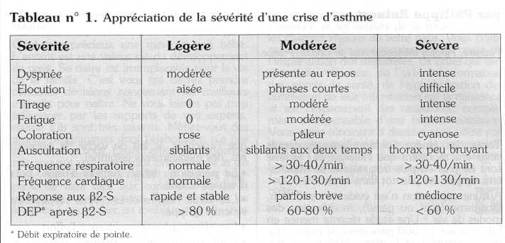
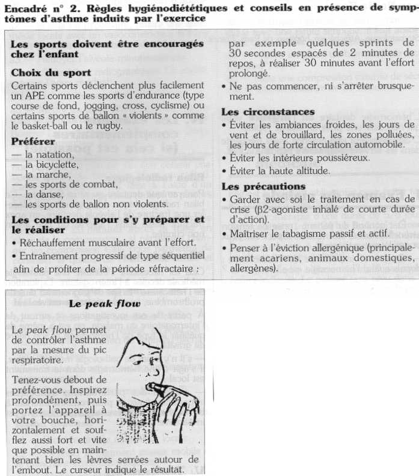

**Asthme de l 'enfant : traitement de la crise**

**par Philippe Reinert**

Pédiatre, Hôpital Intercommunal de Créteil, France.

Toutes les études épidémiologiques depuis vingt ans montrent que l'allergie et l'asthme sont de plus en plus fréquents et se manifestent de plus en plus tôt dans la vie.

Aucune explication n'est évidente : pollution, tabagisme (actif ou passif, modification des modes de vie ? Une étude récente menée en Ethiopie sur 12 000 personnes de même ethnie a montré que l'asthme était moins fréquent en milieu rural qu'en ville où le mode de vie est différent (habitation et alimentation).

De toute façon, l'asthme de l'enfant peut être grave, il doit donc être reconnu et traité tôt et prévenu dans la mesure du possible.

**I.** **Quelques notions fondamentales**

Dû à une bronchoconstriction généralisée et à une inflammation de la muqueuse bronchique, il se définit cliniquement par une gêne expiratoire avec sifflements et bradypnée suivie d'une phase de toux avec hypersécrétion bronchique (l'expectoration est rare chez l'enfant).

Trois facteurs interviennent dans l'asthme :

**Facteurs génétiques**

Depuis longtemps, on sait qu'il y a des familles allergiques et asthmatiques.

Ainsi, un enfant né d'une mère et d'un père asthmatique a de 50 à 60 % de risques de devenir lui-même asthmatique.

Si un seul des deux parents est touché, le risque tombe à 20/30 %.

Si aucun parent n'est asthmatique, le risque n'est que de 5 à 15 %.

**Facteurs environnementaux**

*Les allergènes* : pollen des fleurs, animaux achat, cheval ... ), acariens si fréquents dans les tapis et les moquettes, certains aliments tels

que l'arachide, le lait de vache, le poisson, etc., les médicaments (aspirine).

- *La pollution* : tabac, fumées d'usine, pots d'échappement.

- *Les virus respiratoires* : virus respiratoire syncitial, grippe.

- *Les efforts physiques* : toux à l'effort.

- *L'air conditionné* : variations thermiques brutales, défaut d'entretien des filtres...

**Facteurs psychologiques**

Une crise d'asthme peut être déclenchée par une émotion, une contrariété... et l'anxiété si fréquente chez l'asthmatique.

**Il.** **Clinique**

Il faudra craindre une crise grave chez l'enfant devant les arguments suivants *(tableau n° 1)* :

- crises fréquentes (plus d'une fois par semaine),

- polypnée supérieure à 30/min (donc l'inverse de la bradypnée habituelle),

- tachycardie supérieure à 140/min,

- thorax bloqué en inspiration,

- diminution ou abolition du murmure vésiculaire.

**Et surtout :**

- cyanose,

- sueurs,

- agitation,

- troubles de la conscience,

- apnées.

**Certains renseignements sont indispensables à recueillir :**

- facteurs déclenchants,

- durée des crises antérieures (hospitalisation ?),

- traitements déjà pris.

**III. Outils thérapeutiques** *(tableau n° 2)*

Il faut :

- lutter contre le bronchospasme

- traiter l'inflammation secondaire qui risque de léser la muqueuse bronchique.

**1. Les bronchodilatateurs**

Ils ont fait de remarquables progrès et constituent **le** traitement de la crise. Ce sont :

**a) les bêta-2-mimétiques**

- Salbutamol (Ventoline®),

- Fenoterol (Berotec®),

- Terbutaline (Bricanyl®).

La voie inhalée doit être préférée chaque fois que possible *(voir encadré n° 1)* :

- en aérosol doseur chez l'enfant de plus de 6 ans (sachant inspirer sur commande) ou avec une chambre d'inhalation (confectionnée avec deux bouteilles de plastique au besoin) *(voir schéma dans encadré n° 1)* ;

chez l'enfant de plus de 10 ans, des inhalateurs en poudre (Ventodisk®) sont utiles.

La voie inhalée :

- agit directement sur la bronche

- nécessite de faibles doses, coûte donc moins cher ;

- ne pénètre pas dans le sang (pas d'effet secondaire) ;

- enfin et surtout améliore immédiatement l'état du malade.

Les sirops (Ventoline®) n'ont guère d'intérêt, du moins au stade aigu.

Les formes injectables sous-cutanées (1/4 d'ampoule de Ventoline/15 kg) sont réservées aux formes graves.

**b) La théophylline**

Moins efficace et plus dangereuse, elle est toujours utile du fait de son faible coût. Donner 15 mg/kg.

**c) Les corticoïdes tanti-inflammatoires et bronchodilatateurs)**

En cas d'échec des bêta-2-mimétiques, ils ont toute leur utilité.

Prednisone : 2 mg/kg/jour, pendant 4 jours.

Les formes injectables intraveineuses sont réservées aux crises graves.

Méthylprednisolone en intraveineuses 2 mg/kg/6 heures.

Hémisuccinate en intraveineuses (Dirpcortisone® ) 5 mg/kg/4 heures.

**2. Les médicaments** **de l'inflammation**

Lever le spasme bronchique est le premier geste thérapeutique pour faire disparaître la crise.

Il peut suffire, si les crises sont rares (2 à 3/mois par exemple).

Si les crises sont plus fréquentes, un traitement de fond est souhaitable :

- Les corticoïdes inhalés, Bécotide 250® par exemple (une bouffée matin et soir est très efficace et moins cher) précédé d'une prise de bêta-2-mimétique.

On peut utiliser aussi :

- le cromoclycate (1 bouffée matin et soir),

- le kétotofène (1 mesurette le soir),

- voire les théophyllines retard.

**IV. Asthme provoqué par l'exercice (APE)**

Les bronchospasmes induits par l'effort physique sont fréquents surtout chez l'enfant asthmatique. Ils se manifestent par des accès de toux, voire une véritable crise d'asthme (dyspnée et sibilants) qui interdit de prolonger l'effort (foot, course à pied, par exemple).

Devant une telle situation, il ne faut surtout pas interdire le sport : de nombreux champions olympiques sont asthmatiques ! Il suffit d'apprendre au patient à inhaler 1/2 heure avant J'effort un bronchodilatateur type Salbutamol et à respecter le temps de réchauffement musculaire.

Chez un asthmatique connu et traité, la sur venue de manifestations à l'effort est la preuve que le traitement est inefficace :

- médicaments mal administrés ou non pris;

- doses insuffisantes ;

- surinfection bronchique gênant l'action des thérapeutiques inhalées (?2 stimulants et corticoïdes).

Des règles d'hygiène et de diététique sont à conseiller pour ne pas " installer " l'enfant asthmatique dans sa maladie *(voir encadré n°2).*

**L'enfant doit être surveillé en** **permanence du début à la fin de crise.** **Intoxication à la théophylline**

Si la théophylline a été le premier médicament efficace dans l'asthme, elle peut entraîner des intoxications sévères, parfois mortelles chez le petit enfant. L'intoxication peut apparaître dès la dose de 20 mg/kg en une prise.

Y penser devant ces symptômes : agitation inexpliquée, hyperthermie brutale, convulsions, 1 tachycardie supérieure à 180, vomissements sanglants, déshydratation aiguë.

Se méfier des sirops pour adulte et des formes injectables fortement dosées.

*Développement et Santé, n°140, avril 1999*
