

Nous appelons <strong>Farines composées</strong> les farines associant céréales et légumineuses grasses. 
L'objectif est d'obtenir une farine de haute valeur <strong>protéino-énergétique</strong> :

<ul>
<li>L'association céréales + légumineuses permet d'obtenir des protéines de très bonne qualité.</li>
<li>Les légumineuses grasses (soja et arachide) permettent un apport élevé d'énergie. 
Les farines composées sont donc des aliments de construction et de force particulièrement utiles aux jeunes enfants.</li>
</ul>

La fabrication de la farine BAMiSA est accessible à tous, selon les étapes suivantes :

- Rassembler les ingrédients : Petit Mil (ou Maïs), Soja, Arachide, Sucre et Sel iodé,
- Préparer les grains, comme savent le faire toutes les femmes,
- Fabriquer la farine, avec rigueur, propreté et rapidité,
- Conditionner la farine et le "malt pour la bouillie",
- Conserver les sachets de farine à l'abri.

Ce document en images permet aux "Unités de Production Artisanales\*", aux "Groupes de Fabrication Communautaires" et aux "Mamans Bamisa" de préparer de la farine BAMiSA pour l'usage de la communauté ou pour un usage familial. Le principe de préparation des "farines pour BAL-120" est le même.

- Le document 03c du site [www.bamisagora.org](http://www.bamisagora.org), "la production de farine BAMISA®", donne des indications plus complètes sur la façon de préparer la farine labellisée en UPA.

## Rassembler les ingrédients

### 1. Choisir des produits de bonne qualité

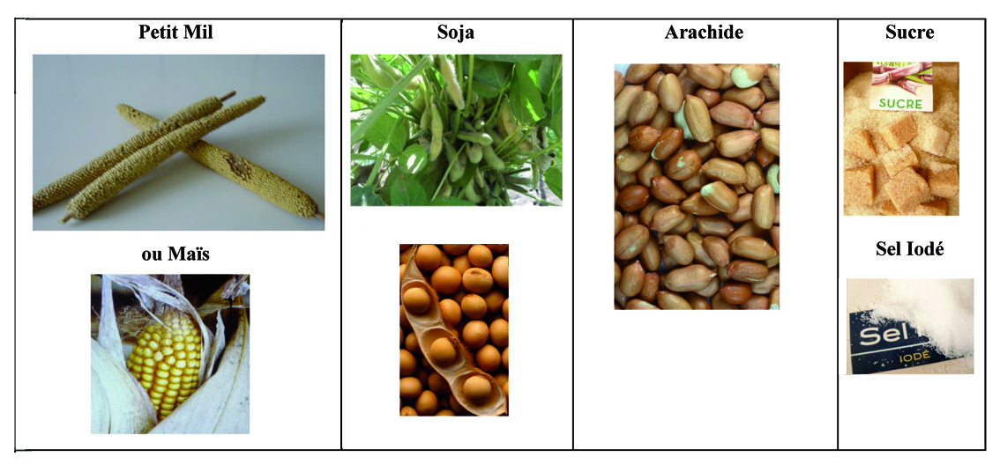

### 2. Quantité nécessaire à la fabrication, par exemple, de 10 kg de farine (20 sachets de 500 g)

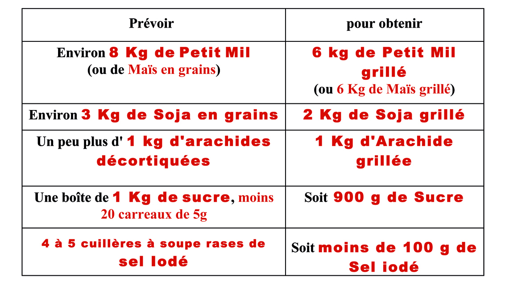

## Préparer les grains

### 3. Vanner

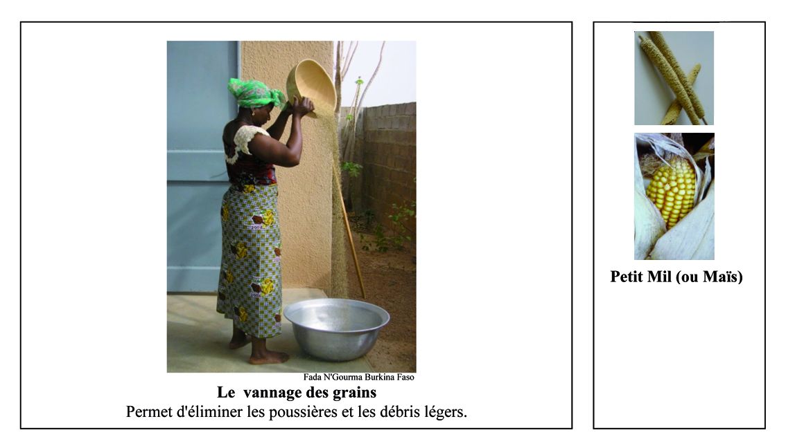

### 4. Tamiser/calibrer

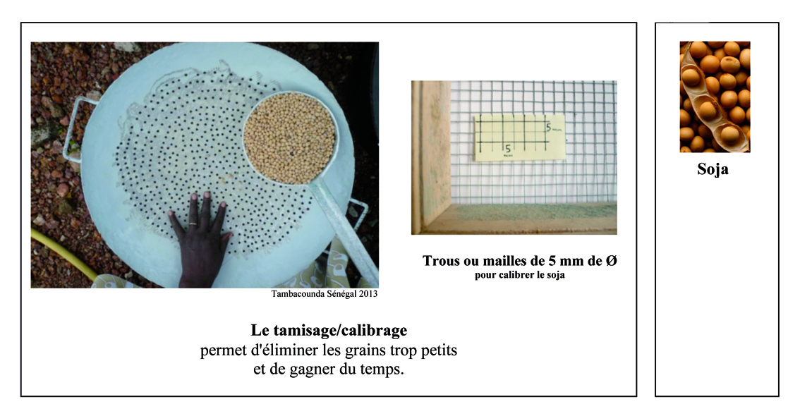

### 5. Laver

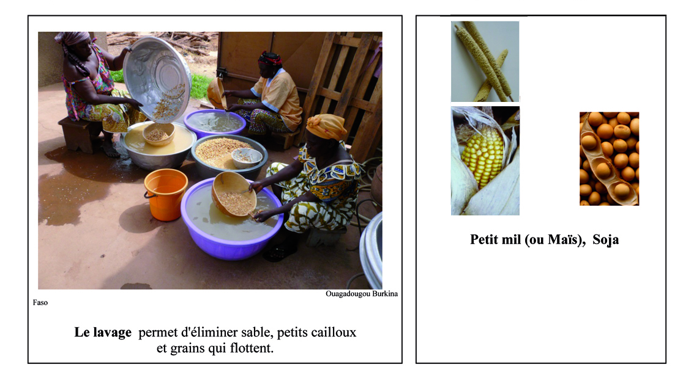

### 6. Egoutter

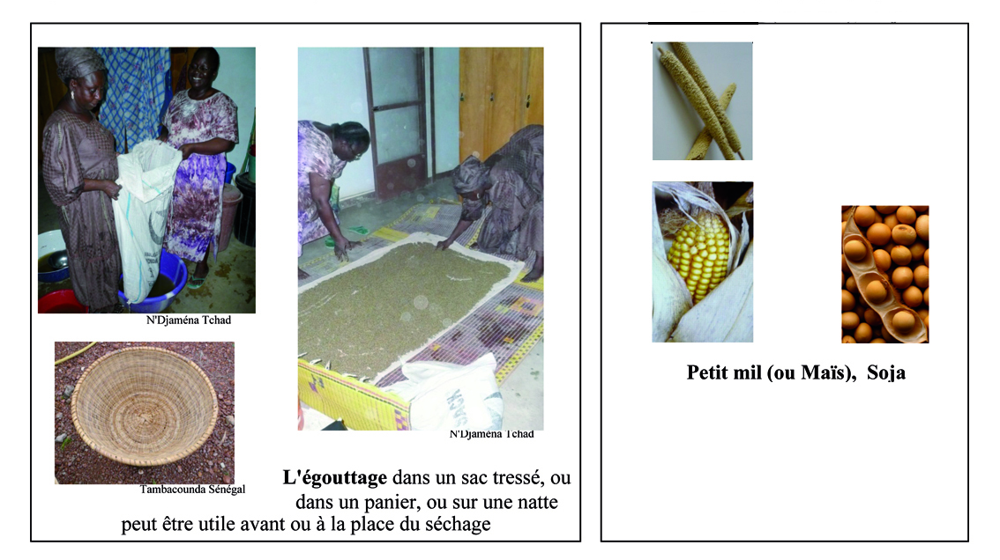

### 7. Sécher

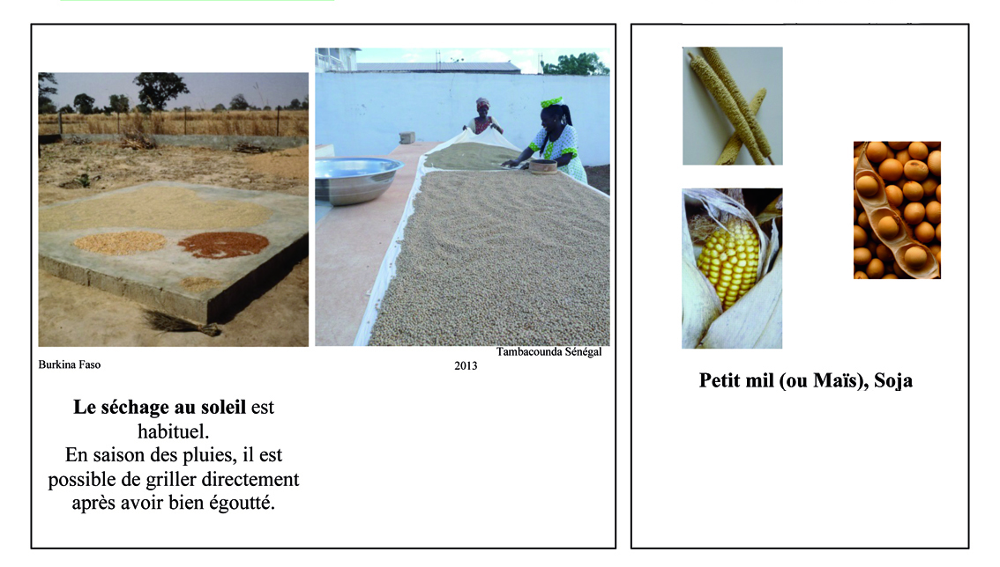

### 8. Trier

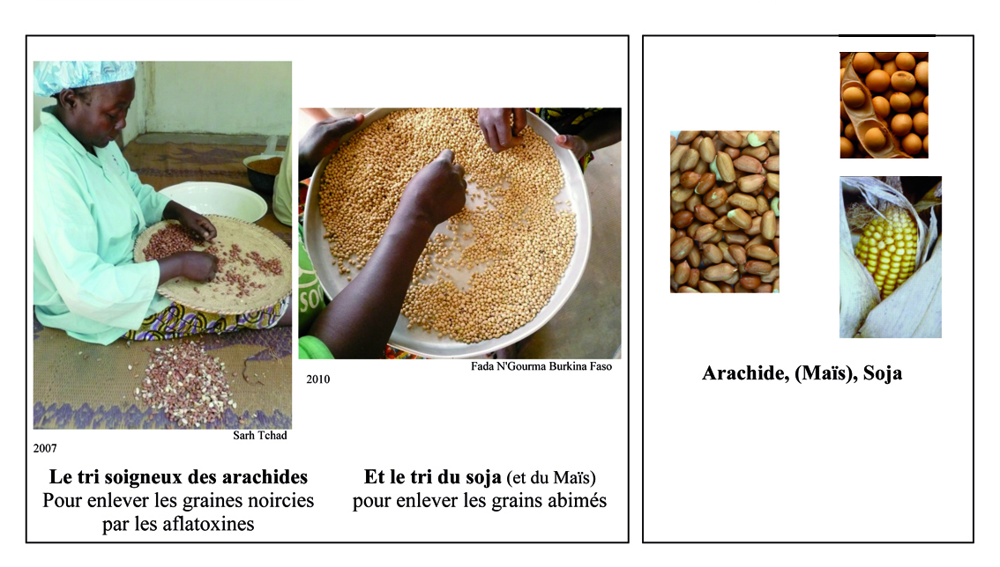

## Fabriquer la farine

### 9. Griller

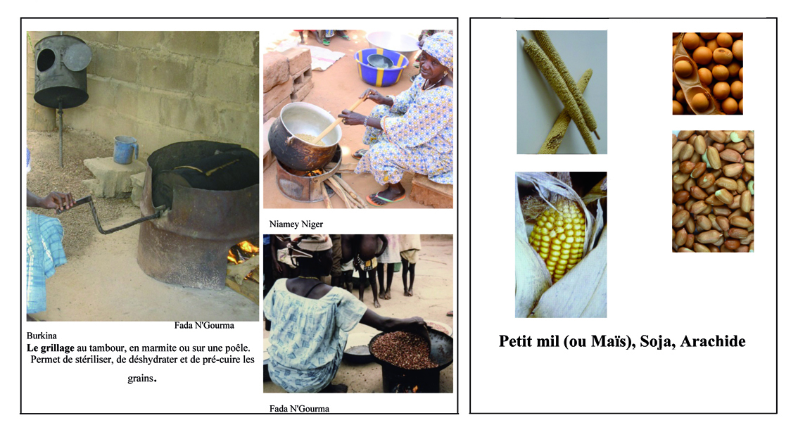

### 10. Travailler le plus proprement possible

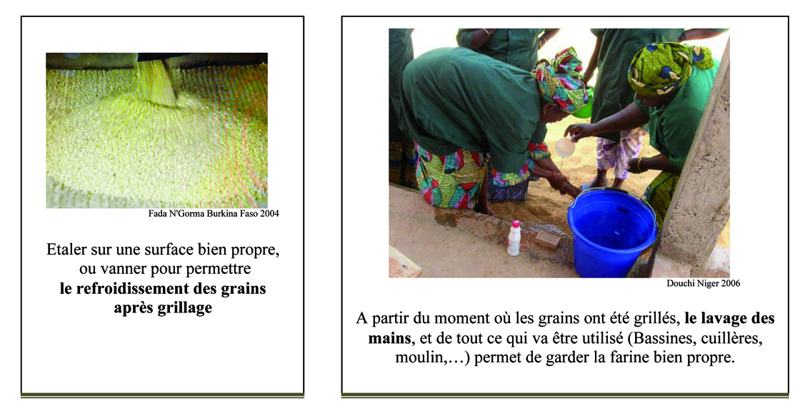

### 11. Dépelliculer

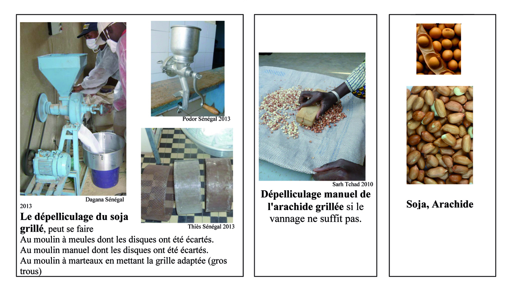

### 12. Vanner et trier à nouveau très proprement

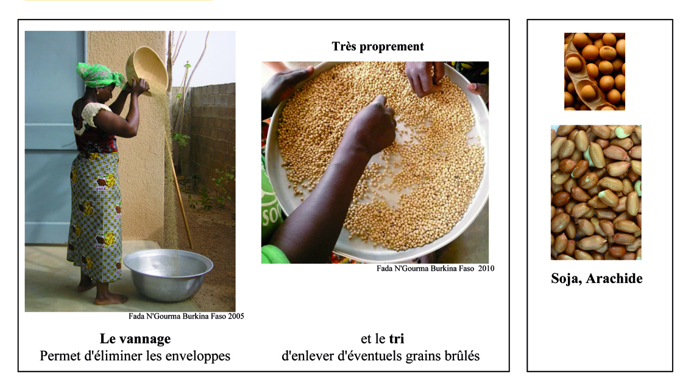

### 13. Respecter les proportions pour les mélanges

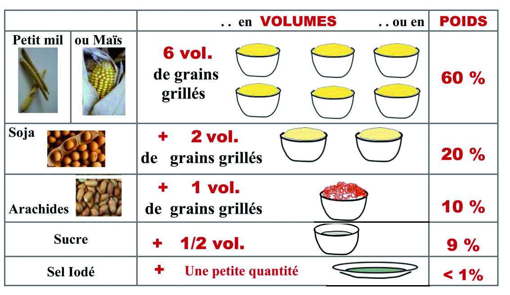

### 14. Mélanger

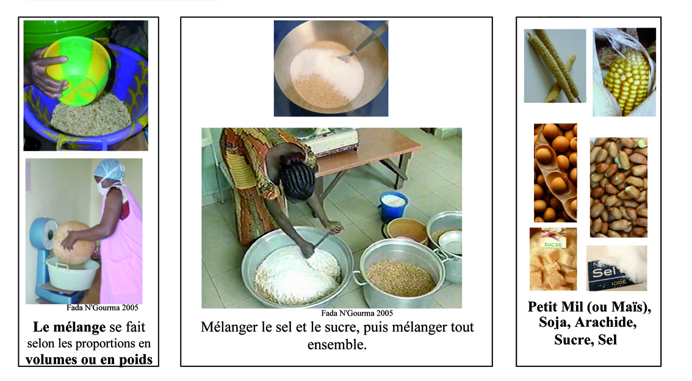

### 15. Moudre le mélange

### 16. Tamiser la farine

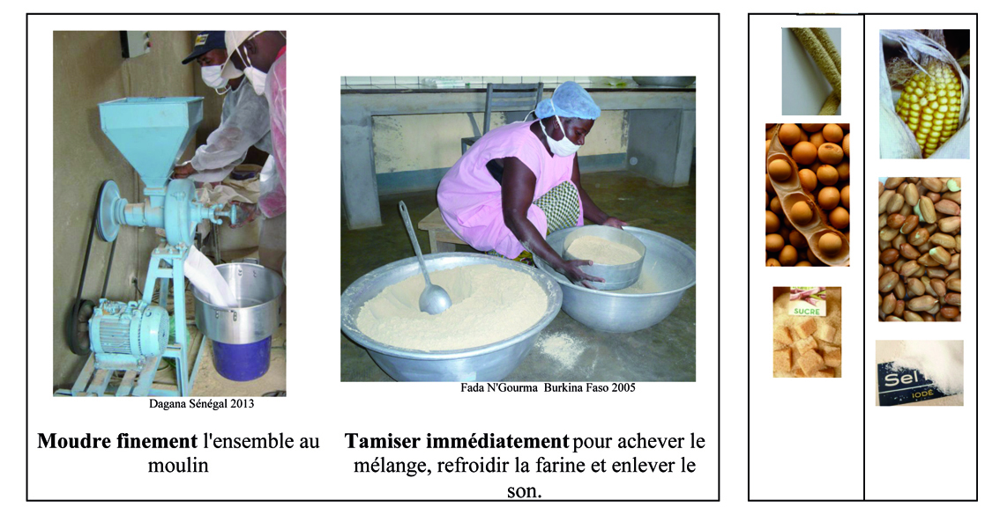

## Conditionner la farine et le malt

### 17. Ensachage de la farine

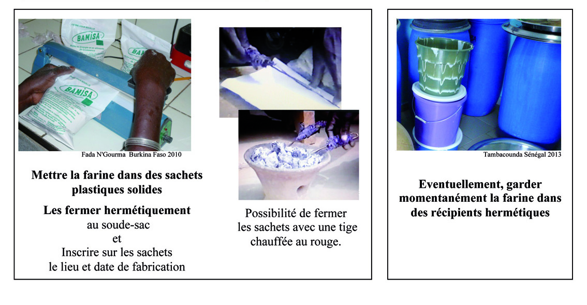

### 18. Ensachage du malt

### 19. Placement du malt

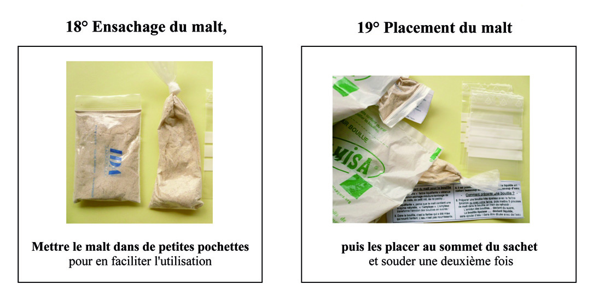

### Protéger les sachets de farine dans des seaux fermés, des sacs ou des fûts

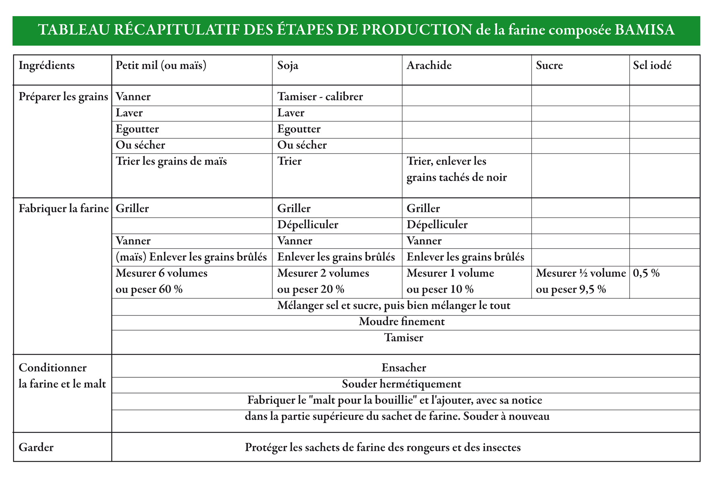
