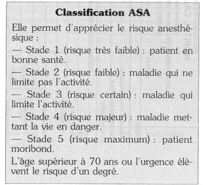
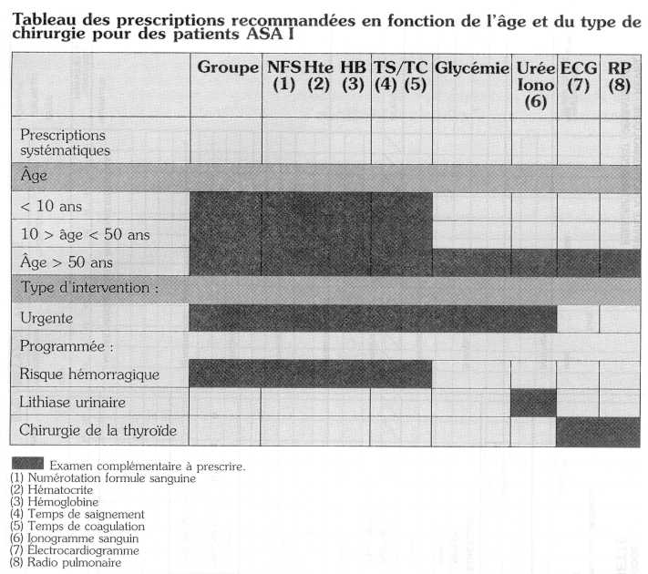
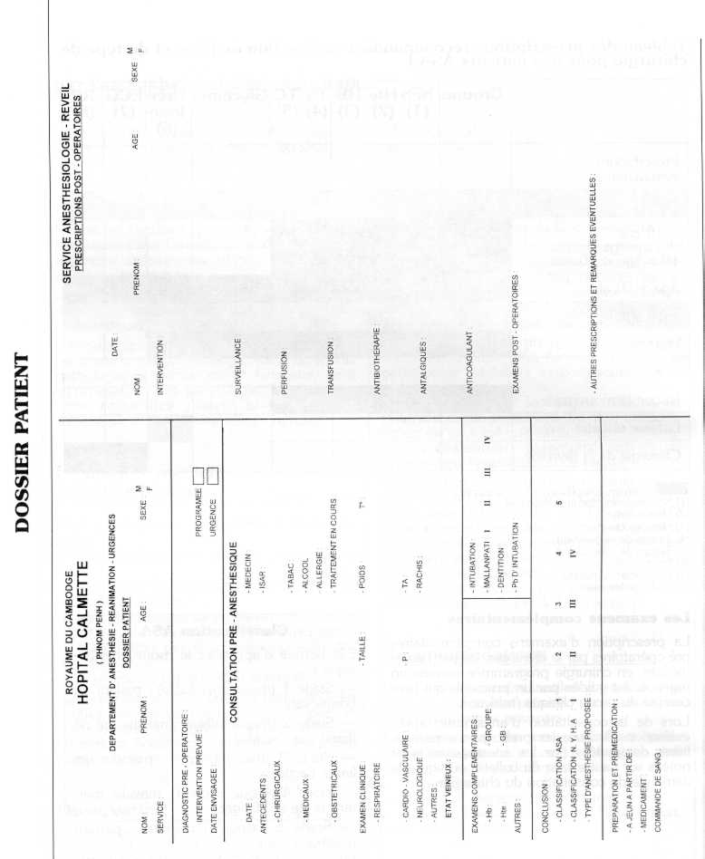
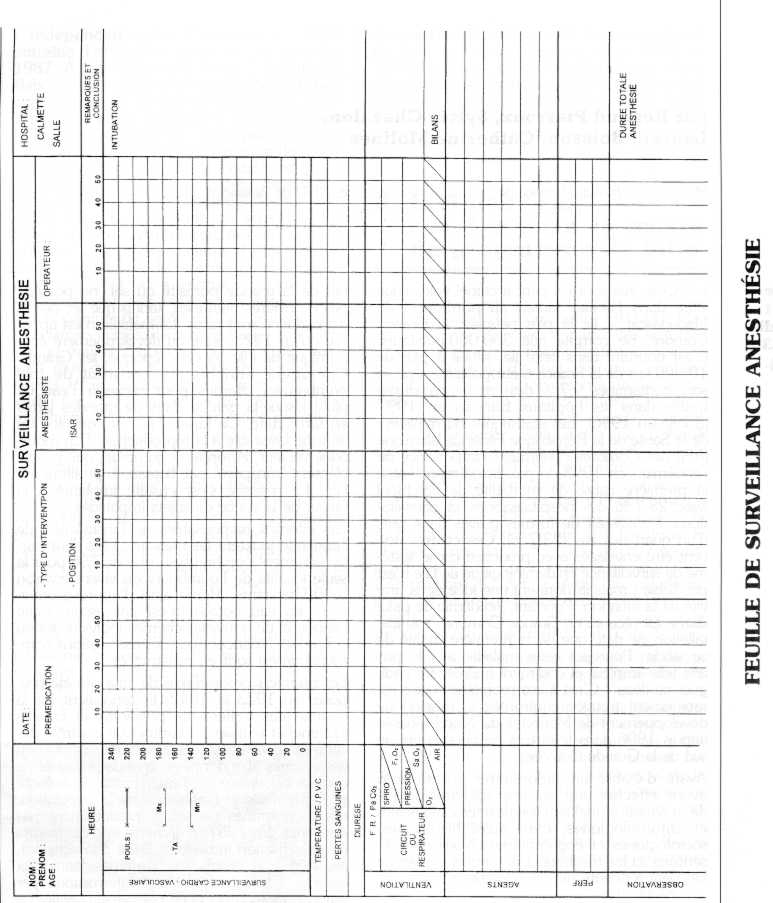

L'évaluation comporte un interrogatoire qui porte sur la symptomatologie, les antécédents pathologiques personnels et familiaux, ainsi qu'un examen clinique complet. Les informations recueillies guident la prescription d'éventuels examens complémentaires.

## I. Le dossier médical pré-anesthésique

C'est un document obligatoire. Il doit comporter :

*   l'identité du patient, son âge, son poids, sa taille,
*   le motif de l'intervention, la technique chirurgicale envisagée,
*   les constatations de l'examen clinique, les antécédents et les examens complémentaires,
*   les résultats des éventuelles consultations de spécialistes,
*   le protocole anesthésique envisagé.

Au terme de ce bilan, on peut déterminer les risques qui peuvent apparaître en per- et postopératoire d'après la classification de l'American Society of Anesthesiologist (ASA) (voir encadré).

## II. Observation

À l'hôpital Calmette, la consultation d'anesthésie demandée par les chirurgiens en cas d'intervention programmée est réalisée tous les jours, cinq jours par semaine. Tous les médecins participent à cette consultation dont la durée est en moyenne de 30 minutes. Pour les problèmes particuliers, il est fait appel aux spécialistes.

La plus grande partie de la population est jeune et en bonne santé, en dehors du problème qui justifie l'intervention (patients ASA I ou ASA II).

En urgence, le bilan clinique pré-anesthésique est fait dans l'enceinte du bloc opératoire.

Nous constatons que les patients arrivent à la consultation de pré-anesthésie avec des examens complémentaires déjà prescrits par le chirurgien. Dans 95 % des cas, ces examens sont injustifiés, inutiles. Les anesthésistes ne prescrivent jamais d'examens systématiques.

L'évaluation clinique pré-opératoire faite par les anesthésistes sous-estime souvent les pathologies médicales associées pour deux raisons principales :

*   les patients ne se savent pas malades, ne prennent aucun traitement. La sous-médicalisation du pays est une explication ;
*   les évaluateurs manquent parfois de rigueur dans l'appréciation du risque.

C'est dire l'importance de l'examen clinique et de l'interrogatoire qui permettent d'identifier les anomalies dans la plupart des cas. On sait que le risque augmente avec l'âge, le terrain et l'urgence. On a constaté qu'en chirurgie programmée, les chirurgiens envoyaient leurs patients en consultation pré-anesthésique sans indiquer le diagnostic, l'indication, la technique chirurgicale envisagée, la date et la durée probable de l'intervention.

### 1. Recommandations

Pour limiter les coûts inutiles et améliorer la prise en charge des patients, nous faisons les recommandations suivantes :

**La demande de consultation préanesthésique** faite par le chirurgien doit comporter de façon obligatoire :

*   le diagnostic,
*   le type d'intervention envisagée,
*   la date et l'heure prévues pour l'intervention,
*   la durée probable.

### 2. Évaluation clinique pré-opératoire

L'évaluation est facilitée par un protocole d'interrogatoire et d'examen clinique standardisé qui permet de guider l'anesthésiste dans cette évaluation.

Les éléments importants sont inscrits de façon détaillée sur la feuille d'anesthésie, ce qui permet d'éviter les oublis.

### 3. Les examens complémentaires

La prescription d'examens complémentaires pré-opératoires par le chirurgien ou par l'anesthésiste, en chirurgie programmée comme en urgence, est guidée par un protocole qui tient compte du risque clinique (tableau).

Lors de la consultation d'anesthésie, après évaluation clinique, les prescriptions particulières demandées par les anesthésistes sont notées sur l'autre face du bulletin où figure la demande de consultation du chirurgien.

Voir, pour information, 3 documents utilisés dans le service Anesthésie-Réanimation-Urgences de l'hôpital Calmette de Phnom-Penh :

Dossier patient :

*   consultation pré-anesthésique,
*   prescriptions postopératoires.  
*   feuille de surveillance Anesthésie.

_Développement et Santé, n° 139, février 1999_