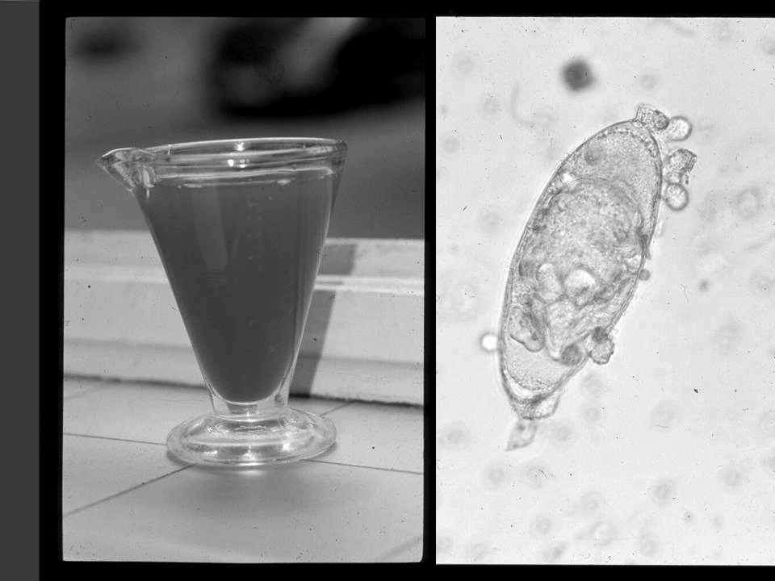

Les bilharzioses sont des helminthiases très répandues dans les pays tropicaux. _Schistosoma mansoni_, agent de la bilharziose intestinale, est localisé en Afrique sub-saharienne, à Madagascar en Egypte et en Amérique latine ; _Schistosoma haematobium,_ agent de la bilharziose urinaire, est localisé en Afrique sub-saharienne, à Madagascar et au Moyen-Orient ; _Schistosoma intercalatum_, responsable de la bilharziose rectale, en Afrique centrale ; _Schistosoma japonicum_ en Extrême-Orient et _Schistosoma_  _mekongi_ en Asie du Sud-Est, responsables de la bilharziose artério-veineuse.

L’enfant s’infeste en se baignant dans l’eau douce (rivières ou marigots), activité fréquente en pays tropical. Après pénétration transcutanée, les schistosomules migrent dans le foie puis, selon l’espèce, gagnent les veines de l’intestin ou de la vessie. Les œufs sont émis par les selles ou les urines, deux mois après l’infestation. Les filles seraient moins atteintes avant l’âge de 10 ans, car elles restent plus souvent à la maison pour préparer les repas, tandis que les jeunes garçons vont à la chasse ou à la pêche et donc se contaminent dans la rivière.

_**Cycle de la bilharziose intestinale**_

## **I. Clinique**

La phase d’infestation est marquée par du prurit : "dermatite des nageurs". L’invasion est le plus souvent muette, mais est parfois marquée par des troubles neurologiques, surtout dans les bilharzioses asiatiques (syndrome de Katayama). Le plus souvent, ces stades sont asymptomatiques. Au bout de plusieurs mois, les formes intestinales provoquent des troubles digestifs (nausées, vomissements, diarrhées, douleurs abdominales) ou urinaires (hématurie). L’hématurie indolore, est souvent considérée comme « physiologique » correspondant à un signe de puberté. Les formes asiatiques entraînent une hypertension portale précoce, atteignant fréquemment l’adolescent.

## II. Diagnostic 

L’hyperéosinophilie n’a rien de spécifique en milieu tropical. Le diagnostic n’est donc affirmé que par la découverte des œufs dans les selles ou les urines. Ces œufs sont ovoïdes, mesurant en moyenne 120 x 60 µ  et sont embryonnés. Ils sont munis d’éperon latéral (_S. mansoni_) ou terminal (_S. haematobium, S. intercalatum_). La rectoscopie montre une muqueuse inflammatoire avec des lésions granulomateuses. La biopsie de muqueuse rectale permet de retrouver toutes les espèces de schistosomes. Une échographie abdominale permet de préciser l’importance d’une hépatosplénomégalie.

_**Oeuf de Schistosoma haematobium dans une urine hématurique**_

## III. Traitement

Le traitement est basé sur le praziquantel : 40 mg/kg en une prise. En cas d’échec, une deuxième, voire une troisième cure sont possibles à la même dose. En cas d’hypertention portale, une dérivation porto-cave s’impose.

La prévention consistant à interdire les bains en eau douce aux enfants est absolument illusoire, car les enfants se réinfestent fréquemment. Ainsi, une étude en milieu scolaire en Côte d’Ivoire a montré une prévalence de 88 % à 94 %. Six mois après traitement, les enfants, s’étant de nouveau baignés dans les lacs avoisinants, étaient de nouveau infestés à un taux de 63 %.