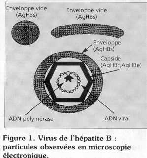
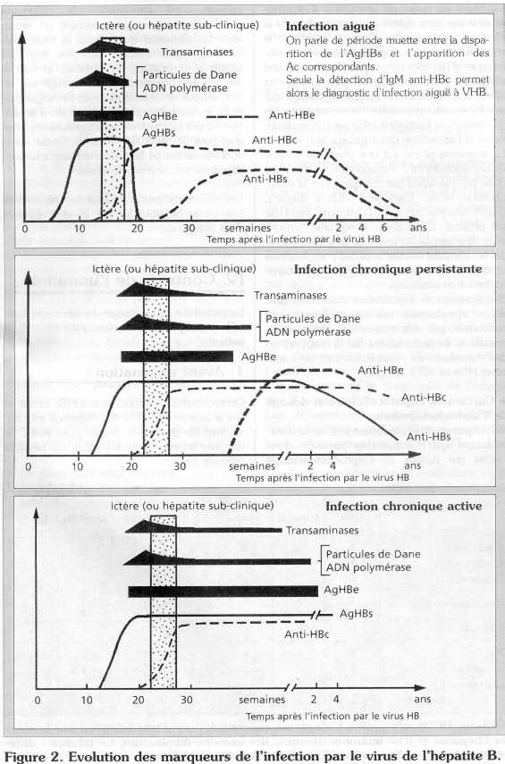
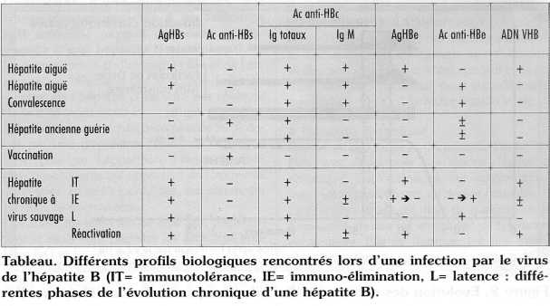
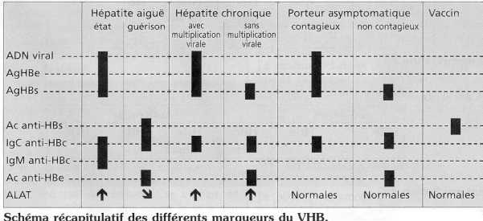

La biologie a un rôle très important dans le diagnostic et le suivi de l'hépatite à virus B. Elle consiste en l'étude des modifications biochimiques du sérum et l'analyse des différents marqueurs virologiques. 
Les paramètres biochimiques permettent d'évaluer la gravité de l'atteinte hépatique. 
Les paramètres virologiques renseignent sur l'agent responsable de la maladie et sur l'évolution de celle-ci. 
Le diagnostic biologique sera réalisé soit devant une symptomatologie évocatrice, soit lors de l'exploration d'une élévation des transaminases, soit lors de test de dépistage chez des patients à risque, soit dans le contexte de la transfusion sanguine pour l'élimination des sangs à risque.

## I. Exploration biochimique

Les paramètres utiles à étudier sont :

- La bilirubine totale : inférieure à 17 micromol/I chez le sujet normal, supérieure à 50 micromol/I au cours des ictères et comprise entre 30 et 50 micromol/I en cas de sub-ictère.
- Les transaminases sériques : aspartate aminotransférase (ASAT) et alanine aminotransférase (ALAT).
- Les phosphatages alcalines sériques.
- Le taux de prothrombine (temps de Quick) et éventuellement le dosage du facteur V.

<table>

<tbody>

<tr>

<td>

Rappel sur le virus

Si on examine au microscope électronique le sérum de patients en phase aiguë d'une hépatite à virus B, on observe différents types de particules des particules spériques de 42 nm de diamètre ainsi que des particules spériques de 22 nm de diamètre et des bâtonnets.

Les particules de 42nm sont des particules virales infectieuses. Elles sont constituées d'une enveloppe sur laquelle les glycoprotéines virales portent un antigène de surface (AgHBs), d'une capside ou core portant un antigène de core (HBc) et d'un ADN. Les particules de 22 nm et les bâtonnets sont des enveloppes virales vides qui portent uniquement l'antigène HBs (figure 1).

</td>

</tr>

</tbody>

</table>

## Il. Exploration virologique

Le diagnostic des différentes situations cliniques est effectué par la détection des marqueurs virologiques de l'infection. Il s'agit soit de méthodes immuno-enzymatiques de type ELISA *(Enzyme Linked Immuno-Sorbent Assay*) réalisables dans des laboratoires non spécialisés, soit de techniques moléculaires détectant, quantifiant ou caractérisant la séquence de l'ADN du virus de l'hépatite B (VHB), et qui ne sont pratiquées pour le moment que dans des laboratoires spécialisés. Les éléments pouvant être mis en évidence dans le sérum sont soit des marqueurs directs de la présence virale, soit des marqueurs dits indirects liés à la réponse immunitaire.

### 1. Marqueurs directs

- L'antigène HBs associé aux enveloppes virales est aisément mis en évidence dans le sérum des patients par des techniques immuno-enzymatiques de type ELISA.
- L'antigène HBc n'est pas retrouvé tel quel dans le sérum.

Une protéine soluble, dérivée de la protéine de capside, porte un antigène appelé HBe qui est détecté dans le sérum en cas de multiplication virale, également par des techniques immuno-enzymatiques de type ELISA.

- L'ADN viral circulant associé aux particules virales infectieuses est mis en évidence par des techniques d'hybridation moléculaire.

### 2. Marqueurs indirects

Ce sont les anticorps secrétés par le patient lorsqu'il rencontre les différents antigènes du virus B : l'anticorps anti-HBs, les anticorps anti-HBc IgG et anti-HBc IgM, et l'anticorps anti-Hbe. Ils sont eux aussi détectés par des méthodes immuno-enzymatiques de type ELISA.

<table>

<tbody>

<tr>

<td>

### Rappel sur les méthodes de détection

#### Méthode ELISA

Elles reposent sur l'utilisation d'un support solide (puits de microplaques, billes, microparticules). Celui-ci est recouvert soit d'antigènes viraux pour la détection des anticorps, soit d'anticorps monoclonaux pour la détection des antigènes.

Le sérum du patient est mis au contact du support ainsi revêtu. Un complexe antigène-anticorps se forme alors. La révélation de ce complexe est effectuée par la fixation d'une enzyme transformant un substrat spécifique en composé coloré ou émettant un signal.

La détection du signal est ensuite assurée par un spectrophotomètre, un fluorimètre ou un chimioluminomètre, selon le type de signal émis.

Les résultats sont habituellement exprimés par un ratio qui correspond au signal de l'échantillon sur le signal du seuil établi pour chaque trousse utilisée. Le ratio est ptoportionnel ou inversement proportionnel à la quantité de marqueur présente dans le sérum, selon qu'il s'agit de techniques dites directes ou de techniques par compétition.

De nombreux réactifs aux performances sensiblement équivalentes, pouvant être utilisés sur des automates ou de façon manuelle 'avec toutefois un minimum d'équipement et beaucoup de soin) sont aujourd'hui disponibles pour la détection des marqueurs du VHB. Les techniques sont décrites de façon précise dans chaque type de coffret.

#### Test moléculaires

La détection/quantification de l'ADN du virus de l'hépatite B est le meilleur marqueur de réplication virale. Il peut être réalisé par hybridation de l'ADN viral à des sondes spécifiques, éventuellement associée à une amplification du signal, ou par amplification génique de type <em>Polymerase Chain Reaction</em> (PCR).  
Ces techniques se classent de la façon suivante par ordre de sensibilité croissante : hybridation, amplification du signal, amplification génique.

La mise en évidence d'une réplication virale est utilisée pour poser l'indication thérapeutique au cours de l'hépatite chronique B. La quantification de l'ADN viral es également indispensable au suivi du traitement par l'interféron alpha.

</td>

</tr>

</tbody>

</table>

Dans les pays en développement, l'AgHBs est le seul marqueur recherché couramment, pour le diagnostic des infections et le dépistage des échantillons de sang à éliminer en transfusion sanguine. Un sujet AgHBs positif est considéré comme infecté par le virus de l'hépatite B, et son sang comme potentiellement infectieux.

A côté des méthodes ELISA, adaptées aux grandes séries, des tests individuels ont été développés . Simples, ne nécessitant ni matériel particulier, ni éléctricité, ils reposent sur des méthodes d'agglutination, d'immunofiltration, ou d'immunochromatographie. Un résultat positif est donné par un point ou un trait coloré, ou une agglutination visibles à l'œil nu. Le temps de réalisation est de 10 minutes à deux heures selon les tests et le prix varie entre 0.35 et 2 dollars US . Ces réactifs sont adaptés aux structures ayant peu de moyens, et/ou recevant un nombre réduit de prélèvements.

Dix  tests rapides ont fait l'objet d'un rapport d'évaluation de l'Organisation Mondiale de la Santé (OMS), publié en mai 2001, auquel nous renvoyons le lecteur.

## III. Evolution des marqueurs en fonction de la pathologie *(figure 2)*

### 1. Hépatite B aiguë

Dans les formes symptomatiques (qui ne représentent que 10 % des cas), après une période d'incubation de 10 semaines en moyenne, suivie d'une phase pré-ictérique de 7 jours environ, survient la phase ictérique. Biologiquement on observe alors une augmentation importante des transaminases sériques, qui peuvent atteindre entre 10 et 100 fois la limite supérieure de la normale. L'activité des phosphatases alcalines est en général normale.

Le taux de prothrombine est normal ou modérément abaissé, en tout cas toujours supérieur à 50 % en l'absence d'évolution sévère.

Des examens virologiques permettent d'affirmer le diagnostic d'hépatite aiguë B :

- L'antigène HBs (qui peut être détecté 3 semaines environ avant les signes cliniques) est présent dans le sérum, ainsi que les anticorps anti-HBc de type IgM (les plus précoces) présents à un titre élevé.
- Les anticorps anti-HBc de type IgM peuvent dans certains cas être seuls présents lorsque l'antigène HBs a déjà disparu du sérum, ce qui se produit dans 10% des cas environ.

**L'existence d'une augmentation des** **transaminases associée à un anticorps** **IgM anti-HBc permet de poser le diagnostic d'une hépatite B aiguë.**

La détermination de l'antigène HBe et de l'anticorps anti-HBe ainsi que le dosage de l'ADN du virus de l'hépatite B ne sont pas utiles au stade d'hépatite B aiguë.

L'évolution est marquée dans plus de 90 % des cas par une disparition rapide de l'antigène HBs, puis par l'apparition d'anticorps anti-HBs neutralisants qui apportent une immunité définitive. Parallèlement, les transaminases sériques se normalisent.

Les anticorps anti-HBc de type IgM disparaissent et seuls vont persister les anticorps antiHBc IgG et les anticorps anti-HBs.

Le taux de ces anticorps diminue lentement et après de nombreuses années il ne subsiste qu'un anticorps anti-HBs ou anti-HBc. Ce profil sérologique est celui d'une infection par le virus de l'hépatite B, ancienne et guérie.

#### Hépatite aiguë sévère

Elle est caractérisée biologiquement par la diminution du taux de prothrombine (inférieur à 50 %) et doit conduire à une hospitalisation rapide en milieu spécialisé pour surveillance.

#### Hépatite fulminante

Elle survient dans 1 % des hépatites aiguës symptomatiques. Elle est toujours précédée d'une phase d'hépatite aiguë sévère. Elle est marquée biologiquement par un taux de prothrombine inférieur à 50 %, (associé à une encéphalopathie hépatique).

### 2. Hépatite B chronique

Elle est définie par un portage d'antigène HBs supérieur à 6 mois après l'épisode d'hépatite aiguë. L'infection se présente sous des formes variables, allant du portage asymptomatique de l'antigène HBs à l'hépatite chronique, la cirrhose, voire le carcinome hépatocellulaire.

#### Portage asymptomatique

Un tiers des porteurs chroniques sont des porteurs asymptomatiques.  
Les transaminases sont normales.  
Il existe des anticorps sériques anti-HBe.

L'ADN viral est absent ou en quantité extrêmement faible, détectable uniquement par PCR. La surveillance de ces patients doit comporter annuellement le dosage des transaminases, et la recherche des marqueurs de réplication virale : antigène HBe et anticorps anti-HBe (et ADN sérique si possible) pour surveiller une éventuelle reprise de la multiplication virale.

#### Hépatite chronique

Deux tiers des patients porteurs de l'antigène HBs vont développer des lésions d'hépatite chronique. L'évolution se fait schématiquement selon trois phases de durées variables. La première phase qui dure de quelques mois à quelques années est une phase de tolérance immunitaire. Elle est marquée par une multiplication active du virus avec un taux d'ADN sérique élevé et la présence d'antigène HBs dans le sérum.

La deuxième phase est une phase d'immuno-élimination caractérisée par une flambée de la réponse immune, elle provoque l'arrêt de la multiplication virale et génère les lésions histologiques d'hépatite chronique. On observe une élévation transitoire, parfois très importante des transaminases et la séroconversion antigène Hbe/ anticorps anti-HBe, c'est-à-dire la diminution de l'antigène HBe jusqu'à sa disparition et l'apparition des anticorps anti-HBe. La troisième phase est une phase de latence virale, résultant de l'immuno-élimination, marquée par l'absence des marqueurs de la multiplication virale. L'antigène HBs a disparu, l'ADN sérique aussi, et l'anticorps anti-HBe est présent. Cependant, lorsqu'une cirrhose s'est développée au cours de la phase précédente, elle peut évoluer vers des complications et exposer le malade à la survenue d'un carcinome hépato-cellulaire.

Des épisodes de réactivation virale sont possibles, apparaissant soit spontanément, soit provoqués par des traitements immunosuppresseurs. Ils se traduisent par la réapparition des marqueurs de multiplication virale : antigène HBe et ADN sérique.

#### Carcinome hépatocellulaire et dosage de l'alpha-foetoprotéine

Sa fréquence élevée pourrait justifier une surveillance systématique des porteurs chroniques par dosage de l'alpha-foetoprotéine sérique. C'est une glycoprotéine d'origine foetale disparaissant pratiquement du sérum dans les semaines qui suivent la naissance. Son taux peut s'élever dans les hépatites aiguës et chroniques, les cirrhoses et surtout les cancers hépatiques. Son dosage est un outil majeur en association avec l'échographie et la ponction biopsie hépatique dans le diagnostic des carcinomes hépatocellulaires, ainsi que pour le suivi des patients, notamment après l'exérèse de la tumeur en permettant le dépistage précoce des récidives.

Les différents profils biologiques rencontrés lors d'une hépatite à virus B sont résumés dans le *tableau*.

<table>

<tbody>

<tr>

<td style="width: 104px;"> </td>

<td style="width: 26px;"> </td>

<td> </td>

<td colspan="2" rowspan="1">

AN anti-HBc

</td>

<td> </td>

<td> </td>

<td> </td>

</tr>

<tr>

<td style="width: 104px;"> </td>

<td style="width: 26px;">AgHBs</td>

<td>AC anti-HBs</td>

<td>Ig totaux</td>

<td>IgM</td>

<td>AgHBe</td>

<td>Ac anti-HBe</td>

<td>ADN VHB</td>

</tr>

<tr>

<td style="width: 104px;">

Hépatite aiguë

Hépatite aiguë

Convalescence

</td>

<td style="width: 26px;">

\+

\+

\-

</td>

<td>

\-

\-

\-

</td>

<td>

\+

\+

\+

</td>

<td>

\+

\+

</td>

<td>

\+

\-

\-

</td>

<td>

\-

\+

\+

</td>

<td>

\+

\-

\-

</td>

</tr>

<tr>

<td style="width: 104px;">Hépatite ancienne guérie</td>

<td style="width: 26px;">

\-

\-

</td>

<td>

\+

\-

</td>

<td>

\+

\+

</td>

<td>

\-

\-

</td>

<td>

\-

\-

</td>

<td>

+/-

+/-

</td>

<td>

\-

\-

</td>

</tr>

<tr>

<td style="width: 104px;">Vaccination</td>

<td style="width: 26px;">-</td>

<td>+</td>

<td>-</td>

<td>-</td>

<td>-</td>

<td>-</td>

<td>-</td>

</tr>

<tr>

<td style="width: 104px;">

Hépatite     IT

chronique   IE

virus sauvage L

Réactivation

</td>

<td style="width: 26px;">+</td>

<td>-</td>

<td>+</td>

<td>-</td>

<td>+</td>

<td>-</td>

<td>+</td>

</tr>

</tbody>

</table>

## IV. Contrôle de l'immunité

La recherche et le dosage des anticorps anti-HBs renseignent sur le niveau d'immunité du patient

### 1. Avant vaccination

On recherche les anticorps anti-HBc totaux et les anticorps anti-HBs. Ce dépistage est utilisé dans les groupes à risque, pour éviter de vacciner un sujet guéri ou ayant une hépatite chronique.

### 2. Après vaccination

Il s'agit du titrage des anticorps anti-HBs, seul marqueur présent chez un sujet vacciné. En effet l'administration du vaccin anti-hépatite B, constitué d'antigène HBs recombinant, induit la production d'anticorps anti-HBs neutralisants protecteurs mais pas la production d'anticorps anti-HBc. Le seuil de protection a été fixé par l'OMS à 10 mUl/mI. Un titre supérieur, de 30 à 50 mUl/mI, semble toutefois assurer une meilleure protection. Le contrôle du titre des anticorps anti-HBs après vaccination n'est pas systématique et doit être réservé aux sujets à risque d'infection qui doivent savoir dans quelle mesure ils sont protégés.

La découverte d'une hépatite B aiguë ou chronique chez un sujet doit conduire à la vérification de l'immunisation des sujets contact par la recherche chez le ou les partenaires sexuels et chez les membres de la famille, de l'antigène HBs et de l'anticorps anti-HBs. Les sujets non immunisés doivent bénéficier d'une immunoprophylaxie ( au moins par la vaccination).

***Autres marqueurs virologiques***

*Compte tenu des modes de contamination communs, il est recommandé chez un patient porteur du virus de l'hépatite B de rechercher une infection associée par le virus de l'hépatite C et de conseiller un dépistage du virus de l'immunodéficience humaine.*

***Transfusion sanguine***

*La recherche de l'antigène HBs et de l'anti-corps anti-HBc total, ainsi que le dosage des transaminases font partie des dépistages obligatoires pour les sangs destinés à la transfusion sanguine.*

## V. Conclusion

Le suivi biologique des hépatites B est d'une grande aide pour le clinicien.

**Les transaminases et le taux de prothrombine** sont des marqueurs essentiels qui apprécient la gravité de l'atteinte hépatique et la notion de l'urgence dans les cas d'hépatites sévères. Ils sont accessibles aux laboratoires de routine.

L'étude des marqueurs virologiques nécessite l'emploi de réactifs commercialisés de coût non négligeable, des techniciens bien entraînés car il s'agit de manipulations délicates, et une bonne interprétation. Seul l'AgHbs peut maintenant être mis en évidence par des test prêts à l'emploi, rapides et fiables, sans matériel particulier.

**Les déterminations de l'antigène HBs,** **l'anticorps anti-HBc et l'anticorps antiHBs permettent le diagnostic de l'hépatite B aiguë.**

**Les déterminations de l'antigène HBs,** **l'antigène HBe et l'anticorps anti-HBe** **sont nécessaires au suivi de l'hépatite** **chronique B.**

Les techniques de biologie moléculaire, délicates et d'un coût important restent pour l'instant effectuées dans les laboratoires spécialisés.

*Développement et Santé, n° 151, février 2001*
