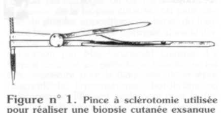

La biopsie cutanée exsangue (BCE) constitue la technique de choix pour le diagnostic de l'onchocercose. Cette parasitose est due à une filaire cutanéo-dermique _Onchocerca vol_oulus, transmise à l'homme par la piqûre d'un petit moucheron noir (simulie), vivant le long des cours d'eau rapides.

Très répandue en Afrique noire, elle est aussi présente au Yémen et en Amérique latine et est responsable d'un très grand nombre de cécités (cécité des rivières).

Les vers mâles et femelles vivent dans les tissus sous-cutanés, pelotonnés dans des nodules. Les vers femelles produisent des larves, les microfilaires, qui migrent sous la peau.

C'est la mise en évidence des microfilaires _d'Onchocerca volvulus_ qui permet d'apporter un argument diagnostique de certitude.

### **Matériel**

Compresses, alcool à 70°

Pince à sclérotomie (_figure n° 1_)

(emporte-pièce WALSER diamètre 2,5 mm distribué par les établissements Moria Dugast)

En l'absence d'emporte-pièce :

- pince

- ciseaux fins à bouts courbes

- éventuellement bistouri ou lame de rasoir

Verre de montre

Sérum physiologique (ou à défaut, eau distillée.)

**Technique**

### **Sites de prélèvement : _(figu_re _n° 2)_**

- Les prélèvements cutanés doivent être effectués dans les zones ou les microfilaires se concentrent en plus grand nombre, c'est-à-dire :

- au niveau des crètes iliaques et des mollets, en Afrique,

- au niveau de l'omoplate (fosse sus-épineuse), en Amérique,

- au niveau des chevilles et des mollets, au Yémen,

- Chez les malades présentant des nodules, la peau est prélevée au centre du nodule.

- Il est conseillé de faire plusieurs BCE (2 au niveau de chaque zone), pour diminuer le risque de faux négatifs.

### **Méthode**

Flamber à l'alcool le matériel de prélèvement. Désinfecter à l'alcool la zone à prélever.

*   **Technique avec pince à sclérotomie**

Sans anesthésie locale, pincer la zone à prélever entre le pouce et l'index.

De l'autre main, appliquer l'emporte-pièce sur la peau et sectionner d'un coup sec un petit fragment de peau.

*   **Technique avec pinces et ciseaux**

Pincer et tirer légèrement sur la peau.

Avec les ciseaux tenus par l'autre main, prélever sans faire saigner des petits fragments de derme superficiel (quelques millimètres de long sur 1 millimètre de large).

*   On peut également utiliser **une lame de** **rasoir ou un bistouri,** après avoir légèrement soulevé la peau à l'aide d'une aiguille, en faisant attention de ne pas faire saigner.

Déposer ces fragments de peau dans un verre de montre contenant quelques gouttes de sérum physiologique.

Attendre 10 à 30 minutes.

Pendant ce temps, nettoyer à l'alcool la zone où a été effectué le prélèvement.

### **Résultats**

Le prélèvement est observé au microscope à faible grossissement (objectif x10), en examinant les contours du morceau de peau d'où sortent les microfilaires.

Les microfilaires _d'Onchocerca volvulus_

- mesurent 270 à 300 microns de long et 5 à 10 microns de large,

- sont très mobiles, avec des mouvements brusques de contorsion,

- sont dépourvues de gaine,

- présentent une queue effilée et recourbée.

En 2 heures environ, presque toutes les microfilaires sont sorties du prélèvement.

### **Causes d'erreur**

D'autres microfilaires dermiques peuvent être retrouvées dans une BCE, mais elles ne sont pas pathogènes. C'est le cas de _Dipetanolema_ _streptocerca._

Ces microfilaires sont plus petites (180 à 240 microns de long, sur 3 microns de large), ont un corps plus droit et moins mobile, et présentent une extrémité caudale en crosse _(figure n° 3)._

- Quelle que soit la technique de prélèvement, _il est surtout très important de ne_ _pas souiller le prélèvement_ _par du sang_ car on pourrait retrouver une microfilaire sanguicole qu'il ne faut pas confondre avec _Onchocerca voloulus_.

Des frottis peuvent être effectués par écrasement d'un prélèvement cutané.

C'est l'examen, après fixation et coloration par le Giemsa, qui permet de reconnaître les différentes microfilaires en fonction :

- de leur taille,

- de l'existence ou non d'une gaine,

- de la taille de leur espace céphalique,

- du nombre, de la forme et de la position des noyaux.

_Développement et Santé, n° 129, juin 1997_