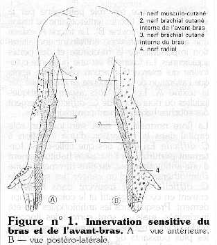
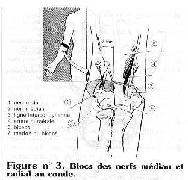
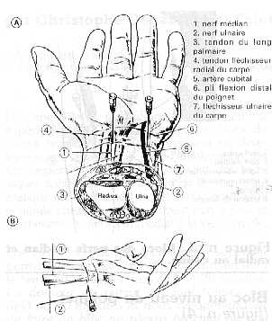
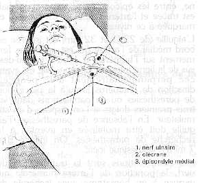
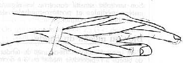
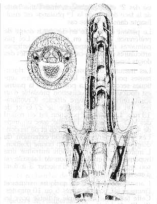
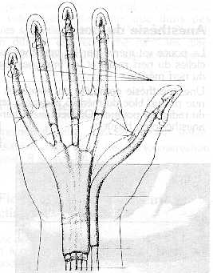
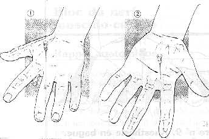

Les anesthésies locorégionales du membre supérieur, blocs tronculaires et les blocs du plexus brachial, connaissent un développement considérable avec l'amélioration des techniques et des drogues. Ce sont des techniques fiables pour la chirurgie de la main traumatique qui évitent les risques d'une anesthésie générale chez un patient souvent non à jeun et permettent un retour immédiat à la vie normale.

Les blocs tronculaires du membre supérieur permettent la petite chirurgie de la main dont le temps de garrot n'excède pas 20 minutes. La douleur du *garrot est mal tolérée au delà de 20 minutes et nous recommandons* *de faire un bloc du plexus brachial ou une anesthésie générale*. Les blocs tronculaires peuvent se faire pour compléter un bloc du plexus brachial incomplet sur un ou plusieurs territoires nerveux de la main. Ils ont d'autres indications telles que le traitement de la douleur aiguë et de la douleur chronique.

Nous présenterons les blocs au coude et au poignet qui permettent d'anesthésier la main et les doigts. Au coude, les nerfs médian, cubital et radial sont des nerfs mixtes et le nerf musculo-cutané est sensitif. Au poignet, les nerfs médian et cubital sont mixtes et le nerf radial est sensitif. Les abords au coude de réalisation plus difficile que les abords au poignet et non dénués de risque n'ont d'indication que. s'il est nécessaire d'obtenir une anesthésie de l'extrémité inférieure de l'avant bras (figures *n° 1 et 2).*

Le **matériel nécessaire** se résume à une aiguille courte à biseau court, une seringue plastique de 10 ml, des compresses, de l'alcool iodé et des gants stériles. Le patient est installé en décubitus dorsal le bras en abduction à 90°. La voie veineuse et l'ECG ne sont pas nécessaires car les blocs périphériques sont exempts de tout retentissement neurologique, cardiovasculaire et respiratoire. Le repérage par neurostimulation a un intérêt pour les nerfs mixtes, permettant d'abandonner la technique de repérage par recherche de paresthésies, et d'injecter de faibles volumes (0,15 ml/kg avec un maximum de 7 ml chez l'adulte au coude et 0,10 ml/kg avec un maximum de 5 ml chez l'adulte au poignet) à proximité du nerf avec un délai d'installation court. Les réponses musculaires motrices lors de la neuro-stimulation sont, pour le médian une flexion-pronation du poignet et une flexion des 2è et 3è doigts, pour le cubital une inclinaison cubitale du poignet et une flexion des 4è et 5è doigts ; pour le radial : une extension du coude, du poignet et des doigts. Pour les nerfs sensitifs ou en absence de neurostimulateur on fait un repérape par recherche de paresthésie ou une infiltration régionale avec l'injection d'un plus grand volume (7 à 8 ml) qui réalise un barrage d'anesthésique local sur le trajet du nerf.

**Bloc du nerf médian**

**Rappel anatomique**

Au coude, le nerf médian est en dedans de l'artère humérale, dans la gouttière bicipitale interne entre le tendon du biceps et le muscle brachial antérieur qui le sépare de l'articulation. Au poignet, le nerf médian chemine sous le tendon du long palmaire en dedans qui est inconstant (absent chez 10 % des sujets), entre le tendon du fléchisseur radial du carpe en dehors et le tendon fléchisseur superficiel des doigts destiné à l'index en arrière. Il donne 3 à 4 cm au-dessus du pli du poignet son rameau cutané palmaire. Il se termine à la partie proximale de la paume par les nerfs digitaux palmaires communs 1, II et III essentiellement sensitifs et le rameau musculaire thénarien qui assure l'innervation des muscles de l'éminence thénar.

Son territoire sensitif est la moitié latérale de la paume de la main jusqu'au milieu du 4e doigt ainsi que les faces dorsales des deux dernières phalanges des 2è, 3è et de la moitié externe du 4è doigt. Le territoire autonome, exclusivement innervé par le nerf médian, est la pulpe du pouce et de l'index. *Il assure essentiellement* *la flexion et* la pronation *de la main et la* *pince pollicidigitale* (pouce-index).

**Bloc au niveau du coude** *(figure n° 3)*

Le membre supérieur est en extension et en supination. L'opérateur se place au bord radial de l'avant-bras. La ligne intercondylienne, entre les épicondyles externe et médial, est tracée et l'artère humérale est repérée et marquée à ce niveau.

L'aiguille (de 23 G et 32 mm) est insérée au bord médial de l'artère qui est appliquée fermement sur l'humérus, à 1 ou 2 cm au-dessus de la ligne intercondylienne. Elle est avancée perpendiculairement à la peau en direction de l'humérus jusqu'à la perception de paresthésies ou de contractions dans les trois premiers doigts si l'on dispose d'un stimulateur. En l'absence de paresthésies, l'aiguille doit être mobilisée en éventail à la recherche de paresthésies. On injecte 3 à 7 ml d'anesthésique local.

Les complications sont la tranfixiation du nerf, la ponction de l'artère humérale qui expose à un hématome avec ischémie du membre en aval et la pénétration dans l'articulation du coude.

**Bloc au niveau du poignet** *(figure n° 4)*

Le membre supérieur est en extension et en supination. L'opérateur se place du côté cubital de la main pour un bloc du poignet droit et du côté radial de la main pour un bloc du poignet gauche. On repère les tendons du long palmaire et du fléchisseur radial du carpe en demandant au patient de fléchir le poignet contre résistance avec les doigts étendus. Le point de ponction est au bord radial du tendon du long palmaire, à 2 cm au-dessus du pli de flexion le plus distal du poignet. Si ce tendon n'est pas perçu, le point de ponction est 1 cm en dedans du tendon du fléchiseur radial du carpe et au dessus du tendon du muscle fléchisseur superficiel des doigts destiné à l'index qu'on localise en fléchissant la 2è phalange sur la 1ère.

Le poignet est mis en légère extension, l'aiguille (de 25 G et 16 mm) est insérée perpendiculairement à la peau d'une profondeur d'environ 1 cm. Dans la loge antérieure de l'avant-bras, le nerf médian est à une profondeur de moins de 1 cm. On injecte, après avoir obtenu des paresthésies ou une réponse motrice, qui est limitée à une opposition et une antépulsion du pouce, si l'on dispose d'un stimulateur. Si les paresthésies ne sont pas obtenues, elles doivent être recherchées dans une direction plus cubitale, sous le tendon du long palmaire.

Lors du retrait de l'aiguille, mais nous conseillons de repiquer pour être sûr d'être en sus-aponévrotique, on injecte 1 ml pour bloquer le rameau palmaire du nerf médian. Cette branche qui innerve l'éminence thénar et la face palmaire du pouce naît parfois au-dessus du point de ponction. En pratique, l'aiguille est orientée à 90° par rapport à l'axe du poignet vers la face externe de l'avant-bras et insérée en sous-cutanée sur toute sa Iongueur.

  
**Figure n°4. Bloc des nerfs médian et cubital au poignet.**

La perte de résistance brutale lors du passage dans la loge antérieure expose à l'embrochage du nerf médian.

**Bloc du nerf ulnaire**

**Rappel anatomique**

Au coude, le nerf ulnaire (cubital) est palpable en arrière de l'épicondyle médial et en dedans de l'olécrane dans la gouttière épicondylo-olécranienne où il est entouré d'un tissu fibreux. Il existe à ce niveau, où sa vascularisation est réduite, une fragilité du nerf à l'origine de paralysies positionnelles spontanées.

Au poignet, le nerf ulnaire est au bord radial du tendon du fléchisseur ulnaire du carpe, au bord ulnaire et en arrière de l'artère. Il donne ses rameaux sensitifs cutanés palmaire et dorsal, à 6 cm environ au-dessus du pli de flexion du poignet et se termine en deux branches, superficielle sensitive et profonde motrice qui assure l'innervation des muscles hypothénariens médiaux, des muscles interosseux, de deux muscles de l'éminence thénar : l'adducteur et le court fléchisseur du I.

Son territoire sensitif est la partie médiale de la main, le 5è doigt ainsi que la moitié interne du 4è doigt. Son territoire autonome est le bord cubital de la main et du 5è doigt.

*Il assure le mouvement des doigts (préhension et* mouvements latéraux *des doigts).*

**Bloc au coude** (figure *n°* 5)

On décrit deux installations : l'avant-bras en flexion et supination, ou le bras en antépulsion à 90°, l'avant-bras reposant sur la poitrine. L'opérateur se place du côté du bras à bloquer. L'épicondyle médial et la gouttière cubitale sont palpés. On choisit un point de ponction 2 à 3 cm au-dessus de l'épicondyle médial sur une ligne joignant la gouttière au pouls axillaire.

L'aiguille (de 23 G et 32 mm) est insérée perpendiculairement à la peau et avancée jusqu'à l'obtention de paresthésies, d'une réponse motrice ou d'un contact osseux. En l'absence de paresthésies, l'aiguille doit être mobilisée en éventail à la recherche de paresthésies. On injecte 3 à 7 ml d'anesthésique local.

Une ponction au niveau de la gouttière peut être à l'origine d'une neuropathie résiduelle par injection intraneurale ou syndrome canalaire. Il est recommandé d'éviter l'abord cubital au coude et de choisir l'abord au poignet d'autant que le territoire anesthésié est le même.

**Bloc au poignet** (*figure* *n°4)*

Le membre supérieur est en supination avec le poignet en légère extension. L'opérateur se place face au bord ulnaire du poignet. On repère l'apophyse styloïde de I'ulna (cubitus), le tendon du fléchisseur Ulnaire du carpe. Le nerf ulnaire est bloqué sous ce tendon avant qu'il se divise en ses branches terminales profonde et superficielle.

Le nerf est abordé deux travers de doigts au-dessus du pli de flexion distal du poignet, soit au bord radial du tendon du fléchisseur cubital du carpe, l'aiguille (25 G et 16 mm) étant dirigée perpendiculairement à la peau (dorsalement) sur une profondeur de moins d'un cm, soit du

  
**Figure n° 5. Bloc du nerf ulnaire au** **coude.**

coté cubital du tendon l'aiguille étant insérée, sous le tendon, de façon perpendiculaire à la peau (radialement) sur une profondeur d'environ 1,5 cm. Dans la seconde approche, que nous recommandons car elle permet de bloquer les deux branches cutanées par le même point de ponction, on injecte 3 à 5 ml après avoir obtenu des paresthésies ou une réponse motrice (mouvement d'adduction du pouce) si on dispose d'un neurostimulateur. En l'absence de neurostimulateur, l'aiguille est insérée de 10 à 20 mm et on injecte 5 à 10 ml d'anesthésique local en retirant graduellement l'aiguille jusqu'à rencontrer une résistance à l'injection qui signalera le passage en sous-cutané.

S'il est nécessaire de bloquer les deux branches cutanées qui innervent la partie médiale de la main, on associe une infiltration sous-cutanée en se dirigeant latéralement de part et d'autre de l'apophyse styloïde de l'ulna. Les deux branches cutanées sont bloquées : la branche dorsale par une infiltration sous-cutanée de 2 à 3 ml au bord ulnaire du carpe et la branche palmaire par une infiltration de 1 à 2 ml au bord radial du tendon fléchisseur cubital du carpe.

**Bloc du nerf radial**

**Rappel anatomique**

Au niveau du coude, le nerf radial passe en avant de l'épicondyle latéral de l'humérus, dans la gouttière bicipitale externe, à 1 ou 2 cm en dehors du tendon du biceps et en dedans du muscle brachio-radial et se divise en deux branches terminales : la branche antérieure superficielle sensitive et la branche postérieure profonde motrice qui assure l'innervation des muscles extenseurs de la main. La branche superficielle contourne le bord latéral de l'avant-bras au-dessus du poignet, où elle chemine dans le fascia superficiel après s'être ramifiée en trois rameaux, les nerfs digitaux dorsaux.

Son territoire sensitif est la face postérieure du bras, de l'avant-bras et de la main avec la partie latérale de la face dorsale de la main en dehors de l'axe du 3è doigt, la face dorsale du pouce, la face dorsale de la l'e phalange des trois premiers doigts et de la partie externe du 4è doigt. Son territoire autonome est la face dorsale de la 1ère commissure. *Il innerve* *les muscles extenseurs du bras et de* *l'avant-bras et accessoirement, il est supinateur et abducteur du pouce.*

**Bloc au coude** *(figure n°3)*

Le membre supérieur est en extension et en supination. L'opérateur se place au bord cubital du bras pour un bloc du bras gauche et au bord radial pour un bloc du bras droit. La ligne intercondylienne est tracée et le tendon bicipital palpé à ce niveau.

L'aiguille (de 22 G et 50 mm) est insérée sur la ligne intercondylienne à 2 cm en dehors du tendon bicipital en direction de l'épicondyle latéral jusqu'à obtenir une paresthésie ou une réponse motrice (extension du poignet). L'index de la main gauche au bord postérieur de l'épicondyle latéral est utilisé comme un guide. En l'absence de paresthésie, au contact de l'os, 2 à 4 ml sont injectés puis l'aiguille est retirée presque à la peau et redirigée plus médialement jusqu'au contact de l'os. On renouvelle les injections selon la même technique une ou plusieurs fois.

S'il est nécessaire de bloquer le nerf cutané postérieur de l'avant-bras, qui naît à la face postérieure de l'humérus et innerve la peau de la face postérieure de l'avant-bras, on associe une infiltration sous-cutanée de l'épicondyle latéral vers l'olécrane sur 3 ou 4 cm.

Les complications sont la tranfixiation du nerf et la pénétration dans l'articulation du coude.

**Bloc au poignet** *(figure n°6)*

Il s'agit d'une infiltration anesthésique des branches sensitives superficielles du nerf radial au niveau du bord radial du poignet.

Le membre supérieur est en extension, le poignet en pronation. Une ligne est tracée 2 cm au-dessus de la styloïde radiale, de part et d'autre du bord radial du poignet.

L'aiguille (de 23 G et 32 mm) est insérée au bord postéro-externe du poignet et enfoncée jusqu'au milieu de la face dorsale du poignet. Durant ce trajet, 3 à 5 ml d'anesthésique local sont injectés. Puis l'aiguille est retirée vers le point d'insertion et réaxée perpendiculairement à l'axe du poignet et enfoncée vers le bord antérieur du poignet. On injecte 3 à 5 ml d'anesthésique local. On réalise une infiltration sous-cutanée hémicirconférencielle postérieure et externe du poignet.

  
**Figure n° 6. Bloc du nerf radial au poignet**

**Bloc du nerf musculo-cutané**

**Rappel anatomique**

Au pli du coude, la branche terminale sensitive chemine latéralement au tendon bicipital, en avant de l'épicondyle latéral et en dedans de la veine médiane céphalique devenant superficielle à une distance variable du pli du coude.

Son territoire est le bord latéral de l'avant-bras jusqu'à l'articulation radio-carpienne. Il est utilisé en complément d'un bloc axillaire qui épargne fréquemment ce nerf ou d'un bloc du nerf radial.

**Bloc au niveau du coude**

Le membre supérieur est en extension et en supination.

Au coude, le site de ponction est celui du nerf radial avec une infiltration sous-cutanée du tendon du biceps à l'épicondyle latéral, que l'on fait lors du retrait de l'aiguille (22 G et 50 mm) de 3 à 4 ml d'anesthésique local.

On peut aussi faire une infiltration sous-cutanée 3 à 5 cm en dessous du pli du coude et en se dirigeant latéralement sur une distance de 3 ou 4 cm de part et d'autre du bord externe de l'avant-bras.

**Bloc du nerf brachial cutané interne de l'avant-bras**

**Rappel anatomique**

Il naît du faisceau médial du plexus brachial et perfore le fascia brachial avec la veine basilique qu'il côtoie latéralement. Il se divise en deux branches ; la branche antérieure qui descend sur la face antéro-médiale de l'avantbras jusqu'au poignet et la branche postérieure vers la face postéro-médiale.

Son territoire sensitif concerne les régions antéro-médiales et postéro-médiales de l'avant-bras et du poignet.

**Bloc au niveau du coude**

C'est une infiltration sous-cutanée du tendon du biceps à l'épicondyle médial ou 3 à 5 cm en dessous du pli de flexion du coude sur 3 cm de part et d'autre du bord interne de l'avant-bras de 3 à 4 ml d'anesthésique local.

**Anesthésie par bloc des nerfs digitaux**

Les blocs digitaux permettent de faire de nombreuses petites interventions sur les doigts en mode ambulatoire, qu'il s'agisse de chirurgie programmée ou d'urgence : pathologie unguéale, exploration de plaies, ablation de tumeur, kyste et matériel, ténolyse et neurolyse (hématome sous-unguéal).

,L'anesthésie locale digitale est contre-indiquée en cas de sepsis local : panaris, morsure, ou doigt inflammatoire.

La principale complication est la nécrose digitale. **Les solutions adrénalinées sont** **formellement contre-indiquées.** Les autres facteurs favorisants sont des lésions vasculaires préexistantes ou par ponction transfixiante, l'injection d'un trop grand volume dans un espace restreint et un garrot digital de plus de 15 mn.

**Rappel anatomique**

Les nerfs interdigitaux, branches des nerfs médian et cubital, se divisent à la partie palmaire distale de la main en nerfs collatéraux palmaires qui innervent la face palmaire de tous les doigts ainsi que la face dorsale des 2è et 3è phalanges des 2è , 3è et 4è doigts. Les nerfs collatéraux palmaires sont accompagnés par des vaisseaux collatéraux *(figure n° 7)*. Les pédicules vasculo-nerveux cheminent sur la face ventro-latérale du doigt, de part et d'autre de la gaine des tendons fléchisseurs. La distribution de la gaine des tendons fléchisseurs *(figure n° 8)* n'est pas la même pour les cinq doigts. Elle enveloppe les tendons fléchisseurs des 2è , 3è et 4è doigts de l'articulation inter-phalangienne distale jusqu'à un centimètre au-dessus de la métacarpo-phalangienne (MCP) correspondante. Pour le 5è doigt et le pouce, elle s'étend jusqu'à 4 ou 5 cm au-dessus du ligt annulaire.

Les nerfs collatéraux dorsaux, issus des nerfs radial et ulnaire innervent la face dorsale du pouce et du 5e doigt, la face dorsale de la première phalange des 2è, 3è, et 4è doigts. Ils cheminent sur la face dorso-latérale du doigt.

**L'anesthésie en bague** (figure *n°9)*

C'est un bloc des nerfs collatéraux palmaires et dorsaux de chaque côté de la base du doigt. Il permet une anesthésie des trois phalanges.

Le patient est installé en décubitus dorsal de préférence, la main en pronation.  
  
**Figure n° 7. Pédicules vasculo-nerveux collatéro-palmaires de part et d'autre des tendons fléchisseurs.**  
  
**Figure n° 8. Gaines des tendons fléchisseurs.**  
  
**Figure n° 9. Anesthésie en bague.** 1. nerf collatéral dorsal - 2. nerf et artère collatéro-palmaires

L'opérateur saisit le doigt entre le pouce et l'index gauche, le pouce étant placé sur la face dorsale et l'index sous la face palmaire. Le point de ponction est au niveau de la base de la 1ère phalange.

On utilise une aiguille de 25 G et de 16 mm, que l'on insère au bord dorso-latéral de la base du doigt et que l'on dirige vers la face ventrale du doigt. On avance l'aiguille jusqu'à ce que l'on perçoive la résistance de la peau palmaire où une pression sur le "doigt protecteur" placé sous le doigt du patient et opposé à la direction de l'aiguille. On fait une 1ère injection sous-cutanée ventrale de 1 ml après avoir retiré l'aiguille de 2 à 3 mm pour anesthésier le nerf collatéral palmaire et une 21 injection sous-cutanée dorsale de 0,5 ml après avoir retiré l'aiguille jusque sous le point de ponction pour anesthésier le nerf collatéral dorsal. Il faut faire la technique au bord latéral et au bord médian du doigt.

Les complications sont les nécroses digitales par syndrome canalaire.

**L'anesthésie inter-commissurale** *(figure n° 10)*

C'est un bloc du nerf inter-digital en amont de la division en nerfs collatéraux entre les têtes des métacarpes. Il permet une anesthésie des trois phalanges.

Le patient est installé en décubitus dorsal de préférence, la main en pronation et les doigts étendus et écartés.

On utilise une aiguille de 25 G et de 16 mm. Le point de ponction est dans la commissure à 2-3 mm de la jonction avec la peau palmaire. On dirige l'aiguille en arrière vers la main avec une direction parallèle aux doigts. On injecte 2 ml de solution après avoir enfoncé l'aiguille jusqu'à la garde. On redirige J'aiguille en direction des nerfs dorsaux, si leur anesthésie est nécessaire. Il faut faire la technique au bord latéral et au bord médian du doigt.

  
**Figure n°10. Anesthésie inter-commissurale.**

1.  approche dorsale - 2. approche palmaire

On peut réaliser une approche dorsale. L'opérateur saisit la commissure entre le pouce et l'index gauche, le pouce étant placé sur la face dorsale et l'index sous la face palmaire. L'aiguille qui rase le pouce de l'opérateur est insérée entre les métacarpes selon un axe oblique qui vise l'extrémité de l'index placée sous la commissure. L'aiguille est enfoncée jusqu'à la peau palmaire et la région est infiltrée de 3 à 5 ml d'anesthésique local.

L'approche palmaire n'est pas conseillée car plus douloureuse.

Les complications sont les lésions vasculonerveuses par ponction transfixiante.

**Anesthésie locale digitale par la gaine des fléchisseurs** *(figure n°11)*

C'est un bloc de proximité des nerfs digitopalmaires, les pédicules vasculo-nerveux palmaires étant situés de part et d'autre de la gaine des fléchisseurs. Il assure une anesthésie des 2è et 3è phalanges, mais l'anesthésie de la face dorsale de la 1ère phalange est insuffisante dans 60 % des cas.

Le patient est installé en décubitus dorsal de préférence, la main en supination. Les plis palmaires distaux répondent aux interlignes articulaires des méta-carpo-phalangiennes des doigts longs.

Les mesures d'asepsie doivent être rigoureuses pour prévenir les complications septiques secondaires. La ponction de la paume est douloureuse et l'utilisation préalable d'un spray réfrigérant s'avère efficace (Cryoflurane). On utilise une aiguille de 27 G et de 13 mm. Le point de ponction est en regard des MCP. On avance l'aiguille, avec un angle de 45°, jusqu'au contact de l'os et du tendon. Les mouvements de flexion-extension du doigt verticalisent l'aiguille en bonne position. L'injection dans le tendon entraîne une hyperpression et l'inclinaison -de l'aiguille où son léger retrait permet d'injecter 3 à 4 ml d'anesthésie locale.

L'anesthésie s'installe en quelques minutes et l'incision est possible après 5 ou 10 minutes. Cette technique est simple et fiable pour les 2è, 3è, 4è doigts, mais insuffisante pour les doigts latéraux du fait de la prédominance des nerfs collatéraux dorsaux. Pour le pouce, un bloc radial au niveau du poignet doit être associé. Pour l'auriculaire, un bloc du cubital au poignet est plus judicieux.

Cette technique n'expose pas aux complications vasculo-nerveuses, mais au risque de phlegmon.

**Anesthésie du pouce**

Le pouce est innervé par les branches superficielles du nerf radial et les branches digitales du nerf médian.

Une anesthésie complète du pouce est obtenue par un bloc du médian associé à un bloc du radial au poignet. On peut aussi faire une anesthésie en bague.

  
**Figure n°11. Anesthésie par la gaine des fléchisseurs**

1.  position de l'aiguille - 2. Verticalisation de l'aiguille lors de la flexion active des doigts

*Développement et Santé, n° 128, avril 1997*
