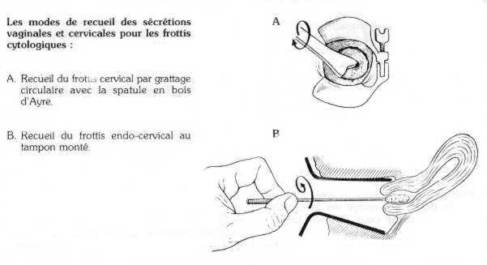
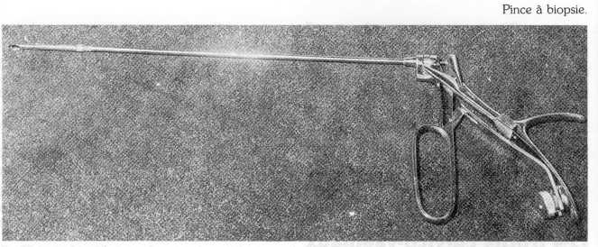
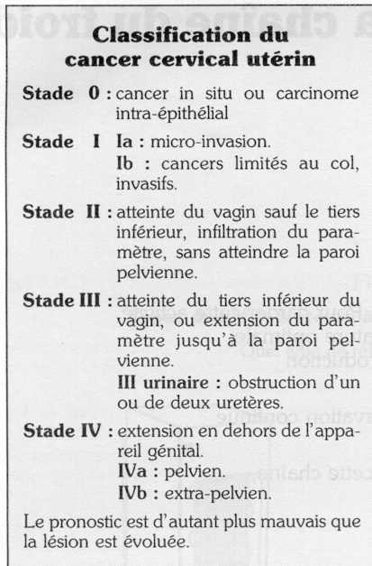
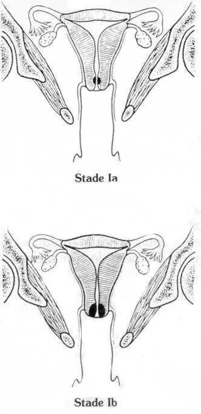
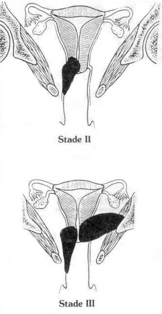

Le cancer du col utérin est une maladie grave.

Son pronostic est meilleur si le diagnostic est fait précocement.

Ceci est possible grâce au dépistage systématique par les **frottis cervico-vaginaux à** faire d'autant plus qu'il existe des signes d'appel ou des facteurs de risque. Sa prévention repose sur le traitement des **lésions précancéreuses ou dysplasies.**

### **Les frottis cervico-vaginaux**

La pratique des frottis est simple. Elle nécessite un minimum d'instrumentation. Un spéculum qui permet d'exposer correctement le col; une spatule en bois ou spatule d'Ayre avec laquelle on recueille par frottement les cellules du fond vaginal, et par l'autre extrémité les cellules de l'exocol. Un écouvillon introduit dans le canal cervical permet le frottis endocervical. Les prélèvements ainsi faits, ou frottis étagés, sont étalés sur trois lames étiquetées et aussitôt fixées par une laque adaptée (exemple : bombe de Cytofix). [On peut également utiliser un mélange éther et alcool].

L'acheminement au Laboratoire d'Anatomopathologie n'est pas une urgence et peut être regroupé en fonction des possibilités techniques. La fixation permet une lecture retardée. Les frottis ne sont pas des prélèvements bactériologiques qui nécessiteraient une autre technique.

### **Quand faire les frottis ?**

**1.** Lorsqu'il existe des signes pouvant faire évoquer une pathologie du col ou **signes** **d'appel :** saignements provoqués par les traumatismes locaux, notamment les rapports sexuels: pertes vaginales sales et persistantes; lorsque dès l'examen au spéculum on constate un gros col inflammatoire, une ulcération ou un bourgeonnement induré au toucher vaginal.

**2.** De préférence **de façon systématique** une fois par an, à partir du moment où la femme a une activité sexuelle; de façon à dépister les lésions précancéreuses ou dysplasies.

**3.** A fortiori lors de **consultations occasionnelles** de femmes non ou peu suivies : lors d'une demande de contraception, durant la grossesse ou le post-partum.

**Le test de Shiller - la** **colposcopie - les biopsies**

### **1. Le test de Shiller**

Lors de l'examen au spéculum, l'application sur l'exocol et le vagin de Lugol fort, à l'aide d'un tampon monté, doit faire prendre à tout l'épithélium une coloration brun-acajou uniforme. Toutes les zones iodo-négatives, c'est-à-dire qui ne se colorent pas, sont a priori pathologiques et doivent donner l'alarme.

### **2. La colposcopie**

Il s'agit d'un examen plus spécialisé qui nécessite un apprentissage. Le colposcope est une loupe qui permet d'observer le col à un grossissement de moyen à fort; et de repérer les zones pathologiques. L'application à l'aide de tampons montés de deux réactifs les fait bien ressortir. D'abord l'acide acétique à 2 % entraîne une réaction blanche des lésions, ensuite le Lugol fort par le test de Shiller montre les zones iodo-négatives. La colposcopie permet ainsi de mettre en évidence les zones suspectes cancéreuses ou précancéreuses, et de les délimiter exactement.

### **3. Les biopsies**

Elles sont indispensables en cas de frottis anormaux, de test de Shiller ou de colposcopie suspects. Le prélèvement est peu ou non douloureux et ne nécessite pas d'anesthésie, ni locale, ni bien sûr générale. Il se fait à l'aide d'une pince à biopsie sur les zones les plus inquiétantes. Le fragment est fixé dans du liquide de Bouin et envoyé au laboratoire d'anatomo-pathologie pour examen histologique.

Les biopsies sont parfois hémorragiques. Le saignement s'arrête facilement par tamponnement à la compresse ou mise en place d'une mèche vaginale.

### **Les résultats**

Les frottis ou examen **cytologique** dépistent donc :

*   les lésions précancéreuses ou dysplasies plus ou moins graves;

*   les cancers, les cellules recueillies sont franchement anormales;

*   les infections, notamment virales.

Les biopsies ou examen **histologique** confirment la nature des lésions et leur étendue en profondeur. Elles différencient les cancers in situ, des cancers invasifs.

### **Les facteurs de risque**

Certaines circonstances favorisent l'apparition du cancer du col de l'utérus et sont importantes à connaître :

**1.** une activité sexuelle commencée précocement dans la vie génitale,

**2.** la multiplicité des partenaires,

**3.** les infections par les virus condylomateux, sexuellement transmis. Les lésions sont :

- soit évidentes car il existe des bouquets de condylomes ou classiques " crêtes de coq " sur la vulve, le vagin et le col,

- soit moins apparentes, dépistées par les frottis et visibles en colposcopie.

**4.** Les accouchements multiples.

### **Bilan du cancer**

Il est indispensable pour permettre un traitement adapté. Il est fait en milieu spécialisé. Il comporte :

*   l'examen clinique sous anesthésie générale, qui apprécie l'extension vaginale et pelvienne;

*   l'examen clinique, radiologique ou endoscopique des organes de voisinage : vessie, rectum ;

un bilan biologique complet et le bilan d'extension d'éventuelles métastases.

Ce bilan permet de **classer** le cancer, suivant le tableau ci-dessus.

### **Principes du traitement**

Il repose sur la radiothérapie et la chirurgie. Schématiquement, les lésions précancéreuses ou dysplasies peuvent être détruites localement. Les lésions limitées (stades 0 et la) relèvent de la chirurgie limitée au col: conisation, amputation du col.

Toutes les autres formes opérables justifient une large intervention d'exérèse emportant l'utérus, les annexes, les ganglions iliaques et la partie supérieure du vagin. Cette chirurgie est classiquement précédée d'une radiothérapie vaginale (curiethérapie) et suivie d'une irradiation pelvienne externe en cas d'atteinte des ganglions.

Les formes inopérables ont une radiothérapie palliative. La chirurgie de dérivation urinaire est parfois nécessaire dans les obstructions urétérales.

_Développement et Santé, N°80, avril 1989_