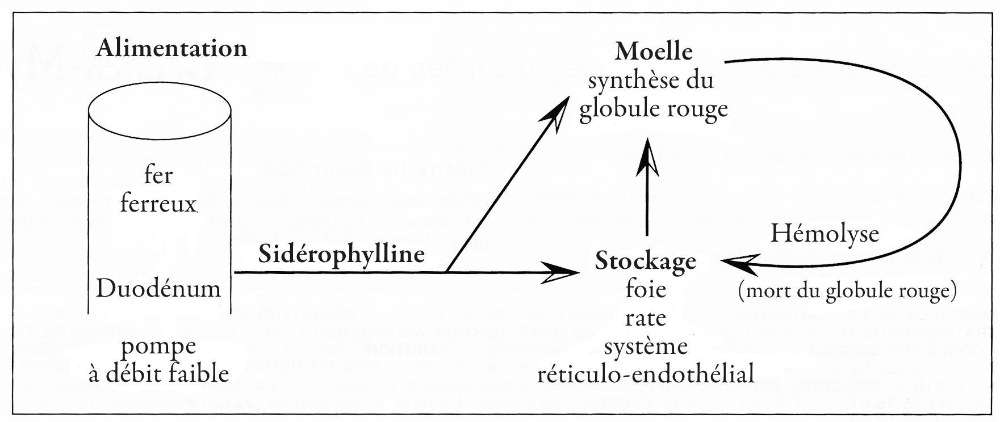
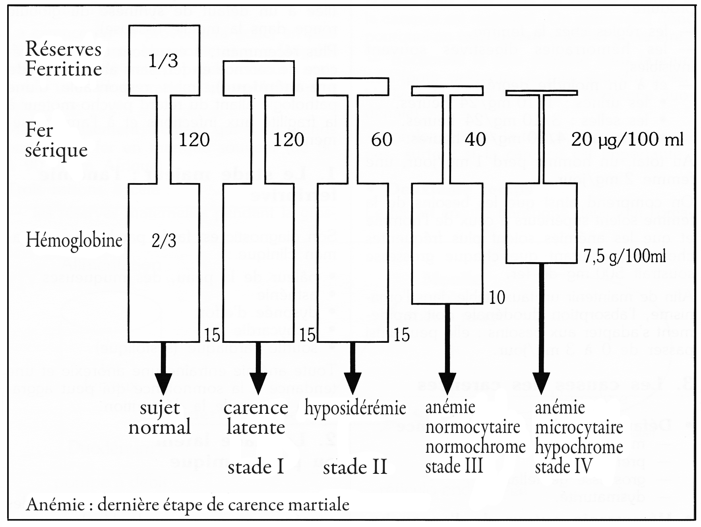
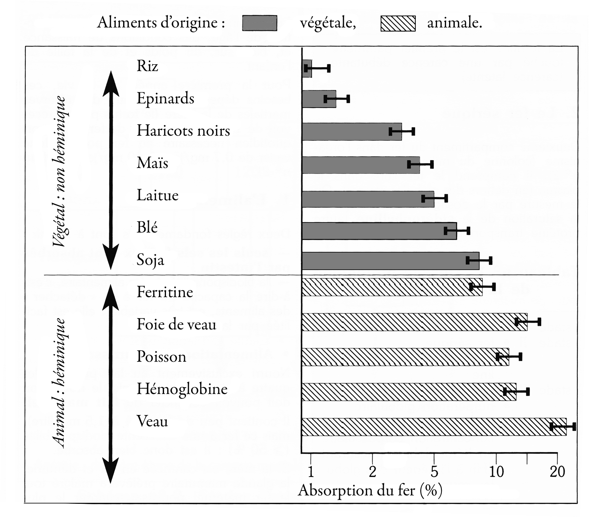

## I. Généralités

### 1. La physiopathologie du fer

Le fer est un élément essentiel de l’organisme. Il est indispensable à la formation d’hémoglobine, constituant majeur du globule rouge.  
Sans le fer, les globules rouges ne peuvent plus être normalement produits par la moelle osseuse. Ils deviennent rares et « pâles » : c’est l’anémie hypochrome par carence en fer.  
Le fer intervient aussi dans la constitution des enzymes musculaires (myoglobine) et l’immunité (bon fonctionnement des polynucléaires et des lymphocytes) pour lutter contre l’infection.  
La carence en fer provoque donc, en plus de l’anémie, une hypotonie et une fatigabilité, source de retard psychomoteur, mais aussi une plus grande susceptibilité aux infectionss  
Malheureusement, l’enfant, qui a de grands besoins en fer, en manque souvent (de 50 % à 90 % en Afrique).  
Trois raisons à cela :

*   les réserves naturelles pendant la grossesse sont souvent trop faibles : le fœtus ne peut donc constituer ses stocks ;
*   l’alimentation de l’enfant est trop pauvre en sels de fer ;
*   les diarrhées, les parasitoses et toutes les infections entraînent des fuites de fer.

### 2. Le cycle du fer

Suivons maintenant le circuit du fer dans l’organisme (schéma n° 1).

#### Premier temps

Contenu dans l’alimentation, le fer ferreux est absorbé dans le duodénum par une véritable « pompe aspirante » qui ne fonctionne que si le niveau du fer sanguin est bas.  
D’autre part, son débit est faible (même si la carence est majeure). On comprend donc pourquoi un traitement martial devra être :

*   fractionné le plus possible dans la journée (pour présenter le plus souvent possible les sels de fer « devant » la pompe duodénale ;
*   prolongé dans le temps, plusieurs semaines, surtout si la carence est importante.

#### Deuxième temps

Le fer est ensuite transporté dans tout l’organisme par une protéine porteuse : la sidérophylline.

#### Troisième temps : le stockage

Grâce à une autre protéine, la ferritine, le fer est stocké dans le foie, la rate et tout le système réticulo-endothélial.

#### Quatrième temps : l’utilisation

Une partie du fer va gagner la moelle osseuse où il va permettre la synthèse de l’hémoglobine puis du globule rouge.  
Une autre partie va servir à la synthèse des cellules musculaires et des polynucléaires.

#### Cinquième temps : la recirculation

Quand le globule rouge meurt au bout de 120 jours, il est capté par la rate et le fer est immédiatement récupéré par la sidérophylline qui, suivant les besoins, ira le livrer dans la moelle ou le stocker dans le foie.

**Figure 1. Le circuit du fer dans l'organisme**

**On constate donc que le fer, ayant pénétré dans l’organisme, doit théoriquement y rester définitivement.**

En fait, de nombreuses « fuites » peuvent se produire :

En fait, de nombreuses « fuites » peuvent se produire :

*   les règles chez la femme,
*   les hémorragies digestives souvent invisibles,
*   et à un moindre degré :
    *   les urines : 1/10 mg/24 heures,
    *   les selles : 3/10 mg/24 heures,
    *   la sueur : 4/10 mg/24 heures.

Au total, un homme perd 1 mg/jour, une femme 2 mg/jour.

On comprend ainsi que les besoins de la femme soient supérieurs à ceux de l’homme et que les anémies soient plus fréquentes chez elle, d’autant que chaque grossesse soustrait 500 mg de fer.  
Afin de maintenir un taux stable dans l’organisme, l’absorption duodénale doit rapidement s’adapter aux besoins : elle peut ainsi passer de 0 à 3 mg/jour.

### 3. Les causes des carences

#### Défaut de stock à la naissance

*   Mère carencée
*   Prématurité
*   Grossesse gémellaire
*   Dysmaturité

#### Hémorragie autour de l’accouchement

Blessure du cordon ou ligature trop précoce.

#### Défaut d’apport alimentaire

Lait artificiel

Régime lacto-farineux (pauvre en viande et en poisson)

#### Pertes sanguines

_Saignements chroniques_

*   Toutes les diarrhées
*   Parasitoses intestinales
*   Reflux gastro-œsophagien
*   Hématurie (bilharziose)

_Processus inflammatoire_

*   Infections pulmonaires (les crachats sont riches en fer)
*   Tuberculose
*   Rhumatisme articulaire aigu

## II. Conséquences cliniques d’une carence

Depuis longtemps, la carence en fer est reconnue comme responsable de l’anémie (liée à un défaut de synthèse du globule rouge dans la moelle osseuse).  
Plus récemment, il est décrit un stade précoce de carence en fer, sans anémie – stade pré-anémique -, mais responsable d’une pathologie allant du retard psychomoteur à la fragilité aux infections et à l’amaigrissement.

### 1. Le stade majeur : l’anémie ferriprive

Son diagnostic est facile par simple examen clinique :

*   Pâleur de la peau
*   Asthénie
*   Dyspnée d’effort
*   Tachycardie
*   Souffle cardiaque (systolique)

Toute anémie entraîne une anorexie et une tendance à la somnolence qui peut à elle seule aggraver la dénutrition.

### 2. La stade latent ou pré-anémique

Plus insidieux, ce stade latent a déjà des conséquences graves sur le développement de l’enfant. Il est donc primordial de diagnostiquer la carence martiale à ce stade précoce, avant l’anémie, car le traitement sera plus rapidement efficace.  
Vous penserez à la carence pré-anémique chez l’enfant quand :

sa prise de poids est insuffisante ais sa taille normale,

*   il se fatigue vite surtout quand il marche,
*   il se met à parler tard et semble peu intéressé par son entourage,
*   il est triste, grognon et peu souriant,
*   il a des infections à répétition : ORL, pulmonaires et cutanées surtout,
*   il a des difficultés à suivre à l’école,
*   enfin, quand il devient frileux sans raison.

Si l’enfant n’est pas traité à ce stade, en quelques semaines l’anémie ferriprive va s’installer.

Récemment enfin, une étude a démontré qu’un stade pré-anémique négligé pendant plusieurs mois chez le jeune enfant pouvait avoir des conséquences définitives sur l’intelligence (les tests de niveau étant effectués cinq à dix ans après la période de carence). Dans cette même étude, le traitement (trop tardif) par les sels de fer n’a pas réussi à restaurer une intelligence normale.

<table>

<tbody>

<tr>

<td>

En conclusion

Une carence en fer modérée peut entraîner :

<ul><li>cassure de la courbe de poids</li><li>trouble de la fonction musculaire</li><li>retard intellectuel</li><li>troubles du comportement</li><li>fragilité aux infections</li></ul></td>

</tr>

</tbody>

</table>

De plus, la carence martiale peut entraîner :

*   troubles cutanéo-muqueux,
*   trouble de la fonction musculaire
*   glossite,
*   perlèche,
*   troubles des ongles,
*   troubles du tractus gastro-intestinal,
*   malabsorption (par atrophie de la muqueuse intestinale).

De plus, la carence martiale peut entraîner :

*   troubles cutanéo-muqueux,
*   trouble de la fonction musculaire
*   glossite,
*   perlèche,
*   troubles des ongles,
*   troubles du tractus gastro-intestinal,
*   malabsorption (par atrophie de la muqueuse intestinale).

## III. Evolution biologique de la carence en fer

Pour comprendre les différents stades de la carence en fer (figure 2) et leur dosage biologique (tableau I), il faut savoir que le fer se répartit en trois secteurs.

### 1. Le fer de réserve

Stocké dans le foie et le système réticulo-endothélial, il représente un tiers du fer total : pour le mesurer, on pourrait effectuer une biopsie hépatique, geste difficile et douloureux ! Heureusement, le taux de **ferritine plasmatique** est un fidèle reflet du fer de réserve : il suffit d’une goutte de sang pour le doser. Ce dosage de la ferritine est sans valeur avant l’êge de six mois et lorsqu’il existe des signes inflammatoires (fièvre, infection). Dans ce cas, la ferritine sérique s’élève même en cas de carence en fer.

<table>

<tbody>

<tr>

<td style="width: 483px;">La ferritine est le premier paramètre touché par une carence débutante (carence latente).</td>

</tr>

</tbody>

</table>

### 2. Le fer sérique

Deuxième compartiment du fer dans l’organisme (colonne du milieu sur le schéma n° 2), il comprend le fer libre dans le plasma (en dehors des globules rouges). On le mesure par le dosage du er sérique et la saturation de la **sidérophylline** (autre protéine transporteuse de fer). Quand les réserves de fer sont épuisées (ferritine = 0), le fer sérique à son tour diminuera (c’est le stade II de la carence).

### 3. L’hémoglobine

C’est le fer contenu dans les globules rouges : il représente les deux tiers du fer total. On le mesure pas le dosage de l’hémoglobine et la numération globulaire.  
Le stade III s’accompagne d’une anémie normocytaire normochrome.  
Le stade IV, stade ultime de la carence, est défini par une anémie microcytaire et hypochrome dont les conséquences peuvent être redoutables.

<table>
<caption>Tableau I. Evaluation biologique de la carence en fer</caption>

<tbody>

<tr>

<td style="width: 47px;">Stade I</td>

<td style="width: 392px;">Ferritine plasmatique</td>

</tr>

<tr>

<td style="width: 47px;">Stade II</td>

<td style="width: 392px;">

Fer sérique

Saturation de la sidérophylline

</td>

</tr>

<tr>

<td style="width: 47px;">Stade III</td>

<td style="width: 392px;">

Hémoglobine

Numération globulaire

</td>

</tr>

<tr>

<td style="width: 47px;">Stade IV</td>

<td style="width: 392px;">

Volume globulaire

Concentration corpusculaire en hémoglobine (mesurant l’hémoglobine à l’intérieur des globules rouges)

</td>

</tr>

</tbody>

</table>

**Figure 2. Stades évolutifs de la carence martiale**

## IV. Prévention de la carence en fer

Les besoins en fer varient beaucoup en fonction de l’âge, des conditions de naissance et, bien sûr, du poids et de la taille de l’enfant.

Pour la première année de la vie, ces besoins dépendent beaucoup des réserves martiales de la mère (le fœtus pourra recevoir de 100 mg à 300 mg de fer). L’apport quotidien nécessaire pourra donc varier de 0,7 mg/jour à 10 mg/jour (tableau n° II).

**Tableau II. Les réserves en fer du nourrisson**

<table>
<caption>Tableau II. Les réserves en fer du nourrisson</caption>

<thead>

<tr>

<th scope="col">Nouveau-né  
Nourrisson</th>

<th scope="col">Poids normal  
né à terme</th>

<th scope="col">Petit poids  
naissance prémarutée</th>

</tr>

</thead>

<tbody>

<tr>

<td>A la naissance  
stock variable</td>

<td>70 à 80 mg/kg  
250 à 300 mg</td>

<td>50 à 70 mg/kg  
100 à 140 mg</td>

</tr>

<tr>

<td>A quatre mois</td>

<td>40 à 45 mg/kg</td>

<td>selon poids de naissance</td>

</tr>

<tr>

<td>Stock à un an</td>

<td>400 à 450 mg</td>

<td>400 à 450 mg</td>

</tr>

<tr>

<td>Doit trouver</td>

<td>150 mg</td>

<td>300 mg</td>

</tr>

<tr>

<td>Soit un apport quotidien</td>

<td>0,7 mg/jour  
idem adultes</td>

<td>

≥ 10 mg/jour  
↑ adultes

</td>

</tr>

<tr>

<td> </td>

<td class="rtecenter">Carence  
toujours possible</td>

<td>Carence obligatoire</td>

</tr>

</tbody>

</table>

### 1. L’alimentation

Deux règles fondamentales sont à retenir : 

*   seuls les sels ferreux sont absorbés par l’intestin ;
*   la biodisponibilité du fer alimentaire, c’est-à-dire la capacité du fer à se « détacher » des aliments, est très variable : elle est facilitée par la vitamine C.

#### Alimentation du nourrisson

Nourri exclusivement au lait pendant les quatre à cinq premeirs mois, le nourrisson doit pouvoir bénéficier du lait maternel.  
Il contient peu de fer (0,4 à 1,5 mg/litre), mais ce fer a une excellente biodisponibilité (≥ 50 %) : il est donc bien absorbé.  
Si la mère est carencée en fer et dénutrie, la glande mammaire prélèvera malgré tout le fer maternel pour sauvegarder le plus longtemps possible la teneur du lait maternel. C’est dire l’intérêt de la supplémentation en fer de la mère dès la grossesse (50 mg/jour dès le 5ème mois.

Le **lait de vache**, à l’opposé, provoque presque toujours un état de carence. En effet, non seulement il est pauvre en fer (0,2 à 0,6 mg/litre) mais celui-ci est très mal absorbé (10 %).  
Pour corriger ces deux graves défauts, on dispose de laits maternisés enrichis en fer : malheureusement, il n’a pour l’instant pas été possible d’obtenir une biodisponibilité égale à celle du fer du lait maternel.

**Le lait maternel est irremplaçable les six premeirs mois (veiller aux réserves martiales de la mère).**

#### Alimentation de l’enfant

Dès le sevrage**, les risques de carence en fer deviennent majeurs** : 

*   car l’apport en protéines animales est souvent insuffisant,
*   car les parasitoses intestinales et toutes les infections pulmonaires ou digestives entraînent une importante perte de fer.

Pour les aliments (comme pour les laits), il faut tenir compte :

*   de la teneur en fer,
*   et surtout de la biodisponibilité (tableau III).

D’une façon générale, les protéines sont riches en fer, et parmi celles-ci, celles d’origine animale (viande, poisson, œuf) ont le fer le plus absorbable : c’est le fer héminique.

Pour connaître la teneur en fer des rpincipaux aliments, se reporter au tableau IV.

**Tableau III. Absorption du fer contenu dans différents aliments d'origine végétale et animale (moyenne géométrique)**

**Tableau IV. Teneur en fer des aliments (daprès S. Herlberg, La carence en fer)**

<table>

<tbody>

<tr>

<td colspan="2" rowspan="1" style="width: 181px;">

Aliments

</td>

<td class="rtecenter" style="width: 82px;">Teneur en fer  
mg/100 g</td>

<td colspan="2" rowspan="1" style="width: 162px;">

Aliments

</td>

<td class="rtecenter" style="width: 61px;">Teneur en fer  
mg/100 g</td>

</tr>

<tr>

<td class="rtecenter" style="width: 46px;">Céréales  
 </td>

<td style="width: 108px;">

Sucre

Pain balnc

Blé (farine)

Maïs (farine)

Mil (farine)

Teff (farine

Sorgho (farine)

Riz brun

Riz blanc poli

Banane plantain

Igname

Manioc

Patate douce

Pomme de terre

Arachide

Haricot

Lentille

Niebé

Pois chiche

Soja (farine)

</td>

<td style="width: 82px;">

0

0,4-0,8

2,2-3,6

3,0-3,4

2,0-3,3

14,9-105,0

8,6-10,0

0,5-2,0

0,3-1,7

1,3

0,8-1,6

0;7-1,9

0,2-5,7

0,8-1,1

3,8

1,4-9,6

7,0

7,6

11,2

6,0

</td>

<td style="width: 44px;">

Origine végétale

</td>

<td style="width: 88px;">

Baobab (feuilles séchées)

Carotte

Epinards

Laitue

Gombo

Courge

Tomate

Piment rouge

Ananas

Avocat

Fraise

Goyave

Mangue

Orange

Raisin

Papaye

</td>

<td style="width: 61px;">

24,0

0,7

1,7-4,4

1,0

1,2

2,8

0,6

2,9

0,4

1,4

0,7

1,3

1,2

0,1

0,8-2,1

0,6

</td>

</tr>

<tr>

<td class="rtecenter" rowspan="2" style="width: 46px;">Origine  
animale</td>

<td rowspan="2" style="width: 108px;">

Viande de mouton

Viande de boeuf

Coeur de boeuf

Viande de porc

Poulet

Foie-abats

Oeuf de poule

Huître

Brochet

Capitaine

Dorade

Maquereau

Sardine

Sole

Tilapia

</td>

<td rowspan="2" style="width: 82px;">

1,5-2,5

2,9-5,6

4,0

1,5-2,3

1,1-2,0

8,0-18,0

2,0-2,6

6,0-7,0

0,8

4,1

1,4

1,2

1,3

0,4

3,2

</td>

<td style="width: 44px;">Lait</td>

<td style="width: 88px;">

Lait de vache

Lait maternel

Beurre

</td>

<td style="width: 61px;">

0,03-0,05

0,07-0,15

0,2

</td>

</tr>

<tr>

<td colspan="3" rowspan="1" style="width: 61px;">

Chocolat          1,6-2,4

Vin 5,0-25,0

</td>

</tr>

</tbody>

</table>

### 2. Les facteurs favorisant l'absorption du fer

**L’acide ascorbique** (vitamine C) joue un rôle majeur : l’ingestion de 100 ml de jus d’orange multiplie par trois l’absorption du fer d’un repas ; c’est dire l’intérêt d’associer à chaque repas un fruit (orange, mangue…).

**Les sécrétions acides gastriques** ont aussi un rôle favorisant (en cas de gastrite, le fer sera moins absorbé). En pratique, surtout chez l’enfant à risque, il est prudent d’administrer des cures préventives de sel de fer.  
Cela est particulièrement utile pour le prématuré, le petit poids de naissance, l’enfant sujet aux diarrhées et aux infections ORL et pulmonaires…

**Le sulfate ferreux est ainsi préconisé à trois mois (date de l’anémie physiologique) et à neuf mois :**

*   A trois mois : 2 mg/kg/jour suffisent, administrés en deux à trois prises pendant six semaines (par exemple 4 gouttes matin, midi et soir au moment des repas).
*   A neuf mois (pour un poids de 8 kg environ), il faudra passer à 16 gouttes par jour de nouveau pendant six semaines.

**​Ainsi, la carence en fer sera prévenue.**

## V. Traitement de la carence en fer

Trop souvent, la carence en fer est découverte au stade majeur qu’est l’anémie.

*   Dans les cas extrêmes, l’hémoglobine peut chuter à 2 à 3 g/100 ml : une transfusion peut  être justifiée devant une menace vitale. Mais les risques de contamination par le VIH et l’hépatite B font que prescrire une transfusion est une lourde responsabilité.
*   L’utilisation de fer injectable (IM) permet une correction de l’anémie en huit à dix jours. Malheureusement, cette voie d’administration est chère et semble augmenter transitoirement le risque d’infection bactérienne grave : cet effet paradoxal est dû à l’effondrement  transitoire du pouvoir bactéricide du sérum, un apport massif de fer inhibe ses protéines naturelles bactéricides.

**En pratique**, la voie orale est la plus utilisée même si son action est plus lente.

**Quelques notions sont fondamentales** :

*   Seuls les sels ferreux sont à prescrire car mieux absorbés et mieux tolérés
*   La durée du traitement doit être supérieure à 3 mois, 6 mois étant souhaitable.
*   L’absorption du fer au niveau duodénal est limitée à 150 mg de Fer métal par jour chez l’adulte : il est donc inutile et même dangereux de dépasser les doses recommandées, le surplus reste dans le tube digestif où il provoque  diarrhée, douleurs abdominales, vomissements et finalement refus du traitement par le patient !!
*   Une prise le matin à jeun  entraîne une meilleure absorption, mais elle est souvent mal tolérée : mieux vaut  administrer le fer au cours des 2 principaux repas
*   Certains aliments diminuent l’absorption du fer de 20 à 40 % : c’est le cas du thé et des laitages
*   A l’opposé la vitamine C, comme en contient le jus d’orange, active la pénétration du fer dans l’organisme
*   Enfin il est inutile de prescrire des associations avec des vitamines autres que la vitamine C ou avec des extraits hépatiques, ces associations sont INUTILES et onéreuses !

**AU TOTAL :**

L’apport en Fer élément doit être compris entre 80 et 20 mg /kg pour l’adulte et de 6 à 10 mg/kg pour le nourrisson et l’enfant.

Quatre sels de fer sont les plus utilisés :

*   Le sulfate ferreux en comprimés dosés en général à 80 mg
*   Le fumarate ferreux comprimés ou poudre pédiatrique, une cuillerée contenant 33 mg de fer (en pratique 2 à 4 cuillers/jour)
*   Le feredelate ferreux sirop pédiatrique
*   L’ascorbate ferreux gélules à 33 mg/gélule.

Il est nécessaire d’avertir les patients ou les parents que ces médicaments colorent les selles en noir (c’est un moyen simple de s’assurer de la bonne prise du traitement). 

Enfin, il n’est pas rare que le patient se plaigne de nausées, de vomissements, de diarrhée et de douleurs abdominales. Dans ces cas, il faut diminuer les doses et au besoin stopper quelques jours le traitement.