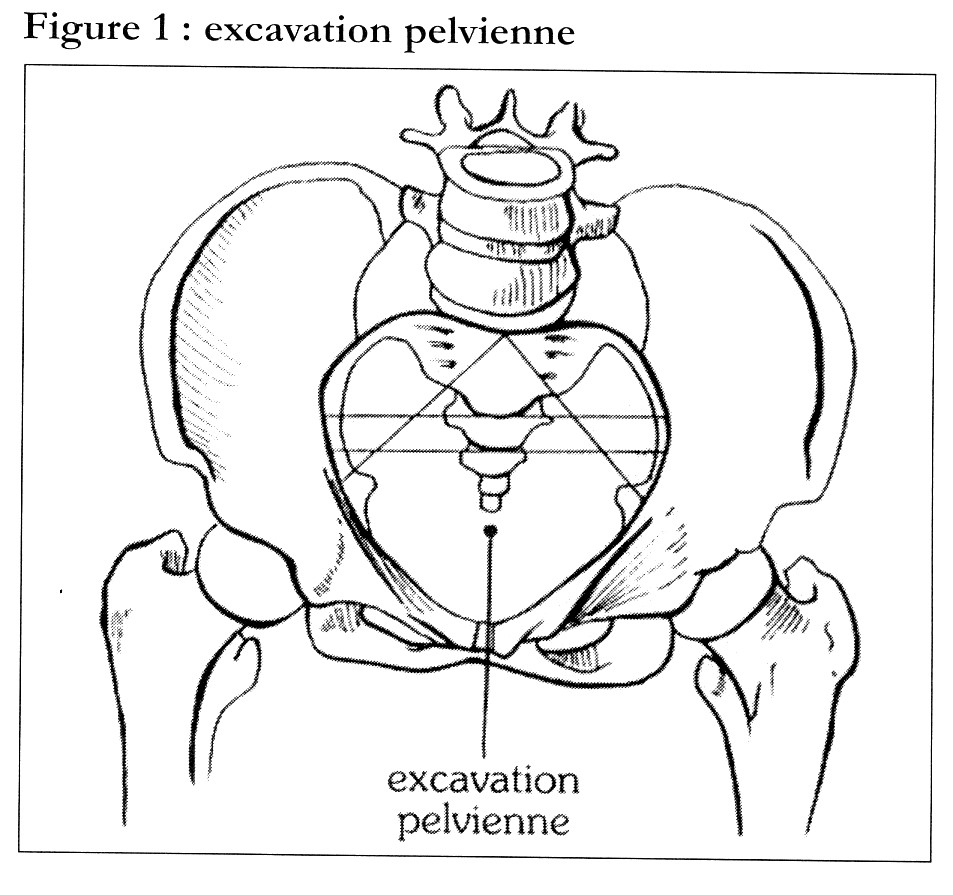
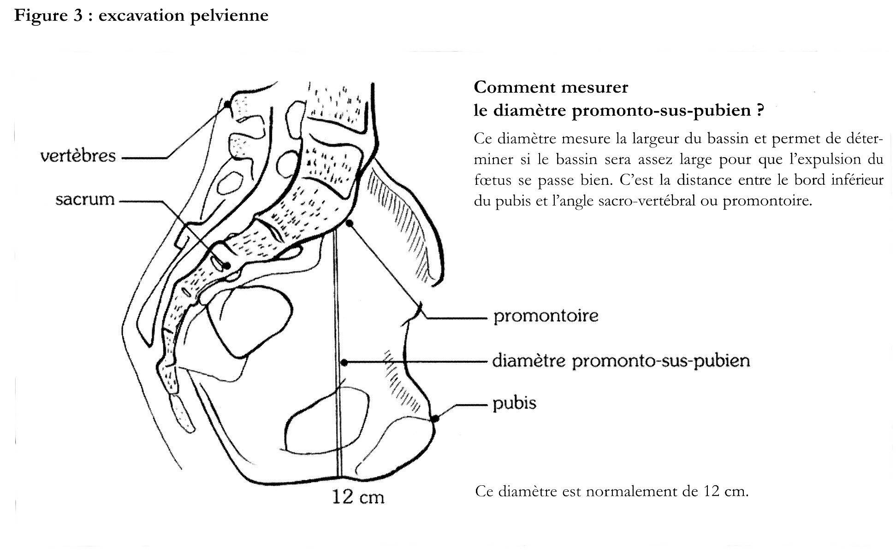
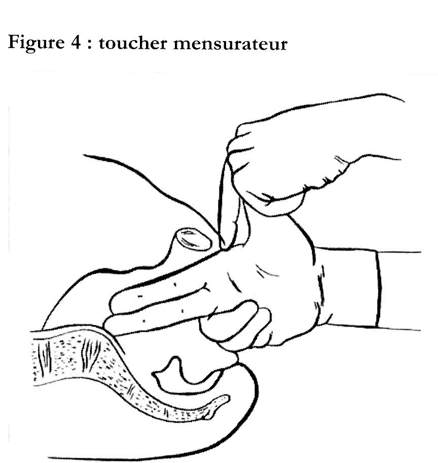

## I. Indications

Le déroulement d'un accouchement dépend de trois éléments :

*   un conduit fixe : la cavité pelvienne,
*   un mobile : le foetus,
*   une source d'énergie pour faire progresser ce mobile à l'intérieur du conduit : l'utérus qui se contracte.

Si l'un de ces trois éléments est anormal, l'accouchement sera difficile et une césarienne peut être nécessaire pour éviter de graves complications (souffrance foetale et mort de l'enfant, rupture utérine, etc...).

D'autre part, une surveillance attentive des femmes au cours de leur grossesse devrait permettre de poser les indications de césarienne avant l'accouchement, cela éviterait des événements souvent dramatiques.  
Certaines césariennes sont décidées avant le début du travail au cours d'un examen systématique pendant la grossesse. C'est le cas par exemple chez une jeune femme avec un bassin rétréci et déformé qui, manifestement, ne permettra pas l'accouchement par les voies naturelles. D'autre"s césariennes sont décidées au cours de l'accouchement, pendant le travail. De toute façon, il faut savoir se décider à temps avant que l'enfant ne présente des signes de souffrance fœtale. D'où l'importance des examens systématiques et d'une bonne surveillance au cours du travail.

Les principales indications d'une césarienne sont dues :

*   soit à un obstacle mécanique (dystocie mécanique) ;
*   soit à une anomalie de la contraction utérine (dystocie dynamique) 
*   soit au fœtus et à ses annexes;
*   soit à l'utérus et au périnée;
*   soit à l'association de la grossesse avec une maladie grave.

### 1. Dystocies mécaniques

#### a) Les bassins déformés et rétrécis

Normalement, une déformation ou un rétrécissement doivent être reconnus par le toucher mensurateur au cours des examens systématiques de la grossesse.  
Dans les rétrécissements prononcés (diamètre promontosus-pubien inférieur à 9,5 cm), la césarienne est décidée à l'avance et sera effectuée au terme de la grossesse, avant le début du travail.  
S'il s'agit d'un "bassin limite" (diamètre promonto-sus-pubien entre 9,5 et 10,5 cm), une courte épreuve du travail (essai d’accouchement par les voies naturelles dont le critère de réussite est l'enqagement franc de la tête fœtale) bien surveillée peut être tentée si l'on est dans un centre équipé pour faire des césariennes, sinon la femme doit être évacuée dans un tel centre.

#### b) Obstacle mécanique praevia

Fibrome ou kyste de l'ovaire volumineux, gênant le passage de l'enfant. Dans ce cas, la césarienne est suivie immédiatement de l'ablation de la tumeur, au cours de la même opération.

### 2. Anomalie de la contraction utérine ou de la dilatation du col

Parfois les contractions utérines sont insuffisantes, inefficaces, sans progression de la dilatation du col. Inversement, on voit parfois des contractions permanentes avec un utérus hypertonique. Là encore il faut savoir décider la césarienne à temps avant les signes de souffrance foetale.

### 3. Indications tenant au foetus et à ses annexes

#### a) Placenta praevia

L'insertion basse du placenta obstruant l'orifice du col fait obstacle à l'accouchement Dans ce cas, le placenta se décolle partiellement au fur et à mesure que le col se dilate, ce qui entraîne des hémorragies importantes et rapidement la mort de l'enfant. La césarienne est **très urgente** ; dans ce cas, il faut savoir le reconnaître précocement.

#### b) Procidence du cordon

Ici l'indication de césarienne est plus nuancée : il faut tenir compte du degré de dilatation du col, de l'état de l'enfant, du nombre d'accouchements. Par exemple, chez une primipare, avec un col un peu dilaté, un travail qui s'annonce long, il faut faire une césarienne d'urgence devant une procidence du cordon.

#### c) Présentation anormale de l'enfant

Le diagnostic de présentation doit être fait au début du travail.

*   une présentation du front, de l'épaule, imposent une césarienne rapide ;
*   dans une présentation du siège la césarienne ne doit pas être systématique. Souvent l'accouchement par le siège se passe très bien par les voies naturelles. Il faut tenir compte de différents facteurs pour décider une césarienne :
    *   bassin déformé ou limité,
    *   grosseur de l'enfant,
    *   primipare ou multipare ayant déjà accouché facilement, "enfant précieux" chez une femme ayant déjà perdu un ou plusieurs enfants lors des accouchements antérieurs.

#### d) Souffrance foetale au début du travail

Deux signes annoncent cette souffrance foetale :

*   liquide amniotique teinté de méconium,
*   modification des bruits du coeur de l'enfant.

Tout doit être prévu pour que le nouveau-né puisse recevoir dès sa naissance les soins de réanimation nécessaires. Toute prolongation du travail, quelle qu'en soit la cause, peut aboutir à une souffrance foetale.

### 4. Indications tenant à l'utérus et au périnée

Existence :

*   d'une rupture utérine antérieure,
*   d'une déchirure.grave du périnée, ou
*   d'une fistule vésico-vaginale réparéc chirurgicalement après un accouchement antérieur.

### 5. Association de la grossesse avec une maladie grave

*   **Toxémie gravidique** (éclampsie, hématome rétroplacentaire),
*   **Hypertension artérielle** par néphrite chronique,
*   **Cardiopathie cyanogène décompensée**.

La césarienne n'est possible que si l'enfant est vivant, avec des bruits de arur perceptibles. Si l'enfant est mort, i1 vaut mieux faire une embryotomie. On ne devrait pas faire de césarienne sur un enfant mort.

## II. Technique

Une césarienne est une intervention chirurgicale majeure et toutes les conditions de la chirurgie abdominale doivent être réunies pour pouvoir la pratiquer (aspiration, transfusion, réanimation, équipe chirurgicale).

L'anesthésie générale avec intubation sera commencée le plus tard possible pour éviter la dépression respiratoire du foutus. On peut également faire une rachi-anesthésie (injection dans le canal rachidien de quelques centimètrescubes de xylocaïne à 5 % ou de tétracaïne à 1 %) ou une anesthésie péridurale (injection de xylocaïne à 2 % dans l'espace situé autour de la dure mère, au contact des racines nerveuses lombaires). Cette dernière technique nécessite une équipe entraînée. L'incision de l'utérus sera toujours, si possible, segmentaire - c'est-à-dire transversale et basse (césarienne segmentaire).  
L'incision haute et longitudinale (césarienne corporéale) cicatrise beaucoup moins bien (risque de rupture utérine) et bien qu'elle soit plus rapide et plus facile, les chirurgiens doivent utiliser au maximum la première technique. L'extraction de l'enfant est faite avec douceur et le nouveau-né est confié tout de suite à une sage-femme qui pratiquera une désobstruction des voies respiratoires et une Oxygénation de l'enfant si cela est nécessaire.  
Puis le chirurgien décollera le placenta et suturera l'utérus avant de refermer le péritoine et la paroi abdominale.

## III. Problèmes particuliers

**Césariennes itératives**, c'est-à-dire successives.  
On peut effectuer deux ou trois césariennes chez la même personne sans difficulté. Souvent, la troisième césarienne faite, l'accoucheur estime préférable de stériliser la femme en sectionnant les trompes, si elle v consent. Mais cela ne doit pas être une règle absolue, si la femme le désire, on peut très bien pratiquer sans danger, quatre ou cinq césariennes chez la même personne.  

**Intervention associée**  
Dans certains cas, on peut après la césarienne, effectuer une intervention complémentaire :

*   ablation d'un myome utérin (myomectomie),
*   ablation d'un kyste de l'ovaire,
*   stérilisation tubaire par section des trompes, avec l'accord de l'intéressée et de son mari,
*   hystérectomie, très rarement, dans le cas de myomes utérins multiples ou pour une hémorragie incontrôlable.

## IV. Complications

Les complications des césariennes sont rares, si la technique du chirurgien et de l'anesthésiste sont bonnes et si les conditions matérielles de travail sont convenables. Cependant, on peut voir quelquefois :

### 1) Des hémorragies utérines

Surtout en cas de déchirure d'une grosse veine. La suture utérine bien faite doit en venir à bout. Parfois, l'utérus saigne parce qu'il reste atone et ne se contracte pas; l'injection de méthylergométrine obtient généralement une contraction utérine suffisante. Il est rare que la persistance d'une hémorragie oblige à pratiquer une hystérectomie d'hémostase.

Cliniquement, on peut l'apprécier au cours du toucher vaginal qui fait partie de tout examen systématique au cours de la grossesse. Pour que l'avant-bras et la main de l'examinateur restent dans le même axe, le coude doit reposer sur le plan du lit ; le doigt suit d'abord la face postérieure du vagin, reconnait la face antérieure de la dernière vertèbre sacrée et remonte vers le haut. Normalement le contact osseux ne peut être maintenu sur le 1/3 supérieur du sacrum et le promontoire reste inaccessible.  
Si le promontoire est accessible, il faut mesurer le diamètre antéro-postérieur. Pour cela, le médius prend contact avec le promontoire et le bord externe de l'index avec le bord inférieur de la symphyse pelvienne. Une marque au stylo à bille est faite sur l'index à ce point de contact. Il suffit alors de mesurer la distance qui sépare cette marque de l'extrémité du médius retiré des voies génitales.

### 2) Des complications infectieuses

Rarement maintenant depuis l'utilisation des antibiotiques. La prescription des antibiotiques est obligatoire  
s'il y a eu plus de huit heures entre la rupture des membranes et l'intervention.

### 3) Des phlébites et des embolies pulmonaires

Elles sont traitées par les anticoagulants.

### 4) La désunion spontanée

La désunion spontanée de la suture utérine lors d'un accouchement ultérieur est devenue très rare après une césarienne basse segmentaire bien exécutée. Ces différents risques impliquent une surveillance rigoureuse de toute femme ayant subi une césarienne.

## V. En conclusion

La césarienne n'est pas une opération anodine, on doit apporter dans son indication, sa préparation et son exécution, beaucoup de soins et une technique irréprochable.

_Développement et Santé, n°197/198, 2010_