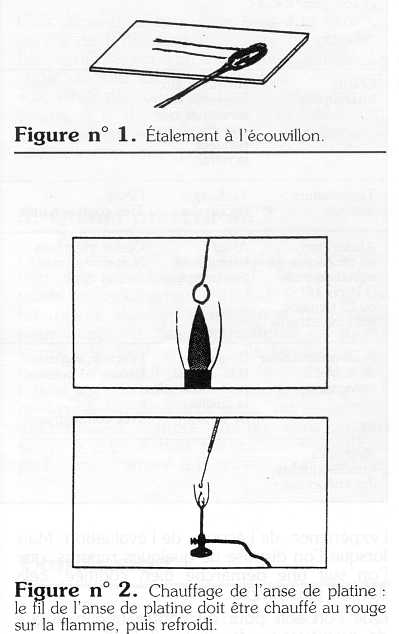
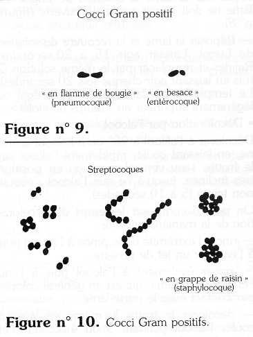
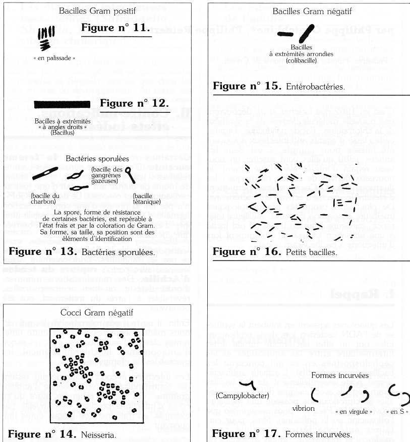

Les techniques de coloration sont utilisées pour l'examen direct des produits pathologiques puis pour l'identification des colonies obtenues après mise en culture de ces produits pathologiques.  
La réalisation de frottis de bonne qualité est une condition préalable à toute coloration.

## I. Réalisation des frottis

Ils doivent être réalisés le plus rapidement possible après le prélèvement.  
Les frottis doivent être étalés en couche mince et régulière, puis séchés et fixés.

### 1. Etalement

Les lames doivent être parfaitement propres et dégraissées.

_Étalement à partir de produits pathologiques_

On utilise, selon les cas :

*   un écouvillon _(figure n° 1)_ ;
*   une pipette ;

*   ou une anse de platine (fil de métal fixé à un porte-fil et ayant la forme d'une boucle d'environ 2 millimètres de diamètre). Dans ce cas, le fil doit être chauffé au rouge sur une flamme _(figure n° 2),_ puis parfaitement refroidi avant le prélèvement.

L'étalement doit être aussi mince que possible : la dilution des produits épais peut parfois s'avérer nécessaire.

*   Lorsqu'il s'agit d'un liquide (urines, ascite, liquide pleural ... ), on effectue les frottis à partir de culots de centrifugation.

_Étalement à partir de milieux de culture_

On étale les gouttes de suspension bactérienne en un film mince et régulier :

*   soit par un mouvement régulier et circulaire à l'aide d'une anse de platine, en décrivant des spirales partant du centre vers l'extérieur, pour obtenir un étalement de 2 à 3 cm de diamètre _(figure_ _n° 3) ;_
*   soit en tirant de façon uniforme l'effilure d'une pipette Pasteur _(figure n° 4)._

### 2. Séchage

Le séchage de la lame doit se faire autant que possible à la température du laboratoire.

*   Il peut éventuellement s'effectuer en posant la lame sur une platine chauffante réglée à 37°, ou en la maintenant dans l'air chaud au-dessus de la veilleuse d'un bec Bunsen _(figure n° 5)._
*   Il faut éviter un séchage trop brutal, à une température trop élevée (altération de certains constituants, en particulier la paroi bactérienne).

### **3. Fixation de la préparation**

La fixation doit s'effectuer sur une préparation sèche.

Plusieurs méthodes peuvent être utilisées :

_Fixation par l'alcool flambé_

C'est la technique la plus utilisée mais elle doit être réservée aux cultures bactériennes. Il est prudent de mettre au préalable de l'eau au fond de la cuve de coloration.

Recouvrir la lame d'alcool à 95°, laisser quelques secondes de contact, égoutter, puis enflammer l'alcool restant. Laisser refroidir.

**_Fixation par la chaleur_**

Cette technique est également réservée aux cultures bactériennes.

La lame séchée, frottis sur le dessus, tenue par une pince, est passée dans une flamme. Le geste doit être lent et la lame doit écraser 3 ou 4 fois la flamme _(figure_ _n° 6)._

**_Fixation à l'alcool_**

Ce procédé de fixation peut être employé quel que soit le produit traité.

On peut utiliser :

- l'alcool méthylique absolu (recommandé pour les produits pathologiques),

- l'alcool éthylique absolu ou à 95°,

- ou l'alcool-éther (mélange à parties égales).

Les préparations chargées en graisses pourront être lavées au xylol avant d'être colorées. Ce traitement doit être précédé et suivi de rinçages à l'alcool.

Quelle que soit la technique de fixation employée, la lame doit être rincée à l'eau distillée, égouttée et séchée avant d'être colorée.

## **II. Colorations usuelles**

La coloration la plus informative est la coloration de Gram. Dans le cas ou les réactifs nécessaires ne seraient pas disponibles, une coloration au bleu de méthylène peut apporter des informations concernant la morphologie des germes.

**Coloration au bleu de méthylène**

_Préparation du bleu phéniqué (de_ " _Kühne ")_

Dans un mortier, broyer et mélanger :

- bleu de méthylène

(pour microbiologie) 20 g

- acide phénique 20 g

- alcool à 95° 100 ml

Reprendre par 100 à 200 ml d'eau distillée :

- laisser reposer 24 heures,

- compléter à 1 000 ml,

- filtrer,

- conserver en flacon bouché,

- filtrer à nouveau avant l'emploi.

**_Technique de coloration_**

Sur le frottis fixé et refroidi :

- Faire couler la solution de bleu de méthylène phéniqué jusqu'à ce que toute la lame soit recouverte.

- Laisser agir 1 minute.

- Rincer abondamment la lame avec le jet d'une pissette d'eau distillée, ou à l'eau du robinet jusqu'à élimination des colorants en excès.

- Sécher à l'air ou sur une platine chauffante, ou encore sécher délicatement entre deux feuilles de papier filtre fin (ou buvard), sans frotter.

- Examiner au microscope, objectif à immersion.

**_Résultats_**

Les bactéries sont colorées en bleu sombre.

Cette coloration est intéressante pour l'observation rapide des frottis mais elle permet seulement l'étude de la morphologie des bactéries.

Il est donc souvent nécessaire de la compléter par une coloration de Gram, que l'on peut compléter par une coloration de May-Grünwald-Giemsa pour la reconnaissance des éléments cellulaires.

**Coloration de Gram**

C'est la coloration de base en bactériologie.

Cette coloration permet de différencier les bactéries selon deux critères :

- leur forme,

- leur affinité pour les colorants.

Principe :

- les bactéries sont imprégnées par une première solution colorante, le violet de gentiane,

- puis elles sont fixées par un mordant, la solution de Lugol (solution d'iode dans l'iodure de potassium).

On fait ensuite agir un décolorant (alcool le plus souvent).

Suivant la composition de leur paroi :

- certaines bactéries résistent à cette décoloration et apparaissent colorées en violet elles sont dites Gram positif.

- d'autres bactéries ne résistent pas et ne sont plus visibles. On doit donc utiliser un deuxième colorant de teinte contrastante (fuchsine, ou safranine, colorants rouges). Ces bactéries apparaissent alors colorées en rose, elles sont dites Gram négatif.

### **1. Coloration classique de Gram**

Préparation des réactifs

*   Violet de gentiane phéniqué

Broyer et mélanger dans un mortier :

- violet de Gentiane 1 g

- acide phénique cristallisé 2 g

- alcool à 95° 10 ml

Quand le mélange est bien homogène, rincer le mortier avec 100 ml d'eau distillée chaude.

- Laisser reposer 24 heures à 37 °C.

- Filtrer.

- Conserver quelques jours avant l'emploi.

- Filtrer avant chaque utilisation.

Les solutions de violet de gentiane ont tendance à précipiter, aussi plusieurs variantes de la formule classique peuvent être utilisées (_cf. plus loin_).

*   Solution de Lugol (ou liquide de Gram)

Formule :

- iode 1 g

- iodure de potassium 2 g

- eau distillée qs 200 ml

Dissoudre l'iodure dans quelques millilitres d'eau distillée.

Puis dissoudre l'iode dans cette solution d'iodure concentrée.

Compléter ensuite au volume d'eau nécessaire.

*   Fuchsine phéniquée de Ziehl

Broyer dans un mortier :

- fuchsine basique 1 g

- acide phénique cristallisé 5 g

- alcool à 95° 10 ml

Reprendre par 10 ou 20 ml d'eau distillée chaude.

Laisser reposer 24 heures.

Compléter à 100 ml.

Filtrer et conserver en flacon bouché.

Filtrer à nouveau avant l'emploi.

Avant utilisation, diluer la fuchsine au 1/10 :

attention cette dilution ne se conserve pas et doit être effectuée extemporanément.

### **2. Technique de coloration**

Le frottis doit être parfaitement refroidi

*   Coloration par le violet

- Recouvrir totalement la lame avec le violet de Gentiane soigneusement filtré en versant de préférence le colorant à partir d'une extrémité de la lame _(figure n° 7)._

- Laisser agir 20 secondes à 1 minute selon la force du colorant utilisé.

*   Mordançage

- Prendre la lame avec une pince et l'incliner légèrement.

- Éliminer le violet de gentiane en faisant couler sur la lame la solution de Lugol. La lame ne doit jamais rester découverte _(figure_ _n° 8)._

- Reposer la lame et la recouvrir de solution de Lugol. Laisser agir 15 à 20 secondes. Rejeter et remplacer par la même solution (2 fois en laissant agir chaque fois 20 secondes). Le temps de mordançage doit être égal ou légèrement supérieur au " temps de violet ".

*   Décoloration par l'alcool

Décolorer à l'alcool à 95° ou à l'alcool-acétone, en laissant couler rapidement l'alcool sur le frottis, tenu verticalement ou en position très inclinée, jusqu'à ce que l'alcool s'écoule non teinté (5 à 10 secondes).

On peut décomposer le temps de décoloration de la manière suivante :

- rincer l'extrémité de la pince à l'alcool puis à l'eau par un jet de pissette,

- rincer également à l'alcool puis à l'eau l'envers de la lame, qui est en général colorée par contact avec le porte-lame,

- décolorer le frottis lui-même en laissant couler l'alcool pendant 3 ou 4 secondes et rincer immédiatement,

- vérifier la décoloration en versant quelques gouttes d'alcool sur le frottis, aucune trace de colorant ne doit être entraînée. Rincer aussitôt à l'eau.

*   Recoloration par la fuchsine

Recouvrir la lame d'eau et verser quelques gouttes de fuchsine à chaque extrémité du frottis. Ne jamais verser la fuchsine directement sur le frottis (risques de dépôts, de coloration trop intense).

On peut préparer, juste avant l'emploi, une dilution de fuchsine au 1/10e dans un tube à essai et verser le colorant ainsi dilué sur la lame.

Laisser la fuchsine 10 à 20 secondes.

*   Rinçage et séchage

Rincer à l'eau et sécher entre deux feuilles de papier filtre ou à la chaleur sur platine chauffante.

**Gram-standard " américain " ou Gram Hucker**

### **1. Préparation des réactifs**

*   Violet-cristal oxalaté

_Solution A_ :

solution alcoolique saturée et filtrée de violet-cristal

- cristal violet 2 g

- alcool à 95° 20 ml

Mélanger et dissoudre.

_Solution B :_

- oxalate d'ammonium

(NH4)2C2O4H2O 0,8 g

- eau distillée 80 ml

Mélanger 20 ml de solution A avec 80 ml de solution B.

*   Solution de Lugol (_cf_. _supra)_
*   Safranine

- solution alcoolique (alcool à 90°)

saturée et filtrée de safranine 20 ml

- eau distillée 80 ml

### **2. Technique de coloration**

*   Coloration par le violet :

- Laisser la solution sur la lame pendant 1 minute.

- Rincer à l'eau.

*   Mordançage

- Laisser le Lugol pendant 1 minute.

- Rincer à l'eau.

*   Décoloration

- Laisser l'alcool pendant 30 secondes. Si la coloration reste violette, remettre de l'alcool pendant 30 secondes.

- Rincer à l'eau.

*   Recoloration

- Laisser la safranine 30 à 40 secondes selon l'épaisseur du frottis.

- Rincer et sécher.

**Observation des frottis**

Elle s'effectue au microscope, objectif à immersion, quand les frottis colorés sont bien secs.

À noter :

Les quantités indiquées doivent être adaptées en fonction du nombre de frottis à colorer. Les différents réactifs doivent être conservés entre 18 et 25 °C, à l'abri de la lumière (colorants dans des flacons teintés).

**Résultats**

La coloration de Gram permet de classer les bactéries en deux grandes catégories :

- les bactéries Gram positif qui gardent leur coloration violette après décoloration par l'alcool,

- les bactéries Gram négatif qui, décolorées par l'alcool, sont teintées par la fuchsine et apparaissent roses ou rouges.

Cette distinction est fondamentale car elle permet de classer les bactéries.

Il faut cependant savoir que la coloration de Gram peut être variable pour une même espèce (par exemple, le pneumocoque se décolore facilement, de même, certaines bactéries Gram positif quand les colonies sont âgées).

Certaines bactéries sont même dites " Gram faible " ou " Gram variable " (ex. : corynébactéries).

## **III. Description de la morphologie bactérienne après coloration**

Selon la forme, on peut distinguer :

*   Les cocci Gram positif

Ils peuvent être isolés ou regroupés :

- diplocoques (ex. : pneumocoques " en flamme de bougie " ou entérocoques , en besace ")

_(figure n°_ 9),

- en chaînettes (streptocoques),

- en tétrades (sarcine),

- en amas ou " grappes de raisin" (staphylocoques) _(figure n° 10)._

*   Les bacilles Gram positif, de taille variable : petits, isolés ou regroupés en palissade comme les corynébactéries _(figure n° 11)_ ; ou plus grand : _Bacillus (figure_ _n° 12)_ ou Clostridium aux extrémités plus arrondies, parfois sporulés _(figure_ _n° 13)._
*   Les cocci Gram négatif pouvant être regroupés en " grain de café " _(Neisseria,_ _figure n° 14)._

*   Les bacilles Gram négatif avec un renforcement bipolaire de la coloration (entérobactéries, _figure n° 15),_

ou assez fins _(Pseudomonas),_

ou encore bacilles plus petits (comme _Haemophilus_ _ou Bacteroïdes) (figure_ _n° 16)._

Les bacilles peuvent être également incurvés (vibrion) ou très fins en forme de " moustache " ou " de vol d'oiseaux " (_Campylobacter) (figure n_° _17)._

### **Conclusion**

Les colorations usuelles et en particulier la coloration de Gram constituent un élément essentiel en bactériologie, permettant d'orienter et/ou de confirmer un diagnostic, afin d'adapter au mieux un traitement efficace.

(Schémas extraits du _Manuel des techniques_ _de base_ pour _le laboratoire médical,_ Organisation Mondiale de la Santé, Genève.)

_Développement et Santé, n°127, février 1997_