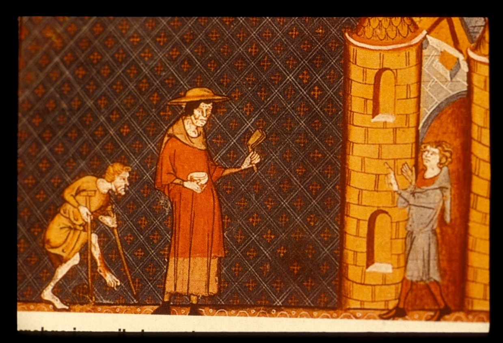
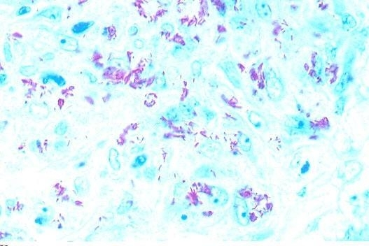
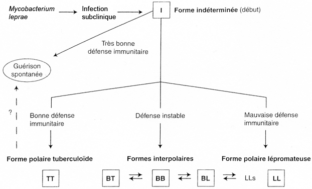
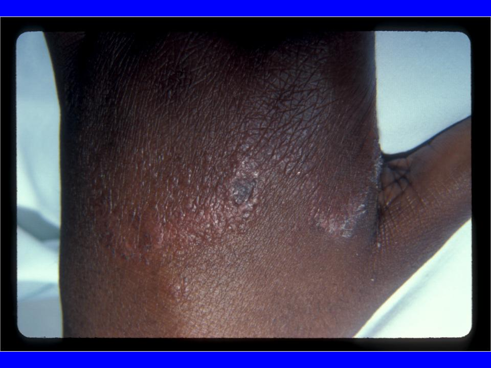
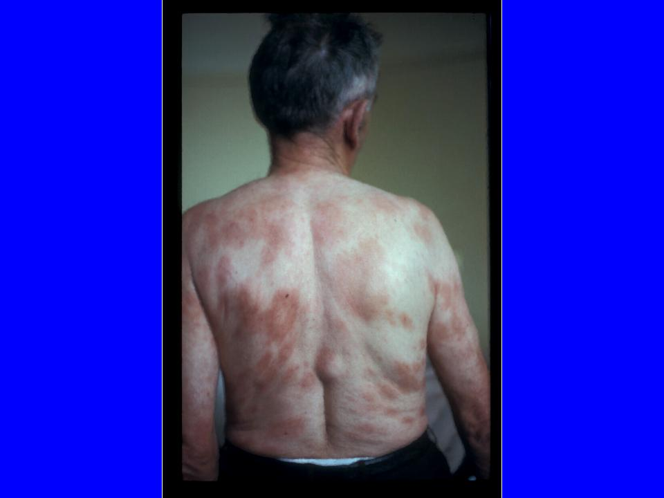
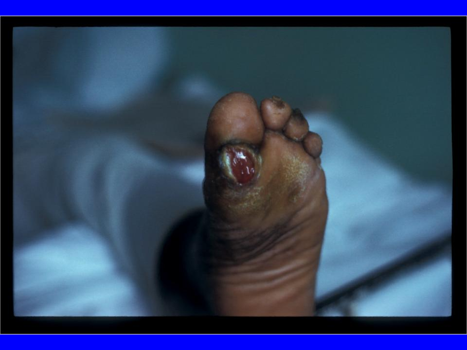
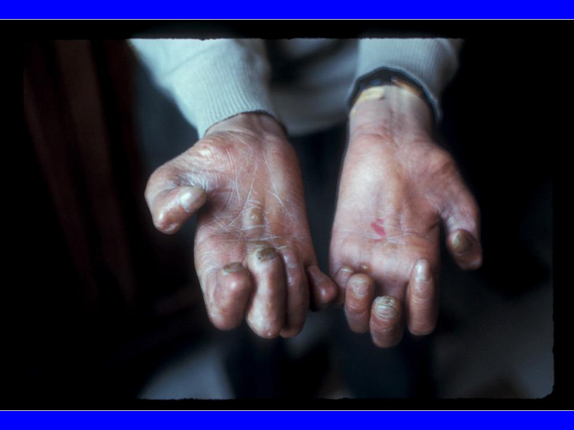
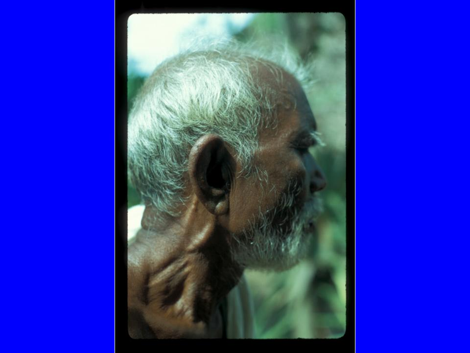
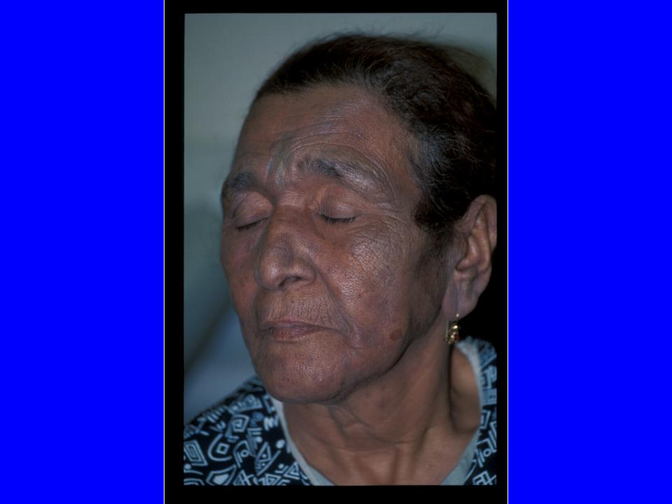
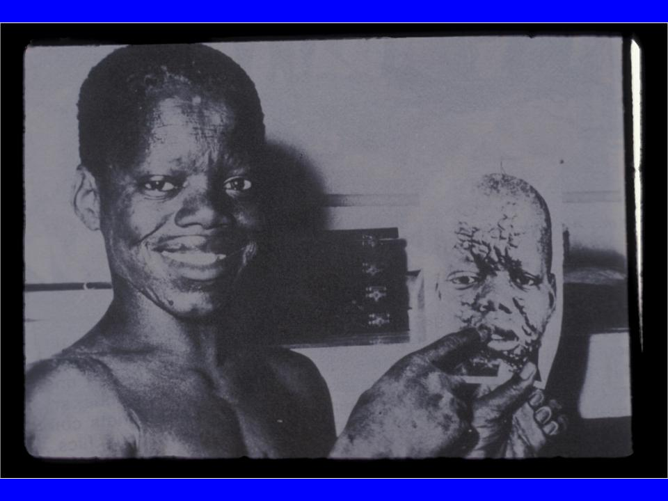

Quand faut-il évoquer le diagnostic de lèpre ?  La lèpre est en nette régression dans le monde, mais reste toujours présente dans les pays tropicaux. Aussi est-il important de faire le diagnostic pour mettre en route un traitement rapide afin d’en éviter les complications, en particulier les amputations.

La lèpre, ou maladie de Hansen, seconde mycobactériose mondiale après la tuberculose, est connue depuis l’antiquité et a traversé les siècles, en provoquant des sentiments de peur avec des mesures d’exclusion sociale. Les lépreux étaient exclus des villes et quand ils y revenaient, ils devaient signaler leur présence avec une crécelle (figure 1). En effet, à l’époque des croisades, le lépreux était considéré, comme impur mais craint, car revenant des lieux saints, il représentait l’image vivante du Christ souffrant. La prévalence de la lèpre a considérablement régressé depuis une vingtaine d’années, grâce à la polychimiothérapie, qui est rapidement efficace avec néanmoins le risque de réactions secondaires parfois handicapantes.

## I. Epidémiologie : nette régression

La lèpre est connue depuis l’Antiquité, les premières descriptions datant de 600 ans avant JC en Chine, en Egypte et en Inde. Autrefois cosmopolite, la lèpre a quasiment disparu des pays industrialisés, mais persiste encore dans les zones tropicales dans 127 pays d’Afrique, d’Amérique latine et d’Asie (Tableau I) mais 94 % des cas sont concentrés dans 17 pays, et tout particulièrement en Inde, en Indonésie et au Brésil.

<table>
<caption>Tableau I. Répartition des lépreux dans le monde en 2011</caption>

<tbody>

<tr>

<th scope="col">  
Région</th>

<th scope="col">Nombre de cas  
(prévalence  
pour 10 000 hab.)</th>

<th scope="col">Nouveaux cas en 2010  
(incidence  
pour 100 000 hab.)</th>

</tr>

<tr>

<td>Afrique</td>

<td>27 000             (0,38)</td>

<td>5 345         (3,53)</td>

</tr>

<tr>

<td>Amérique</td>

<td>33 953             (0,38)</td>

<td>37 740         (4,25)</td>

</tr>

<tr>

<td>Asie du sud-est</td>

<td>113 750             (0,64)</td>

<td>156 254         (8,77)</td>

</tr>

<tr>

<td>Méditerranée orientale</td>

<td>9 046               (0,17)</td>

<td>4 080         (0,67)</td>

</tr>

<tr>

<td>Pacifique</td>

<td>8 386                (0,05)</td>

<td>5 055         (0,28)</td>

</tr>

<tr>

<td>Total</td>

<td>192 246                (0,34)</td>

<td>228 474        (3,93)</td>

</tr>

</tbody>

</table>

En 1990, l’OMS avait annoncé l’élimination de la lèpre en tant que problème de santé publique en 2000, en cherchant à obtenir une prévalence inférieure à 1 cas pour 100 000 habitants. En Europe, environ une quinzaine de cas sont détectés chaque année chez des sujets originaires des zones tropicales, y compris des DOM-TOM, où la prévalence est très élevée et  atteint 6,2 pour 10 000 habitants à Mayotte.

La lèpre peut atteindre tous les âges, avec une prévalence variant de 0,3 % à 38 % chez les enfants selon les pays, et un sex-ratio H/F de 2/1. Le réservoir de *Mycobatérium leprae* est le patient lépromateux qui excrète des bacilles dans les sécrétions nasales, le lait, les selles. La pénétration du bacille s’effectuerait essentiellement par les voies aériennes supérieures et éventuellement par effractions cutanées. Le risque de contamination est multiplié par 8 en cas de contact proche avec un sujet lépromateux. La physiopathologie d’un individu en contact avec  
*M. leprae* dépend de sa réponse immunitaire à médiation cellulaire, ce qui va orienter vers la forme clinique. En effet, la maladie va apparaître chez seulement 5 % des sujets, dont 40 % sous forme lépromateuse, en cas de faible immunité et 60 % sous forme tuberculoïde en cas de bonne immunité.

*Mycobacterium leprae,* ou bacille de Hansen\_,\_ est un bacille intra-cellulaire, acido-alcoolo-résistant, à multiplication lente, qui ne se cultive pas *in vitro*. Dans un frottis de sérosité dermique, ces bacilles apparaissent sous forme de bâtonnets de couleur rouge foncé, mesurant de 1 à 8 x 0,3 microns, isolés ou en amas ou «globi» (figure 2).  L’étude génétique a montré que 90 % des gènes sont communs à *Mycobacterium tuberculosis* et *M. leprae*, seuls 10 % des gènes étant propres à ce dernier. Les techniques actuelles de PCR permettent non seulement de détecter les *M. leprae* mais aussi de tester leur résistance aux différents traitements.

**Figure 2. *Mycobacterium leprae* en globi**

## II.  Formes cliniques : atteintes cutanées

La lèpre peut se manifester sous deux formes dites « polaires », tuberculoïde et lépromateuse avec de nombreuses formes de transition, instables ou «borderline» (figure.3).

**Figure 3. Classification de Ridley et Joppling**  
(TT : lèpre tuberculoïde ;BT : l. borderline ; BB : l. borderline borderline ; BL : l. borderline lépromateuse ;  LLs : l. lépromateuse subpolaire ;  LL: l. lépromateuse)

#### La lèpre indéterminée

Elle correspond au stade initial de la maladie, se constate surtout chez l’enfant et se manifeste par une tache cutanée légèrement hypochromique, de quelques centimètres de diamètre, à limites floues, avec de très légers troubles de la sensibilité. Cette lésion  soit disparaît spontanément dans la majorité des cas, soit peut évoluer vers une des formes polaires.

#### La lèpre tuberculoïde

Elle se manifeste par quelques lésions cutanées maculeuses, mesurant  plusieurs centimètres de diamètre, hypochromique avec des limites nettes et de répartition asymétrique (figure 4). Il peut s’agir aussi de lésions plus grandes, en relief, infiltrées en bordure ou en totalité, mais toujours anesthésiques. Ces lésions disparaissent sans cicatrice avec un  traitement précoce.

**Figure 4. Plaque de lèpre tuberculoïde**

#### La lèpre lépromateuse

Elle peut aussi se manifester sous forme de lésions maculeuses de petite taille légèrement hypochromiques ou érythémateuses, à limites floues. Ces macules peuvent être infiltrées en totalité pour former des lépromes de teinte cuivrée ou seulement en bordure donnant un aspect annulaire, mal limité, de 5 à 10 centimètres de diamètre (figure 5). Ces lésions sont nombreuses (plusieurs dizaines), avec une disposition bilatérale et symétrique, souvent au niveau du lobule des oreilles, des doigts et des orteils et ne sont pas anesthésiques. Une alopécie de la queue des sourcils est constatée dans les formes avancées. Là encore, ces lésions disparaissent sans cicatrice sous l’effet du traitement.

**Figure 5. Lèpre lépromateuse**

#### Les formes "borderline"

Ce sont des formes de transition. La **forme borderline tuberculoïde (BT)** comprend quelques lésions de grande taille (de 5 à 20 cm, voire plus), maculeuses ou infiltrées en périphérique, asymétriques et hypoesthésiques avec des lésions plus petites à proximité. La **forme borderline borderline (BB)** se caractérise par la présence de plusieurs lésions de type annulaire, de 5 à 10 cm de diamètre, mal limitées et sans anesthésie. La **forme borderline lépromateuse** **(BL)** comprend plus d’une dizaine de lépromes et de lésions annulaires, bilatérales, non anesthésiques.

L’atteinte neurologique est constante dans toutes les formes de lèpre. Quelques nerfs sont sévèrement touchés, de façon asymétrique au cours de la forme tuberculoïde. Le patient se plaint d’engourdissement, d’anesthésie de la région du nerf atteint, réalisant une anesthésie en «gant» ou en «chaussette». Cette disparition de la sensibilité cutanée est responsable  des troubles trophiques, comme le mal perforant plantaire (figure 6). Les paralysies entraînent un steppage du pied et des déformations des mains et des pieds (main de singe, griffe cubitale (figure 7), orteils en marteau). Au contraire, au cours de la lèpre lépromateuse, de nombreux nerfs sont touchés, de façon bilatérale et symétrique, en particulier les nerf cubital, radial, médian, sciatique poplité externe, tibial postérieur ainsi que le plexus cervical superficiel (figure 8).

**Figure 6. Mal perforant plantaire                         Figure 7. Griffe cubitale**

  
                  

**Figure 8. Plexus cervical hypertrophié**

Les autres organes sont surtout atteints dans la forme lépromateuse. Une rhinite séreuse puis muco-purulente peut évoluer vers une rhinite atrophique puis une fonte des os propres du nez, donnant l’image de la racine du nez en «coup de hache» (figure 9).

**Figure 9. Destruction de la cloison nasale en coup de hache**

Des arthralgies sont fréquentes dans la forme lépromateuse, mais surtout au cours des états réactionnels. L’atteinte osseuse provoque, chez le sujet lépromateux, des lyses des phalanges. Dans les deux formes, les lésions vasculaires, plus fréquentes, provoquent une ostéoporose diffuse et des ostéolyses «en sucre d’orge sucé», évoluant vers une amputation des doigts et des orteils.

## III. Etats réactionnels

La lèpre évolue insidieusement, mais peuvent survenir des réactions importantes sous l’influence d’un traitement ou même de façon spontanée. Il y a deux types de réactions :

### 1. La réaction de réversion, ou réaction de type 1 

Elle est due à un phénomène d’hypersensibilité retardée renforçant l’immunité à médiation cellulaire. Elle n’est constatée que chez les patients borderline qu’elle déplace vers le pôle tuberculoïde. Elle atteint  de 15 % à 45 % de ces patients, principalement dans les premiers mois du traitement. Elle se manifeste brutalement par une turgescence des lésions déjà connues qui peuvent s’ulcérer, des arthralgies et surtout une névrite aigue, hypertrophique et douloureuse, entraînant une paralysie et une anesthésie des territoires concernés. La réaction de réversion tardive, apparaît chez 10% à 45% des patients dans les mois ou années après l’arrêt du traitement et posent un problème de diagnostic différentiel avec une rechute.

### 2. L’érythème noueux lépreux, ou réaction de type 2

Il est observé chez 50 % des patients lépromateux. Il apparaît en début de traitement et évolue par poussées en relation avec une infection  intercurrente ou une grossesse. Les symptômes seraient dus à une élévation du *Tumor Necrosis Factor* α dans le sérum. Le patient présente une fièvre, une altération de l’état général, des arthralgies, des polyadénopathies, une névrite aigue et des nodules hypodermiques chauds, douloureux et de couleur violacée.

## IV. Diagnostic : mise en évidence du bacille

La lèpre est affirmée par la mise en évidence des bacilles de Hansen dans le suc dermique prélevé au niveau du lobule de l’oreille ou des lésions cutanées et non plus dans le mucus nasal, considéré comme moins fiable. L’étude des frottis, colorés par le Ziehl-Neelsen, permet de détecter les bacilles et de déterminer les index bactériologique (IB = nombre de bacilles par champ) et morphologique (IM= pourcentage de bacilles entiers vu pour 100 bacilles). L’IB est évalué de 1+ (1 à 10 bacilles/ 100 champs) à 6+ (> 1000 bacilles /champ). Par ailleurs, l’étude d’une biopsie cutanée confirme l’aspect anatomo-pathologique :

### 1. Forme tuberculoïde

- IB  négatif ou 1+, IM négatif
- Infiltrat histiolymphocytaire à localisation périannexielle et  périnerveuse, avec infiltration voire destruction des filets nerveux et des glandes sudorales.

### 2. Forme lépromateuse

- IB positif, > 2+, bacilles regroupés en globi, IM positif (1 à 30%)
- Infiltrat dense, histiolymphocytaire, avec des cellules à cytoplasme  spumeux (cellules de Virchow) à localisation péricapillaire, périannexielle et périnerveuse, mais sans les envahir et séparé du derme par la bande claire de Unna. 

## V. Traitement : une polychimiothérapie efficace

Depuis 1998, la polychimiothérapie préconisée par l’OMS, comprend la rifampicine, la dapsone et/ou la clofazimine pour éviter l’apparition de résistance aux bacilles. La clofazimine provoque une coloration violacée de la peau, dont il faut prévenir le malade (figure 10).

**Figure 10. Coloration violacée de la peau due à la clofazimine**

La polychimiothérapie est basée sur la répartition des patients en deux groupes  (tableau II): les paucibacillaires (PB) et les multibacillaires (MB), définis de la façon suivante :

- Sujets paucibacillaires :  IB négatif, ou patients ayant moins de 5 lésions cliniques, maculeuses ou infiltrées, asymétriques, avec une seule atteinte nerveuse
- Sujets multibacillaires : IB positif (de 1+ à 6+), ou patients ayant au minimum 5 lésions hypoesthésiques, symétriques, avec atteinte de plusieurs nerfs. Les résultats sont spectaculaires, comme le prouve ce jeune patient en montrant la différence avec sa photo avant le traitement (figure 11). 

<table>
<caption>Tableau II. Polychimiothérapie de la lèpre chez l'adulte (OMS)</caption>

<thead>

<tr>

<th scope="col">Classification</th>

<th scope="col">Produits</th>

<th scope="col">Posologie</th>

<th scope="col">Durée</th>

</tr>

</thead>

<tbody>

<tr>

<td>Lèpre PB</td>

<td>

Rifampicine

et dapsone

</td>

<td>

600 mg  1 fois/mois supervisée

100 mg/jour

</td>

<td>6 mois</td>

</tr>

<tr>

<td>Lèpre MB</td>

<td>

Rifampicine et 

clofazimine

et dapsone

</td>

<td>

600 mg   1 fois/mois supervisée

300 mg    1 fois/mois supervisée

100 mg/jour

</td>

<td>12 à 24 mois</td>

</tr>

</tbody>

</table>

**Figure 11. Nette amélioration de l'aspect d'un patient lépromateux,  
avant et après le traitement**

En cas de lèpre paucibacillaire à lésion unique, on peut envisager le traitement ROM (rifampicine, oxfloxacine, monocycline)  en une prise mensuelle pendant 6 mois (formes PB) à 24 mois (formes MB). D’autres antibiotiques sont à l’étude.

Le traitement des états réactionnels nécessite de maintenir la thérapeutique en cours. En cas de réaction de réversion, une hospitalisation en urgence s’impose, car une névrite aigue déficitaire peut apparaître rapidement et justifie une corticothérapie (0,5 à 1mg/kg/j) pendant 6 mois, ou un anti-inflammatoire non stéroïdien, ou encore la cyclosporine (5 à 7mg/kg) en cas de réaction sévère. En cas d’érythème noueux lépreux, le produit le plus efficace est la thalidomide (400mg/j/3 mois) (avec une contraception indispensable). 

La prophylaxie est difficile. L’isolement des patients est inutile en raison de la très longue incubation de la maladie et de l’efficacité de la rifampicine. Il n’existe pas de chimioprophylaxie. Malgré les progrès réalisés concernant le diagnostic et le traitement, la lèpre reste encore une affection répandue dans le monde tropical et entraîne toujours une certaine méfiance pour l’entourage, témoignant de la persistance des mœurs ancestrales. Aussi est -il important de penser à la lèpre devant toute lésion cutanée hypoesthésique.

<table>

<thead>

<tr>

<th scope="col">En pratique</th>

</tr>

</thead>

<tbody>

<tr>

<td>

Devant toute lésion hypochromique, il faut systématiquement penser à la lèpre. Parfois, les lésions peuvent présenter une couleur différente de la peau (roses, violacées) sans être vraiment hypochromiques. Les lésions lépreuses sont peu nombreuses, non squameuses, en général sèches.

Il faut systématiquement tester la sensibilité de toute tache cutanée. Pour cela, il faut demander au sujet de fermer les yeux et piquer avec une aiguille la zone suspecte : si le malade ne sent  rien ou ne sent que le contact, le diagnostic de lèpre doit être envisagé.

Parfois le diagnostic peut être envisagé chez un sujet qui présente des cicatrices de brûlures ou autres traumatismes au niveau des mains. Dans la forme multibacillaire, plus rare, le patient a en plus des nodules.

Pour confirmer le diagnostic, un prélèvement de mucus nasal ou de suc dermique au niveau du lobe de l’oreille doit être effectué pour être coloré et rechercher les bacilles de Hansen. Cet examen se pratique dans des centres spécialisés ou des laboratoires généralistes. Vous devez donc référer votre patient à ce centre et, pour cela, vous devez en connaître l’adresse et les modalités de fonctionnement (horaires).

Si le diagnostic est confirmé, le patient recevra son traitement pour plusieurs mois. Vous devez alors le revoir régulièrement pour vous assurer qu’il prend bien ses médicaments et qu’il n’est pas soumis à des difficultés économiques ou sociales qui nuisent à son observance.

Avec le service spécialisé, vous devez aussi mettre en route une visite systématique des membres de la famille et, s’il s’agit d’un enfant scolarisé, des écoliers de sa classe.</td>

</tr>

</tbody>

</table>
