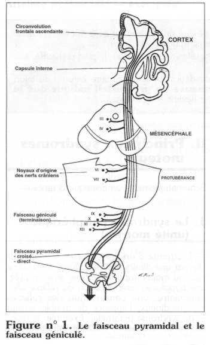
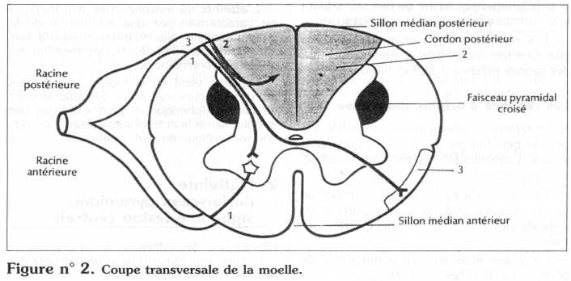
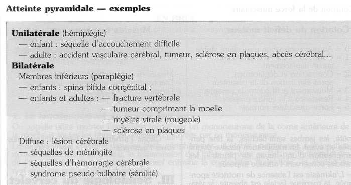

## I. Étude de la motricité

La réalisation du mouvement est un phénomène complexe qui met en jeu :

*   le muscle,
*   la jonction neuro-musculaire (rapport entre le nerf et le muscle),
*   le nerf périphérique ou motoneurone,
*   la voie nerveuse centrale ou faisceau pyramidal _(figures n° 1 et 2),_
*   les systèmes extrapyramidaux.

Le muscle, la jonction neuromusculaire et le motoneurone périphérique sont regroupés sous le nom d'unité motrice. Le motoneurone part de la moelle (corne antérieure), chemine dans le nerf périphérique et se synapse au muscle (jonction neuromusculaire). La stimulation du nerf entraîne la contraction du muscle, la section du nerf, une paralysie.

La voie nerveuse centrale du faisceau pyramidal commande la motricité volontaire. Tous les motoneurones reçoivent une afférence de ce faisceau.

Le système extrapyramidal et le cervelet régulent le tonus, la coordination du geste et l'adaptation posturale.

Le réflexe est une contraction musculaire involontaire en réponse à une stimulation périphérique.

Le _réflexe myotatique_ est une contraction musculaire à l'étirement du muscle.

Le _réflexe ostéo-tendineux_ est provoqué par la percussion du tendon d'un muscle (rotulien, achillien) et dépend de la moelle épinière. Il provoque la contraction du muscle.

Le _réflexe cutané_ est un réflexe de préservation.

## II. Examen clinique de la motricité, du tonus et des réflexes

Il doit répondre à 5 questions :

*   existe-t-il une atrophie musculaire ?
*   existe-t-il une diminution de la force musculaire ?
*   existe-t-il une anomalie des gestes fins et de la coordination motrice ?
*   existe-t-il des troubles du tonus ?
*   existe-t-il des troubles des réflexes ?

### 1. L'atrophie musculaire

Elle s'apprécie par l'inspection et éventuellement la mensuration comparative (2 membres au même niveau). Le muscle amyotrophé est plus plat, plus mou, un creux existe parfois. Il doit être palpé.

#### La force musculaire

Globalement, elle se fait par :

*   l'étude de la marche, de la station debout, de la " position du serment " les bras tendus, du maintien des cuisses et des jambes demi-fléchies au-dessus du plan du lit (signe de Mingazzini et Barré) et également par la marche sur la pointe des pieds, les talons et par l'accroupissement ;
*   l'étude de la force des mouvements élémentaires au niveau des articulations ;
*   on peut explorer la force, muscle par muscle, avec une cotation (pas de contraction volontaire, contraction sans mouvement, ébauche de mouvement, réalisation du mouvement complet, maintien du mouvement contre résistance.

#### Les gestes fins et déliés

Le sujet doit pianoter ou battre la mesure avec le pied, faire des rotations rapides avec les mains autour du poignet, mettre le talon d'un côté sur le genou de l'autre, ou le doigt sur le nez. Les deux côtés sont explorés comparativement.

#### L'examen du tonus

Il est d'appréciation plus difficile. On étudie le balancement du bras lors de la marche, la rapidité du geste, l'attitude de la station debout. Le tonus du repos s'apprécie en mobilisant passivement les segments de membre comparativement d'un hémicorps à l'autre.

#### L'étude des réflexes

**Les réflexes ostéotendineux**

La percussion brusque à l'aide d'un marteau à réflexes du tendon musculaire entraîne une contraction unique de ce muscle. L'examen est comparatif. Il faut obtenir un relâchement musculaire aussi complet que possible et parfois utiliser certaines manœuvres de facilitation.

**Les réflexes d'origine cutanée**

_-_ Le réflexe cutané plantaire (signe de Babinski) est un temps capital de l'examen _(encadré n° 1)._

_- Le réflexe_ neuro-palpébral s'obtient par la percussion de la racine du nez provoquant une fermeture bilatérale des paupières.

_- Les réflexes crémastérien et_ anal sont plus rarement recherchés. Ils correspondent à des racines précises (L1L2 et S4S6).

**Les réflexes d'origine muqueuse**

*   _Le réflexe_ cornéen par un coton effilé à la portion périphérique de la cornée qui entraîne une contraction de la paupière (à utiliser avec précaution).  
*   _Le réflexe du voile du palais_ recherché par la stimulation de la face apparente du voile du palais provoquant une élévation du voile.  
*   _Le réflexe nauséeux_ par la stimulation du pharynx ou de la base de la langue.

## III. Principaux syndromes moteurs

Schématiquement, on distingue 3 niveaux.

### 1. Le syndrome périphérique (unité motrice)

*   _L'atteinte d'origine musculaire_ caractérisée par une diminution de la force musculaire plus ou moins importante, une amyotrophie, une hypotonie, une abolition du réflexe idiomusculaire, une conservation des réflexes ostéotendineux, l'absence de trouble sensitif et de syndrome pyramidal. Exemple, la myopathie de Duchêne, maladie génétique ne touchant que le garçon.  
*   _L'atteinte de la fonction neuromusculaire._ Il existe une fatigabilité musculaire à l'effort répété ou maintenu. Ces troubles sont variables dans la journée. L'atteinte des muscles oculaires en est souvent le début. Il est nécessaire de compléter l'examen par un électromyogramme.  
*   _L'atteinte du motoneurone_ _périphérique_ est caractérisée par une diminution de la force musculaire plus ou moins complète, une amyotrophie, une hypotonie, une abolition des réflexes ostéotendineux.

Si l'atteinte vient de la moelle épinière, les troubles moteurs sont isolés. Si l'atteinte vient du nerf périphérique, il peut s'associer des troubles sensitifs et trophiques (exemple : section traumatique du nerf, poliomyélite).

### 2. L'atteinte du faisceau pyramidal signe une lésion centrale

Elle associe des difficultés de la commande volontaire, une hypertonie et une atteinte des réflexes ostéotendineux.

*   L'atteinte de la commande volontaire peut entraîner une impossibilité totale de tout mouvement, mais elle peut être moindre, avec une force musculaire conservée, avec des gestes malhabiles et une difficulté aux mouvements fins des extrémités. L'atteinte est le plus souvent limitée à un hémicorps (hémiplégie). Certaines épreuves complètent l'examen, comme le "signe du serment " au membre supérieur qui retombe lentement et le signe de Barré et Mingazzini (la jambe fléchie à angle droit sur la cuisse retombe lentement).

D'autres recherches sont nécessaires dans une atteinte légère (marche, équilibre, fatigabilité).

*   L'hypertonie spastique se caractérise par la répartition géographique (quadriceps, fléchisseurs des orteils au membre inférieur et muscles fléchisseurs de l'avant-bras, de la main et des doigts ou membre supérieur). Lors de la mobilisation passive, il y a une contraction réflexe du muscle étiré qui s'oppose à l'étirement.  
*   L'exagération des réflexes ostéotendineux est avec l'hypertonie, le témoin de la spasticité et de l'atteinte du faisceau pyramidal. Elle se traduit par une vivacité anormale de la réponse réflexe étudiée par comparaison une diffusion à d'autres groupes musculaires son caractère polycinétique : la réponse est faite de plusieurs contractions successives (ou mouvements). Le clonus est une série de contractions se produisant de façon rythmée à l'étirement d'un muscle spastique (surtout observé à la cheville), il y a aussi parfois une augmentation de la zone réflexogène.  
*   Le réflexe cutané plantaire de Babinski _(voir encadré_ _1)._
*   Les réflexes de défense se manifestent par un triple retrait (pied, jambe, cuisse qui fléchit) après stimulation douloureuse du dos du pied.

Nous ne nous étendrons pas sur les différents aspects cliniques du syndrome pyramidal, en fonction de la topographie de l'atteinte, qui feront l'objet d'un examen neurologique spécialisé : atteinte corticale, atteinte centrale cérébrale (capsule interne), atteinte du tronc cérébral, atteinte de la moelle épinière par compression (se rapporter au schéma anatomique).

### 3. Signes des atteintes du système extrapyramidal  
(système régulatoire)

Atteinte d'autres régions centrales, profondes, du tronc cérébral et des voies nerveuses provenant et passant par la moelle épinière soit syndrome parkinsonien (maladie de Parkinson) soit mouvements involontaires.

#### Le syndrome parkinsonien

Il est caractérisé par 3 principaux signes : la rigidité, l'akinésie, le tremblement.

*   _La rigidité_ est due à une exagération permanente du tonus musculaire. Elle existe au repos, est exagérée par l'effort et les mouvements en sont perturbés. Le patient est fixé dans une attitude fléchie en avant, l'aspect voûté, les jambes semi-fléchies, la tête penchée en avant. La mobilisation passive donne l'impression d'un " tuyau de plomb ", les muscles conservent l'attitude imposée.  
*   _L'akinésie_ est l'absence de motricité spontanée, la mimique faciale est absente, le visage est figé, le réflexe palpébral excessif. Il y a peu de mouvements (parole, balancement des bras à la marche). La marche est à petits pas précipités, les bras collés au corps et demi-fléchis. Le patient semble courir après son centre de gravité. Il est facilement déséquilibré.

Dans les cas évolués, toute autonomie peut être perdue.

*   _Le tremblement_. C'est un tremblement de repos disparaissant lors du sommeil et exagéré par l'émotion. Il est lent, d'amplitude régulière, prédominant aux extrémités, parfois au menton.  
*   _Il_ y a _d'autres troubles associés_ : ceux de l'élocution et de l'écriture. La voix est faible, monotone, d'émission rapide, les mots mal articulés parfois inintelligibles, l'écriture est micrographique.

Enfin, on constate souvent une constipation et une tendance dépressive. L'intelligence est conservée, des troubles psychiques peuvent survenir tardivement.

À côté du syndrome parkinsonien, il existe _d'autres types de mouvements anormaux_, citons les principaux :

*   _Les tremblements, plus banals_. Ils prédominent à l'attitude et s'exagèrent lors des émotions. lis peuvent parasiter les gestes de la vie courante. Ils sont fréquents dans l'alcoolisme ou l'hyperthyroïdie, il peut s'agir de tremblements dits essentiels ou émotifs.  
*   Le mouvement choréique est plus particulier, rapide, brutal, de grande amplitude intéressant toutes les parties du corps, il n'y a pas d'hypertonie.  
*   _Les myoclonies_ sont des contractions brèves, involontaires.  
*   Citons _l'athéthose, l'hémiballisme_, plus rares _l'astérixis._

## IV. Sémiologie du cervelet

Le cervelet est placé en dérivation sur les voies motrices. Il contrôle la station debout et l'équilibre. Il a une action importante sur la coordination des mouvements.

Le syndrome cérébelleux comporte :

*   L'hypotonie qui se manifeste par une augmentation du ballant lors de la mobilisation passive des segments de membres, une hyperlaxité des mouvements, un caractère exagéré des réflexes ostéotendineux avec plusieurs oscillations de la jambe par exemple (mouvement pendulaire pour une seule stimulation).  
*   _Les troubles de l'équilibre_ avec oscillations brusques, régulières. La station debout est impossible les pieds joints, la marche est désordonnée, déséquilibrée, parfois impossible sans appui. Les troubles légers montrent une mauvaise résistance aux poussées. L'occlusion des yeux ne modifie pas la marche, ni la station debout. Le patient se tient debout les jambes écartées (polygone de sustentation). Le polygone de sustentation est élargi.  
*   _L'incoordination_ est une perturbation des mouvements qui perdent leur caractère harmonieux et précis. Les épreuves couramment employées sont le doigt sur le nez, le talon sur le genou opposé, le geste dépasse le but et la correction est excessive. Les gestes alternatifs rapides sont impossibles (adiadococinésie, marionnettes).  
*   _Asynergie._ Les gestes volontaires perdent un certain nombre de réactions automatiques. Les talons ne décollent pas du sol quand le patient s'accroupit par exemple.  
*   _La_ dysarthrie. L'élocution est irrégulière, scandée, explosive et hachée.

**EN BREF...**

La réalisation des mouvements est un phénomène complexe qui met en jeu :

*   un effecteur : le muscle,
*   la jonction neuromusculaire
*   le motoneurone périphérique
*   le faisceau pyramidal
*   les systèmes extrapyramidaux.

Les trois premiers éléments peuvent être regroupés sous le nom d'unité motrice.

### 1. Le fonctionnement de l'unité motrice

On appelle unité motrice l'ensemble formé par un mononeurone de la corne antérieure de la moelle et toutes les fibres musculaires innervées par ce mononeurone.

Le motoneurone chemine dans les nerfs périphériques ; il établit une synapse à la jonction neuromusculaire ; à ce niveau, la transmission de l'influx nerveux se fait par l'intermédiaire de l'acétylcholine. La stimulation du nerf entraîne la contraction du muscle ; la section du nerf entraîne une atrophie musculaire.

### 2. Le faisceau pyramidal

Tous les motoneurones reçoivent une afférence du faisceau pyramidal qui assure la commande volontaire de la motricité.

_Développement et Santé, n°142, août 1999_