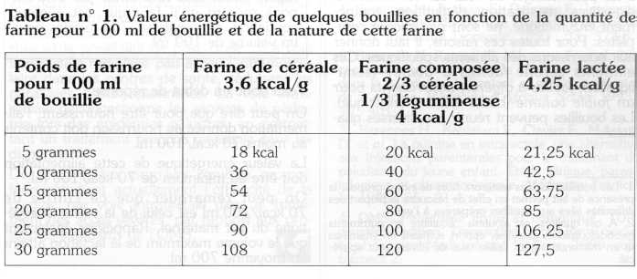
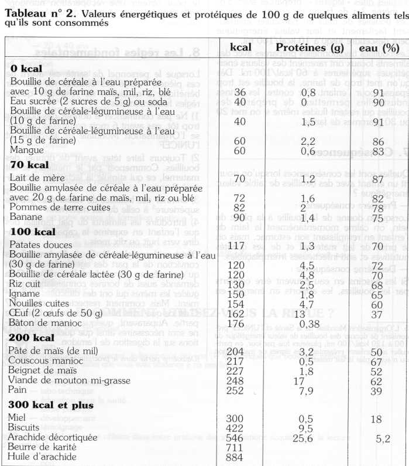

**Il est d'usage depuis quelques décennies de conseiller aux mères, en particulier à celles dont le jeune enfant présente un retard pondéral, de donner des bouillies afin d'accroître les apports alimentaires. Cet article montre le bien fondé de ces pratiques, à condition que soient respectées quatre règles fondamentales. Le non-respect de ces quatre règles est en effet à l'origine de nombreux échecs et d'aggravation de la malnutrition. Si l'intérêt de donner aux jeunes enfants souffrant de malnutrition ou de sous-nutation des bouillies de haute valeur énergétique est bien établi, les moyens simples d'y parvenir avec des bouillies non lactées (Les bouillies lactées resteront hors de notre propos, la présence de lait permet en effet de résoudre la plupart des difficultés liées aux bouillies préparées à l'eau), sont plus difficiles à trouver et nous proposons ici des solutions faisant appel à de l'amylase domestique.**  
**Dans la première partie, nous aborderons la notion de valeur énergétique des aliments, appliquée à l'alimentation infantile. Puis, nous parlerons de la viscosité des bouillies et du rôle de l'amylase sur l'amidon. Enfin, nous verrons ce que permet l'utilisation des amylases domestiques.**

## **I. Valeur énergétique** **des aliments dans** **l'alimentation infantile**

### **1. Les bouillies**

Pour situer le problème, il faut bien comprendre que le nourrisson et le jeune enfant ont une croissance pondérale fabuleuse, comme en témoigne une courbe de poids normale : ils grossissent en moyenne de 20 à 30 grammes chaque jour les premiers mois, et de 10 grammes par jour jusqu'à 1012 mois. Les scientifiques ont observé que pour obtenir une telle croissance, il fallait que le nourrisson de plus de six mois consomme environ 100 kilocalories et 140 ml d'eau par kilo de poids et par jour.

Mais on sait aussi que le nourrisson a des capacités digestives limitées et immatures : en effet, le volume de ce qu'il peut absorber à chaque repas est limité par la contenance de son estomac (200 à 250 ml), et il lui faut un certain temps entre chaque repas. De même il ne peut manger de tout car ses fonctions digestives, mastication, déglutition, équipement enzymatique, ne sont pas encore complètes. Pour toutes ces raisons, il faut donner aux nourrissons des aliments spécifiques. Ces aliments seront _faciles à_ avaler (semi-liquides), faciles _à digérer, nourrissants pour_ _un faible volume_ (haute valeur énergétique). Les bouillies peuvent réunir ces diverses qualités (À ces qualités, on ajoutera : équilibre en nutriments (protides, lipides, glucides), apport suffisant en vitamines et en micronutriments, faible taux de fibres, goût apprécié).

### **2. Quelle valeur énergétique ?**

On admet facilement que l'aliment donné aux nourrissons doit être liquide ou onctueux et facile à digérer. Mais, qu'est-ce qu'un aliment nourrissant ? Combien d'énergie faut-il que ce liquide apporte pour qu'il soit nourrissant ? Qu'est-ce que la valeur énergétique (ou densité énergétique) ?

En fonction du poids d'un enfant et à partir des indications ci-dessus (100 kilocalories et 140 ml d'eau par kilo de poids et par jour), on peut estimer grossièrement :

1) Combien cet enfant doit boire d'eau (ou de liquide) par jour.

2) Combien d'énergie il lui faut par jour.

3) Si toute son alimentation est liquide, on peut aussi estimer la quantité d'énergie qu'il faut en moyenne dans 100 ml de cet aliment.

Par exemple un nourrisson de 5 kg doit au minimum boire 700 ml (140 ml x 5) et a besoin de 500 kcal (100 kcal x 5). Un rapide calcul (500 kcal divisé par 700 ml) nous montre qu'il faut que cet aliment contienne, en moyenne, 70 kcalories pour un volume de 100 ml.

Voilà donc un début de réponse :

On peut dire que pour être nourrissant, l'alimentation donnée au nourrisson doit contenir au moins 70 kcal/100 ml.

La valeur énergétique de cette alimentation doit être au minimum de 70 kcal/100 ml.

On peut remarquer que ce chiffre de 70 kcal/100 ml est celui de la valeur énergétique du lait maternel. Rappelons également que le volume maximum de la lactation atteint en moyenne 700 ml.

### **3. Les calories**

Voyons maintenant combien d'énergie apportent les bouillies, celles que les mères préparent pour leurs enfants, celles qu'on trouve sur les marchés, celles qu'on prépare dans certains CREN. Quelle est leur valeur énergétique ?

Une bouillie c'est de l'eau et de la farine. Ce qui, dans une bouillie, apporte les nutriments et l'énergie, " les calories ", c'est la farine. Il est donc essentiel de savoir combien de farine on donne à l'enfant quand on lui donne une bouillie.

Il serait intéressant de savoir combien de calories contient approximativement une bouillie (calcul de ce qu'on appelle la valeur énergétique ou densité énergétique de la bouillie). Voilà comment on peut procéder :

Il faut pour cela un récipient gradué et une petite balance (pèse-lettre).

### **4. Les quantités**

Prenons, par exemple, 100 ml d'une bouillie habituellement préparée pour les enfants dont vous vous occupez. Faites-la se dessécher au soleil ou dans un four de façon à obtenir des paillettes sèches. Pesez ces paillettes. La bouillie déshydratée en paillettes, farine cuite (Les paillettes obtenues par déshydratation des bouillies peuvent être plus sèches que la farine dont elles proviennent. La quantité d'eau dans les farines ordinaires représente 10 % de leur poids, alors que les farines grillées, les farines industrielles pour nourrisson et les paillettes de bouillie déshydratée ne contiennent que 5 % d'eau ou même moins. De ce fait, leur valeur énergétique peut être un peu plus élevée) a approximativement le même poids et la même valeur énergétique que la farine crue utilisée pour préparer cette bouillie.

La plupart du temps nous allons trouver environ 10 grammes de paillettes. Cette bouillie est dite à 10 % de farine, c'est-à-dire contenant 10 grammes de farine pour 100 ml de bouillie.

Nous savons, par les tables de composition des aliments ou par les indications mentionnées sur l'étiquette combien de calories il y a dans 100 grammes de la farine utilisée (valeur énergétique de la farine). La valeur énergétique des farines grillées est un peu plus élevée que celle des farines crues. Le grillage les rend plus sèches (5 % d'humidité) que les farines crues (12 % d'humidité)).

- S'il s'agit de _farine de céréale,_ mil, maïs, riz, blé, la valeur énergétique de ces farines est environ de 360 kcal/100 g, soit 3,6 kcal/g.

- S'il s'agit de farine _composée céréale-légumineuse,_ la valeur énergétique est environ de 400 kcal/100 g, soit 4 kcal/g.

- S'il s'agit de _farine lactée,_ la valeur énergétique est environ de 425 kcal/100 g, soit 4,25 kcal/g.

Le tableau qui suit donne la valeur énergétique des bouillies en fonction de la quantité de farine et de la nature de celle-ci.

Nous allons maintenant pouvoir calculer la quantité d'énergie contenue dans 100 ml de bouillie : il suffit de multiplier la valeur énergétique de la farine par le poids des paillettes obtenues par dessèchement de la bouillie.

Reprenons notre exemple : si ces 100 ml de bouillie sont préparés avec une farine céréale-légumineuse et qu'il reste, après dessèchement, 10 g de paillettes, on calcule : 4 kcal x 10 g = 40 kcal.

### **5. Comparaison avec les aliments pour adultes**

- Si l'enfant mange ces 100 ml de bouillie, il aura consommé 40 kcal. La valeur énergétique de cette bouillie est de 40 kcal/100 ml.

Nous savons maintenant combien de farine on donne à l'enfant quand on lui donne une bouillie et donc combien de calories il consomme.

Nous savons aussi estimer la valeur énergétique d'une bouillie.

La comparaison de la valeur énergétique des bouillies avec la valeur de quelques aliments consommés par les adultes permet de les situer et de constater que même les bouillies les plus riches ont une valeur énergétique inférieure à la plupart des aliments des adultes.

### **6. La consistance des bouillies et leur valeur nutritive**

Dans l'exemple précédent, nous avons calculé la valeur énergétique d'une bouillie céréale-légumineuse. Le _tableau n°_ 2 permet de situer la valeur énergétique de cette bouillie par rapport à celle d'un soda.

Cette bouillie a la consistance souhaitée pour un aliment destiné aux nourrissons, mais, bien que considérée comme une bonne bouillie du fait de sa composition, elle est peu nourrissante (faible valeur énergétique). En effet, 40 kcal/100 ml est la valeur énergétique de l'eau sucrée ou celle du soda. Cependant cette bouillie est mieux équilibrée en nutriments que le soda.

Malheureusement des bouillies encore moins nourrissantes peuvent être parfois données aux nourrissons, notamment les premières bouillies dites "légères", préparées avec 5 g, et même 3 g de farine de céréales simples. Les bouillies de maïs en particulier épaississent facilement et leur valeur énergétique peut descendre jusqu'à 10 kcal/100 ml.

Les bouillies traditionnelles préparées avec des aliments locaux ont rarement des valeurs énergétiques supérieures à 60 kcal/100 ml. Dès qu'on met trop de farine, la bouillie est trop épaisse pour l'enfant. Par contre, les farines industrielles permettent de préparer des bouillies qui restent fluides même si on met 20 ou 30 grammes de farine.

### **7. Conséquences**

Quelles sont les conséquences lorsqu'on nourrit un enfant avec des bouillies de faible valeur énergétique ?

- Première conséquence :

Lorsqu'on donne de la bouillie à la place du sein, on calme momentanément la faim de l'enfant en remplissant son estomac, mais on le prive de lait maternel et de ses qualités nutritives et anti-infectieuses irremplaçables.

- Deuxième conséquence :

Si les besoins en eau peuvent être couverts par les bouillies, les apports en énergie, en protéines, en graisses, en micro-nutriments sont très insuffisants. La digestion de ces bouillies n'est, de plus, pas toujours complète.

- Troisième conséquence :

Alimentés avec ces bouillies, les enfants ne prennent pas de poids ou maigrissent et on n'en comprend pas la raison. Sans être averti, on est tenté de donner un peu plus de bouillie... et un peu moins le sein !

La situation est parfois encore pire lorsque les enfants sont nourris par sonde de gavage. La bouillie étant trop épaisse, elle est diluée avec de l'eau pour pouvoir passer dans la sonde. Sa valeur énergétique, déjà insuffisante pour obtenir une récupération nutritionnelle efficace, est encore diminuée par la dilution !

### **8. Les règles fondamentales**

Lorsque le personnel de santé est averti de ces pièges, l'usage des bouillies est bien sûr bénéfique à condition de respecter quatre règles fondamentales :

1) Ne pas commencer à donner des bouillies trop tôt, pas avant 6 mois comme le préconise l'Organisation Mondiale de la Santé et l'UNICEF.

2) Toujours faire téter avant de donner des bouillies. Commencer par le meilleur, le lait maternel, ce qui stimule la lactation, ceci jusqu'à 2 ans.

3) Donner des bouillies de valeur énergétique supérieure à celle du lait maternel. (L'Organisation Mondiale de la Santé et l'UNICEF préconisent de donner des bouillies de valeur énergétique de 100 à 120 kcal/100 ml, plusieurs fois par jour, en particulier aux enfants présentant des signes de malnutrition ou n'ayant plus le lait maternel).

4) Introduire les aliments du plat familial dès que l'enfant en exprime la capacité, c'est-à-dire vers huit ou dix mois.

Observer les règles 1), 2) et 4) demande la conviction de la part des agents de santé afin qu'eux-mêmes persuadent les mères. Cela demande aussi de bonnes connaissances pour guider les mères qui ont des difficultés d'allaitement. Mais comment respecter la règle 3) ? C'est ce que nous allons voir dans la troisième partie. Auparavant, quelques notions de cuisine sont nécessaires ainsi que quelques explications sur la digestion de l'amidon.

_(Voir deuxième partie_)

_Développement et Santé, n°126, décembre 1996_