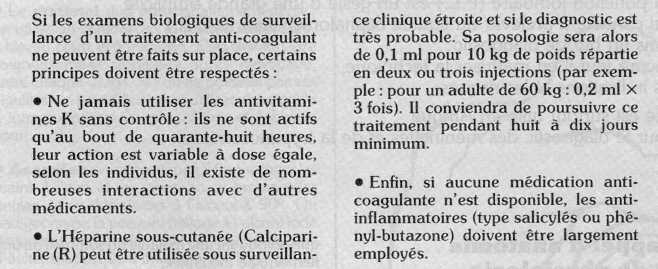
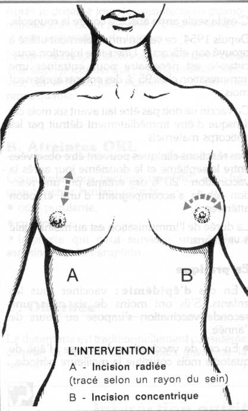
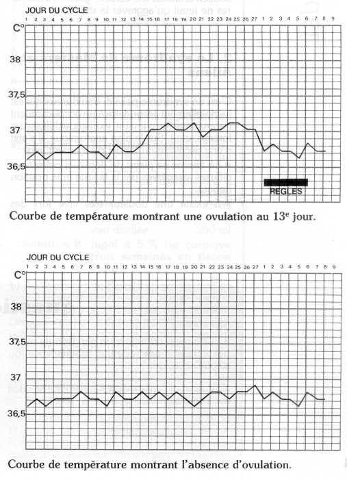

**Complications du post-partum :****I - dans les premiers jours**

**par Jean-Daniel Rainhorn.**

Que l'accouchement ait lieu au domicile ou dans une structure prévue à cet effet (case d'accouchement, maternité rurale, hôpital), c'est la plupart du temps alors que la femme est à la maison, qu'apparaissent les éventuelles complications du post-partum. C'est dire l'importance de l'information qui doit être donnée à la jeune accouchée et à son entourage car c'est la surveillance attentive dans les jours qui suivent l'accouchement qui va permettre le dépistage précoce de ces complications et donc d'en limiter les conséquences.

**A. La surveillance**

Elle doit être constamment orientée vers la recherche des complications.

*   La femme ayant été levée dès le premier jour.  
*   L'état général doit rester satisfaisant.  
*   Le pouls régulier et la température autour de 37°.  
*   La palpation du fond utérin le retrouve chaque jour plus bas. A la fin de la première semaine, il est à mi-chemin entre l'ombilic et la symphyse. A la fin de la deuxième semaine, il est derrière la symphyse et le col est fermé.  
*   Des contractions utérines - " les tranchées " peuvent se manifester les deux ou trois premiers jours et sont d'autant plus fréquentes que la multiparité est avancée. Souvent déclenchées par la mise au sein, elles nécessitent rarement de prescription d'un antalgique.

*   Les " lochies " sont sanglantes et fluides les premiers jours avec parfois un ou plusieurs caillots; puis, elles deviennent moins abondantes et rosées. Une recrudescence vers le quinzième jour n'est pas rare.

*   La vessie est parfois atone. Si la femme ne peut uriner, il faut la sonder jusqu'au retour des mictions spontanées. Celles-ci étant d'autant plus rapides que le lever est précoce. Par ailleurs, il n'est pas rare de constater dans le post-partum, une incontinence urinaire d'effort dont l'évolution est en règle favorable en quelques mois.

*   Dans les premiers jours, la constipation est quasi constante, de même que la crise hémorroïdaire.

Enfin, on surveillera attentivement le périnée, en particulier s'il y a eu une suture périnéale, à la recherche d'un hématome ou d'un abcès. L'examen des seins sera soigneux, de manière à éviter les complications mammaires de l'allaitement qui viendraient dramatiquement mettre en jeu le pronostic vital du nouveau-né.

Ainsi, on évitera bien souvent la survenue de complications en rappelant à la femme et à son entourage l'importance des mesures de prévention que constituent:

*   une toilette vulvaire quotidienne au savon,
*   les soins attentifs des seins dans les premières semaines, dont le mamelon ne doit pas être touché et si possible protégé,
*   le lever précoce, qui demeure la meilleure précaution contre la survenue d'un accident thrombo-embolique.

**B. Les complications des premières heures du post-partum**

Il ne faut pas perdre une minute:

*   tenter d'en préciser la cause,
*   s'assurer de la vacuité utérine et faire une révision systématique car l'utérus ne fera son hémostase que s'il est évacué,
*   obtenir la rétraction utérine. Le plus simple consiste à injecter de la posthypophyse (Synthocinon (R) 10 ui) dans le muscle utérin par voie transabdominale en se guidant avec la main laissée dans la cavité,
*   compenser exactement l'hémorragie par une transfusion iso-groupe, iso-rhésus,
*   dans tous les cas une antibiothérapie systématique sera instituée pour prévenir une infection.

Elles sont essentiellement hémorragiques et sont d'autant plus graves que survenant quelques heures après un accouchement normal, elles peuvent être négligées.

Les deux causes les plus fréquentes sont:

*   l'inertie utérine,
*   la rétention placentaire.

Ailleurs, il s'agira d'une plaie vaginale, d'une plaie du col, voire d'une rupture utérine.

Toute hémorragie abondante (supérieure à 500 ml) qui survient dans les vingt-quatre heures qui suivent un accouchement - ou toute reprise d'une hémorragie - doit être considérée comme une urgence très grave.

**C. La complication des premiers jours** **du post-partum**

**1. Les complications mammaires de l'allaitement**

**La montée laiteuse :** toute poussée fébrile à 39-40° avec seins tendus et douloureux survenant au troisième jour du post-partum ne doit pas inquiéter: c'est une manifestation fréquente de la montée laiteuse. Elle cédera rapidement avec l'allaitement et ne doit conduire au plus qu'à la prescription d'Aspirine.

**Les crevasses :** elles peuvent apparaître dès les premiers jours de l'allaitement et sont favorisées par l'absence d'hygiène.

Non traitées, les crevasses risquent d'entraver l'allaitement et d'entraîner son abandon avec les conséquences dramatiques que l'on sait pour le nouveau-né. Négligées, les crevasses peuvent être surtout le point de départ de complications septiques mammaires. Le traitement est essentiellement préventif et repose sur une hygiène rigoureuse du mamelon (en évitant les produits agressifs).

**La lymphangite aiguë du sein:** elle se manifeste dans la première semaine de l'allaitement par un début brutal:

*   fièvre à 40° avec frissons,
*   placard inflammatoire souvent limité avec traînées lymphatiques se dirigeant vers l'aisselle,
*   traitée par des anti-inflammatoires locaux (type Phénylbutazone) l'évolution est rapidement favorable. Il n'y a pas dans ce cas d'indication pour une antibiothérapie.

**L'engorgement mammaire:** les seins se vident mal, sont en permanence tendus et douloureux. Les tétées sont insuffisantes. Il faut alors les répéter plus souvent et si cela ne suffit pas, utiliser un tire-lait après chaque tétée. La guérison s'obtient alors en quarante-huit heures.

**2. La thrombo-phlébite puerpérale**

Elle se manifeste dans les jours qui suivent l'accouchement, plus souvent chez la multipare et lorsque l'accouchement a été compliqué, en particulier par des manoeuvres endo-utérines.

**Les premiers signes** apparaissent vers le cinquième/septième jour après l'accouchement.

**a.** Souvent tout commence par une accélération du pouls alors que la température oscille autour de 38°. Bien que variables, les modifications du pouls et de la température sont constantes et sont dans ce contexte une grande valeur diagnostique.

**b.** Les troubles au niveau d'un membre inférieur sont d'autant plus évocateurs qu'ils sont unilatéraux: fourmillements, crampes, pesanteurs et tension douloureuse de la jambe, puis douleur vraie du mollet.

**c.** Parfois, un point de côté brutal, souvent angoissant, peut être révélateur d'une embolie pulmonaire dont on connaît la gravité.

**L'examen clinique**

Soigneux et comparant les deux membres inférieurs, il recherchera les signes classiques:

- l'augmentation de volume d'un mollet,

- la tension des masses musculaires qui se traduit par une diminution du ballottement du côté atteint,

- l'augmentation de la chaleur locale au niveau du mollet,

- la douleur à la flexion du pied sur la jambe, ou signe d'Homans, est de grande valeur diagnostique, car il est très précoce,

- on recherchera, enfin, une douleur provoquée sur le trajet veineux au niveau du mollet, de la cuisse et de la région inguinale.

A ce stade et dans ce contexte, existe une très grande probabilité qui suffit habituellement pour mettre en route le traitement.

*   **Les examens complémentaires** restent en effet insuffisants pour affirmer un diagnostic de thrombo-phlébite au début car les tests de coagulation sanguine sont fréquemment perturbés dans les suites de couches normales et toute modification n'a donc que peu de valeur diagnostique. Cependant, l'exploration de la coagulation peut servir de point de départ pour suivre l'efficacité d'un traitement anticoagulant.

*   **Sous traitement, l'évolution** est en règle favorable. En l'absence de traitement précoce, la thrombo-phlébite peut s'aggraver avec un membre inférieur énorme, infiltré, déformé en poteau, aux téguments tendus, lisses, chauds; l'hydarthrose réactionnelle du genou, la douleur au moindre mouvement viennent compléter ce tableau dramatique.

L'embolie pulmonaire, bien que rare, reste la complication majeure de la phlébite.

**Traitement**

**Avant tout préventif:**

- lever et mobilisation précoces, dès le premier jour du post-partum,

- lutte contre l'anémie au cours de la grossesse et compensation d'une hémorragie au cours de l'accouchement,

- prévention de l'infection puerpérale par une aseptie rigoureuse lors de l'accouchement et une antibiothérapie systématique en cas de rupture prématurée des membranes ou de manoeuvres endo-utérines,

- traitement précoce de toute endométrite débutante.

*   **Le traitement anticoagulant :** comporte dans un premier temps l'injection d'Héparine (Calciparine (R) sous-cutanée) suivie quelques jours plus tard d'anti-vitamine K (Sintrom (R), Tromexane (R), etc.).

**La surveillance par les tests de coagulation est impérative et permet de contrôler** **l'efficacité du traitement et d'éviter des** **surdosages.**

*   **Le traitement antibiotique** est souvent indiqué car ces phlébites surviennent volontiers dans un contexte infectieux. Il devra être poursuivi huit à dix jours (Pénicilline G, Ampicilline, etc.).

*   **Les anti-inflammatoires** généraux sont indispensables.

**3. L'infection puerpérale**

Ce type d'infection résulte d'une contamination par un germe lors de l'accouchement (streptocoque le plus souvent, parfois germe Gram (-)). L'infection puerpérale est favorisée par:

- un travail traînant en longueur,

- une rupture prématurée (plus de quarante huit heures) de la poche des eaux,

- une hémorragie lors de la grossesse, de l'accouchement ou de la délivrance,

- des contusions tissulaires lors des manoeuvres de l'accouchement ou de la délivrance.

Dans ces cas, un traitement antibiotique systématique sera prescrit. L'attitude logique consiste à prescrire d'emblée de la Pénicilline G.

En outre, l'aseptie rigoureuse dans les gestes de l'accouchement, de la délivrance et des soins du post-partum, s'efforcera d'éviter la souillure microbienne des voies génitales.

*   **L'endométrite puerpérale:** son signe essentiel est la fièvre. Celle-ci apparaît quelques jours après l'accouchement (cinquième-septième jour), monte progressivement à 38° et s'associe à une fétidité particulière des lochies qui sont parfois sanglantes.

L'utérus involue mal. Il est gros et douloureux.

L'erreur la plus grave serait alors de croire à une rétention placentaire et de pratiquer une révision utérine là où un simple traitement antibiotique de quelques jours suffit.

En effet, le traitement de l'endométrite puerpérale repose sur l'association d'une antibiothérapie et d'un utéro-tonique (Méthyl-Ergobasine (R)).

Si l'évolution n'est pas favorable au bout de deux-trois jours, il est nécessaire de modifier ce traitement (Chloramphénicol, Bactrim, etc.).

En l'absence de traitement, l'infection peut évoluer vers une extension loco-régionale et en particulier vers une péritonite.

**II - dans les semaines ultérieures**

**D. Les complications mammaires**

**Les abcès du sein**

C'est habituellement vers la troisième-quatrième semaine que peuvent apparaître les abcès du sein. Ils se constituent souvent à partir de crevasses négligées du mamelon.

Au début, la fièvre est discrète, vers 38°, le sein est peu tendu, sans modification des téguments. Il n'y a pas d'adénopathie satellite. Le mamelon a du lait mêlé de pus qui laisse une tache jaune sur le coton où on le recueille. Le traitement à ce stade impose:

*   l'arrêt temporaire de l'allaitement du côté atteint,
*   une antibiothérapie,
*   des anti-inflammatoires (type Aspirine).

En l'absence de traitement, l'évolution se fait vers la mastite aiguë:

*   les douleurs sont très vives,
*   la température s'élève à 39-39°5,
*   l'état général s'altère.

L'examen découvre un sein très sensible avec un noyau dur très douloureux.

Pouvant parfois régresser sous l'effet des antibiotiques, la mastite évolue le plus souvent vers la collection suppurée qu'il importera alors d'évacuer.

Pour inciser, on se fondera sur :

*   les douleurs qui deviennent lancinantes, pulsatiles,
*   la température qui oscille à 40°,
*   l'hyperleucocytose à polynucléose,
*   la sensation de collection du noyau à l'examen.

L'incision d'un abcès doit être esthétique et efficace. Elle sera péri-aréolaire, avec une contre-incision de drainage dans le sillon sous-mammaire et un drainage par une lame.

Il est essentiel d'effondrer toutes les logettes infectées au doigt, afin d'éviter la poursuite de l'infection, après drainage, ou la récidive ultérieure.

**E. Les anomalies du retour de couches**

Lorsque la femme n'allaite pas, le retour de couches a lieu vers la sixième semaine, parfois plus tard. En cas d'allaitement maternel, le retour de couches est retardé.

**1. Les retours de couches** **hémorragiques**

Normalement le retour de couches a l'aspect de règles normales, parfois un peu plus abondantes. Lorsqu'il est véritablement hémorragique avec de volumineux caillots, il importe alors d'en rechercher la cause:

*   Il ne s'agit jamais d'une rétention placentaire. Le curetage est donc non seulement inutile, il est nuisible car exposant aux infections, à la perforation d'un utérus fragile, aux synéchies utérines (accotement cicatriciel des parois utérines).

*   La cause la plus fréquente d'hémorragie est l'infection. Un traitement antibiotique viendra alors aisément à bout de cette endométrite tardive et amènera l'arrêt de l'hémorragie.

*   Des anomalies de cicatrisation avec atrophie muqueuse sont responsables de métrorragies Persistantes plus que d'une hémorragie.

**2. Les aménorrhées du** **post-partum**

Elles se définissent comme l'absence de règles:

*   trois mois après l'accouchement chez la femme qui n'allaite pas,

*   quelques mois après l'arrêt de l'allaitement si la femme allaite.

Le plus souvent il convient d'attendre sans s'inquiéter. Si l'aménorrhée persiste, il pourrait alors être utile de faire prendre la température rectale pendant un mois:

*   si la courbe de température est plate, au-dessus de 37°, il s'agit probablement d'une nouvelle grossesse,

*   si la courbe thermique est plate au-dessous de 37°, il s'agit le plus souvent d'un syndrome anovulatoire qui va se corriger grâce à un cycle artificiel oestro-progestatif (Norquentiol, Ovanon, Physiostat),

*   si la courbe thermique est biphasique, il y a sécrétion de progestérone et donc probablement ovulation. En l'absence de manoeuvres endo-utérines intempestives (curetage), il convient alors de prendre patience.

**F. Quelques séquelles de l'accouchement**

**1. Les anomalies de la paroi utérine**

Il persiste souvent après l'accouchement, une certaine laxité de la paroi abdominale. Parfois même existe une véritable diastasis des muscles droits de l'abdomen.

Il faut rappeler ici que le port de moyens de soutien artificiels tels corsets, gaines ou ceintures ne ferait qu'aggraver la situation.

**2. Le syndrome de Masters et Allens**

C'est un syndrome pelvien douloureux qui est habituellement secondaire à un accouchement traumatique (gros enfant, extraction difficile par forceps, etc.). Sur le plan anatomique, il s'agit d'une déchirure du feuillet du ligament large:

*   La femme se plaint de douleurs pelviennes diffuses, exagérées par la fatigue et la position debout.

*   Il existe une douleur très vive lors des rapports sexuels (dyspareunie profonde). Cette douleur persiste plusieurs heures après.

*   Lors de l'examen gynécologique, le toucher vaginal reproduit la douleur au niveau du col de l'utérus.

*   Le traitement chirurgical s'impose car le syndrome n'a aucune tendance à la guérison spontanée et risque d'avoir un profond retentissement sur l'équilibre psychique de la femme et du couple.

**3. Le prolapsus**

Cette séquelle obstétricale qui survient en règle chez les multipares peut être dans bien des cas évitée par un dépistage correct, en cours de grossesse et en cours de travail, des facteurs de risque:

*   gros enfant,
*   mauvaise présentation,
*   accouchement trop rapide ou trop lent,
*   délabrement périnéal.

_Développement et Santé, n°45/46, juin/août 1983_