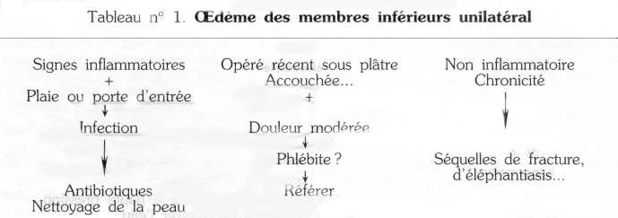
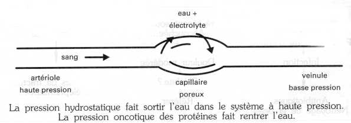

La conduite diagnostique consiste à différencier en premier lieu les œdèmes uni- et bilatéraux; ensuite à évoquer les principaux organes mis en cause. Il devient facile à partir de quelques signes cliniques d'orienter le diagnostic étiologique.

## I. Œdèmes des membres inférieurs (OMI) unilatéraux

### 1. Infection

Présence de signes inflammatoires (chaleur, rougeur, douleur) et éventuellement de fièvre. On recherche une porte d'entrée comme une plaie infectée. Il s'agit d'un œdème par infection, nécessitant antibiotiques et nettoyage de la plaie.

### 2. Suspicion de phlébite

Le mollet est modérément douloureux et chaud. La dorsiflexion du pied provoque parfois la douleur. Mais c'est le contexte clinique qui doit alerter. Il s'agit:

- d'une femme ayant récemment accouché ou avorté,

- d'un opéré récent, surtout du petit bassin (fibrome, hémorroïdes, etc.),

- d'un patient alité pendant plusieurs jours: personne âgée, malade sous plâtre, cardiaque.

Il faut référer au médecin.

### 3. L'œdème est non inflammatoire, chronique et unilatéral

Il s'agit le plus souvent de séquelles de fracture, d'une ancienne phlébite non guérie, d'un éléphantiasis, etc.

## II. Œdèmes des membres inférieurs bilatéraux

On évoque les différents organes qui peuvent être touchés, l'un après l'autre. Le diagnostic repose sur:

- des signes positifs en rapport avec l'organe atteint,

- des signes négatifs concernant les autres organes.

**1. Carences nutritionnelles majeures: le kwashiorkor**

Le contexte épidémiologique, la situation de crise nutritionnelle (disette), l'état des phanères (peau et cheveux décolorés, plaies) soutiennent le diagnostic. A référer au médecin.

**Mécanisme physiopathologique des œdèmes**

Deux choses sont à comprendre:

**1.** *Le gradient de pression hydrostatique* entre les artérioles et les veinules. Le sang arrive dans les artérioles à haute pression. Dans les capillaires, la pression diminue pour être basse dans les veinules. En conséquence, dans les capillaires dont la paroi est poreuse, l'eau intra vasculaire va sortir et occuper l'espace extra vasculaire dit interstitiel.

**2.** *La pression oncotique* représente la pression d'aspiration des grosses protéines, comme l'albumine dans le sérum. Plus le taux de protéines est élevé, plus l'eau et les électrolytes seront attirés; plus ce taux est bas comme dans le kwashiorkor, plus cette pression sera faible et l'aspiration moindre. L'eau qui était sortie vers le secteur extra vasculaire va repasser dans les veinules à basse pression, grâce à cette pression oncotique. Dans les conditions normales, les deux pressions se neutralisent et il n'y aura pas d'œdème. En revanche, dans une insuffisance cardiaque, la pression du sang est élevée: l'origine de l'œdème est mécanique. De même pour une cirrhose ou une insuffisance veineuse.

### 2. Anémie grave

Elle peut évidemment s'associer au diagnostic précédent. Le patient est très fatigué, dyspnéique, ses conjonctives sont très pâles. Le dosage de l'hémoglobine par une méthode calorimétrique (Lovibond, Sahli, Tallquist) ou par la numération indique un taux inférieur à 9 g/l. A référer au médecin.

### 3. Insuffisance cardiaque

La triade évocatrice: tachycardie, dyspnée et œdème invite à rechercher:

- la notion de volvulopathie (souffle au cœur),

- un gros foie mou et douloureux,

- un reflux hépato-jugulaire: le malade assis, on appuie doucement sur le foie et on voit les veines du cou gonfler,

- un signe de Harzer : le cœur est perçu dans le creux xyphoïde,

- une ascite complétant les œdèmes des membres inférieurs.

A référer au médecin.

### 4. Cirrhose hépatique

- Le foie est dur et indolore. Il est gros et déborde sous les côtes,

- les yeux sont parfois ictériques,

- on a la notion d'un alcoolisme chronique ou d'une bilharziose à *Schistosoma* *mansoni* ancienne et non traitée.

### 5. Insuffisance rénale

On découvre de l'albumine dans les urines, deux ou trois +++. On recherche une hypertension artérielle.

### 6. Insuffisance veineuse

Les varices sont apparentes. Les pieds gonflent lorsqu'il fait chaud.

Pour soulager le patient, on peut proposer :

- de maigrir si il/elle est obèse

- de marcher beaucoup et de faire du vélo

- d'installer ses jambes en position surélevée lors du coucher

- d'utiliser des bas à varices .

## III. En conclusion

Pour les œdèmes bilatéraux, il faut penser:

- à l'état nutritionnel,

- au sang,

- au cœur,

- au foie,

- aux reins,

- aux veines.

Le diagnostic se fait par les signes positifs propres à chaque organe atteint et l'absence des autres signes. Néanmoins, on se rappellera que les affections peuvent être associées. Par exemple, une anémie grave s'accompagne souvent d'un tableau d'insuffisance cardiaque, lequel s'améliorera après correction de l'anémie.

Enfin, dans certaines situations telles que:

- œdème des membres inférieurs unilatéral infectieux ou séquellaire,

- œdème des membres inférieurs bilatéral par cirrhose éthylique ou par varices.

Presque tous ces cas sont à référer au médecin pour confirmation diagnostique et traitement adapté.

*Développement et Santé, n°116, avril 1995*
