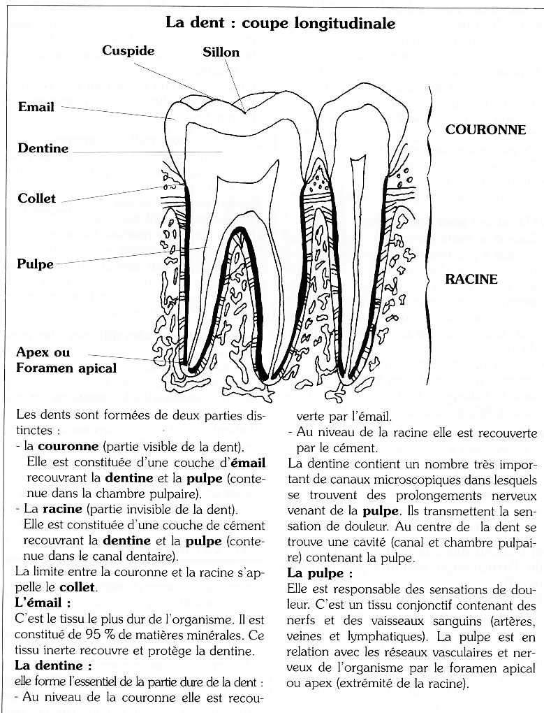
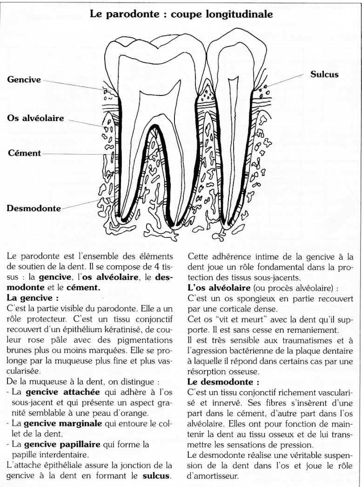
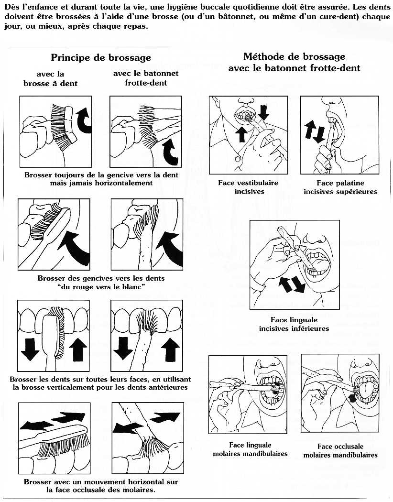

Devant une douleur en odontostomatologie, il convient d'abord d'établir un diagnostic et ensuite de traiter cette douleur. Nous aborderons les différentes étapes qui permettent de poser un diagnostic.

## I. L'interrogatoire

### 1. Concernant la douleur

- Depuis quand la douleur est-elle apparue ?
- Les phénomènes augmentant cette douleur chaud, froid, acide, sucre.
- Les spécificités de cette douleur : sourde, pulsatile, continue, discontinue. Le patient peut-il localiser cette douleur, son irradiation est-elle aggravée par le décubitus, augmente-t-elle le soir ?
- Y a-t-il un phénomène de gonflement après un repas?

### 2. Concernant le patient

- A-t-il un traitement en cours ? Si oui quels médicaments prend-il ?
- A-t-il pris de l'aspirine récemment ?
- A-t-il eu de la fièvre accompagnant cet épisode douloureux ?
- A-t-il eu une intervention stomatologique récente ? Ou a-t-il récemment vu un chirurgien dentiste ?
- A-t-il reçu une radiothérapie ?

## Il. L'examen exo-buccal

- Recherche d'une plaie de la face.
- Recherche de tuméfaction ou d'ecchymoses.
- Recherche d'adénopathies.

## III. L'examen endo-buccal

- Examen minutieux de toute la cavité buccale : recherche d'ulcération, d'abcès en formation, de lésion carieuse, de mobilité dentaire.
- Dès que le patient a signalé la dent douloureuse, on notera son aspect, le degré de son atteinte carieuse, sa mobilité, sa couleur et la qualité des tissus de soutien.
- L'examen de la pulpe est indispensable car cela déterminera le diagnostic : non atteinte pulpaire par la carie, atteinte carieuse de la pulpe, présence de pus ou non, odeur se dégageant de la pulpe.
- Les tests de vitalité ou tests thermiques (réaction de la dent au chaud et au froid).
- La réaction de la dent aux chocs (test de percussion axiale et transversale) qui renseigne sur la qualité de la zone apicale de la dent, douloureuse ou non, va aider a établir un diagnostic précis.
- La qualité du vestibule (comblé ou non).

## IV. Les examens indispensables

- Une radiographie rétro-alvéolaire en un premier temps.
- Si possible un panoramique dentaire.
- Un bilan biologique en cas de suspicion d'infection.

## V. Les différents diagnostics

### a) Pulpite aiguë

- Carie importante, le patient a déjà eu des épisodes douloureux, la douleur est discontinue, vive, exacerbée par le chaud et le froid, lancinante, pulsatile.
- Le patient ne reconnaît pas la dent douloureuse en raison de l'irradiation de la douleur vers les dents adjacentes.
- La percussion axiale est négative, ce qui signifie une absence d'atteinte du périapex.
- La percussion transversale est positive, ce qui signale une atteinte pulpaire.
- Les tests thermiques sont positifs.
- Le cliché radiologique ne révèle pas d'atteinte du périapex.

### b) Gangrène pulpaire ou desmodontite

- Douleur continue, sourde.

- Dent délabrée ou ayant déjà été traitée (reprise de carie).

- Légère mobilité de la dent.

- Tous les tests de vitalité sont négatifs.

- Douleur à la percussion axiale comme à la pression axiale.

- On peut noter une haleine buccale fétide.

- Elargissement ligamentaire.

- On peut noter également un début de comblement vestibulaire qui est un début d'abcès.

### c) Douleurs postopératoires

- *Suite à un geste chirurgical*: leur survenue se situe à peu près 48 h après le geste, on peut avoir une alvéolite sèche ou une alvéolite suppurée. La douleur est intense, le patient ne peut dormir, l'écouvillonnage est extrêmement douloureux, il faut bien apprécier l'état de l'alvéole afin de définir un plan de traitement.
- *Suite à un traitement canalaire* : la douleur apparaît rapidement dans les 24 h qui suivent le traitement, la douleur est continue cédant difficilement aux antalgiques.

### d) Douleur due aux prothèses

On découvre à l'examen une ulcération, le patient ne supporte pas le port de sa prothèse. L'ulcération se situe aux points de contacts, ce qui entraîne une compression des tissus muqueux et installe progressivement l'ulcération.

### e) Douleur due aux dysfonctionnements de l'articulation temporo-mandibulaire (ATM)

Fragilité ligamentaire faisant suite à une édentation non restaurée, à un traumatisme (fracture ou coups au niveau de la face). La douleur est inconstante, présente lors de la mastication, à l'ouverture buccale maximale. On peut voir des blocages suite à une ouverture buccale importante. On peut entendre des bruits à l'ouverture et à la fermeture buccale s'accompagnant de douleurs.

### f) Douleur d'origine salivaire

- Elles apparaissent lors des repas, sont brutales et de grande violence.
- Elles se localisent à tout le plancher buccal, on note une tuméfaction que le patient signale et qui peut disparaître après les repas. Cette tuméfaction peut-être sous-mandibulaire ferme, douloureuse à la palpation et on constate une turgescence du canal de Wharton.
- La présence d'un calcul peut être perçue à la palpation bidigitale et confirmée par un bilan radio.

### g) Douleur post-radiothérapique

- Le patient signale un traitement radiothérapique dans le cadre d'une pathologie néoplasique.

- Lésion de la muqueuse buccale due à un traumatisme récent surajouté.

- Lésion due à une prothèse mal adaptée.

- A l'examen on retrouve une ulcération et un os dénudé, *il faut être attentif à tous les patients n'ayant pas bénéficié d'un protocole de gouttières fluorées pendant le* *traitement* *de radiothérapie.*

### h) Douleurs buccales diffuses : les glossodynies

- Douleurs buccales diffuses, sensation de brûlures ou de picotement.
- Se manifestant dès le réveil, cédant aux repas et inexistantes la nuit.
- Faisant suite à un choc émotionnel, problème de vie sociale (chômage, etc.).
- Atteint plus souvent les femmes.
- L'examen clinique est strictement normal.
- C'est un état dépressif masqué.

## VII. Conclusion

Devant des douleurs d'origine bucco-dentaire, il est impératif :

- de procéder à un interrogatoire minutieux du patient quant à ses antécédents médicaux car il oriente vers une pathologie ;
- d'examiner soigneusement la cavité buccale et toutes les dents une à une. Ne pas se focaliser uniquement sur la zone douloureuse montrée par le patient car on peut découvrir une pathologie qui peut être sérieuse (carcinome épidermoïde chez un patient éthylo-tabagique, ulcération de la muqueuse buccale ou kaposi buccal chez un immuno-déprimé).

*Développement et Santé, n°155, octobre 2001*
