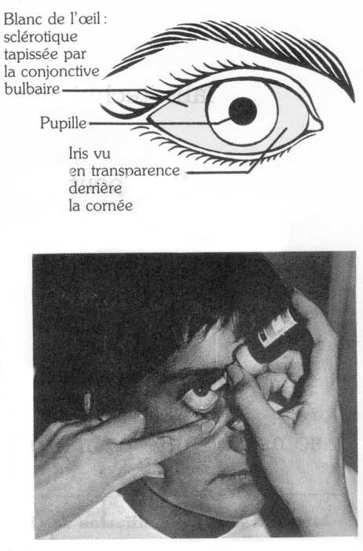
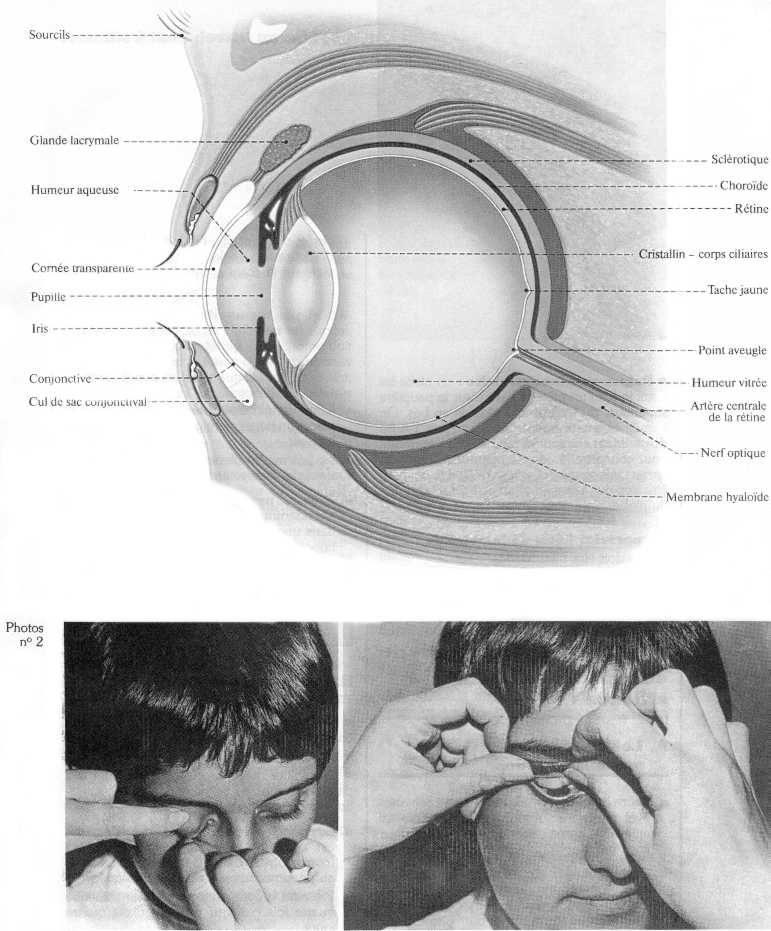
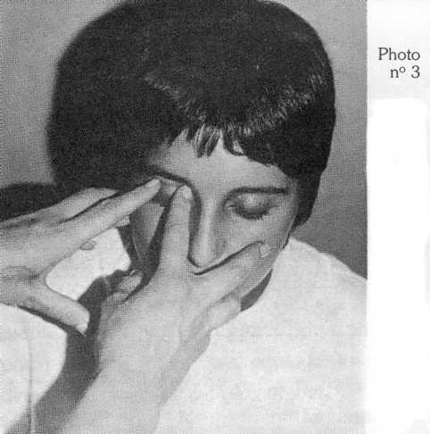
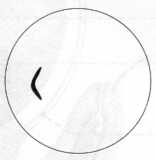
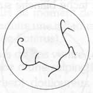

Devant un oeil rouge, l'infirmier non ophtalmologiste:

- pourra, dans certains cas, soulager lui-même le malade,

- devra, dans les cas les plus graves, savoir le diriger, à temps, vers un centre spécialisé,

- aura un rôle capital dans le dépistage et la prévention de nombreuses maladies oculaires.

**Rappel anatomique**

**L'équipement minimum**

un centre de soins devrait comprendre:

- Echelle d'acuité représentant des dessins simples.
- Loupe.
- Lampe électrique.
- Pique à corps étranger.
- Paquets de Fluo-contact (Faure): petits bâtonnets de papier imprégnés de Fluorescéine. Placés dans le cul-de-sac conjonctival inférieur, ils colorent en vert les ulcérations de comée.
- Collyres:

<!-- -->

- anesthésiques: Novésine Chibret  
  Cébésine - Kéracaïne...

- antiglaucomateux: Pilocarpine 2 %

- antibiotiques: Chloramphénicol  
  Rifamycine  
  Gentalline...

<!-- -->

- Pommades antibiotiques: Auréomycine essentiellement.

- Diamox en comprimés, antiglaucomateux.

**Les gestes à connaître**

- **Se laver les mains** entre chaque malade.

- Bien savoir **mettre gouttes et pommade** dans un oeil: faire regarder le malade en haut, pincer la paupière inférieure entre deux doits, et, dans le creux ainsi constitué *(cf. photo n° 1*),

faire tomber la goutte. L'oeil ne contient qu'une goutte, inutile d'en mettre plus.

**Attention :** ne pas toucher le bord de la paupière avec le bout du flacon.

- **Retourner une paupière supérieure:** faire regarder le malade en bas. Pincer les cils très fort entre deux doigts de la main droite, retourner la paupière en se servant de l'index gauche comme pivot *(cf. photos n° 2).*

- **Palper un globe oculaire:** on place les deux index l'un près de l'autre sur la paupière supérieure du malade qui regarde en bas. On appuie alternativement avec l'un puis l'autre doigt. Il faut s'entraîner sur des yeux normaux pour connaître la consistance normale qui est ferme mais souple *(cf. photo n°* 3). Un oeil peut être trop dur (glaucome) ou trop mou (atrophie du globe, plaie perforante).

- **Apprécier l'état de la pupille:**

<!-- -->

- elle doit être bien ronde,

- elle doit se rétrécir quand on éclaire l'oeil.

Cas où l'infirmier peut être immédiatement efficace

**A. Les traumatismes oculaires bénins**

**a.** Corps étrangers dans le cul-de-sac conjonctival supérieur: retourner la paupière et enlever le corps étranger avec le coin d'un linge propre.

**b.** Corps étranger piqué dans la cornée: mettre une goutte de collyre anesthésique. Gratter aussi complètement que possible avec la pique (ou la pointe d'un bistouri), en superficie, sans perforer la cornée.

**c.** Hémorragie sous-conjonctivale par traumatisme direct (ou spontanée). C'est bénin. Il faut surtout rassurer le malade.

**d.** Plaie superficielle de la cornée (par plante, branche d'arbre, griffe d'animal,  
ongle d'enfant ... ): l'oeil est larmoyant et douloureux. La coloration à la Fluo dessine la plaie sur la cornée.

Il faut donner une pommade antibiotique et placer un pansement pendant quarante-huit heures.

Ne pas mettre d'anesthésique, qui calme la douleur, mais retarde la cicatrisation.

**e.** Brûlure par produit chimique: rincer abondamment avec de l'eau bouillie placée dans une seringue: cela donne un jet plus important et plus facile à diriger.

**Attention : un collyre se périme en quinze jours !**

**B. Les conjonctivites**

- En l'absence d'autres lésions, la vision est conservée.

- La cornée n'est pas colorée par la Fluo.

- La douleur n'est pas insupportable: il s'agit plutôt de brûlures, de démangeaisons (sensation de grains de sable).

**a.** La conjonctivite peut être **suppurée:** l'oeil est collé par un écoulement jaunâtre (conjonctivites dues au staphylocoque doré, au pneumocoque, au bacille de Weeks). Prescrire collyre ou pommade antibiotique quatre fois par jour pendant dix à quinze jours.

**b.** Ou **non suppurée,** avec seulement un larmoiement important. L'origine est le plus souvent virale.

La plus douloureuse est la conjonctivite de la **rougeole.** Donner immédiatement un collyre ou une pommade antibiotique car, surtout chez l'enfant mal portant et dénutri, elle peut se propager rapidement à la cornée et aboutir à la perforation et l'atrophie de l'oeil.

**c.** **Insistons particulièrement sur le trachome,** où le rôle de l'infirmier est capital. Dans les pays d'endémie, le trachome doit être dépisté chez le jeune enfant au premier stade. Sur la paupière supérieure retournée, on constate que la conjonctivite est très rouge, parsemée de grains bleuis.

- La conjonctivite trachomateuse (due à une bactérie Chlamydia trachomatis) guérirait facilement avec un traitement immédiat à la pommade Auréomycine: quatre fois par jour pendant quatre à six semaines. Chloramphénicol et Rifamycine sont également efficaces. La Pénicilline est inefficace.

- Mais, sans soins, elle se surinfecte vite (streptocoque, pneumocoque, et surtout bacille de Weeks se propageant par épidémies), entraînant:

***Les complications locales:***

- ulcération de comée,
- rétraction de la paupière: trichiasis.

***La transmission :*** les importantes sécrétions purulentes sont responsables de la contagion

-soit directe par mains et linge entre les membres d'une même famille,

- soit indirecte par l'intermédiaire des mouches.

Donc, outre le traitement, l'infirmier devra donner des **conseils d'hygiène aux familles.**

**Pour toutes les conjonctivites:**

- le seul traitement: pommade ou collyre antibiotique,
- ne jamais donner de corticoïde,
- ne jamais mettre de pansement,
- se laver les mains entre chaque malade.

**C. Les kératites au début**

Ce sont des infections de la cornée.

L'oeil est plus douloureux, plus larmoyant, plus sensible à la lumière que dans les conjonctivites. Il n'est pas purulent.

Parmi les plus graves, citons **l'herpès.** La Fluorescéine dessine sur la cornée une ulcération ramifiée.

Le traitement spécifique est le collyre CébéViran (Chauvin-Blache) ou la pommade Zovirax (Welcome).

En leur absence: enrouler du coton autour du bout d'un instrument fin. L'imbiber d'alcool iodé ou d'éther. Mettre une goutte d'anesthésique. Bien gratter toutes les parties ulcérées avec le coton. Mettre un antibiotique et un pansement.

**Cas où l'infirmier devra** **orienter suffisamment tôt le malade vers un centre** **de soins spécialisés**

**A. Traumatismes oculaires** **importants**

Plaie perforante du globe, ou corps étranger intra-oculaire.

- Palper le globe: il peut être mou.

- Regarder la pupille: si elle est déformée, il peut s'agir d'une hernie de l'iris dans la plaie.

- Mettre une pommade antibiotique, un pansement et essayer de transférer d'urgence.

**B. Atteintes profondes de la** **cornée**

- On voit une tache blanche sur l'oeil.

- La vision est très diminuée.

- Faute de mieux, prescrire une pommade antibiotique et

- un pansement.

**C. Trichiasis**

C'est la déformation de la paupière due au trachome. Les cils frottent sur la cornée entraînant des ulcérations. Le trichiasis doit être traité chirurgicalement.

**D. Infections intra-oculaires** (ou uvéites)

La cause la plus fréquente est l'onchocercose.

- L'oeil est rouge et douloureux.

- L'acuité visuelle est diminuée mais non abolie.

- Le traitement par collyre ou pommade antibiotique n'a donné aucun début d'amélioration en quarante-huit heures.

- Il faut transférer.

**E. Glaucome** (ou hypertonie du globe oculaire)

Insistons sur ce chapitre. Rappelons qu'il existe deux sortes de glaucomes:

1.  Le glaucome **aigu** (40 % des cas environ):

- l'oeil est très douloureux, très rouge,

- la cornée est trouble,

- la vision est abolie,

- à la palpation l'oeil est très dur. Le traitement comprend:

- collyre Pilocarpine 2 %, une goutte toutes les heures,

- Diamox, deux comprimés par jour.

L'oeil atteint est probablement perdu, le traitement servira surtout à diminuer la douleur. Il est **capital** d'envoyer cependant le malade dans un centre spécialisé, pour que **l'autre oeil,** qui risque aussi de faire un glaucome aigu, soit traité à temps chirurgicalement.

2.  Le glaucome **chronique** (60 % des cas environ):

Dans ce cas, le rôle de l'infirmier est capital. En effet, un oeil peut être blanc, peu ou pas douloureux, voir de façon normale, et avoir une tension très importante.

**C'est la palpation systématique du globe** qui donne l'alerte. C'est à ce stade qu'il faut envoyer le malade dans un centre spécialisé pour traitement chirurgical.

Sinon, l'hypertension du globe va irrémédiablement comprimer et atrophier le nerf optique. Quand l'acuité visuelle aura commencé à diminuer, il sera trop tard.

*Développement et Santé, n°48, décembre 1983*
