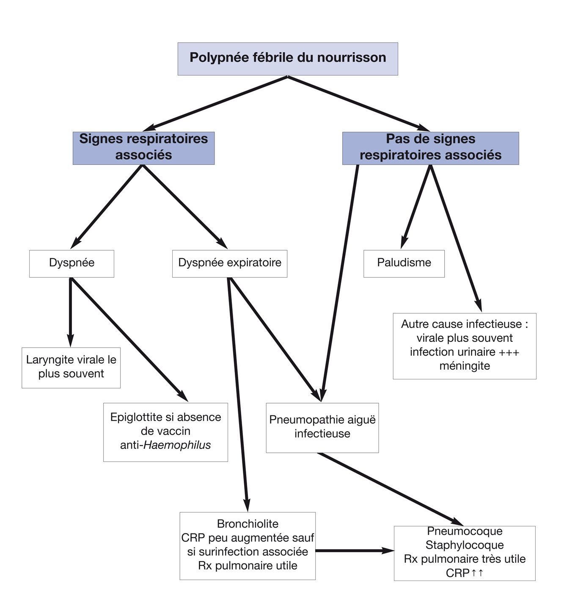
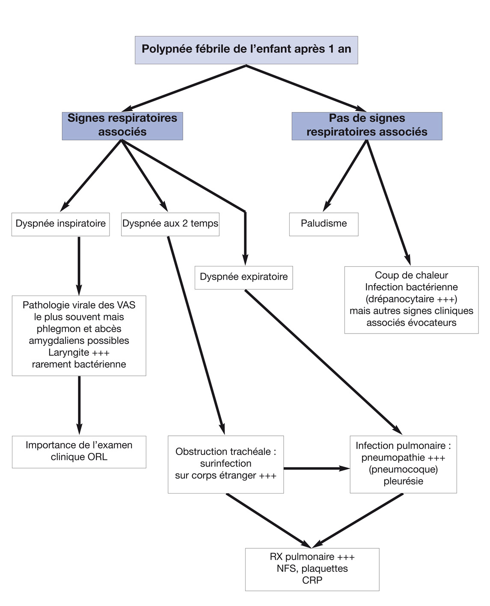

C’est une situation fréquemment rencontrée qui demande une démarche diagnostique précise afin de ne pas passer à côté d’une pneumopathie à Pneumocoque dont le pronostic peut être redoutable, tout particulièrement lorsqu’il s’agit d’un enfant drépanocytaire. Il convient de différencier la conduite à tenir au regard de l’âge de l’enfant, et l’hospitalisation en urgence peut être la seule attitude possible s’il s’agit d’un nourrisson de moins de 3 mois. Toutefois, nous ne prendrons pas en compte la polypnée du nouveau-né (0-1 mois) qui nécessite une conduite particulière décrite dans la pathologie néo-natale.
## Quand parle-t-on de fièvre ?

La température normale est comprise entre 36°5 et 37°5. Entre 37°5 et 38°, il s’agit d’un état subfébrile qui demandera simplement, en l’absence de signe associé, de découvrir l’enfant et de le surveiller. Si la température est supérieure à 38°, il s’agit d’une fièvre. Toute élévation de la température centrale entraîne des signes associés, dont une tachycardie réflexe. La tachycardie se définit pour une fréquence cardiaque supérieure à la valeur en fonction de l’âge, en sachant que si l’enfant est endormi, elle peut être inférieure de 10 % à la borne inférieure.

<table>
<caption>Fréquence cardiaque normale en fonction de l'âge</caption>

<thead>

<tr>

<th scope="col">Age</th>

<th scope="col">FC  =  battements/min</th>

</tr>

</thead>

<tbody>

<tr>

<td>1-12 mois</td>

<td>100 - 160</td>

</tr>

<tr>

<td>1 - 3 ans</td>

<td>90 - 150</td>

</tr>

<tr>

<td>4 - 5 ans</td>

<td>80 - 140</td>

</tr>

<tr>

<td>6 - 12 ans</td>

<td>70 - 120</td>

</tr>

<tr>

<td>13 - 18 ans</td>

<td>60 - 100</td>

</tr>

</tbody>

</table>

Lorsqu’un enfant est fébrile, il est indispensable d’apprécier le degré de tolérance de la fièvre en recherchant des signes associés, dont le temps de recoloration et le degré de déshydratation de l’enfant (très important chez un enfant drépanocytaire).

### Appréciation du degré de déshydratation

Saisir la peau de l’abdomen entre le pouce et l’index, tirer celle-ci et la relâcher rapidement. Observer à l’aide d’un chronomètre à quelle vitesse elle reprend son aspect normal :

*   normalement, la peau reprend immédiatement son état normal, ceci témoigne d’une bonne hydratation ;
*   si le pli cutané persiste et met du temps à retrouver son aspect normal, il peut s’agir d’une déshydratation et/ou d’une dénutrition associée.

<table>

<thead>

<tr>

<th scope="col">Temps de retour  
à l'aspect normal</th>

<th scope="col">Degré de  
déshydratation</th>

</tr>

</thead>

<tbody>

<tr>

<td>< 2 s.</td>

<td>< 5 %</td>

</tr>

<tr>

<td>2 - 3 s.</td>

<td>5 - 8 %</td>

</tr>

<tr>

<td>3 - 4 s.</td>

<td>9 - 10 %</td>

</tr>

<tr>

<td>> 4 s.</td>

<td>> 10 %</td>

</tr>

</tbody>

</table>

### Appréciation de l'état circulatoire par la mesure du temps de recoloration :

Pour mesurer le temps de recoloration, il faut appuyer pendant 5 à 10 secondes sur la pulpe d'un doigt ou sur un ongle puis relâcher.  
On mesure alors le temps que la peau blanchie au point de pression met à reprendre sa couleur antérieure. Normalement, ce temps est inférieur à 2 s.

<table>
<caption>Mesure du temps de recoloration</caption>

<thead>

<tr>

<th scope="col">Temps de  
recoloration (TRC)</th>

<th scope="col">Interprétation</th>

</tr>

</thead>

<tbody>

<tr>

<td>< 2 s.</td>

<td>Normal</td>

</tr>

<tr>

<td>3 - 5 s.</td>

<td>Allongé, urgence</td>

</tr>

<tr>

<td>> 5 s.</td>

<td>Etat de choc</td>

</tr>

</tbody>

</table>

## Comment diagnostiquer une polypnée chez un enfant ?

Quel que soit l’âge de l’enfant, il faut mesurer la polypnée avec un chronomètre (très souvent disponible sur le téléphone portable). Afin d’être le plus précis, il faudra la mesurer sur une minute, en choisissant de débuter sur une inspiration. C’est le cycle respiratoire complet qui correspond à un élément de la mesure de la fréquence respiratoire, c’est-à-dire que la seconde respiration commencera après une inspiration-expiration complète.  
Cette mesure se fait sur un enfant déshabillé afin de bien observer l’ampliation thoracique ; en même temps, il sera possible d’avoir une indication sur les signes de détresse respiratoire associés que nous rappellerons ci-dessous.

On peut, après la mesure de cette fréquence respiratoire, se reporter au tableau ci-dessous qui permettra d’évaluer le degré de gravité, à la fois en fonction de l’augmentation de la fréquence respiratoire et en fonction de l’âge.

<table>

<thead>

<tr>

<th scope="col">Age de l'enfant</th>

<th scope="col">FR au repos (/min)</th>

</tr>

</thead>

<tbody>

<tr>

<td>1 - 12 mois</td>

<td>30 - 60</td>

</tr>

<tr>

<td>1 - 3 ans</td>

<td>24 - 40</td>

</tr>

<tr>

<td>4 - 5 ans</td>

<td>22 - 34</td>

</tr>

<tr>

<td>6 - 12 ans</td>

<td>18 - 30</td>

</tr>

<tr>

<td>13 - 18 ans</td>

<td>12 - 16</td>

</tr>

</tbody>

</table>

La polypnée se définira donc comme une valeur supérieure à celle indiquée ci-dessus en fonction de l’âge. Il faut savoir que la polypnée peut être simplement un symptôme associé à la fièvre et ne pas témoigner nécessairement d’une affection pulmonaire ou cardiaque associée. L‘examen clinique est donc important et c’est lui qui permet d’orienter la démarche diagnostique et thérapeutique.

Il faut **rechercher des signes associés** qui peuvent être absents mais qui, s’ils sont retrouvés, permettent une orientation diagnostique plus facile :

*   battements des ailes du nez (dilatation inspiratoire des orifices narinaires) ;
*   tirage sus-sternal, intercostal, sous-costal ;
*   wheezing : bruit aigu ressemblant à un sifflement perçu à distance (sans stéthoscope) lors des deux temps de la respiration et témoignant d'un rétrécissement des voies aériennes ;
*   dyspnée inspiratoire évoquant une obstruction des voies aériennes supérieures, associée parfois à un tirage sous-mandibulaire, un phlegmon pharyngé, une laryngite (cause fréquente, se méfier de l’épiglottite si l’enfant n’est pas vacciné contre _l’Haemophilus_ Ib, surtout en cas de drépanocytose) ;
*   dyspnée expiratoire faisant évoquer une obstruction des voies aériennes inférieures ;  
    sueurs ;

*   difficultés à la prise du sein ou du biberon+++, signe de dyspnée à l’effort..

## Quel matériel et quels examens complémentaires avoir à sa disposition ?

*   Stéthoscope
*   Otoscope pour regarder les tympans
*   Abaisse-langue
*   Chronomètre (le plus souvent disponible sur le téléphone mobile)

**Dans la mesure du possible, l’idéal est de pouvoir pratiquer facilement les examens suivants** :

*   NFS, plaquettes 
*   Recherche de paludisme par examen de la lame 
*   CRP
*   Bandelette urinaire (nitrites, leucocytes)
*   Radio pulmonaire
*   Examen des tympans avec un otoscope

## Orientations diagnostiques possibles devant une polypnée fébrile chez l’enfant

Nous tenons à souligner que cet arbre diagnostique n'est pas exhaustif et que nous avons mis en évidence les schémas les plus courants à côté desquels il ne faut absolument pas passer, ce d’autant qu’une fois le diagnostic établi, le traitement curatif est le plus souvent connu et facile à mettre en place, même sans hospitaliser l’enfant.

