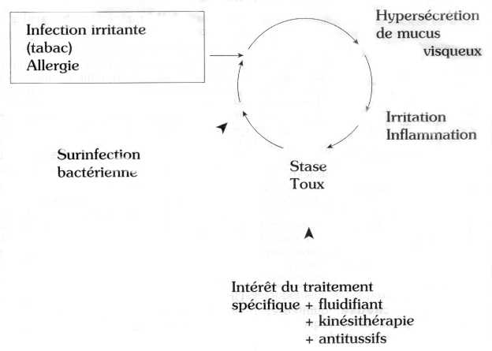

La toux est un brusque et violent courant d'air qui vient déloger les débris gênant l'écoulement de l'air dans l'arbre respiratoire. C'est donc un mécanisme de défense de notre organisme qui peut être gênant s'il est durable, mais qu'il peut être très dangereux d'enrayer (le risque alors est l'asphyxie par encombrement).

La toux comporte quatre temps :

*   inspiration profonde,
*   fermeture de la glotte,
*   expulsion brutale d'une masse d'air comprimée pendant la phase précédente,
*   inspiration prolongée.

Au cours de ces phases, le débit respiratoire peut être multiplié par trois ou quatre ; la pression intrathoracique et intra-abdominale s'élève beaucoup (risque de hernie inguinale ou de pneumothorax chez le tousseur chronique), la trachée diminue de calibre. Enfin la vitesse de l'air expiré peut atteindre dans la trachée deux cent quatre-vingts mètres/seconde ! (soit 85 % de la vitesse du son).

## **I. Mise en jeu du réflexe** **de la toux**

Le réflexe tussigène prend naissance au niveau de récepteurs situés au niveau du larynx, de la bifurcation trachéale, des divisions bronchiques (et de l'oreille). L'influx nerveux gagne le bulbe rachidien. Le centre de la toux est proche du centre commandant les vomissements (explication des toux émétisantes).

## **II. Différents types de toux**

*   La **toux coquelucheuse,** quinteuse, spasmodique, est typique de la coqueluche. Elle peut aussi se voir au cours de certaines viroses et d'inhalation de corps étrangers.

*   La **toux sèche** évoque le tabagisme, les bronchites virales, mais aussi l'asthme, la tuberculose et le cancer bronchique.

*   La **toux grasse** témoigne d'un encombrement important dont les causes sont multiples :

- ORL : pharyngite, sinusite,

- bronchite chronique++,

- dilatation des bronches,

- tuberculose excavée,

- fausses-routes.

*   La **toux rauque** aboyante est évocatrice d'une laryngite sous-glottique si la voix est claire. Elle doit faire redouter le croup si la voix est éteinte.

*   La **toux faible,** répétitive, évoque l'insuffisance cardiaque.

## **III. Les causes**

Toute la pathologie respiratoire peut provoquer une toux ! Quelques causes cependant méritent d'être rappelées :

*   Chez **l'enfant** une toux uniquement nocturne peut évoquer :

*   soit un asthme,
*   soit un reflux gastro-oesophagien.

*   Chez **l'adulte,** une toux prolongée doit faire penser à une complication pulmonaire du sida (tuberculose++).

Une toux sèche, prolongée, ne survenant jamais pendant le sommeil, doit faire penser à une toux psychogène (tics de l'enfant et de l'adolescent++).

## **IV. Les traitements** **antitussifs**

Ils sont uniquement symptomatiques et doivent en principe être administrés une fois la cause précisée.

En cas d'infection, la priorité est aux :

*   **Antibiotiques**

Pour une pneumonie, en effet, les crachats purulents sont d'autant plus " collants " qu'ils sont riches en débris de polynucléaires dont le nombre est proportionnel à l'infection.

En cas d'asthme, le traitement doit d'abord comporter :

*   **Bronchodilatateurs et antiallergiques pour un asthme**

(Ventoline®, Lomudal®, Zaditen®)

Si la toux est grasse, les mucolytiques (N. Acétyl-cystéine) et la kinésithérapie peuvent être utiles.

### **1. Antitussifs centraux**

Ce sont essentiellement les dérivés de la morphine : la codéine contre-indiquée chez l'enfant de moins de trente mois, est très efficace mais peut déprimer le centre respiratoire (danger chez le sujet âgé).

Chez l'enfant, on lui préfère les sédatifs : antihistaminiques type Théralène® ou Phénergan®.

### **2. Antitussifs périphériques**

Ils agissent sur les récepteurs muqueux trachéobronchiques ; les plus efficaces sont, en fait, les :

- antiallergiques (Lomudal®)

- anti-inflammatoires (corticoïdes inhalés), et les

- bronchodilatateurs (Ventoline®).

**Conclusion**

Si l'appareil mucociliaire se charge en permanence de la toilette bronchique, la toux est un système de secours lorsque l'appareil est " débordé ".

Il faut donc laisser agir ce moyen naturel de défense à moins que celui-ci ne perturbe le sommeil et la vie courante.

Si la toux peut être gênante, voire constituer un handicap en perturbant le travail et le sommeil, elle peut justifier un traitement antitussif.

Par contre, si elle est récente et grasse (productive), il faut la respecter surtout aux âges extrêmes de la vie puisqu'elle a pour rôle vital de libérer les voies aériennes.

_Développement et Santé, n°120, décembre 1995_