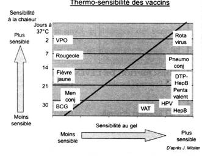
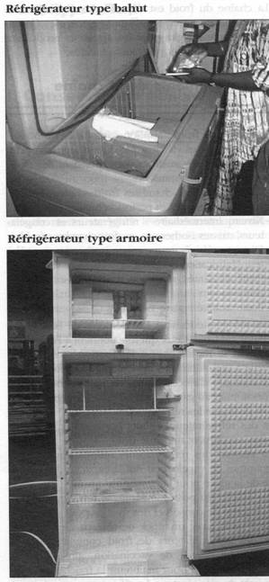
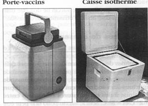
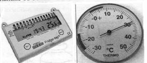
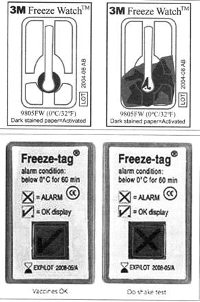
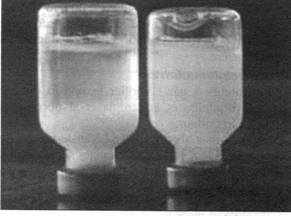

## I. Conservation des vaccins

### 1. Stabilité des vaccins

La connaissance de la thermostabilité des vaccins est nécessaire pour assurer leur innocuité (c'est-à-dire leur absence de nuisance) et leur efficacité. Elle permet au responsable de la gestion des vaccins de mettre en place les conditions optimales de leur conservation au moyen d'une chaîne du froid adaptée.  
La chaleur et le gel ont des effets irrémédiables sur le potentiel immunogène du vaccin. Cependant, si l'accumulation à des températures supérieures aux normes (8° C) a un effet progressif sur tous les vaccins, une seule exposition au gel peut détruire de façon irrémédiable l'immunogénicité de certains vaccins. Il est donc nécessaire de limiter les expositions des vaccins à des températures supérieures à + 8° C et indispensable de protéger les vaccins sensibles au gel contre des températures inférieures à 0° C.

#### a) Vaccins sensibles à la chaleur

Tous les vaccins sont sensibles à la chaleur mais à des degrés divers. Ainsi, certains peuvent supporter des températures de 37° C plus de 4 semaines en gardant leur potentiel immunogène (hépatite B, diphtérie, anatoxine antitétanique, HPV ou papillomavirus humain). D'autres ont une stabilité moyenne et supportent des températures de 37° C pendant des périodes allant de 1 à 3 semaines (rougeole, fièvre jaune, BCG). Enfin, certains sont rapidement altérés lors d'expositions à des températures supérieures à 8° C pendant plus de 24 à 48 heures (vaccin polio oral).  
Chaque exposition à des températures supérieures à + 8° C a un effet cumulatif sur le potentiel immunogène des vaccins.  
Après reconstitution, les vaccins lyophilisés (rougeole, fièvre jaune, BCG) sont très instables en raison de l'absence de stabilisateurs dans leur composition. Reconstitués, ils doivent être conservés à une température maximale de + g° C, utilisés dans un délai de 6 heures et détruits passé ce délai. Les diluants doivent être rafraîchis avant reconstitution afin de préserver la qualité du vaccin.

Le strict respect de ces règles est nécessaire non seulement pour préserver le potentiel du vaccin mais aussi pour limiter les risques de contamination.

#### b) Vaccins sensibles au gel

Quelques minutes d'exposition à des températures négatives peuvent détruire certains vaccins qui contiennent des adjuvants type sels d'aluminium, comme le vaccin contre la diphtérie, le tétanos et la coqueluche ainsi que le vaccin contre l'hépatite B. Le gel de ces substances provoque leur agglomération et affecte l'immunogénicité du vaccin. Le chan¬gement de l'apparence physique du vaccin est mis en évidence grâce au test d'agitation du flacon qui permet de vérifier si un vaccin a été exposé au gel.  
La plupart des expositions au gel surviennent lors du transport d'un dépôt à l'autre ou au cours de la nuit dans les dépôts au niveau périphérique.

  

#### c) Vaccins sensibles à la lumière

Les vaccins BCG et anti rougeoleux sont sensibles aux rayons ultraviolets. Même si leurs flacons sont teintés, il est nécessaire de les protéger de l'exposition à la lumière (soleil ou néon), particulièrement après leur reconstitution. Au cours de la séance de vaccination, ils doivent donc être conservés dans le porte vaccin, dans la mousse prévue à cet effet.

#### d) Date limite d'utilisation

La date limite d'utilisation de chaque vaccin est déterminée par le fabricant en fonction de sa composition et de sa stabilité. Elle est propre à chaque lot de vaccin et indiquée sur l'étiquette apposée sur le flacon. De la même façon que le numéro de lot, elle doit apparaître dans le registre de stock des vaccins.  
En aucun cas un flacon de vaccin ne doit être utilisé lorsque la date limite d'utilisation est dépassée.

### 2. Normes de conservation des vaccins

Les normes de conservation des vaccins sont définies par le fabricant et le programme national de vaccination. **Actuellement, l'OMS recommande que tous les vaccins soient conservés de façon continue à des températures comprises entre + 2° C et + 8° C.** Seul le vaccin polio oral peut être conservé à des températures négatives dans les dépôts au niveau national ou régional. Les diluants doivent être conservés à température ambiante. Seuls ceux qui serviront à la reconstitution des flacons de vaccins lyophilisés lors de la prochaine séance de vaccination doivent être rafraîchis dans le réfrigérateur afin de préserver la qualité du vaccin reconstitué.  
Le rangement correct des vaccins dans les équipements de la chaîne du froid contribue à leur qualité. Il est organisé en fonction de la thermosensibilité des vaccins. Les vaccins sensibles au gel ne doivent pas être en contact avec les parois des réfrigérateurs. Ils sont disposés sur les étagères du bas dans les réfrigéràtéurs verticaux ou les étagères du haut dans les réfrigérateurs horizontaux.  
Les vaccins les plus sensibles à la chaleur sont disposés à proximité des éléments producteurs de froid (partie haute dans les réfrigérateurs verticaux et partie basse dans les réfrigérateurs horizontaux).  
Les flacons de vaccins ouverts pouvant être conservés doivent être clairement signalés et disposés dans un plateau, la date d'ouverture étant inscrite sur l'étiquette. Ils seront utilisés en priorité lors de la séance de vaccination suivante.

## II. La chaîne du froid

La chaîne du froid est un système qui garantit la qualité des vaccins depuis leur fabrication jusqu'à leur point d'utilisation. Elle est composée d'équipe¬ments (réfrigérateurs, congélateurs, glacières), de personnes (logisticiens, responsables des vaccins) et doit répondre à des normes et à des procédures.  
La chaîne du froid est dépendante d'un approvisionnement continu et suffisant en énergie : électricité, pétrole ou gaz pour les appareils produisant le froid et carburant pour les véhicules.

### 1. Equipements de la chaîne du froid

La chaîne du froid s'applique aussi bien au niveau du stockage des vaccins que durant leur transport. A chacun de ses maillons correspondent des équipements et des normes.

*   Niveau central : chambres froides, congélateurs, caisses isothermes et parfois véhicules réfrigérés.  
*   Niveau intermédiaire : réfrigérateurs et congélateurs, caisses isothermes, parfois chambres froides.  
*   District : réfrigérateurs, caisse isotherme, congélateur (fabrication de glace).  
*   Poste de santé : réfrigérateur, caisse isotherme et porte-vaccin.  
*   Poste avancé : porte-vaccin.

Les réfrigérateurs sont les éléments de base de la chaîne du froid. Ceux qui fonctionnent à l'électricité coûtent le moins cher à l'utilisation et sont plus facile à entretenir. En l'absence de fourniture fiable et continue d'électricité, les réfrigérateurs peuvent fonctionner au gaz, au pétrole ou à l'énergie solaire. On distingue les réfrigérateurs "armoires" verticaux et des réfrigérateurs bahuts horizontaux. Ces derniers conservent mieux le froid.  
La plupart des réfrigérateurs utilisés par les programmes de vaccination ont la capacité de produire de la glace pour la stratégie avancée.  
Au niveau du poste de santé, le réfrigérateur doit permettre de conserver des vaccins pour une durée de 1 mois, avec un stock de réserve ; les diluants et des accumulateurs de froid congelés pour la prochaine séance de vaccination, ainsi que des bouteilles d'eau pour maintenir la fraîcheur en cas d'arrêt du réfrigérateur. Le réfrigérateur ne doit pas être rempli à plus de la moitié de sa capacité afin de laisser l'air circuler.

**Règles pour la bonne conservation des vaccins dans le réfrigérateur :**

*   Ne pas placer les vaccins sensibles au gel près des parois.  
*   Eviter d'ouvrir trop fréquemment la porte.  
*   Ne pas conserver d'aliments ni de boissons.  
*   Vérifier régulièrement la température et ajuster le thermostat.  
*   Respecter la règle du "premier expiré, premier sorti".

Le congélateur sert à la production de glace utilisée pour le transport des vaccins et pour les activités en stratégie mobile ou avancée.  
La caisse isotherme ou glacière et le porte-vaccin ne produisent pas de froid mais le maintiennent pendant plusieurs heures ou plusieurs jours selon leur contenu et l'épaisseur de leur paroi. La caisse isotherme est utilisée pour le transport des vaccins ou des accumulateurs de froid. Elle peut aussi servir à conserver des vaccins lors d'arrêt des équipements produisant du froid. C'est principalement pour cet usage que chaque dépôt et chaque poste de santé doivent en disposer. Le porte-vaccin est utilisé pour le transport des vaccins depuis le dépôt de district ou lors des séances de vaccination.

_La température dans une caisse isotherme chargée d'accumulateurs de froid sortant du congélateur sera inférieure à 0° C, mettant les vaccins sensibles au gel en danger. Afin de ne pas exposer les vaccins au gel, il est nécessaire de condi-tionner les accumulateurs de froid (les réchauffer) avant de les mettre dans la caisse._

### 2. Organisation de la chaîne du froid

La chaîne du froid rapide repose sur les capacités de transport plutôt que de stockage de la chaîne du froid. Elle est utilisée pour les campagnes de vaccination, en l'absence d'infrastructures ou de fourniture d'énergie sûres, et l'acheminement des échantillons biologiques destinés à la surveillance épidémiologique.  
Elle permet de se passer d'entrepôts intermédiaires et de limiter les stocks à tous les niveaux. Elle nécessite une bonne capacité de gestion des stocks de vac-cins et diluants et des moyens de transport sûrs.  
La chaîne du froid lente est le plus souvent utilisée dans les programmes de vaccination. Elle repose sur le principe du stockage des vaccins dans des entre-pôts intermédiaires et périphériques. Elle augmente les besoins en équipements producteurs de froid et la quantité de vaccins immobilisés dans le pays.

### 3. Maintenance de la chaîne du froid

La maintenance de la chaîne du froid permet de maintenir la continuité de l'activité de vaccination et d'en limiter le coût. Elle repose sur deux principes : assurer le bon fonctionnement des équipements (réfrigérateurs, congélateurs, véhicules) et limiter l'impact de leur arrêt sur la qualité des vaccins et la couverture vaccinale. Elle est organisée en maintenance préventive et en maintenance correctrice.

#### a) Maintenance préventive

La maintenance préventive permet de maintenir les équipements en état de fonctionnement correct et d'en prolonger la vie. C'est une activité routinière ét systématique réalisée par l'opérateur des équipements. Elle respecte un programme déterminé :

*   Tâches journalières
    *   Nettoyer l'appareil et le local l'abritant.  
    *   Relever la température matin et soir et le weekend.  
    *   Ajuster le thermostat si nécessaire (appareil électrique, à gaz).  
    *   S'assurer que les vaccins sont correctement disposés.  
    *   Contrôler et régler la flamme et la mèche (appareils à absorption).  
    *   Après utilisation, les caisses isothermes et les porte-vaccins doivent être nettoyés, séchés et entreposés en laissant le couvercle ouvert. Vérifier en particulier le joint du couvercle, car toute défaillance à ce niveau raccourcira l'autonomie de la glacière.  
*   Tâches hebdomadaires
    *   Réfrigérateurs à gaz : vérifier le niveau du gaz dans la, bouteille et la remplacer si nécessaire, nettoyer le brûleur.  
    *   Réfrigérateurs à absorption : vérifier le niveau de pétrole dans le réservoir ; compléter si nécessaire. Vérifier la mèche, éliminer la calamine sur la mèche, nettoyer la cheminée.  
    *   Eliminer le givre si son épaisseur dépasse 1 cm puis assécher l'intérieur.  
*   Tâches mensuelles
    *   Nettoyer le serpentin du condensateur à l'arrière du réfrigérateur et épousseter les alentours du compresseur (chiffon sec, brosse souple). Retoucher la peinture des parois externes du réfrigérateur (au besoin).  
    *   Nettoyer l'intérieur du réfrigérateur et l'assécher à l'aide d'un chiffon.  
    *   Nettoyer le joint de la porte, en particulier le long du bord inférieur des appareils verticaux.

#### b) Maintenance correctrice

La maintenance correctrice comprend les activités à mener après une panne d'un équipement de chaîne du froid afin de le ramener à un état de fonctionnement normal.  
Afin de limiter les risques de détérioration des vaccins et de réduire les délais de remise en état des appareils, la maintenance correctrice doit être planifiée et des fonds doivent être réservés pour sa réalisation. Elle est effectuée par un technicien de maintenance qualifié et équipé des outils adéquats et connaissant les différents appareils.

### 3. Suivi de la température de la chaîne du froid

Le suivi de la température est l'un des rôles majeurs des opérateurs de la chaîne du froid. Il garantit la qualité des vaccins en assurant la fiabilité du main-tien des températures requises pour leur conservation. Le suivi de la température s'effectue deux fois par jour y compris les week-ends et jours fériés.

#### a) Dispositifs de suivi de la température

Il existe plusieurs dispositifs adaptés à chaque maillon de la chaîne du froid :

**Thermomètre**  
C'est l'élément indispensable au suivi de la température. Il peut se présenter sous différentes formes : à cadran, à cristaux liquides, digital, enregistreur.  
Il doit être disposé dans la partie centrale du réfrigérateur. Son fonctionnement correct doit être vérifié régulièrement en comparant ses mesures avec un autre thermomètre. Les mesures indiquées doivent être rapportées au moins deux fois par jour sur une feuille de suivi de la température. Une mesure hors des normes exigées [+ 2° C - + 8° C] doit amener à des actions appropriées (ex : réglage de la flamme ou du thermostat).

**Indicateur d'alerte à la congélation**  
Il est présenté sous la forme d'un petit flacon de liquide rouge collé sur une feuille en carton. Lorsque l'indicateur est exposé au gel durant plus d'une heure, le flacon se brise, répandant le liquide dans sa poche en plastique. L'intégrité des vaccins sensibles au gel doit alors être vérifiée (test d'agitation). Ces indicateurs existent en version électronique. Un signe indique alors l'exposition à des températures négatives supérieure à 60 minutes.

**Pastille de contrôle des vaccins**  
II s'agit d'un dispositif apposé sur l'étiquette ou sur le capuchon des flacons de vaccins. La couleur de la pastille varie en fonction de son exposition à la chaleur. Lorsque la couleur de la partie centrale est comparable ou plus sombre que la partie externe, le seuil de tolérance du vaccin à la chaleur est atteint, affectant sa stabilité. Le vaccin contenu dans le flacon ne doit plus être utilisé.

**Test d'agitation**  
Le test d'agitation permet de vérifier si le vaccin contenu dans un flacon soumis au gel a été affecté. Il doit être conduit sur tout flacon de vaccin sen¬sible au gel (pentavalent, DTC, VAT) dont on suspecte qu'il a été exposé à des températures négatives.

*   Prendre 2 flacons du même vaccin provenant du même fabricant ; un que vous suspectez avoir été congelé (test), l'autre que vous savez ne jamais avoir été congelé (témoin).  
*   Agiter les 2 flacons pendant 30 secondes.  
*   Les déposer sur une table et attendre 10 minutes.  
*   Vérifier l'aspect du contenu des 2 flacons.  
*   Si la sédimentation du contenu du flacon test est nette comparée au flacon témoin, le flacon test a été exposé au gel, affectant la stabilité du vaccin. Le vaccin ne doit pas être utilisé. Il doit être détruit.

**A gauche, flacon exposé au gel. Ne pas utiliser.**  

### b) Conduite à tenir en cas de rupture de la chaîne du froid

En cas de rupture de la chaîne du froid, la première action à mener est de protéger les vaccins puis de réparer la panne.

#### Protection des vaccins

Retirer les vaccins du réfrigérateur. Si le problème peut être rapidement résolu, disposer les vaccins dans une glacière ou dans des porte-vaccins avec des accumulateurs de froid ou des bouteilles d'eau rafraîchies, en veillant à protéger les vaccins sensibles au gel (pas de contact avec les accumulateurs de froid congelés). Si la panne risque de durer, entreposer les vaccins dans un autre réfrigérateur.  
Les arrêts de fonctionnement de réfrigérateurs sont fréquents et peuvent être dus à plusieurs raisons. Il est donc indispensable de prévoir un plan de contingence afin de garantir la qualité des vaccins et la poursuite des activités de vaccination.

#### Remise en état du réfrigérateur

Vérifier l'alimentation en électricité ou en combustible. En cas de coupure de courant prolongée, prenez les dispositions jusqu'à ce que l'électricité revienne.  
Si la cause n'est pas un problème d'alimentation électrique ou combustible, réparez la panne ou prévenez l'agent de maintenance identifié pour une intervention rapide.

**Références bibliographiques :**  
- Temperature sensitivity of vaccines. WHO/IVB/06.10 ; World Health Organization, 2006.  
- Immunization in practice - A practical guide forhealth stqff.; World Health Organization, 2004.  
- EPI Essentials - A guide for program officers. jSI,1989.  
- Training course for mid level managers. World Health Organization, 2004.  
- EPIVAC, [www.epivac.org](http://www.epivac.org "www.epivac.org")

Développement et Santé, n°195, 2009