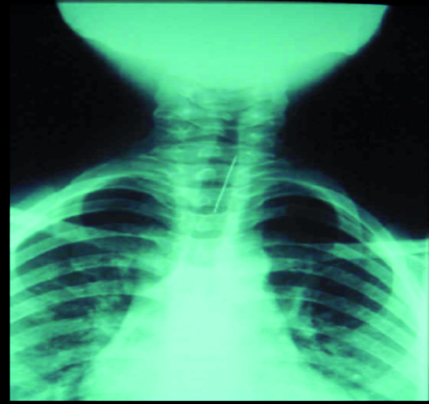
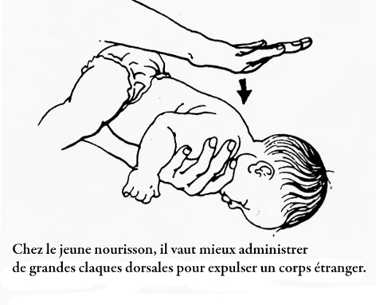
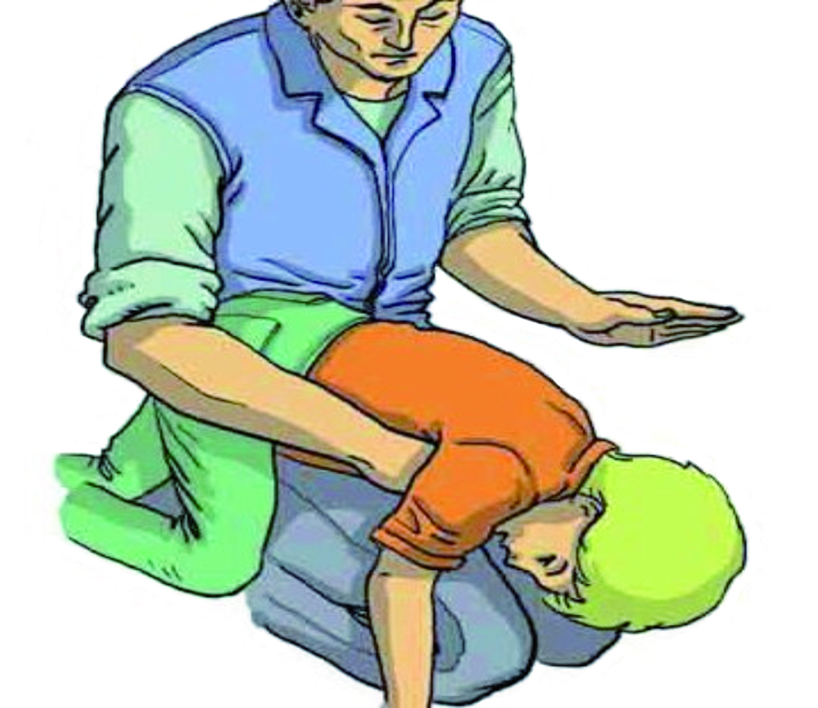
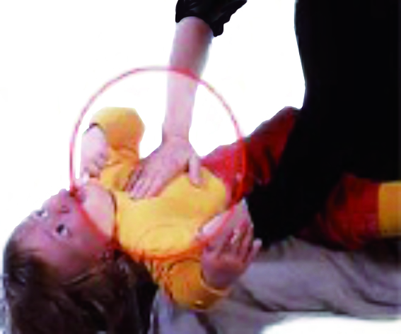
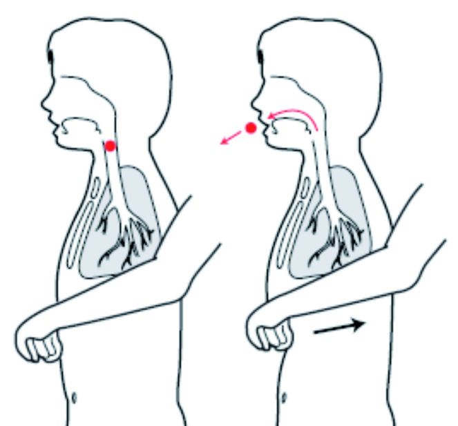

## I. Anatomie des voies aériennes supérieures

Vis-à-vis de l'inhalation d'un corps étranger (CE), de ses risques et de sa symptomatologie, trois étages sont à différencier dans l'axe aérien.

### 1. L'étage glotto-sous-glottique

Il correspond à l’ouverture des voies aériennes au niveau du carrefour aérodigestif supérieur. Il est représenté par le larynx, dont l'épiglotte chez le jeune enfant est particulièrement haute, parfois tubulée ou flaccide. En arrière, les aryténoïdes peuvent être proéminents, très mobiles, réalisant lors de l'inspiration un phénomène de stridor. En ce qui concerne les diamètres, la partie la plus étroite est la sous-glotte, correspondant à l'anneau cricoïdien ; chez le nourrisson, elle est d'environ 6 mm (12 à 19 mm chez l’adulte).

### 2. La trachée

Chez le nourrisson, elle fait en moyenne quatre centimètres (trachée adulte : 10 à 14 cm). Le diamètre trachéal est de 7 mm (25 mm chez adulte).

### 3. Les bronches souches

Elles ont une longueur d'environ 2,5 cm chez le nourrisson pour un diamètre compris entre 3 et 4 mm (adulte : 16 mm). La réactivité des voies aériennes peut provoquer un spasme lors de la stimulation endobuccale, laryngée, trachéale ou bronchique. Cette réactivité est particulièrement exacerbée au cours des infections ORL. Les faibles réserves en oxygène de l'enfant entraînent une désaturation oxyhémoglobinée rapide pouvant entraîner un arrêt cardiaque.  
Le revêtement muqueux est épais et très sensible à toute stimulation qui entraîne saignement et surtout oedème. Compte tenu du faible diamètre de départ et de la relation entre les résistances des voies aériennes et leur rayon (les résistances augmentent de façon inverse à la puissance quatrième du rayon : loi de Poiseuille), 1 mm d'oedème au niveau de la sous-glotte entraîne une diminution de son diamètre de 33 %, de sa surface de 55 % et des débits aériens de 80 %.

Ces considérations, associées aux autres facteurs de précarité de la ventilation du jeune enfant (mécanique ventilatoire peu performante, immaturité du système nerveux central, consommation d'O2 élevée, etc.) aboutissent très rapidement à une fatigue  
respiratoire et à une hypoxie.  
Ainsi, surtout chez le jeune enfant, la protection des voies aériennes est anatomiquement bien assurée par un “bouclier” laryngé relativement imperméable et dont la réactivité s'exprimant par une toux prolongée peut en imposer pour un syndrome de pénétration.

## II. Généralités

### 1. Terrain

Chez l'enfant, c'est le petit garçon qui paie le plus lourd tribut (2/3 des cas). Ces accidents surviennent dès l'âge de la préhension  
(6 à 9 mois) et atteignent un pic au cours de la deuxième année. Le risque diminue ensuite pour de nouveau augmenter  
vers l'âge de 6-8 ans (jeux).

### 2. Type de corps étrangers

La cacahuète demeure l'ennemi public numéro un. Dans la plupart des statistiques, elle représente plus de 50 % des corps  
étrangers inhalés chez l'enfant. Les autres végétaux, oléagineux en particulier (noix, noisettes, amandes) représentent 20 à 25 % des inhalations accidentelles. Les objets métalliques (aiguilles) sont en nette régression, remplacés par les objets en plastique (15 %) (jetons, perles).

### 3. Événements favorisant l'inhalation

L'inhalation est, dans la quasi-totalité des cas, favorisée par une inspiration soudaine et profonde (peur, surprise, sanglot, quinte  
de toux, etc.).  
Trois types de circonstances peuvent être décrits :

1.  aliment inhalé par un sujet dont “la bouche est pleine” et qui est contraint de “reprendre sa respiration” ;
2.  objet introduit dans la bouche et inhalé fortuitement à l'occasion d'un choc, d'un effet de surprise, etc. (capuchon de stylo, bonbon par exemple) ;
3.  inhalation d'un jouet ou d'un fragment de jouet nécessitant des efforts inspiratoires (embout de trompette, fléchettes de sarbacane, etc.).

## 

    

## III. Localisation des CE inhalés

**Pronostic vital si enclavement du CE en sous-glottique (risque d'arrêt cardio-respiratoire)**

**Essentiellement bronchique** : 75 % des cas, deux fois plus fréquent à droite en raison de la disposition anatomique (la bronche droite est plus verticale, presque dans l'axe de la trachée ; angles bronchiques avec l'axe trachéal de 30° à droite et 45° à gauche, calibre légèrement supérieur à la bronche souche gauche). Le CE peut ensuite migrer jusqu'à la bronche segmentaire  
correspondant à son calibre. Selon sa nature, il peut soit se remobiliser (migration dans une autre bronche homo ou controlatérale), soit s'enclaver, ce qui demeure l'éventualité la plus fréquente après la phase aiguë.

**Parfois trachéal** : 15 % des cas (un CE qui reste trachéal est le plus souvent mobile. Le risque majeur de cette localisation est l'enclavement au niveau de la sous-glotte après un effort de toux ou une manoeuvre d'extraction externe malencontreuse).

**Parfois laryngé** : 10 % des cas. Les corps étrangers inhalés peuvent migrer (jusqu'à la bronche segmentaire correspondant  
à leur calibre), changer de localisation ou s'enclaver.

Il faut distinguer le corps étranger laryngé et le corps étranger trachéobronchique, tant sur le plan sémiologique que sur celui  
de l'urgence.

### 1. Corps étranger laryngé

Il est particulier en raison de la gravité du tableau clinique et du risque de blocage dans la région glottique et sous-glottique (cricoïdienne), zones de rétrécissement anatomique.  
Le tableau clinique est dramatique, réalisant :

*   Soit une asphyxie aiguë, immédiate, foudroyante.  
*   Soit une dyspnée laryngée majeure d'installation brutale avec tirage très intense, aphonie et cyanose importante.

Ce tableau, rebelle au traitement corticoïde, nécessite une extraction de toute urgence sous endoscopie, par les voies naturelles. L'extraction par voie endoscopique est impérative, de toute urgence. Elle nécessite un centre spécialisé, une instrumentation  
complète, un opérateur entraîné et la collaboration  
étroite d'un anesthésiste réanimateur.  
Seule, en cas d'asphyxie suraiguë avec mort imminente, la manoeuvre de Heimlich pourra être tentée : une pression brusque de la région épigastrique peut permettre l'expulsion par l'élévation diaphragmatique et l'hyperpression pulmonaire qu'elle

Le diagnostic différentiel est aisé :

*   La laryngite striduleuse — accès de dyspnée laryngée brutal, passager, spontanément réduit —, est différente d'un syndrome de pénétration. Elle survient en général la nuit.  
*   L'épiglottite associe un syndrome fébrile intense, une dysphagie et une dyspnée progressive aboutissant à une détresse respiratoire rapide.

### 2. Corps étranger trachéo-bronchique

Les symptômes et l'évolution sont différents. Certes, la symptomatologie initiale est alarmante, très particulière, stéréotypée, quasi pathognomonique. Mais bien souvent, l'épisode aigu inaugural a été méconnu ou oublié; le diagnostic peut être difficile, fonction des données de l'anamnèse, de l'examen clinique et de la radiographie. Il faudra toujours évoquer la possibilité d'un corps étranger devant une symptomatologie bronchopulmonaire aiguë, récidivante, surtout si elle reste localisée à un même territoire (segment, lobe ou poumon entier).  
Le diagnostic repose sur la notion d'un syndrome de pénétration. Elément fondamental, donnée de l'interrogatoire, le syndrome de pénétration est un accès de suffocation brutal, inopiné et spontanément résolutif, survenant chez un enfant en bonne santé. Il est associé à des quintes de toux violentes, expulsives, angoissantes avec tirage et cornage. Il est en règle diurne. Ce syndrome très fugace (quelques minutes) est caractéristique de l'inhalation d'un corps étranger dans les voies aériennes inférieures. Il impose à lui seul un examen endoscopique dans les meilleurs délais.

## IV. Signes cliniques

L'irruption d'un CE dans les voies aériennes est toujours marquée par un syndrome clinique de grande valeur diagnostique :  
le syndrome de pénétration.  
Quel que soit le CE, ce syndrome existe toujours, même s'il est plus ou moins intense. Il est souvent évident lorsque des témoins  
sont présents mais il peut être méconnu, surtout chez l'enfant jeune.  
Ce syndrome de pénétration est marqué par la survenue brutale d'un accès de suffocation suivi immédiatement de quintes de toux expulsives puis d'un tirage inspiratoire entre les quintes. Une apnée de quelques secondes avec apparition rapide d'une cyanose est possible.  
Dans la plupart des cas, le syndrome de pénétration est un accident brutal et bruyant chez un enfant apyrétique en excellente santé. Ses efforts de toux associés à une rougeur ou une cyanose de la face et une suffocation intense sont caractéristiques, mais tout peut se réduire à quelques secousses de toux, tout rentrant dans l'ordre en quelques minutes. Le syndrome de pénétration est noté dans 70 à 85 % des cas, mais il peut avoir été négligé puis oublié. Il est capital de le faire préciser lors de l’interrogatoire.

**Signes de gravité**

*   **Généraux** : : position assise ou semi-assise, extension
*   Respiratoires :: détresse respiratoire aiguë, disparition du murmure vésiculaire, tirage, cyanose (se méfier d'une apparente amélioration des signes respiratoires traduisant un épuisement de l'enfant).  
*   **Cardiovasculaires** : bradycardie, arrêt cardiocirculatoire.  
*   **Neurologiques** : convulsions, coma.

Ces signes seront à rechercher pendant toute la surveillance car à tout moment, un CE peut de déplacer et s’enclaver dans le  
larynx. De même si le CE est trachéal et non obstructif initialement, l’oedème réactionnel peut le rendre asphyxique dans un  
deuxième temps.

### **Corps étrangers : trois situations**

**S'il n'y a pas d'asphyxie aiguë :**  
Tant que le sujet tousse, il faut respecter cette toux et surtout n’appliquer aucun geste.

**Si le sujet s'épuise ou s’il est asphyxique :**  
Tout va dépendre des circonstances dans lesquelles on se trouve.

*   **En milieu non médical**  
    Il faut faire la **manoeuvre de Heimlich**. Le sauveteur se place derrière le sujet en enserrant sa taille avec ses bras. Il place ses deux mains jointes dans le creux épigastrique puis appuie brutalement de bas en haut. La manoeuvre est répétée 3 à 5 fois de suite. La poussée sous-diaphragmatique, en augmentant de façon brutale la pression trachéo-bronchique, a pour but de désenclaver le corps étranger sus ou sous-glottique. Le siège du coup doit être épigastrique et non latéralisé (risques de lésions hépatiques et spléniques).  
    Chez le nouveau-né ou le petit enfant, on préfère la manoeuvre de Mofenson, moins traumatisante au niveau du thorax. Il faut lui appuyer sur le ventre en maintenant une main à plat sur le dos, et maintenir la tête vers le bas après l'avoir posé à plat ventre sur l’avant-bras.  
*   **En milieu médical non spécialisé**  
    Si l'état respiratoire d'un sujet qui a inhalé un corps étranger s'aggrave, soit d'emblée, soit secondairement, il faut l'intuber.Si le corps étranger est sus-glottique, il sera mis en évidence au cours de l'exposition du larynx puis enlevé avec une pince (pince de Magil servant à l’intubation). S'il n'est pas visible, le corps étranger est sous-glotto-trachéal. On peut espérer le refouler dans une bronche souche et permettre une ventilation. Après amélioration de la ventilation, le patient sera immédiatement dirigé vers un service ORL où sera extrait le CE sous bronchoscopie au tube rigide.

#### **Dans un service d’ORL**

**Si l'enfant arrive en état d'asphyxie**, l'endoscope rigide sera glissé par voie orale au travers du larynx sans anesthésie.

**Si l'enfant n'est pas asphyxique**

*   Soit la présence du corps étranger ne fait pas de doute, il faut réaliser une endoscopie au tube rigide sous anesthésie générale car un CE ne peut être enlevé qu'avec un tube rigide.  
*   Si les conditions ventilatoires sont satisfaisantes et que le CE semble d’origine végétale ou en place depuis longtemps, une endoscopie au tube souple (fibroscopie) peut être réalisée pour explorer soigneusement la totalité de l'arbre aérien. En cas de sténose trop importante, ou lorsque l'extraction risque de blesser la bronche, on préférera différer l'extraction de quelques jours le temps de réaliser un traitement antibiotique et corticoïde. On vérifie toujours les 2 arbres bronchiques après l'extraction afin de s'assurer qu'il n'y a pas d'autres fragments et pour faire le bilan d’éventuelles lésions bronchiques en aval de la zone d'enclavement.

## VI. Que faire devant un CE asphyxique ?

### 1. Réaliser 5 tapes dans le dos

*   Appliquer la face antérieure du thorax sur la cuisse fléchie du sauveteur :enfant à califourchon ventral (sauveteur: pied au sol ou sur une chaise pour les moins de un an ou au sol pour les plus de un an).  
*   Tête penchée en avant plus basse que le thorax dépassant les genoux.  
*   Interposer votre main gauche entre votre cuisse et le thorax de l’enfant soutenu par la paume de votre main.  
*   5 tapes dans le dos avec le plat de la main entre les deux omoplates.

_**Enfant de moins de 1 an                                                  Enfant de plus de 1 an**_

###   
2. Si échec des tapes dorsales

#### Moins de un an : 5 compressions thoraciques

Partie inferieure du sternum avec le talon d’une seule main (ou deux doigts chez le nourrisson).  
près les 5 tapes dans le dos et les 5 compressions thoraciques : examiner la bouche. Si le CE est visible : le retirer.  
Si l’enfant respire, continuer à surveiller sa respiration et appeler à l’aide. 

**Plus de 1 an : 5 compressions abdominales (manoeuvre de Heimlich)**

Décrit en 1975, le principe de la manoeuvre de Heimlich consiste en la création d'une hyperpression brutale intra-trachéobronchique . Cette hyperpression entraîne un déplacement de l'air contenu dans les voies aériennes suffisamment puissant pour expulser un CE vers la cavité buccale.

**Après les 5 tapes dans le dos et les 5 compressions abdominales :**  
Examiner la bouche : Si CE visible le retirer Si l’enfant respire, continuer à surveiller sa respiration et appeler à l’aide Si échec : recommencer

À l'issue de ces manoeuvres, il importe de vérifier très vite si l'enfant respire ou non, de dégager les voies aériennes en vérifiant si le CE est extractible sous contrôle de la vue et de débuter sans tarder, si possible, une ventilation artificielle (bouche-à-bouche).  
Si celle-ci s'avère impossible ou inefficace, les manoeuvres décrites ci-dessus seront renouvelées en attendant les secours médicalisés.

            

   

Décrit en 1975, le principe de la manoeuvre de Heimlich consiste en la création d'une hyperpression brutale intratrachéobronchique.  
Cette hyperpression entraîne un déplacement de l'air contenu dans les voies aériennes suffisamment puissant pour expulser un CE vers la cavité buccale.

**Après les 5 tapes dans le dos et les 5 compressions abdominales** :  
Examiner la bouche : si le CE est visible, le retirer. Si l’enfant respire, continuer à surveiller sa respiration et appeler à l’aide. En cas d’échec : recommencer.

### En conclusion

600 à 700 cas annuels en France.  
Jamais assez de prévention.  
Notion de syndrome de pénétration = endoscopie des voies aériennes.  
Manoeuvres d’extraction uniquement si asphyxie aiguë.  
Absence d’asphyxie = respecter la toux, enfant demi-assis, aucune manoeuvre !

