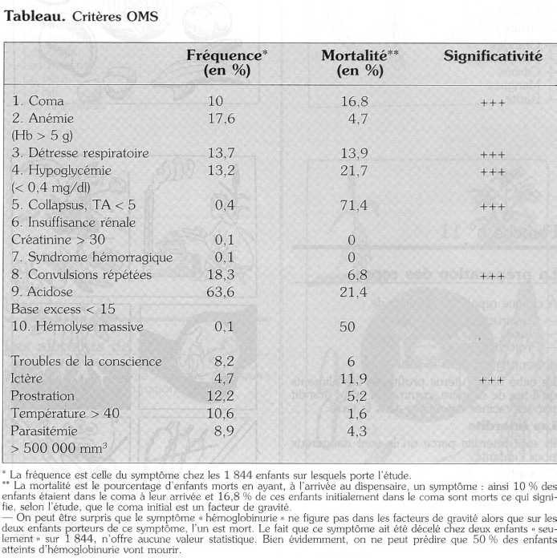

**Critères de gravité d'un accès pernicieux chez l'enfant**

**par Philippe Reinert**

**Pédiatre, Hôpital Intercommunal de Créteil**

L'accès pernicieux ou neuropaludisme, caractérise par l'importance de la souffrance cérébrale, constitue le grand problème du paludisme à _Plasmodium falciparum._ La mortalité est toujours comprise entre 10 et 30 %.

Cette encéphalopathie aiguë fébrile résulte d'une intense multiplication des hématozoaires dans les capillaires viscéraux et en particulier cérébraux.

Le neuropaludisme ne frappe que les sujets dépourvus d'immunité. Il s'agit donc surtout d'enfants de plus de 4 mois (ayant perdu les anticorps maternels) et de moins de 4 ans, ou d'étrangers récemment transplantés négligeant leur chimio-prophylaxie.

En zone de faible endémie ou de paludisme saisonnier, les adultes autochtones mal prémunis (donc n'ayant plus d'anticorps) peuvent présenter également un accès pernicieux.

En 1995, une équipe médicale du Kenya (K. Marsh) a évalué les facteurs de gravité cliniques et paracliniques définis par l'OMS auxquels ont été adjoints cinq paramètres simples. L'étude a porté sur 1 844 enfants hospitalisés pour malaria.

Pour chaque critère fut évalué le risque de décès (_tableau_). Ainsi sont comparés la fréquence du symptôme, le pourcentage de mortalité et l'importance de la corrélation symptôme/risque de mort.

De ces données, il ressort certaines évidences Un coma initial, un collapsus cardiovasculaire, un état de mal convulsif sont des facteurs majeurs de mortalité.

À l'inverse, il est surprenant qu'une anémie aiguë, une acidose, une parasistémie élevée ne grèvent pas le pronostic vital.

D'autres éléments moins évidents sont à retenir: gravité de l'hypoglycémie et surtout de la détresse respiratoire sévère ainsi que de l'ictère.

En pratique, une telle évolution des risques peut permettre, au dispensaire, une meilleure orientation des patients vers l'hôpital le plus proche.

Ainsi un enfant prostré, ayant une détresse respiratoire importante et un ictère, chez lequel on découvre, de plus, une hypoglycémie, présente un risque d'évolution fatale de 92 % : tout devra donc être mis en oeuvre le plus vite possible pour le sauver.

À l'inverse, l'enfant hyperthermique, très anémique, n'a pas de risques vitaux majeurs et doit guérir avec les moyens classiques (quinine IV et transfusion).

On notera aussi que les examens de laboratoire (mis à part la NFS) ne sont pas d'une grande utilité pour le diagnostic.

Enfin, la majorité des enfants décédés sont arrivés en détresse respiratoire, ce qui a souvent fait méconnaître le diagnostic de paludisme ! De plus, ces mêmes enfants sont pratiquement tous morts dans les vingt-quatre premières heures d'hospitalisation.

Au total, si les mécanismes du neuropaludisme sont encore mal compris, le simple examen clinique évaluant l'atteinte neurologique et l'état respiratoire suffit à faire prendre les bonnes décisions thérapeutiques.

Pour _en savoir plus sur cette étude :_

Indications of Life Threating Malaria in African Children. In : _The New England Journal of_ _Médecine_ 1995; 332 (21) : 1399-1404.

_Développement et Santé, n° 135, juin 1998_