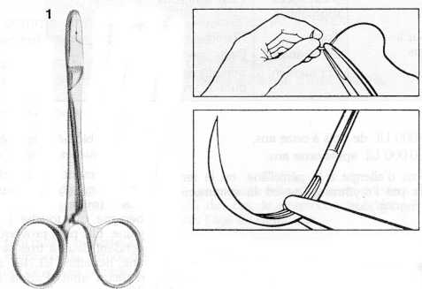
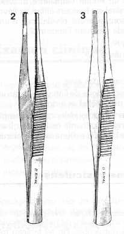
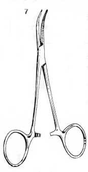
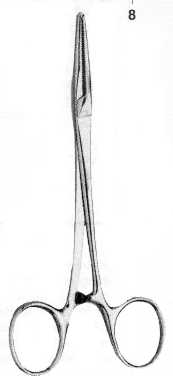
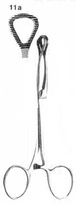

**1. Le porte-aiguille**

Comme son nom l'indique, il porte l'aiguille et le fil qui vont charger et suturer les tissus ou la peau. L'aiguille est pincée perpendiculaire au porte-aiguille et au bout de ses mors; la préhension se fait généralement deux tiers un tiers ou la moitié de la courbure de l'aiguille et pointe à gauche.

**2. La pince à disséquer à griffes**

Elle s'utilise de la main gauche pour les droitiers comme aide pour écarter ou présenter les tissus ou plans lors d'une dissection. Elle permet, par exemple, de bien retourner et présenter la peau à l'aiguille qui va la charger perpendiculairement.

**3. La pince sans griffe**

Elle permet une préhension plus fine mais moins forte. Elle est utile pour l'extraction des corps étrangers, mais elle est paradoxalement plus traumatisante que la pince à griffes pour la peau.

**4. Le bistouri**

Il ne sert qu'à l'incision de la peau et du tissu sous-cutané. C'est un mauvais instrument pour la dissection, car peu précis et contondant. Il peut éventuellement servir à couper les fils superficiels en l'absence de ciseaux adéquats.

### **5. Le ciseau à disséquer**

C'est l'instrument roi de la dissection des plans anatomiques au cours d'interventions comme la hernie, l'hydrocèle, l'ablation de kystes ou lipomes. Ces petits ciseaux ne doivent pas couper de gros tendons ou aponévroses, et encore moins des fils, même les catguts car très vite, ils prendront du jeu dans l'axe central et perdront leur précision et leur biseau.

**6.** Il est permis aux **ciseaux plus forts** de faire ce qu'on interdit aux ciseaux précédents. On ne dissèque pas avec des ciseaux droits, mais ils servent par exemple, à couper l'intestin lors d'une résection. De bons **ciseaux de Mayo** courbes, bien aiguisés, peuvent disséquer correctement lors de la cure de la hernie par exemple.

**7.** Le premier usage de la **pince à hémostase** est de permettre par une préhension fine la ligature d'un vaisseau ou sa coagulation par le bistouri électrique.

Elle est aussi un bon complément dans le repérage et la mise en tension des tissus au cours de la dissection, sur une aponévrose, un sac herniaire, une vaginale d'hydrocèle.

Enfin, comme pince repère sur les fils passés et en attente; cas typique des fils de la suture digestive ou de la réfection de paroi après une cure de hernie, qui ne sont noués qu'une fois tous passés.

**8.** Classiquement droite et à gaies, **la pince** **Kocher** ne permet pas les hémostases fines mais permet d'exercer de fortes tractions sur certains tissus. La préhension du bout des tendons et nerfs à suturer est interdite avec les pinces à disséquer et à hémostase. Il est préférable de repérer le tendon avec un fil pour exercer une traction et le présenter, ou le fixer au plan sous-jacent ostéo-tendineux avec une aiguille intramusculaire (cas typique pour les tendons fléchisseurs de la main).

**9. La curette** élimine bien les tissus nécrosés et les débris après incision d'abcès; de même, dans les parages d'une plaie contuse et récente ou d'une plaie infectée, les tissus morts s'éliminent à la curette alors que les tissus encore vivants résistent.

En post-opératoire, **la sonde cannelée** est une " exploratrice " de la plaie récente, entre deux fils, où l'on suspecte une collection de pus. Elle explore aussi toutes les plaies pour juger de leur profondeur et étendue.

**10.** La paire **d'écarteurs de Farabeuf** est le complément indispensable au cours d'une intervention. Elle est confiée à l'aide sous les directives de l'opérateur pour écarter les tissus superficiels quand le chirurgien travaille en profondeur.

**11.** La préhension des organes internes plats peut se faire avec **la pince en coeur,** mais en préhension douce, non traumatique, les doigts dans les anneaux de la pince sans fermer ni bloquer la crémaillère, si les organes restent en place et sont simplement manipulés (exemple: l'intestin et le caecum au cours de l'appendicectomie). Par contre, si les organes " tombent ", la crémaillère peut être fermée à un cran ou complètement (appendice, résection intestinale, colectomie, gastrectomie, lipome).

**La scie-fil de Gigli** se manipule fil tendu à l'aide des poignées prévues ou de deux pinces Kocher (le fil est alors pincé près de l'articulation de la pince pour avoir la force de scier). Il faut protéger les parties molles de la poussière d'os qui en résulte.

Un champ opératoire au carré nécessite quatre champs et quatre **pinces.** La peau et l'angle des deux champs ne sont pincés que légèrement; il ne faut pas pincer la peau si on est sous anesthésie locale.

_Développement et Santé, N°79, février 1989_