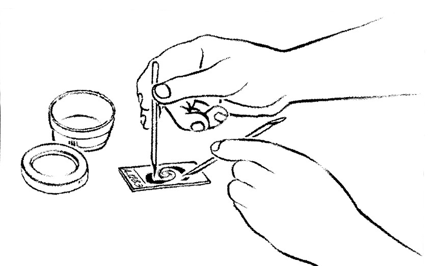
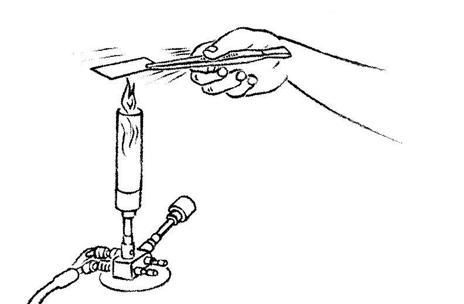
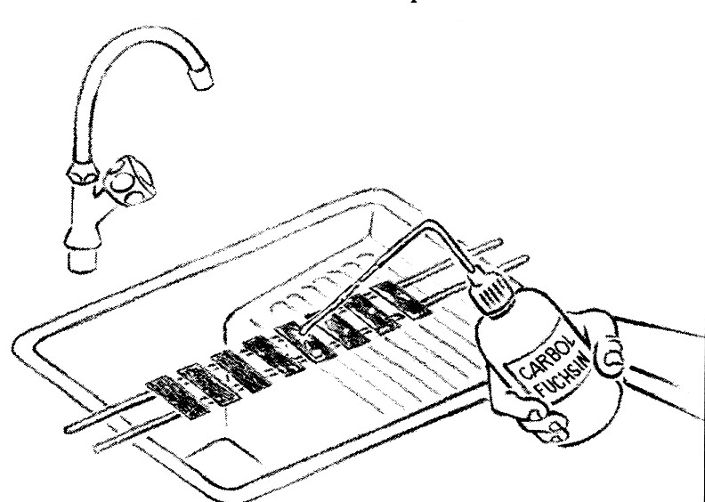
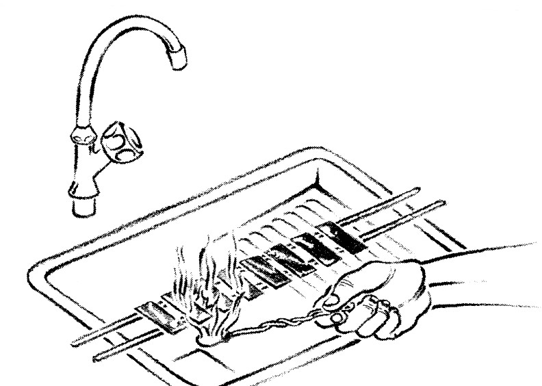
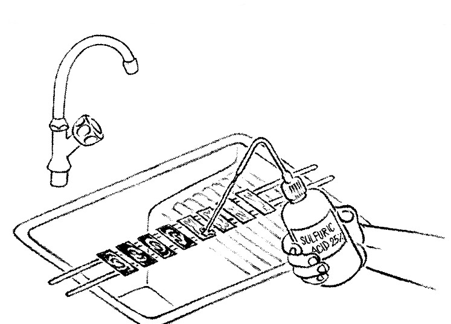
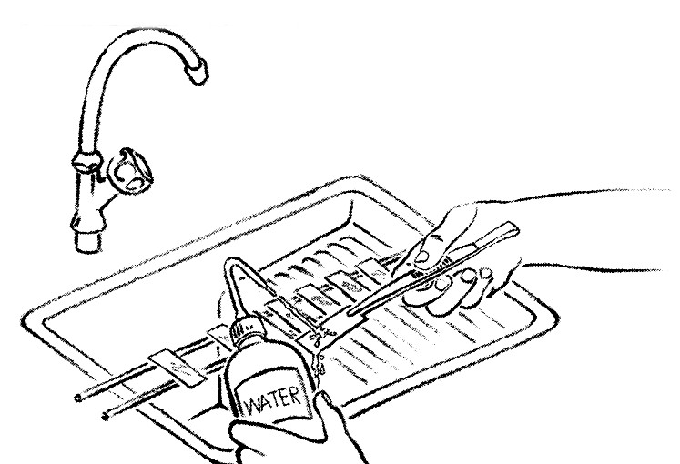
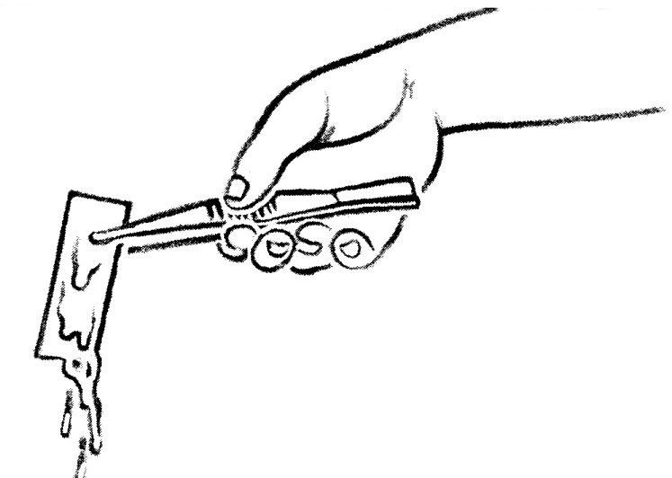
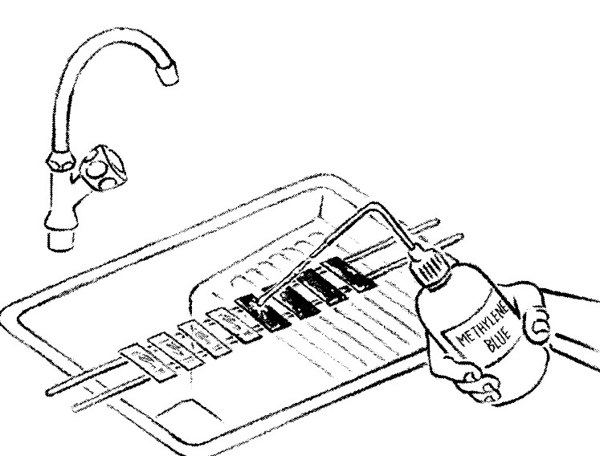
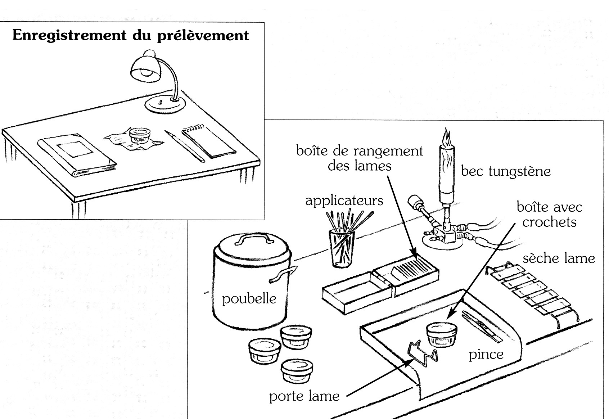

Le laboratoire a un double rôle dans la lutte contre la tuberculose : diagnostic, et aide au suivi du traitement. Quelques rappels bactériologiques sont nécessaires, pour la compréhension des étapes du diagnostic biologique.
<table>

<tbody>

<tr>

<td valign="top">

Rappel de la bactériologie de la tuberculose

La tuberculose est une maladie infectieuse due à la multiplication de bactéries appartenant au genre <em>Mycobacterium</em>. Il existe trois espèces dans ce genre, dites mycobactéries tubercu­leuses ou mycobactéries du "<em>complexe tuberculosis" :</em>

<ol><li>La principale bactérie responsable de l'affection est <em>Mycobacterium tuberculosis</em>, qui a été isolée par Robert Koch (c'est pourquoi on l'appelait autrefois Bacille de Koch ou BK).</li><li><em>Mycobacterium africanum</em> qui en est une variété très proche, retrouvée principalement en Afrique de l'ouest.</li><li><em>Mycobacterium bovis</em> qui est responsable de la tuberculose chez les bovidés et peut se transmettre à l'homme par le lait cru.</li></ol>

Il existe d'autres mycobactéries, dites mycobactéries atypiques. Elles ne provoquent pas la tuberculose, mais certaines peuvent être la cause de diverses infections, en particulier chez les patients immunodéprimés.

</td>

</tr>

</tbody>

</table>

**La tuberculose est essentiellement une maladie des poumons, c'est pourquoi la majorité des prélèvements qui par­viennent au laboratoire est d'origine pulmonaire.**

Le premier moyen de diagnostic d'une tuber­culose pulmonaire est la mise en évidence des mycobactéries directement dans le prélève­ment par un examen microscopique, après une coloration spéciale, reposant sur la riches­se en cires de la paroi de la bactérie. Facile à réaliser, demandant peu de moyens tech­niques, l'examen microscopique est souvent le seul à pouvoir être pratiqué dans les pays en développement, essentiellement sur les expectorations (crachats). Effectué par des personnels entraînés, il est pratiqué sur le terrain, à proximité des patients, où il rend de très grands services. Il permet un diagnos­tic rapide et donc la mise en place précoce de mesures pour éviter la contagion.

L'examen direct peut être complété par la mise en culture, qui seule permettra d'obtenir la souche de mycobactérie, de l'identifier comme appartenant au complexe tuberculo­sis, agent de la tuberculose, et d'étudier sa sensibilité aux antibiotiques. Ces examens seront regroupés et effectués dans des labora­toires de bactériologie plus équipés.

**Il existe d'autres localisations de la tuberculose, moins fréquentes, pour lesquelles d'autres prélèvements sont envoyés au laboratoire** **:** urines, abcès, lésions cutanées, liquides d'épanchement, LCR, selles, sang, prélèvements chirurgicaux, etc. Ces produits pathologiques nécessitent, en plus de l'examen direct, une mise en cultu­re, car ils ne contiennent généralement pas suffisamment de bacilles pour qu'on puisse les détecter à l'examen direct.

## I. Prélèvements

En cas de suspicion de tuberculose pulmonai­re, il est conseillé de recueillir les crachats émis spontanément après un effort de toux, de préférence le matin au réveil, dans des flacons stériles, à large embouchure afin d'éviter les contaminations des bords extérieurs. La pré­sence de bacilles dans les sécrétions respira­toires étant discontinue, les prélèvements sont généralement répétés trois jours de suite.

### 1. Recueil

*   Les crachats doivent être recueillis en plein air ou dans une pièce largement ventilée réservée à cet effet, le plus loin possible d'autres personnes.
*   Une personne entraînée doit expliquer au malade comment tousser pour ramener une expectoration qui vient du plus profond des poumons.
*   Cette personne doit ouvrir le crachoir, se placer derrière le malade et lui demander de cracher en rapprochant ses lèvres du crachoir.
*   Contrôler la qualité et la quantité de crachat collecté (2 à 3 ml de crachat contenant des particules solides).
*   Fermer le crachoir de façon étanche.
*   Se laver les mains à l'eau et au savon avant de donner au malade un nouveau crachoir qu'il doit rapporter avec son prélèvement le lendemain au centre.
*   S'assurer que le malade a compris comment il doit recueillir ses crachats le lendemain matin et comment bien fermer le crachoir.

### 2. Conservation et transport des crachats

Si les crachats ne sont pas examinés sur place, ils doivent être envoyés à un laboratoire. Le transport doit avoir lieu tous les jours ou au moins 1 ou 2 fois par semaine. Pour la conservation et le transport, des boîtes spéciales pouvant contenir 10 à 20 crachoirs sont utilisées.

#### Les règles suivantes doivent être suivies :

*   Chaque crachoir doit être soigneusement identifié par une étiquette portant le nom, le prénom et le numéro du registre.
*   La boîte avec les crachoirs doit être gardée dans un endroit aussi frais que possible. S'il est prévu de faire des cultures à partir de ces échantillons, ils doivent être conservés au réfrigérateur à +4°C.

*   Une liste comportant le nom des malades et les renseignements sur les malades, doit accompagner la boîte de transport (cette liste ne doit contenir que le nom des sujets et être sous enveloppe fermée).

_NB : Si l'on désire envoyer des frottis fixés au lieu des échantillons de crachats, les frottis réalisés et fixés au niveau du centre de santé peuvent être adressés au laboratoire de micro­scopie pour lecture. Mais les résultats actuel­lement obtenus dans les pays appliquant cette technique sont peu encourageants._

## II. Examen microscopique

Il est effectué directement sur le frottis d'une parcelle purulente ou hémorragique du produit pathologique. Pour mettre en évidence les mycobactéries on utilise leur propriété d'acido-­alcoolo-résistance, c'est-à-dire leur capacité à former des complexes stables avec des colo­rants basiques, fuchsine ou fluorochromes phé­niqués, qui persistent malgré la double action de l'alcool et des acides forts dilués. Deux méthodes sont bien adaptées à la pratique quotidienne, la méthode de Ziehl-Neelsen, et la méthode de coloration à l'auramine.

### 1. Identification des lames

*   Prendre une lame neuve (ne pas réutiliser d'anciennes lames pour cet examen) et gra­ver avec le diamant marqueur, le numéro d'identification du crachat sur une extrémité de la lame en utilisant la liste d'accompagne­ment des échantillons.
*   Préparer ainsi une lame pour chaque échan­tillon (pas plus de 10 à 12 crachats à la fois).

#### a. Préparation des frottis

*   Prendre chaque lame par la partie où est gravé le numéro, la poser à cheval sur un support lame, la partie gravée tournée vers soi.
*   Prendre le crachoir correspondant au numéro de la lame, l'ouvrir, poser le crachoir à droite du support de lames et poser à côté son couvercle.
*   Passer l'anse métallique à la flamme en la portant au rouge et la laisser refroidir.

*   Prélever une parcelle de crachat en choi­sissant si possible une parcelle purulente.
*   Faire un frottis aussi fin que possible de 2 cm x 1 cm sur la lame.

*   Placer la lame sur le séchoir.
*   Flamber l'anse métallique pour la stériliser avant de prendre un autre crachoir.
*   Préparer les autres lames de la même façon.

#### b. Séchage

*   Laisser sécher les frottis à l'air pendant au moins 15 minutes (15 à 30 min). Ne pas utiliser la flamme pour sécher le frottis.

#### c. Fixation

*   Prendre avec une pince chaque lame par sa partie gravée, frottis tourné vers le haut.
*   Passer la lame 3 fois (en 3 à 5 secondes) à travers la flamme du bec bunsen ou de la lampe à alcool.

*   Replacer la lame sur le séchoir propre.

### 2. Coloration de Ziehl-Neelsen

#### a. Coloration

*   Placer les lames sur le porte-lame, frottis tournés vers le haut, en faisant attention qu'elles ne se touchent pas.

*   Couvrir les lames avec de la fuchsine phéniquée de Ziehl. La fuchsine doit être filtrée au travers d'un filtre en papier, placé dans un entonnoir au-dessus des lames.
*   Chauffer sous les lames, très doucement, jusqu'à émission de vapeurs, avec un tam­pon monté à l'extrémité d'une baguette métallique et imbibé d'alcool à brûler.

En aucun cas le colorant ne doit bouillir ou se dessécher sur la lame.

*   Laisser agir le colorant chaud pendant 3 minutes.
*   Répéter deux fois le chauffage du colorant.

#### **b. Décoloration**

*   Rincer chaque lame séparément à l'eau du robinet jusqu'à ce que le colorant libre soit entraîné.
*   Replacer toutes les lames sur le porte-lame et couvrir chaque lame séparément avec de l'acide.
*   Laisser agir 3 minutes.

*   Laver à l'eau.
*   Couvrir d'alcool à 95°.

*   Laisser agir 5 minutes.
*   Rincer à nouveau à l'eau.

*   Décolorer une seconde fois avec l'acide jusqu'à ce que toute coloration ait prati­quement disparu.
*   Rincer à nouveau à l'eau chaque lame séparément.

#### c. Contre-coloration

*   Replacer les lames décolorées sur le porte-­lame et recouvrir les frottis avec du bleu de méthylène à 0,3 % pendant 1 minute.

*   Rincer chaque lame à l'eau et laisser sécher à l'air libre.

_* La décoloration des frottis peut être obte­nue en utilisant uniquement de l'acide sul­furique à 25 % à plusieurs reprises jusqu'à obtenir une décoloration totale du frottis._

#### d. Lecture

Au microscope optique à transmission, objec­tif 100 à immersion, les mycobactéries ou bacilles acido-alcoolo résistants (BAAR) conservent la coloration rouge vif de la fuchsi­ne sur le fond bleu de la préparation. Les autres bactéries et les cellules apparaissent en bleu.

### 2. Coloration à l'auramine

Après contact à froid avec l'auramine, la lame est traitée par un mélange acide-alcool. L'au­ramine nécessite une lecture au microscope à fluorescence avec l'objectif x 16 ou x 25. Les bacilles apparaissent jaune-vert brillant sur fond rouge.

Si le nombre de frottis à examiner est impor­tant et si l'on dispose d'un microscope à fluo­rescence, l'utilisation de cette méthode per­met un gain de temps appréciable puisque le champ observé est alors 16 fois plus impor­tant que celui examiné à l'immersion. Tout examen positif doit être confirmé par une coloration de Ziehl-Neelsen.

Cette technique nécessite un équipement beaucoup plus coûteux (les lampes du micro­scope doivent être renouvelées environ après 200 heures d'utilisation), et ne sera rentable que si le nombre de lames à examiner par jour est supérieur à 30. Il faut par ailleurs disposer de l'électricité, et que les techniciens soient bien formés.

### 3. Expression des résultats

Le résultat est exprimé de façon quantitative, en précisant la méthode de coloration utilisée. Le nombre de bacilles présents dans l'expec­toration est en relation avec le degré de conta­giosité du patient. Il permet aussi de contrôler la disparition progressive des bacilles, sous trai­tement.

#### a. Sensibilité

Le produit pathologique examiné doit contenir au moins 10 000 bacilles par millilitre pour être positif à l'examen direct. Une telle quan­tité de bacilles n'est présente que dans les lésions des malades atteints de tuberculoses pulmonaires cavitaires. L'examen microscopique permet de détecter rapidement les tuberculeux les plus contagieux. Il constitue l'examen clef dans le diagnostic de la tuberculose pulmonaire.

Les tuberculoses non pulmonaires sont géné­ralement pauvres en bacilles, c'est pourquoi ils sont rarement retrouvés à l'examen direct.

**Expression des résultats de l'examen microscopique**

<table>
<caption>Expression des résultats de l'examen microscopique</caption>

<thead>

<tr>

<th rowspan="2" scope="col" style="width: 120px;" valign="top">

Résultat

</th>

<th colspan="2" scope="col" style="width: 382px;" valign="top">

Nombre de bacilles  
acido-alcoolo-résistants observés

</th>

</tr>

</thead>

<tbody>

<tr>

<td style="width: 118px;" valign="top">

Coloration de Ziehl

</td>

<td style="width: 256px;" valign="top">

Coloration à l'auramine

</td>

</tr>

<tr>

<td style="width: 124px;" valign="top">

Absence

</td>

<td style="width: 202px;" valign="top">

0

</td>

<td style="width: 134px;" valign="top">

0

</td>

</tr>

<tr>

<td style="width: 124px;" valign="top">

Douteux

</td>

<td style="width: 202px;" valign="top">

1-2 / 200 champs

</td>

<td style="width: 134px;" valign="top">

1-9 / frottis

</td>

</tr>

<tr>

<td style="width: 124px;" valign="top">

1+

</td>

<td style="width: 202px;" valign="top">

1-9 / 100 champs

</td>

<td style="width: 134px;" valign="top">

1-9 / 10 champs

</td>

</tr>

<tr>

<td style="width: 124px;" valign="top">

2+

</td>

<td style="width: 202px;" valign="top">

1-9 / 10 champs

</td>

<td style="width: 134px;" valign="top">

1-9 / champ

</td>

</tr>

<tr>

<td style="width: 124px;" valign="top">

3+

</td>

<td style="width: 202px;" valign="top">

1-9 / champ

</td>

<td style="width: 134px;" valign="top">

10-99 / champ

</td>

</tr>

<tr>

<td style="width: 124px;" valign="top">

4+

</td>

<td style="width: 202px;" valign="top">

> 10 / champ

</td>

<td style="width: 134px;" valign="top">

> 100 / champ

</td>

</tr>

</tbody>

</table>

## III. Mise en culture

La culture d'un produit pathologique suspecté de contenir des bacilles tuberculeux est le moyen le plus fiable pour faire le diagnostic d'une tuberculose.

Elle nécessite des moyens supérieurs tant au niveau des équipements que de la formation du personnel, et n'est praticable que dans des laboratoires de bactériologie.

### 1. Décontamination des prélèvements

La plupart des produits pathologiques, sauf ceux qui proviennent de lésions fermées (prélèvements effectués au cours d'interven­tions chirurgicales, liquides de séreuses, ou liquides articulaires), sont contaminés par d'autres bactéries. Elles doivent être éliminées par des produits qui tuent les contaminants plus vite que les mycobactéries.

Les techniques d'homogénéisation-décontami­nation reposent toutes sur le même principe : action d'un agent fluidifiant, neutralisation puis centrifugation. Il s'agit le plus souvent d'un agent alcalin : soude à 4 % (méthode de Pétroff), mélange soude et lauryl sulfate, ou mélange soude et N acétyl-cystéine (métho­de de Kubica). Leur choix tient compte du nombre de prélèvements à traiter, et des milieux de cultures employés.

### 2. Culture classique en milieu solide

L'ensemencement du culot de centrifugation se fait sur les milieux de Lowenstein-Jensen et de Coletsos, milieux solides spécifiqües, à base d'oeuf, adaptés au développement des mycobactéries. Les milieux sont placés dans une étuve à 37°C pendant 12 semaines et observés très régulièrement. Les premières semaines ils doivent être regardés tous les jours, puis une à deux fois par semaine.

Les mycobactéries du complexe tuberculosis se développent lentement (leur temps de divi­sion est de 13 à 20 heures alors qu'il est de 20 mn pour Escherichia coli), ce qui explique que les colonies apparaissent seulement après trois semaines d'incubation. Elles ont un aspect caractéristique dit en "choux fleur", elles sont arrondies, de couleur beige clair, et leur surface est sèche et rugueuse.

### 3. Identification

Lorsque des colonies deviennent visibles, il convient de s'assurer qu'il s'agit bien de myco­bactéries en réalisant une coloration de Zieh-Neelsen. Elles doivent ensuite être identi­fiées selon leur aspect et l'étude de caractères biochimiques : activité catalasique thermostable et thermolabile (positive à 22°C et négative à 68°C), activité nitrate réductase, accumulation d'acide nicotinique (niacine-test). Il existe main­tenant des méthodes rapides d'identification faisant appel à des sondes nucléiques. Nous ne détaillerons pas ici l'ensemble de ces techniques, renvoyant le lecteur aux manuels de bactériologie.

<table>

<thead>

<tr>

<th scope="col" valign="top">

Mycobactéries

</th>

<th scope="col" valign="top">

Aspect des colonies

</th>

<th scope="col" valign="top">

Niacine

</th>

<th scope="col" valign="top">

Nitrates

</th>

<th scope="col" valign="top">

Catalase 22°C

</th>

<th scope="col" valign="top">

Catalase 68°C

</th>

</tr>

</thead>

<tbody>

<tr>

<td valign="top">

Tuberculeuses

</td>

<td valign="top">

R

</td>

<td valign="top">

+

</td>

<td valign="top">

+

</td>

<td valign="top">

+

</td>

<td valign="top">

-

</td>

</tr>

<tr>

<td valign="top">

Bovis

</td>

<td valign="top">

S

</td>

<td valign="top">

-

</td>

<td valign="top">

-

</td>

<td valign="top">

+

</td>

<td valign="top">

-

</td>

</tr>

<tr>

<td valign="top">

BCG

</td>

<td valign="top">

R

</td>

<td valign="top">

-

</td>

<td valign="top">

-

</td>

<td valign="top">

+

</td>

<td valign="top">

+

</td>

</tr>

<tr>

<td valign="top">

Atypiques

</td>

<td valign="top">

V

</td>

<td valign="top">

V

</td>

<td valign="top">

V

</td>

<td valign="top">

+

</td>

<td valign="top">

+

</td>

</tr>

</tbody>

</table>

### 4. Expression des résultats

Le nombre de colonies développées sur le tube de culture est le reflet de la richesse en bacilles des lésions, c'est pourquoi il est intéressant de rendre un résultat sous forme quantitative, comme proposé dans le tableau suivant :

<table>

<thead>

<tr>

<th scope="col" style="width: 182px;" valign="top">

Nombre de colonies

</th>

<th scope="col" style="width: 220px;" valign="top">

Résultat

</th>

</tr>

</thead>

<tbody>

<tr>

<td style="width: 186px;" valign="top">

< 10 colonies

</td>

<td style="width: 224px;" valign="top">

+

</td>

</tr>

<tr>

<td style="width: 186px;" valign="top">

10 à 100 colonies

</td>

<td style="width: 224px;" valign="top">

++

</td>

</tr>

<tr>

<td style="width: 186px;" valign="top">

> 100 colonies

</td>

<td style="width: 224px;" valign="top">

+++

</td>

</tr>

<tr>

<td style="width: 186px;" valign="top">

Incomptable

</td>

<td style="width: 224px;" valign="top">

Incomptable

</td>

</tr>

</tbody>

</table>

La culture et l'identification requièrent un personnel entraîné, des locaux adaptés. Le coût en est relativement élevé. La réponse est tardive (1 à 2 mois après le prélèvement). Ce n'est pas une technique de dépistage. Les indications sont les tuberculoses pauvres en bacilles, tuberculoses pulmonaires à examen direct négatif, et tuberculoses extra-pulmo­naires. La culture est nécessaire pour la réali­sation des antibiogrammes.

### 5. Résultats comparés de la microscopie et de la culture

Lorsqu'on fait un seul prélèvement d'expecto­ration à des malades présentant une tubercu­lose pulmonaire, 66 % sont positifs en micro­scopie après coloration de Ziel-Neelsen, alors que 93 % sont positifs à la culture. Lorsqu'on fait plusieurs examens successifs chez un patient, le pourcentage de positivité à l'exa­men direct augmente, car l'émission de bacilles peut être discontinue.

**C'est pourquoi il est préconisé d'exami­ner au moins trois expectorations recueillies plusieurs jours de suite, chez un malade suspect, pour établir le diagnostic de la tuberculose.**

## IV. Méthodes récentes

### 1. Méthodes de culture en milieu liquide

Plus récentes, plus délicates, et plus oné­reuses, ces méthodes ont été mises au point pour diminuer le délai de réponse, car elles permettent un développement plus rapide des mycobactéries. La croissance microbienne est mise en évidence, soit par la mesure de la consommation d'oxygène (milieux de cultu­re additionnés d'un composé émettant une lumière fluorescente lorsque la concentra­tion en oxygène diminue), soit par la mesure de la production de gaz carbonique (modifica­tion d'un indicateur coloré en présence de gaz carbonique). Il peut s'agir de méthodes manuelles ou d'automates selon la quantité de prélèvements à traiter et les possibilités d'équipement du service.

La positivité des cultures est visible en 8 à 30 jours selon que les prélèvements sont très riches ou moins riches. Une culture en milieu solide doit toujours être effectuée parallèle­ment, pour l'observation des colonies et l'identification.

### 2. Méthodes de biologie moléculaire : amplification génique

Elles consistent à amplifier un fragment d'ADN de la mycobactérie puis à l'identifier par hybridation avec des sondes marquées spécifiques. Cette technique est appelée la "réaction polymérase en chaîne" ou PCR. Elle permet une détection directe, rapide et spécifique des bacilles de la tuberculose dans le produit pathologique. Elle est cependant moins sensible que la culture (80 %). Elle nécessite un équipement spécifique et coû­teux, et n'est pratiquée actuellement que dans les services spécialisés.

## Conclusion

L'examen microscopique et la culture sont actuellement les examens permettant le diagnostic de certitude de la tuberculose. Les techniques plus élaborées, en particulier celles de biologie moléculaire n'ont pas leur place pour la prise en charge des malades dans les pays à forte prévalence tuberculeuse. Pour les tuberculoses pulmonaires, l'examen de choix est l'examen micro­scopique. Une série de trois échantillons sera demandée. Pour les cas suspects non prouvés par les examens microscopiques, trois cultures au moins seront faites lorsqu'un laboratoire pratiquant cet examen est accessible. Pour les tuberculoses extra-pulmonaires, l'exa­men microscopique direct est le plus souvent négatif. Le diagnostic doit être confirmé par la culture, ou par un examen anatomopatho­logique.

<table>
<caption>Coloration de Ziehl-Neelsen</caption>

<tbody>

<tr>

<td colspan="2" style="width: 443px" valign="top">

1) Colorant

Solution A: Solution alcoolique saturée de fuchsine

</td>

</tr>

<tr>

<td style="width: 309px" valign="top">

Fuchsine basique

Ethanol 96°

</td>

<td style="width: 104px" valign="top">

3 g

qsp 100 ml

</td>

</tr>

<tr>

<td colspan="2" style="width: 443px" valign="top">

Solution B : Solution de phénol à 5 %

</td>

</tr>

<tr>

<td style="width: 309px" valign="top">

Phénol cristallisé

Eau distillée

</td>

<td style="width: 104px" valign="top">

10 g

qsp 200 ml

</td>

</tr>

<tr>

<td style="width: 309px" valign="top">

Mélanger

Solution A

Solution B

</td>

<td style="width: 104px" valign="top">

10 ml

90 ml

</td>

</tr>

<tr>

<td style="width: 309px" valign="top">

2) Agents décolorants

a) Eau distillée

Acide sulfurique concentré

b) Alcool éthylique 95°

</td>

<td style="width: 104px" valign="top">

300 ml

100 ml

</td>

</tr>

<tr>

<td style="width: 309px" valign="top">

3) Contre colorant

Bleu de méthylène

Alcool 95°

Phénol

Eau distillée

</td>

<td style="width: 104px" valign="top">

1 g

10 ml

1 g

Qsp 100 ml

</td>

</tr>

</tbody>

</table>

**Coloration à l'auramine**

<table>

<tbody>

<tr>

<td style="width: 238px" valign="top">

1) Acide trichloracétique à 1%

Acide trichloracétique

Eau distillée

</td>

<td style="width: 165px" valign="top">

10 g

qsp 1000 ml

</td>

<td style="width: 201px" valign="top"></td>

</tr>

<tr>

<td style="width: 238px" valign="top">

2) Auramine

Solution A

Solution B

</td>

<td style="width: 165px" valign="top">

Auramine 00  
Eau distillée  
Chlorure de magnésium  
Eau distillée  
Phénol

</td>

<td style="width: 201px" valign="top">

1 g  
800 ml  
2 g  
200 ml  
50 g

</td>

</tr>

<tr>

<td style="width: 238px" valign="top">

Laisser dissoudre.  
Mélanger A et B. Filtrer.  
Conserver à 4°C et à l'obscurité.

</td>

<td style="width: 165px" valign="top"></td>

<td style="width: 201px" valign="top"></td>

</tr>

<tr>

<td style="width: 238px" valign="top">

3) Décolorant

Alcool à 90°  
Acide chlorhydrique pur  
Chlorure de sodium

</td>

<td style="width: 165px" valign="top">

1000 ml  
5 ml  
5 g

</td>

<td style="width: 201px" valign="top"> </td>

</tr>

<tr>

<td style="width: 238px" valign="top">

4) Solution de rouge de thiazine

Solution A

Solution B

</td>

<td style="width: 165px" valign="top">

Rouge de thiazine  
Eau distillée

Chlorure de magnésium  
Eau distillée  
Phénol

</td>

<td style="width: 201px" valign="top">

1 g  
800 ml

2 g  
200 ml  
50 g

</td>

</tr>

<tr>

<td style="width: 238px" valign="top">

Laisser dissoudre.  
Mélanger A + B, filtrer.  
Conserver à l'obscurité.

</td>

<td style="width: 165px" valign="top"></td>

<td style="width: 201px" valign="top"></td>

</tr>

</tbody>

</table>

**Illustrations :** _Management of tuberculosis. International Union Against Tuberculosis and Lung Disease._ _5ème edition, 2000._

_Développement et Santé, n°190, 2008_