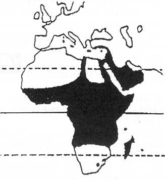
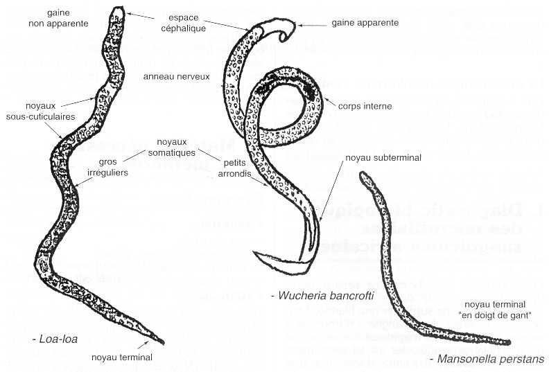

Les filarioses, dans leur ensemble, représentent la troisième endémie parasitaire mondiale, derrière le paludisme et les bilharzioses. Cent cinquante millions de personnes souffriraient de filarioses en zone intertropicale. Celles-ci se répartissent en quatre tableaux cliniques.

## I. Les filarioses

### Les filarioses lymphatiques ou filaires de Bancroft

*Wucheria bancrofti* en est l'agent responsable en Afrique (*figure n°1*). Les vers adultes vivent dans le système lymphatique et sont responsables des signes cliniques présentés par le malade : lymphangite centrifuge, adénite chronique, puis éléphantiasis des membres inférieurs, des organes génitaux, chylurie, etc.

L'émission de microfilaires nocturnes dans le sang circulant permet la dissémination de la maladie par l'intermédiaire du vecteur, un moustique généralement du genre Culex. La recherche de ces microfilaires par ponction veineuse au milieu de la nuit est à la base du diagnostic biologique.

**Figure n°1. Localisation du *W. bancrofti*.**

### La loase

*Loa-loa* est responsable de cette filariose exclusivement africaine (*figure n° 2*). Sa zone géographique reste relativement limitée.

Le ver adulte vit dans le tissu cellulaire sous-cutané. Il est la cause de symptômes plus spectaculaires que graves : oedème migrateur, prurigineux et fugace de Calabar, passage sous-conjonctival ou sous-cutané du ver, manisfestations allergiques qui peuvent devenir graves en cas de lyse brutale des microfilaires par un traitement sans précaution à la diéthylcarbamazine.

L'émission diurne des microfilaires, en phase avec la piqûre du taon Chrysops, vecteur de la loase, boucle le cycle parasitaire. Leur recherche dans le sang capillaire ou veineux affirme le diagnostic.

**Figure n° 2. Localisation de loa-loa.**

### L'onchocercose

Le diagnostic de cette filaire, due à *Onchocerca volvulus*, ne se fait pas dans le sang circulant mais par biopsie cutanée exsangue.Nous ne ferons donc que citer cette filariose particulièrement invalidante par ses complications oculaires, touchant environ vingt-cinq millions de malades.

### La dracunculose ou filaire de Médine

Due à *Dracunculus medinensis*, sa réparation géographique actuelle tend à se réduire à quelques foyers sahéliens. Le diagnostic évident cliniquement lors de l'extériorisation de la filaire au niveau de la cheville, ne fait pas appel à la biologie.

## II. Diagnostic biologique des microfilaires sanguicoles africaines

Les examens de laboratoire seront donc demandés en cas de signes cliniques évocateurs permettant de suspecter une filariose lymphatique (adénite, lymphangite "rétrograde") ou une loase (oedème migrateur). La recherche de microfilaires sanguicoles est ici pleinement justifiée. Parfois, il s'agira d'identifier une microfilaire découverte sur un frottis sanguin réalisé pour d'autres raisons : recherche d'hématozoaires du paludisme par exemple.

Des signes biologiques non spécifiques comme l'hyperéosinophilie peuvent également attirer l'attention sur un frottis sanguin. On recherchera alors principalement une éventuelle microfilaire dans les franges, en bout de frottis. Les techniques indirectes de sérologie pour les filaires restent encore peu spécifiques et ne sont pas de pratique courante pour le laboratoire africain.

### 1. Matériel nécessaire et méthode

#### Examen direct

**Matériel :**

- vaccinostyle,
- compresse de gaze, alcool,
- lame et lamelle,
- eau physiologique : sérum salé à 9°/00

**Méthode :**

Désinfecter à l'alcool le doigt à piquer, sur le côté, au-dessous du niveau de l'ongle. Sécher, piquer avec un vaccinostyle. Recueillir la première goutte de sang sur la lame. Rajouter ou non une goutte de sérum physiologique et recouvrir avec une lamelle. Observer au faible grossissement (objectif 10) après stabilisation des courants liquidiens. Une microfilaire se signale par un mouvement rapide, une reptation parmi les globules rouges.

**Tableau n° 1. Les microfilaires sanguicoles africaines**

<table>

<tbody>

<tr>

<td colspan="2" valign="top"><em>Wucheria bancrofti</em></td>

<td valign="top"><em>Loa-loa</em></td>

<td colspan="3" valign="top"><em>Mansonella perstans</em></td>

</tr>

<tr>

<td valign="top">Pathogénicité</td>

<td colspan="3" valign="top">Pathogène</td>

<td valign="top">Pathogène</td>

<td valign="top">Non pathogène</td>

</tr>

<tr>

<td valign="top">Région</td>

<td colspan="3" valign="top">Afrique noire intertropicale du Sénégal  
au Mozambique</td>

<td valign="top">Afrique centrale  
Golfe de Guinée  
Région des grands lacs  
Bloc forestier du bassin du Congo</td>

<td valign="top">Afrique noire intertropicale</td>

</tr>

<tr>

<td valign="top">Heure de prélèvement</td>

<td colspan="3" valign="top">

La nuit  (entre 22 h et 4 h)

</td>

<td valign="top">Le jour (entre 10 h et 16 h)</td>

<td valign="top">Non périodique à toute heure</td>

</tr>

<tr>

<td valign="top">Vecteurs</td>

<td colspan="3" valign="top">Moustique (Culex)</td>

<td valign="top">Taon (Chrysops)</td>

<td valign="top">Moucheron (culicoïdes)</td>

</tr>

<tr>

<td valign="top">Taille</td>

<td colspan="3" valign="top">200-300 µm</td>

<td valign="top">250-300 µm</td>

<td valign="top">150 µm</td>

</tr>

<tr>

<td valign="top">Epaisseur</td>

<td colspan="3" valign="top">8 µm = un leucocyte</td>

<td valign="top">8 µm = un leucocyte</td>

<td valign="top">4 µm = 1/2 leucocyte</td>

</tr>

<tr>

<td valign="top">Mobilité à frais</td>

<td colspan="3" valign="top">Souple et ondulant traverse rapidement le champ</td>

<td valign="top">Souple et ondulant traverse rapidement le champ, aime les bords de la lamelle</td>

<td valign="top">Frétillant et brusque, reste sur place dans le champ, s'immobilise en quelques minutes</td>

</tr>

<tr>

<td valign="top">Courbure du corps</td>

<td colspan="3" valign="top">Régulière et souple</td>

<td valign="top">Irrégulière et tortillée</td>

<td valign="top">Régulière, en boule de ficelle</td>

</tr>

<tr>

<td valign="top">Gaine</td>

<td colspan="3" valign="top">Rose</td>

<td valign="top">Incolore</td>

<td valign="top">Pas de gaine</td>

</tr>

<tr>

<td valign="top">Queue</td>

<td colspan="3" valign="top">Rectiligne et effilée pas de noyau au bout</td>

<td valign="top">Incurvée et effilée noyaux jusqu'au bout</td>

<td valign="top">Rectiligne et bout arrondi en doigt de gant</td>

</tr>

<tr>

<td valign="top">Noyaux du corps</td>

<td colspan="3" valign="top">Noyaux moyens bien séparés</td>

<td valign="top">Gros noyaux se chevauchant</td>

<td valign="top">Petits noyaux serrés peu distincts</td>

</tr>

<tr>

<td valign="top">Corps interne</td>

<td colspan="3" valign="top">Unique, visible</td>

<td valign="top">Non visible</td>

<td valign="top">petits noyaux serrés peu distincts  
non visible</td>

</tr>

</tbody>

</table>

\$1  
**Figure n° 3. Éléments caractéristiques des microfilaires (MGG)  
.**

#### Frottis sanguin, goutte épaisse et autres méthodes de concentration

**Matériel**

- seringue de 5 ml, aiguille de ponction veineuse, tube citraté ou hépariné,
- compresse de gaze, alcool,
- lames,
- colorant au Giemsa,
- sérum physiologique : Nacl à 90/00
- solution de saponine à 2 % dans le sérum physiologique à 90/00,
- éprouvette graduée,
- tube conique à centrifuger,
- pipette Pasteur,
- centrifugeuse.

Frottis sanguin et goutte épaisse

- Méthode : même technique que pour la recherche d'hématozoaires.

Concentration à la saponine 2 %

**Méthode**

Mélanger dans l'éprouvette 1 volume de 5 ml de sang sur anticoagulant, à 10 ml (ou 2 volumes) de sérum physiologique. Ajouter 5 gouttes de la solution de saponine à 2 %. Retourner l'éprouvette plusieurs fois pour assurer une bonne hémolyse. On peut rajouter encore quelques gouttes de saponine pour parfaire une hémolyse incomplète.

Répartir le mélange dans les tubes coniques et centrifuger à 500 g, soit 1 500 tours par minute environ pendant dix minutes. Rejeter le surnageant en laissant les tubes, ouverture vers le bas, essuyer les parois avec un coton monté sur une pince. Ajouter une goutte de sérum physiologique et reprendre le culot en l'homogénéisant par une pipette Pasteur. Déposer sur une lame. Sécher, fixer, colorer par le Giemsa.

## III. Les résultats

L'observation à l'état frais des microfilaires permet de porter une présomption sur l'identité de l'espèce en cause. Cependant une identification certaine repose sur les colorations réalisées à partir du frottis, de la goutte épaisse ou du culot de centrifugation après action de la saponine en cas de faible parasitémie.

Outre *Wucheria bancrofti et Loa-loa,* on peut également mettre en évidence une troisième microfilaire sanguicole : *Mansonella* (ancienne *Dipetalonema) perstans.* Peu ou pas pathogène, et donc sans conséquence clinique en dehors d'une hyperéosinophilie, cette filaire dont l'adulte vit dans les séreuses doit impérativement être distinguée des deux espèces pathogènes. Insistons d'emblée sur la taille plus petite de *Mansonella perstans* (150 µm) par rapport aux deux autres espèces.

L'identification de la microfilaire reposera donc sur l'association de différents critères, résumée par la *figure n° 3 et le tableau n° 1* origine géographique du malade, taille de la microfilaire : épaisseur par rapport aux leucocytes, mobilité à l'état frais, existence ou non d'une gaine : colorée en rose pâle par le Giemsa mais souvent difficile à voir, courbures de la microfilaire, queue de la microfilaire : présence ou non de noyaux terminaux, noyaux du corps : violet au Giemsa, bien séparés ou se chevauchant, corps interne : coloré en rose au centre de la filaire.

**Conclusion**

Le diagnostic biologique permet un diagnostic de certitude de la filaire évoquée sur les arguments cliniques. La diéthylcarbamazine, à dose progressive et très prudente, en particulier pour la Loa, permet une guérison complète du malade, en dehors des complications de la filaire lymphatique qui relèvent de la chirurgie. Depuis quelques années, l'ivermectine, proposée en cure unique dans l'onchocercose, a fait ses preuves contre la filaire lymphatique et la loase par sa facilité d'administration en prise unique. Cependant, la microfilarémie à long terme n'est réduite qu'à 90 %, et la diéthylcarbamazine garde donc ses indications si l'on veut totalement déparasiter le malade. À noter la résistance habituelle, mais sans conséquence de *Mansonella perstans* aux antifilariens.

*Développement et Santé, n° 132, décembre 1997*
