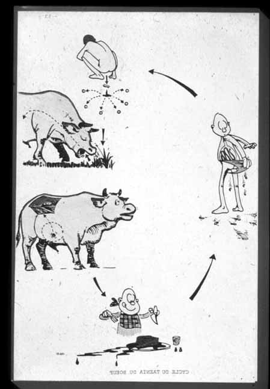
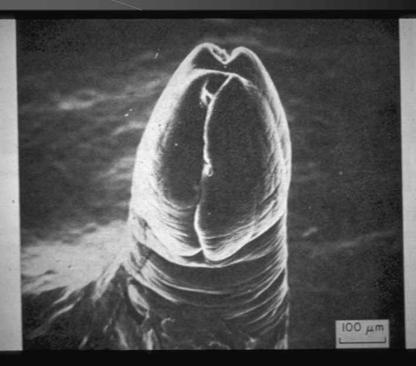

Les cestodes sont des vers plats segmentés très fréquents, provoquant des troubles digestifs. Les conséquences 
peuvent être sévères concernant par exemple la complication du tænia du porc. 
Les tænia du bœuf et du porc, mesurant plusieurs mètres, sont le plus   souvent uniques, et ont le nom de “ver solitaire”. Les cestodes peuvent infester l’homme au stade adulte (tænia) ou au stade larvaire (échinococcose). Toutes ces parasitoses peuvent être évitées par une bonne hygiène alimentaire et individuelle.

## I. Cestodes adultes

### 1. *Tænia saginata*

Le *Tænia saginata* est un ver mesurant de 5 à 10 mètres ( figure 1), situé dans l’intestin grêle de l’homme. La tête ou scolex ( figure 2), est munie de 4 ventouses.

**Figure 1 : *Tænia saginata***

**Figure 2 : scolex de *Tænia saginata***

Les anneaux terminaux se détachent et sont éliminés avec les selles. En outre, les anneaux sortent activement  de  l’anus et sont retrouvés dans le linge ou les sous-vêtements.  
Eliminés dans la nature, les anneaux éclatent et libèrent des embryophores. Ceux-ci sont ingérés par les bovidés et vont se localiser  dans les muscles (cysticerques). L’homme s’infeste par ingestion de viande de bœuf mal cuite (figure 3).  Les muscles sont digérés, libérant les parasites qui vont se développer dans la lumière intestinale pour devenir un ver adulte en 3 mois.

**Figure 3 : cycle du *Tænia saginata***

Le patient présente des troubles digestifs (nausées, vomissements, douleurs abdominales, diarrhée) et des troubles généraux (asthénie, irritabilité), ces troubles étant regroupés sous le nom de “tæniasis”.  
Le diagnostic est évoqué devant l’hyperéosinophilie  
et confirmé par le  scotch-test anal et l’examen parasitologique des   selles qui met en  évidence les embryophores caractéristiques. De même, le diagnostic peut être affirmé sur l’identification des anneaux retrouvés dans les draps ou les sous-vêtements.  
Le traitement est basé sur le niclosamide ou le praziquantel (Tableau I).

<table>
<caption>Tableau I : traitement du <em>Tænia saginata</em> et du <em>Tænia solium</em></caption>

<thead>

<tr>

<th class="rteleft" scope="row" style="width: 126px; ">Nom chimique</th>

<th scope="col" style="width: 307px; ">Posologie</th>

</tr>

</thead>

<tbody>

<tr>

<td class="rteleft" style="width: 130px; ">Niclosamide  
cp à 500 mg</td>

<td style="width: 311px; ">4 comprimés en 1 jour  
(le matin à jeun : 2 comp. à mâcher, attendre 1 h à jeun, reprendre 2 comp. et attendre 3 h avant un nouveau repas</td>

</tr>

<tr>

<td class="rteleft" style="width: 130px; ">Praziquantel  
cp à 600 mg</td>

<td style="width: 311px; ">10 mg/kg en une seule fois*</td>

</tr>

<tr>

<td class="rteleft" style="width: 130px; ">Albendazole  
cp à 400 mg</td>

<td style="width: 311px; ">1 comp/j/3 jours</td>

</tr>

<tr>

<td class="rteleft" colspan="2" style="width: 130px; ">* double dose pour le traitement du bothriocéphale</td>

</tr>

</tbody>

</table>

### 2. *Taenia solium*

Le  *Tænia  solium* est situé dans l’intestin grêle de l’homme. La tête, ou scolex, est pourvue de 4 ventouses et de 2 rangées de crochets. Les anneaux terminaux se détachent par groupes  de 2 à 5 ou 6 anneaux et sont éliminés avec les selles. Dans la nature, les anneaux sont lysés, libérant les embryophores qui sont disséminés dans la nature et ingérés par les porcs. Les parasites traversent la paroi digestive et vont se loger dans les muscles.  
L’homme s’infeste par ingestion de viande de porc mal cuite. Après ingestion, les muscles sont digérés et les larves se libèrent et grandissent, pour devenir adultes en 3 mois. L’homme élimine alors les anneaux (Figure 4).

**Figure 4 : cycle du \_Tænia solium \_**

Toute la gravité du *Taenia solium* réside dans l’antipéristaltisme intestinal qui fait remonter les embryons qui sont alors libérés dans l’estomac et migrent dans l’organisme. Ceci entraîne la localisation  des cysticerques dans les muscles, l’œil ou, plus grave, le cerveau. Dans les régions endémiques (Inde, Madagascar, La Réunion), il faut systématiquement évoquer une cysticercose  cérébrale  devant  des  céphalées  persistantes ou une epilepsie.  
Les symptômes sont identiques à ceux du “*taeniasis*”, décrits avec l’infestation par *T. saginata*.  
Le diagnostic est établi sur l’identification des anneaux émis avec les selles et la mise en évidence des embryophores à l’examen parasitologique des selles.  
Le traitement du *taenia* est basé sur le niclosamide ou le praziquantel. Mais le traitement de la cysticercose nécessite une exérèse chirurgicale du parasite, complétée par le praziquantel ou l’albendazole pendant plusieurs mois.

### 3. *Hymenolepis nana*

Ce tænia est un petit taenia de 2 à 4 mm, situé dans l’intestin  grêle.  Il  est  très  fréquent  sur  le  pourtour méditerranéen. Ce tænia est le plus petit des tænia, d’où le nom de *Hymenolepis nana*, mais existe le plus souvent en grand nombre. Le scolex est muni d’un rostre court, de 4 ventouses et d’une couronne de crochets (Figure 5).

**Figure 5 : scolex d'*Hymenolepis nana***

Les œufs sont émis dans la nature et sont ingérés par de petits insectes (blatte, ver de farine), lesquels peuvent se trouver dans le  pain.  L’homme peut s’infester par ingestion de pain mal cuit contenant ces insectes. Par ailleurs,  l’homme, et en particulier  l’enfant, peut se contaminer  directement  par  les  “mains  sales”,  les embryophores étant sur les doigts en cas d’hygiène douteuse. Après ingestion, les embryons se libèrent et vont se développer, pour grandir et devenir ver adulte en 15 jours.  
Cette infestation peut rester asymptomatique. Dans les autres cas,  les enfants présentent des troubles digestifs (anorexie, diarrhée, vomissements, amaigrissement) et des troubles généraux,(céphalées, irritabilité).  
Le diagnostic est basé sur l’hyperéosinophilie et la mise en évidence des embryophores à l’examen parasitologique des selles. Le traitement est basé sur le niclosamide pendant 7 jours ou le praziquantel en prise unique (Tableau II).

<table>
<caption>Tableau II : traitement de l'infestation par <em>H. Nana</em></caption>

<thead>

<tr>

<th class="rteleft" scope="col" style="">Nom chimique</th>

<th class="rteleft" scope="col" style="">Posologie</th>

</tr>

</thead>

<tbody>

<tr>

<td style="">Niclisamide  
cp à 500 mg</td>

<td style="">4 comp. le 1er jour  
puis 2 comp./j/7 j</td>

</tr>

<tr>

<td style="">Praziquantel  
cp à 600 mg</td>

<td style="">20 mg/kg en une fois</td>

</tr>

<tr>

<td style="">Albendazole  
cp à 400 mg</td>

<td>1 comp/j/3 jours</td>

</tr>

</tbody>

</table>

### 4. *Hymenolepis diminuta*

Ce petit tænia de 2 à 6 cm est situé dans l’intestin grêle. Le scolex est muni de 4 ventouses. Les œufs sont émis avec les selles et absorbés par des arthropodes  (coléoptères,  vers  de  farine,  puces)  qui  sont avalés accidentellement par l’homme (pain mal cuit).  
Après ingestion par l’homme, la larve se libère et se fixe sur la muqueuse jéjunale et devient adulte en 20 jours.  
L’infestation  reste  le plus souvent asymptomatique, ou provoque des troubles digestifs. Le diagnostic est établi sur l’examen  parasitologique des selles qui retrouve les œufs caractéristiques (embryophores).  
Le traitement est basé sur le niclosamide pendant 7 jours ou le praziquantel en prise unique.

### 5. Bothriocéphale

Le bothriocéphale ou *Diphyllobothrium latum* est un grand tænia de 3 à 20 mètres. Le scolex est ovoïde, sans crochet ni ventouse, mais pourvu de deux fentes médianes  (Figure  6). 

**Figure 6 : scolex de bothriocéphale**

Les œufs sont émis avec les selles, tombent dans l’eau douce, éclosent et libèrent une larve ou coracidium, qui est avalé par un petit crustacé  (cyclops),  lui-même  avalé  par  un  poisson.  
L’homme s’infeste en ingérant du poisson mal cuit.  
Chez l’homme, le parasite se fixe sur la muqueuse intestinale et grandit en 3 à 5 semaines (Figure 7).

**Figure 7 : cycle du bothriocéphale**

L’infestation peut rester asymptomatique, on provoquer des troubles du “tæniasis” (voir Tænia saginata). En outre, ce tænia, se nourrissant de vitamine B12, provoque, en cas d’infestation massive, une carence en vitamine B12 et donc une anémie.  
Le diagnostic est évoqué devant l’hyperéosinophilie et l’anémie macrocytaire. Il est confirmé par l’examen parasitologique des selles, montrant les œufs caractéristiques.  
Le traitement est basé sur le niclosamideou mieux, le praziquantel 20 mg/kg en une prise (Tableau I).

## II. Cestodes larvaires

Les cestodes larvaires sont les échinococcoses. Il s’agit de tænia de canidés dont la larve passe accidentellement chez l’homme.

### 1. Hydatidose

L’hydatidose est le résultat du développement  chez l’homme de la larve du taenia du chien, *Echinococcus granulosus*. Habituellement,  le  chien hébergeant le ver adulte émet des œufs avec ses excréments.  Les œufs, éparpillés dans la nature, sont ingérés par un mouton. Chez ce dernier la larve gagne le foie et y grossit pour former une masse liquidienne.  
Le mouton en meurt et est dévoré par le chien… et le cycle recommence.  
L’homme s’infeste soit par les crudités contaminés par les selles de chien, soit lors de contacts étroits avec les chiens. La localisation préférentielle est le foie puis les poumons, puis les autres organes.  
Les symptômes n’apparaissent que plusieurs années après l’infestation, sous forme de sensation de masse abdominale comprimant les organes de voisinage (pesanteur gastrique, ictère).  Le diagnostic est basé sur l’échographie (images de lacunes hépatiques), la radiographie et le sérodiagnostic.  
Le seul traitement efficace est l’exérèse chirurgicale du ou des kystes. Le traitement au long cours ne peut être qu’un complément en cas de kyste inopérable. La prophylaxie consistant à traiter tous  les chiens est illusoire, surtout en pays d’élevage ovin.

### 2. Echinococcose alvéolaire

L’échinococcose alvéolaire est due au développement chez l’homme de la forme larvaire du taenia du renard *Echinococcus multilocularis*. Le tænia éparpille dans la nature les embryophores avec les  excréments. Les petits rongeurs s’infestent par ingestion des baies sauvages et graines contaminées. Le parasite gagne le foie où il forme de nombreuses cavités et tue le rongeur qui est alors dévoré par le renard.  
L’homme s’infeste par ingestion de fruits ramassés dans la nature et situés à  moins de 1 m de hauteur. La larve va gagner le foie où il forme de très nombreuses cavités de diverses tailles, donnant l’aspect, en coupe, de tranche de pain (Figure 8).

**Figure 8 : echinococcose alvéolaire (coupe de foie)**

Les symptômes sont tardifs (sensation de pesanteur abdominale, ictère). Le diagnostic est établi par l’échographie et le sérodiagnostic.  
Le seul traitement vraiment efficace est la transplantation hépatique.

### 3. Cysticercose

La  cysticercose est la localisation dans l’organisme humaine de la forme larvaire (cysticerque) du Tænia solium. Les larves traversent l’estomac du patient, puis diffusent dans tous les organes en plusieurs semaines ou mois. Les lieux de prédilection sont les muscles (souvent avec peu de signes), l’œil (exophtalmie unilatérale) ou le cerveau (syndrome déficitaire, aphasie, épilepsie).  
Le diagnostic est établi sur l’aspect clinique, les images échographiques ou radiologie (avec multiples images lacunaires), et le sérodiagnostic. Le traitement est essentiellement symptomatique, parfois associé au praziquantel pendant plusieurs mois, quand l’infestation est relativement récente.

*Développement et Santé, N° 185, 2007*
