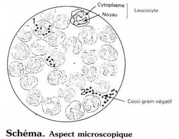
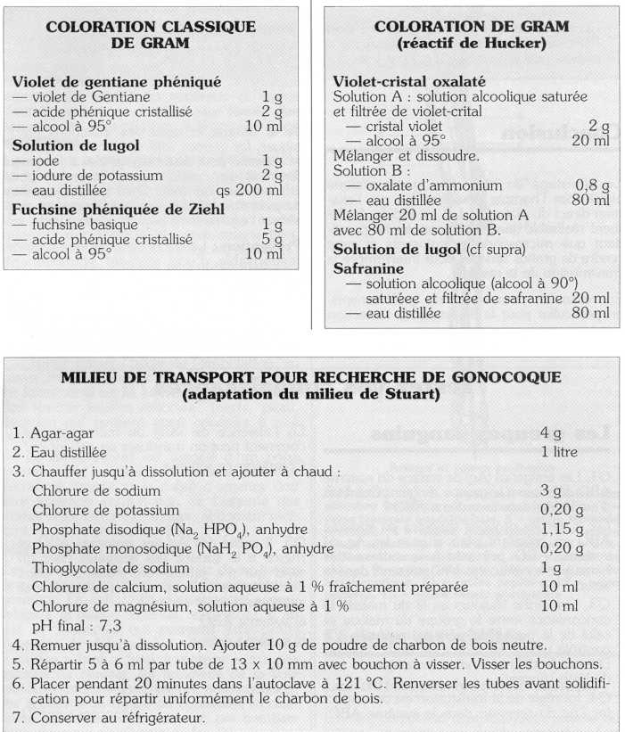
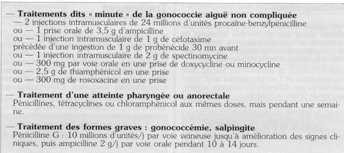

Le gonocoque (<em>Neisseria gonorrhoeae</em>) est une bactérie pathogène, responsable d'une maladie sexuellement transmissible, très fréquente et très contagieuse, la blennorragie. Cette bactérie est spécifique de l'espèce humaine, où elle se trouve toujours à l'état pathogène. Il n'y a jamais de porteurs sains.

## I. Pouvoir pathogène

### 1. La blennorragie

Le gonocoque provoque des suppurations des voies génitales qui, en l'absence de traitement, peuvent être suivies de complications graves.

*   **Chez l'homme,** c'est une urétrite aiguë se traduisant par un écoulement purulent au niveau du méat urinaire et des douleurs aiguës à la miction. La période d'incubation est courte (4 à 8 jours) et sans symptôme. Si le traitement n'est pas instauré rapidement, l'urétrite antérieure devient totale Elle peut même se propager aux voies génitales donnant des infections de l'épididyme, du testicule et de la prostate.

*   **Chez la femme,** contrairement à ce qui se passe chez l'homme, la maladie est le plus souvent sans symptômes au début, pour ne devenir visible que lorsque l'infection s'est étendue. Il peut s'agir d'une inflammation de l'urètre, des glandes de Skène et/ou de Bartholin. Souvent la patiente consulte pour leucorrhées et l'on constate alors une cervicite, une salpingite. Parfois il s'agit d'une péritonite.

Des formes asymptomatiques sont maintenant signalées aussi chez l'homme.

### 2. Autres localisations

*   L'infection gonococcique de la femme enceinte peut provoquer une infection de l'enfant lors de l'accouchement. Celle-ci peut se traduire chez le nouveau-né par une infection généralisée, mais la manifestation la plus habituelle est une conjonctivite purulente. L'ophtalmie néonatale est prévenue par l'instillation oculaire systématique aux nouveau-nés d'une solution de nitrate d'argent à 1 pour cent.  
*   On peut trouver chez l'adulte des formes anorectales et pharyngées.

### 3. Complications

Elles surviennent en l'absence de diagnostic et de traitement. Il s'agit de complications articulaires (arthrite du genou par exemple), septiques (endocardites, méningites) ou mécaniques (rétrécissement urétral chez l'homme).

## II. Épidémiologie

Le gonocoque est très fragile, il ne survit pas dans le milieu extérieur. C'est par contact direct à l'occasion de rapports sexuels que se fait la contamination. La gonococcie passe très souvent inaperçue, notamment chez la femme et les malades asymptomatiques, qui hébergent des gonocoques dans le tractus urogénital ou le rhinopharynx et jouent un rôle majeur dans la propagation interhumaine de la maladie. Le dépistage et le traitement rapide d'un malade sont donc très importants afin de rompre la chaîne de transmission. Ils doivent toujours être complétés par le dépistage et le traitement des partenaires.

## III. Diagnostic biologique

Il se fait au laboratoire par la mise en évidence des gonocoques à l'examen direct dans les prélèvements, complété par une culture et un antibiogramme quand cela est possible.

### 1. Prélèvements

#### Chez l'homme

Lors d'urétrite aiguë, on prélève un peu de pus urétral, de préférence à distance d'une miction.  
Dans les formes subaiguës, où l'écoulement est souvent minime et intermittent, le prélèvement devra être fait le matin avant la première miction.  
Dans le cas d'une atteinte haute, il est possible de prélever les sécrétions urétro-prostatiques après massage prudent de la prostate.  
Il faut, chez les homosexuels, pratiquer un prélèvement anorectal.

#### Chez la femme

Plusieurs prélèvements seront effectués systématiquement :

*   au niveau de l'urètre,
*   au niveau des orifices glandulaires vulvaires de Bartholin ou de Skène en cas d'atteinte inflammatoire,
*   au niveau de l'endocol, avec un spéculum,
*   au niveau de l'anus.

Il faut savoir qu'il existe une réactivation physiologique au moment des règles (4e jour).

#### Dans les deux sexes

Le gonocoque est plus rarement isolé au niveau de la gorge, de lésions cutanées, du liquide articulaire, du sang.

### 2. Examen microscopique

Faire un étalement mince du pus sur une lame de microscope.

Effectuer une coloration de Gram _(voir Développement et Santé, n° 127, 1997, p. 8)_

Examiner la lame pour rechercher la présence :

*   de pus qui se présente sous forme d'un amas de leucocytes altérés, à noyau rose vif et cytoplasme altéré,
*   de gonocoques qui sont des cocci à gram négatif (rose clair), en forme de grains de café, disposés par paires pouvant être (voir schéma).  
    *   intracellulaires : à l'intérieur du cytoplasme des leucocytes. (1)
    *   extracellulaires : amas entre les leucocytes, provenant de l'éclatement de ces derniers. (2).

Cet examen permet de faire le diagnostic des urétrites aiguës de l'homme. Un étalement de pus montrant après coloration des diplocoques à gram négatif en majorité intraleucocytaires est très caractéristique et constitue un très fort élément de présomption. La confirmation par culture est cependant recommandée.

Dans toutes les autres formes de gonococcie, en particulier l'urétrite chronique de l'homme et l'infection génitale de la femme, les germes sont rares et l'examen microscopique est peu révélateur. La culture du gonocoque est alors le seul moyen de diagnostic bactériologique.

### 3. Culture

La culture du gonocoque est délicate et nécessite l'ensemencement immédiat du prélèvement sur un milieu enrichi avec du sang cuit ou des vitamines et rendu sélectif par addition d'antibiotiques.

La culture est incubée à 37°C en atmosphère enrichie avec 5 à 10% de gaz carbonique. Les colonies apparaissent en 24 à 48 heures, petites, grisâtres, à bords irréguliers. À partir de ces colonies, le diagnostic de Neisseria gonorrhoeae est fortement orienté par la mise en évidence de cocci à gram négatif en grains de café, possédant une oxydase. Il faut cependant savoir que parmi les différentes espèces de Neisseria, trois peuvent se développer sur les milieux sélectifs : Neisseria gonorrhoeae, Neisseria meningitidis (agent de la méningite cérébrospinale), Neisseria lactamica (non pathogène). Le diagnostic définitif ne peut se faire que par l'étude biochimique de la souche isolée.

Si la culture ne peut être réalisée sur place, le prélèvement doit être ensemencé dans un milieu de transport (milieu de Stuart par exemple) permettant son acheminement jusqu'à un laboratoire.

 4. Antibiogramme

Non réalisé autrefois, il doit maintenant être effectué quand cela est possible en raison de l'existence de souches résistantes, notamment aux pénicillines et aux tétracyclines. Là aussi, des milieux de culture enrichis sont nécessaires.

Tous les milieux de culture et les réactifs pour l'identification et l'antibiogramme sont commercialisés par différents laboratoires, accompagnés de fiches techniques.

## IV. Traitement

Il devra tenir compte des résistances apparues dans de nombreuses régions et être établi en fonction des connaissances des résistances locales, des données éventuelles de l'antibiogramme, et de la présence possible d'autres pathologies sexuellement transmissibles associées, Chlamydiae ou syphilis par exemple.

## Conclusion

Le dépistage de l'infection gonococcique aiguë chez l'homme peut être fait par l'examen direct du pus urétral. Il est rapide, facilement réalisable dans un laboratoire ne possédant que microscope et colorants et peut rendre de grands services pour interrompre la transmission de la maladie.

En revanche, pour les autres prélèvements, en particulier pour le dépistage de l'infection de la femme et celui des infections chroniques, les germes sont souvent en trop petite quantité pour être bien visibles à l'examen direct et des cultures sont nécessaires pour affirmer un diagnostic. Dans ce cas l'examen ne peut être fait que dans un laboratoire possédant l'équipement pour la bactériologie.

**Prévention :** Le gonocoque est une bactérie responsable d'une maladie sexuellement transmissible. La seule prévention possible réside dans l'usage du préservatif.

_Développement et Santé, n° 136, août 1998_