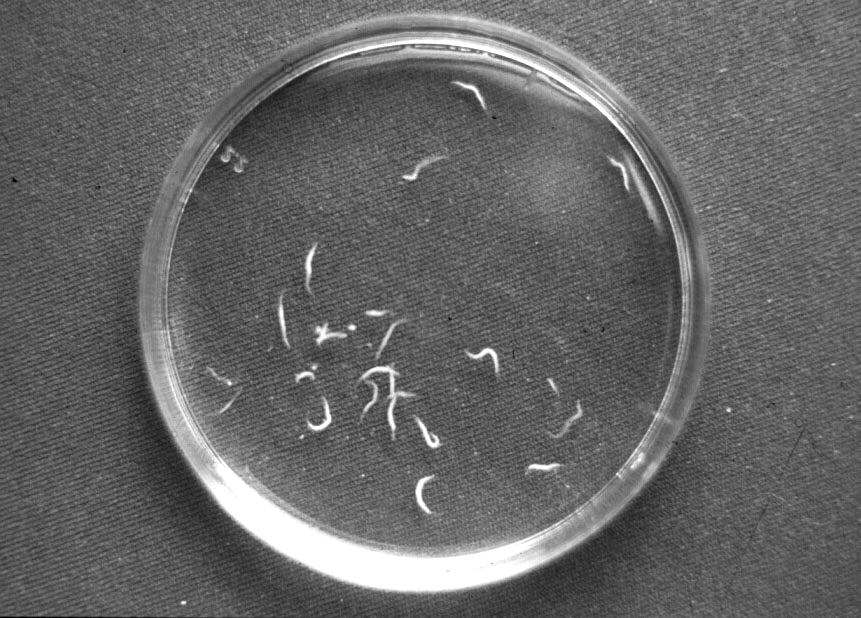
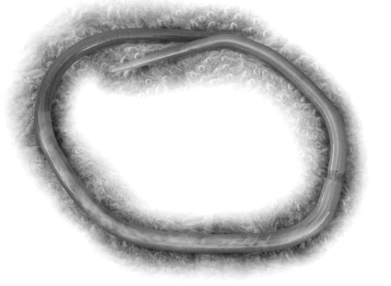
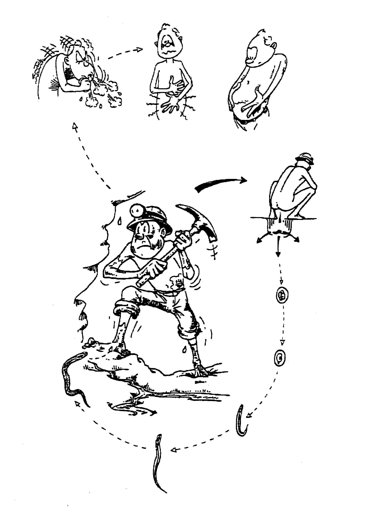
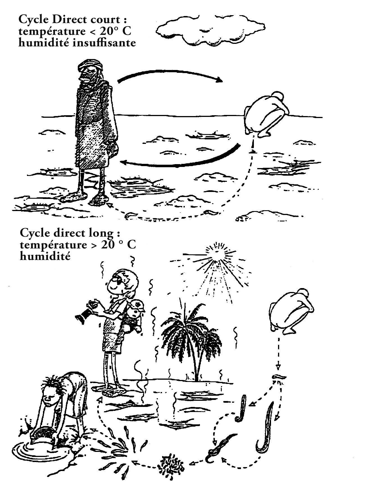

Les nématodes sont des helminthes très fréquents dans le monde, et particulièrement en zone tropicale. Parmi les parasitoses intestinales, six nématodoses sont fréquentes, dont 4 sont cosmopolites (oxyures, ascaris, trichocéphale, trichine) et 2 sont exclusivement tropicales (ankylostome, anguillules).

## I. Oxyurose

Les oxyures (Enterobius vermicularis) sont des petits vers blancs d’environ 1 cm de long ( figure 1). Les vers femelles, situés dans le caecum, migrent vers  l’anus pour pondre. Les œufs émis, contenant les embryons, sont  directement  infestants.

**Figure 1 : oxyures adultes**

L’enfant se contamine directement en portant les mains à la bouche ( figure 2).

**Figure 2 : cycle de l'oxyure**

Les patients se plaignent de douleurs abdominales et surtout de prurit anal nocturne, et éventuellement, chez la fillette, de vulvovaginite. En outre, les enfants présentent une certaine irritabilité et des troubles du comportement. Les complications sont rares (appendicite).  
Le diagnostic est évoqué devant une légère hyperéosinophilie et la mise en évidence des œufs à l’examen parasitologique des selles  
et surtout au scotch-test anal (figure 3).

**Figure 3 : œufs d'oxyures (scotch test)**

Le traitement est basé sur la prise d’un anti-helminthique : pamoate de pyrantel, mebendazole, flubendazole, associé à des mesures d’hygiène (Tableau I).

<table>

<thead>

<tr>

<th class="rteleft" scope="row" style="">Nom chmique</th>

<th class="rteleft" scope="col" style="">Posologie</th>

</tr>

</thead>

<tbody>

<tr>

<th class="rteleft" scope="row" style="">

Pamoate de pyrantel

Mebendazole

Flubendazole

Albendazole

</th>

<td>

Comp. à 125 mg, 1 comp. ou 1 cuillère à café /10 kg

Comp. à 100 mg, 1 comp. ou 1 cuillère mesure

Comp. à 100 mg, 1 comp. ou 1 cuillère mesure

Comp. à 400 mg, 1 comp.

</td>

</tr>

<tr>

<th class="rteleft" colspan="2" scope="row" style=""><ul><li>Traiter toute la famille le même jour</li><li>Changer la literie et le linge le jour du traitement</li><li>Couper les ongles le plus ras possible</li><li>Lavage des mains et brossage des ongles après chaque selle et avant chaque repas</li><li>Renouveler le traitement 20 jours après</li></ul></th>

</tr>

</tbody>

</table>

## II. Ascaridiose

Les ascaris (*Ascaris lumbricoïdes*) sont des vers blanc-rosés mesurant de 10 à 20 cm de long (figure 4).

**Figure 4 : ascaris adulte**

Ces vers, situés dans l’intestin grêle, émettent des œufs qui sont éliminés avec les selles. Ces œufs doivent évoluer dans la nature pendant plusieurs semaines pour devenir infestants. L’homme s’infeste par ingestion d’eau, de crudités ou de fruits non pelés (Figure 5).

**Figure 5 : cycle de l'ascaris**

Après ingestion, les œufs éclosent, libèrent les larves qui traversent la paroi digestive, gagnent le foie, le cœur, le poumon remontent la trachée et retombent dans le tube digestif. Ce cycle dure 2 mois.  
Les symptômes sont d’abord pulmonaires (toux, expectoration, hémoptysie) mais passagers (syndrome de Loëffler),  puis digestifs (nausées, vomissements, douleurs abdominales, diarrhées).  
Les complications sont digestives : syndrome occlusif, invagination, colique hépatique, cholécystite, voire péritonite par perforation.  
Le diagnostic de ces complications est porté sur la présence des vers à l’intervention chirurgicale (Figure 6).

**Figure 6 : coupe d'ascaris dans un intestin**

L’éosinophilie sanguine s’élève en début d’infestation, puis régresse en 2 mois et se  
stabilise à un taux subnormal selon la courbe de Lavier.  
Le diagnostic est basé sur la mise en évidence des œufs à l’examen parasitologique des selles, ou parfois par élimination des vers adultes dans les selles ou lors d’un  
vomissement.

Le traitement est basé sur la prise d’antihelminthiques. La prophylaxie nécessite le strict respect de l’hygiène alimentaire.

## III. Trichocéphalose

Les  trichocéphales (*Trichuris  trichiura*) sont des petits nématodes de 3 à 5 cm de long, formés d’une extrémité antérieure filiforme et d’une extrémité postérieure plus grosse (figure 7).

**Figure 7 : trichocéphale adulte**

Les vers situés dans le caecum, émettent des œufs qui sont éliminés avec les selles. Ces œufs vont évoluer dans la nature. L’homme s’infeste par ingestion des œufs avec l’eau et les crudités.

Les  troubles  n’apparaissent que chez les patients très infestés :douleurs  
abdominales, diarrhées. Les complications sont rares (prolapsus rectal).  
L’hyperéosinophilie sanguine est modérée. Le diagnostic est affirmé par la mise en évidence des œufs caractéristiques dans les selles.

## IV. Trichinellose

Les vers adultes, situés dans l’intestin de l’homme et des animaux réservoirs, émettent des larves qui vont se localiser dans les muscles. L’homme s’infeste par  
ingestion de viande de porc, de phacochère ou d’ours (ou éventuellement de cheval).  
Il  existe plusieurs espèces de trichine, dont *Trichinella spiralis* (cosmopolite), *Trichinella pseudo-spiralis* (région du Caucase), T. nelsoni (Afrique, Eurasie), *T. nativa* (pays du nord), autres phénotypes T5, T6, T8.  
Les troubles cliniques sont assez caractéristiques : fièvre, œdème du visage ou des  
paupières, diarrhée et myalgies. Les complications éventuelles sont cardiaques, rénales et neurologiques.

Le diagnostic est évoqué devant les symptômes évoqués et l’hyperéosinophilie très importante (6 à 9 000/mm3 ). En outre, les enzymes  musculaires sont élevées (CPK, aldolase, LDH).

La  confirmation est apportée par le sérodiagnostic positif. Il n’y a aucun passage des parasites dans les selles. Il faut attendre un mois pour que les parasites aient achevé leur migration dans les muscles. Ceci permet de retrouver, par une biopsie musculaire, les larves enroulées sur elles-même dans un kyste d’environ 500 µ (figure 8).

**Figure 8 : larve de trichine (biopsie musculaire)**

Les épidémies sont souvent familiales, après avoir partagé le même repas de viande mal cuite.  
Le traitement est basé sur l’albendazole et éventuellement les corticoïdes pour faire régresser des symptômes relativement sévères.

## V. Ankylostomose

Les ankylostomes, dont il existe deux espèces *Ancylostoma duodenale* (en régions  tropicales et subtropicales) et *Necator americanus* (en région équatoriale),  
sont des petits vers blanchâtres de 8 à 15 mm de long.  
Ils vivent dans le duodénum, et se fixent sur la muqueuse par leur cavité buccale, munie de 4  crochets (*Ancylostoma*) (figure 9) ou de 2 lames coupantes (Necator) (figure 10).

**Figure 9 : Ancylostoma                        Figure 10 : Necator**           

  
            

Les adultes femelles pondent des œufs qui sont éliminés dans la nature. Ils éclosent et donnent naissance à des larves qui deviennent infestantes et traversent la  
peau à l’occasion d’une marche en terrain boueux. Elles gagnent le poumon puis la trachée, le carrefour aérodigestif et retombent dans le tube digestif où elles  
s’installent dans le duodénum. Ce cycle dure environ 40 jours (Figure 11).

**Figure 11 : cycle de l'ankylostome**

Les troubles sont tout d’abord cutanés (érythème papuleux et prurigineux), puis pulmonaires  (toux, expectoration) puis digestifs (épigastralgies, nausées, vomissements, anorexie, diarrhée).  
Ces vers sont hématophages (consommation de 0,2 ml  de  sang/ver/jour pour *Ancylostoma* et de 0,02 ml/ver/j pour Necator), et vivent 5 à 15 ans. Aussi, en cas d’infestation massive et prolongée, apparaît une anémie se manifestant par une pâleur, une dyspnée, une  tachycardie, une hypotension et des œdèmes sous-cutanés mous et indolores.  
Le diagnostic est évoqué sur l’hyperéosinophilie et l’anémie microcytaire hyposidérémique, et confirmé par la mise en évidence des œufs à l’examen parasitologique des selles.

Le traitement par les antihelminthiques est habituellement  suffisant  pour  faire  regresser  spontanément l’anémie. Cependant, quand celle-ci est trop importante et mal supportée ; un traitement à base de fer peut-être utile.

## VI. Anguillulose

Les anguillules (*Strongyloïdes stercoralis*) sont des petits nématodes de 2 à 3 mm de long. Les femelles, parthénogénétiques (produisant des larves sans intervention du mâle), sont situées dans le duodénum.  
Après la ponte, les œufs éclosent rapidement et les larves continuent leur progression dans le tube digestif jusqu’à leur élimination avec les selles. Dans la   nature, les larves évoluent de façon différente selon les conditions météorologiques. En effet, en climat chaud et sec, chaque larve devient infestante. En climat  
très chaud (> 20°C) et humide (équatorial), les larves muent en adultes qui vont copuler et donner naissance à de nombreuses larves qui vont devenir infestantes : et il y a donc une multiplication des larves dans ce cas (Figure 12).

**Figure 12 : cycle de l'anguillule**

L’homme s’infeste par pénétration transcutanée des larves à l’occasion d’une marche en terrain boueux. Les larves gagnent la circulation puis le foie, les poumons, la trachée, le carrefour aéro-digestif puis le duodénum, où elles arrivent au stade adulte.  
En outre, il existe un cycle d’auto-infestation, les larves pouvant devenir infestantes *in situ* dans l’organisme. Ceci explique la pérennité de l’infestation pendant plusieurs dizaines d’années.  
Les troubles sont d’abord cutanés (éruption papuleuse) puis pulmonaires (toux,  dyspnée) puis digestifs (épigastralgies, diarrhées, nausées, vomissements).  
Les complications sont surtout importantes en cas d’immunodépression ou de traitement antibiotiques ou corticoïde au long cours, avec un risque de diffusion des parasites dans tout l’organisme.  
Le diagnostic est évoqué devant une hyperéosinophilie oscillante et confirmé par la mise en évidence des larves à l’examen parasitologique des selles.  
Le traitement actuel est basé sur l’ivermectine.

<table>

<tbody>

<tr>

<td>

Figure 13 : Larves rhabditoïdes d’anguillule (<em>Strongyloides stercoralis</em>)

Examen direct sans coloration  
Les  larves rhabditoïdes d’anguillule mesurent 250 à 300 µm/15 µm. Le pharynx est court, l’oesophage de type rhabditoïde possède 2 renflements et l’extrémité postérieure est effilée. A l’émission dans les selles, elles sont mobiles mais beaucoup moins que les larves strongyloïdes.

</td>

<td>  

</td>

</tr>

<tr>

<td>

Figure 14 : Larve strongyloïde d’anguillule (<em>Strongyloides stercoralis</em>).  
Taille : 600 µm ; elle est plus longue que la larve rhabditoïde et aussi beaucoup plus mobile. C’est la forme infestante.

Noter la petite encoche caractéristique, qui se trouve au bout de l’extrémité postérieure de la larve.

<em>Clichés (gr x 165 et 660). Dr. A.M. Deluol</em>

</td>

<td>

</td>

</tr>

</tbody>

</table>

\$1<table>

<caption>Tableau II : traitement des nématodes intestinaux</caption>

<thead>

<tr>

<th class="rteleft" scope="col" style="width: 134px;">Nom chimique</th>

<th class="rteleft" scope="col" style="width: 324px;">Posologie</th>

</tr>

</thead>

<tbody>

<tr>

<td style="width: 138px;">

Flubendazole

Mébendazole

Albendazole

Ivermectine\*

</td>

<td style="width: 328px;">

Comp à 100 mg ; 1 cp x 2/j/3 j

Comp à 100 mg ; 1 cp x 2/j/3 j

Comp à 100 mg ; 1 cp ou 10 ml de suspension en 1 fois

Comp à 600 mg ; 200 µg/kg en 1 fois

</td>

</tr>

<tr>

<td colspan="2" style="width: 138px;">\* Traitement de l'anguillulose et des filarioses</td>

</tr>

</tbody>

</table>

Développement et Santé N° 185, 2007
