

Les maladies parasitaires dues à des protozooses intestinales sont   l’amibiase, la giardiase et quelques autres parasitoses plus rares. Ces parasites provoquent des troubles digestifs de gravité variable. Le diagnostic est principalement basé sur l’examen parasitologique des selles.

## I. Amoebose

L’amoebose (appelée antérieurement amibiase) est due à l’amibe *Entamoeba Histolytica*. Cette amibe essentiellement tropicale se présente sous trois formes avec une fonction différente.

- forme minuta (12 à 15 microns) mobile, agent d’infestation.
- forme histolytica (20 à 30 microns) hématophage, très mobile dans toutes les directions, responsable de la maladie.
- forme kystique (12 à 14 microns), immobile, arrondie, à 4 noyaux, agent de transmission.

L’homme s’infeste par ingestion des kystes avec l’eau et les crudités. Dans l’intestin, les kystes se transforment en forme minuta qui se multiplient puis s’arrondissent,  deviennent  des  kystes  et  sont  éliminés dans les selles.  
Chez les sujets présentant un affaiblissement de l’état général,  les  formes minuta grossissent, deviennent hématophages et attaquent la muqueuse colique formant un abcès “en bouton de chemise” ( figure 1), qui se défend en secrétant du sang et du mucus, éliminés  
avec les selles.

**Figure 1 : abcès en "bouton de chemise".**

Les  patients se plaignent de douleurs abdominales avec des diarrhées glairo-sanglantes (ou “crachat rectal”) ( figure 2), mais sans fièvre. Sans traitement, les amibes peuvent envahir le foie et le poumon, provoquant une amibiase viscérale : abcès du foie (fièvre, hépatomégalie fébrile) ou du poumon (toux, dyspnée, fièvre). Dans ce cas, une échographie ou un scanner visualise la ou les lacunes (figure 3).

**Figure 2 : amibiase aiguë, selles glairo-sanglantes**

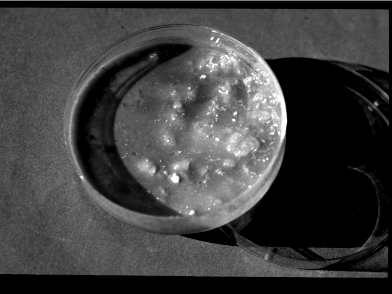

**Figure 3 : scanner montrant des lacunes hépatiques**

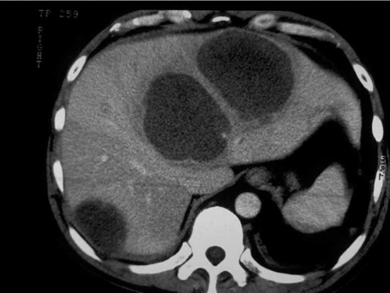

Le diagnostic est basé sur l’examen de selles fraîches. Une rectoscopie permet de constater des ulcérations en coup d’ongle et un prélèvement par écouvillon permet de retrouver les amibes (Tableau I).  
En cas d’amibiase viscérale, l’hémogramme révèle une hyperleucocytose à polynucléaires neutrophiles et le sérodiagnostic d’amibiase est positif. Le traitement est basé sur la prise de dérivés imidazolés et  quinoléiques  (Tableau II).

<table>
<caption>Tableau I : différentes techniques de recherche des protozooses intestinales</caption>

<thead>

<tr>

<th scope="row">Parasite</th>

<th scope="col" style="width: 461px; ">Examens complémentaires</th>

</tr>

</thead>

<tbody>

<tr>

<th scope="row">

Amibes

<em>Giardia</em>

<em>Balantidium</em>

<em>Isospora</em>

<em>Cyclospora</em>

<em>Cryptosporidium</em>

</th>

<td style="width: 465px; ">

Examen parasitologique des selles, rectoscopie avec écouvillonnage rectal

Examen parasitologique de selles, tubage duodénal

Examen parasitologique des selles, biopsie colique

Examen parasitologique des selles

Examen parasitologique des selles, auto-fluorescence des parasites  
dans les selles

Frottis de selles

</td>

</tr>

</tbody>

</table>

Le traitement est basé sur la prise de dérivés imidazolés (tinidazole, métronidazole) et  quinoléiques (tiliquinol, tilbroquinol) (tableau II).  
Il existe d’autres amibes considérées comme non pathogènes (*Entamoeba coli, Endolimax nanus, Pseudolimax butschlii*).

<table>
<caption>Tableau II : thérapeutique des protozooses intestinales (* produit en ATU)</caption>

<thead>

<tr>

<th class="rteleft" scope="row" style="">Parasite</th>

<th class="rteleft" scope="col" style="">Dénomination  
commune internationale</th>

<th class="rteleft" scope="col">Posologie</th>

</tr>

</thead>

<tbody>

<tr>

<th class="rteleft" scope="row" style="">Amibiase</th>

<td>

Tinidazole

Métronidazole

Tiliquinol/tilbroquinol

</td>

<td>

4 cp/j/1 à 3 j  
(cp à 500 mg)

4 cp/j/10 j  
(cp à 500 mg)

4 cp/j/10 j  
cp à 100/200 mg)

</td>

</tr>

<tr>

<th class="rteleft" scope="row" style="">Giardiase</th>

<td>Tinidazole</td>

<td>4 cp/1 j  
(cp à 500 mg)</td>

</tr>

<tr>

<th class="rteleft" scope="row" style="">Balantidiose</th>

<td>Cyclines</td>

<td>2 cp/j/5 j  
(cp à 100 mg)</td>

</tr>

<tr>

<th class="rteleft" scope="row" style="">Isoporose</th>

<td>Chloroquine</td>

<td>5 cp/j/5 j  
cp à 100 mg)</td>

</tr>

<tr>

<th class="rteleft" scope="row" style="">Cyclosporose</th>

<td>Sulfaméthoxazole  
Triméthoprime</td>

<td>2 cp/j/10 j  
(cp à 800 mg sulf. et  
160 mg triméth.)</td>

</tr>

<tr>

<th class="rteleft" scope="row" style="">Cryptosporidiose</th>

<td>Nitazoxanide*</td>

<td>200 mg à 1 g/j/3 j</td>

</tr>

<tr>

<th class="rteleft" scope="row" style="">

Microsporidioses

- <em>Encephalocytozoon</em>

- <em>Enterocytozoon</em>

</th>

<td>

Albendazole

Fumagilline\*

</td>

<td>

2 cp/j/3 j  
(cp à 400 mg)

60 mg/j/14 j

</td>

</tr>

</tbody>

</table>

## II. Giardiose

La giardiose (ou ex-giardiase) est une parasitose cosmopolite due à la présence de *Giardia intestinalis* (ou *Lamblia intestinalis*), protozoaire flagellé en forme de cerf-volant, mesurant environ 7 x 15 microns ( figure 4). 

**Figure 4 : schéma de forme végétative et de kyste de *Giardia intestinalis***

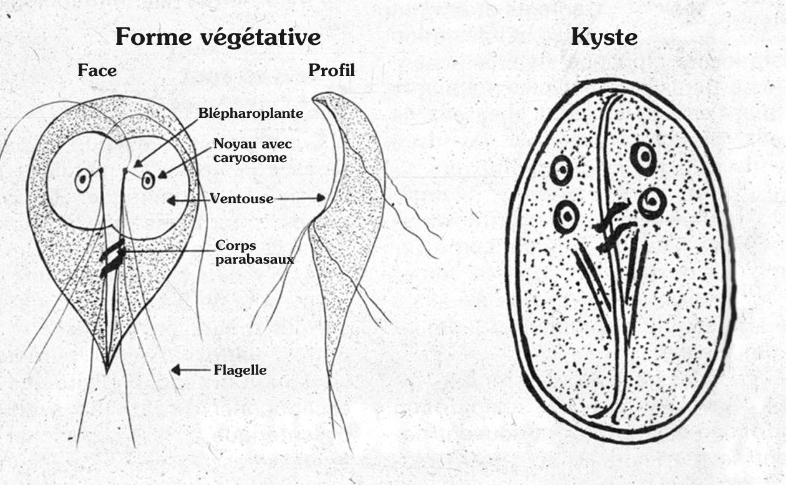

L’homme s’infeste par ingestion de kystes avec l’eau et les crudités. Les Giardia s’accolent sur la paroi duodénale par leur ventouse et provoquent des microtraumatismes. Les formes végétatives se multiplient puis s’enkystent et sont éliminées avec les selles sous forme de kystes (figure 5).

**Figure 5 : cycle de *Giardia intestinalis***

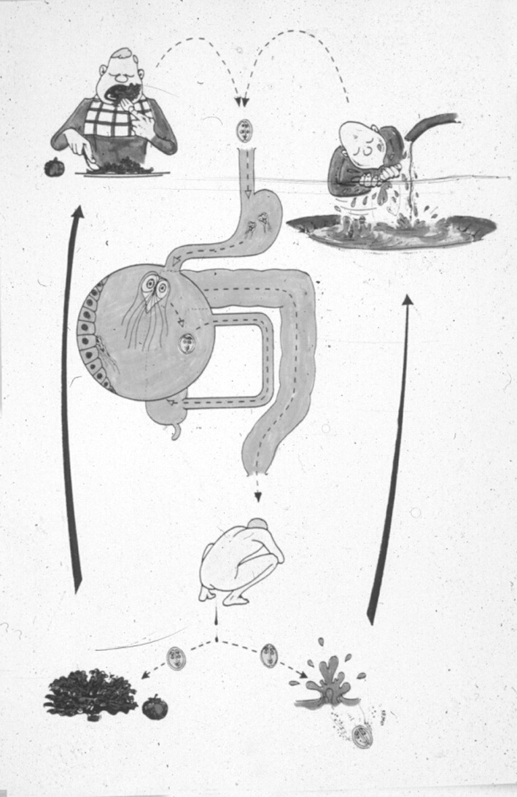

Les  patients présentent des épigastralgies, plus ou moins rythmées par les repas, des diarrhées jaunâtres, sans glaire ni sang provoquant un syndrome pseudo- ulcéreux ou pseudo-pancréatique. Au  maximum, peut survenir une malabsorption et un retard staturo-pondéral chez l’enfant.  
Le  diagnostic  est  basé  sur  l’examen  parasitologique des selles qui met en évidence les formes végétatives et les kystes et sur l’aspiration duodénale qui retrouve de nombreuses formes végétatives  (figure 6). Le traitement par les dérivés  imidazolés est rapidement efficace. La prophylaxie est basée sur le respect de l’hygiène alimentaire.

**Figure 6 : formes végétatives de *Giardia intestinalis***

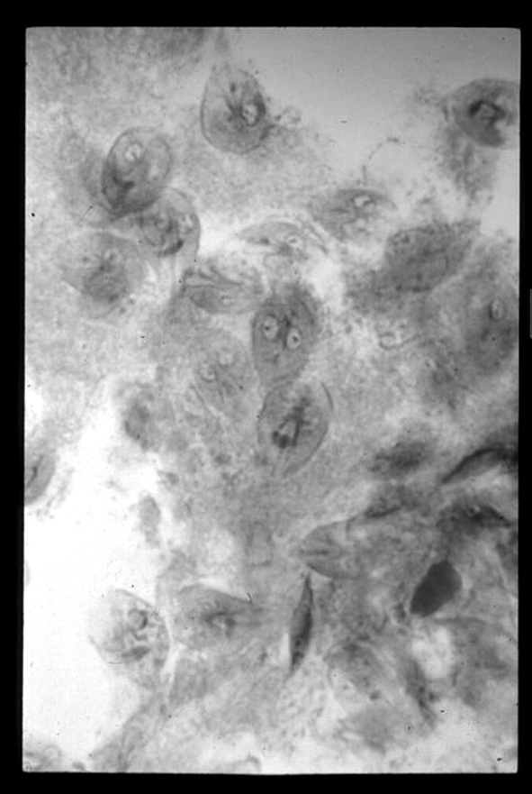

## III. Balantidiose

Cette parasitose cosmopolite est due à un protozoaire cilié, piriforme de 30 à 200 microns, *Balantidium coli*. L’hôte réservoir est le porc qui élimine des kystes. L’homme s’infeste par ingestion des kystes avec l’eau et les crudités. Les sujets infestés peuvent rester longtemps asymptomatiques ou présenter un syndrome dysentérique.  
Le diagnostic est basé sur l’examen parasitologique des selles qui met en évidence les formes végétatives (figure 7) et les kystes. Ces parasites peuvent être retrouvés dans la biopsie colique (figure 8).  Le traitement est basé sur les cyclines et la prophylaxie sur le respect de l’hygiène alimentaire.

**Figure 7 : forme végétative de *Balantidium coli***

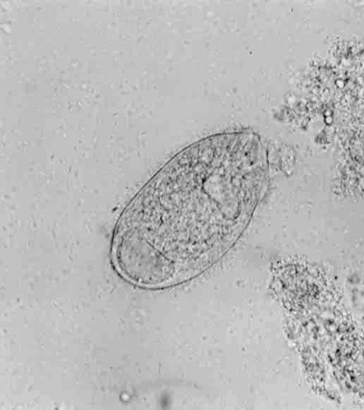

**Figure 8 : biopsie colique avec *Balantidium coli***

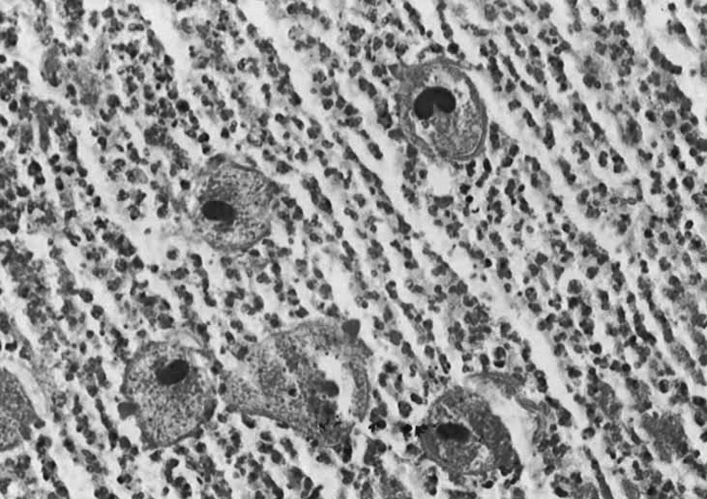

## IV. Cryptosporidiose

Cette zoonose cosmopolite est due à une coccidie, de 4 à 6 microns *Cryptosporidium parvum*, fréquente chez les veaux et les poulains. L’homme s’infeste par ingestion des oocystes avec l’eau et les crudités, mais reste le plus souvent  asymptomatique.  Toutefois, le sujet immunodéprimé présente des diarrhées importantes et parfois une atteinte pulmonaire (toux, dyspnée).  
Le diagnostic est basé sur le frottis de selles, avec des colorations  de  Ziehl-Neelsen  (oocystes rouges sur fond vert) (figure 9).  
Il faut bien différencier Cryptosporidium et Cyclospora (Tableau III). Le traitement n’est que symptomatique.

**Figure 9 : *Cryptosporidium*, coloration de Ziehl-Neelsen**

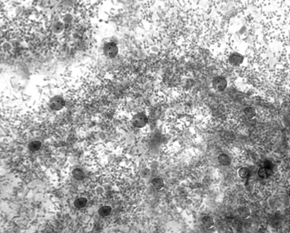

## V. Cyclosporose

Cette coccidiose est une zoonose cosmopolite due à *Cyclospora cayetanensis,* mesurant 8 à 10 microns dont la contamination s’effectue par ingestion (figure 10).  Elle provoque des diarrhées surtout fréquentes et abondantes chez les sujets immunodéprimés.

**Figure 10 : cycle de *Cyclospora cayentannensis***

Le diagnostic est établi par l’examen parasitologique des selles ou l’aspiration duodénale, colorées au Ziehl- Neelsen ou à la safranine (figure 11) faisant apparaître les Cyclospora en rouge. En outre, il présente une auto-fluorescence bleue.  
Le traitement est basé sur le sulfaméthoxazole-triméthoprime et la prophylaxie sur le respect de l’hygiène alimentaire.

**Figure 11 : *Cyclospora* dans les selles**

## VI. Microsporidiose

Ces  parasites  intracellulaires, mesurant de 0,5  à  6 microns, dont il existe plusieurs espèces (*Encephalitozoon, Enterocytozoon, Microsporidium*), sont responsables de zoonoses. Les diarrhées sont fréquentes chez les sujets VIH positifs.  
Le diagnostic est établi par le frottis de selles avec une coloration au trichrome (figure 12) ou par fluorescence ou par la biopsie duodénale.  
Le traitement n’est que symptomatique et nécessite surtout de renforcer l’immunité du sujet.

**Figure 12 : frottis de selles avec *Microsporidium***

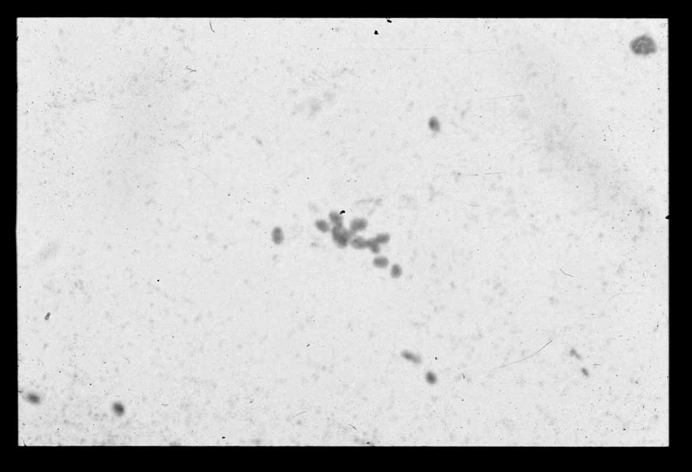

## VII. Isosporose

Ces  parasites *Isospora hominis* et *Isospora belli* sont fréquents chez l’animal mais rares chez l’homme. Ils se manifestent par une entérocolite fébrile, avec alternance de diarrhées et de constipation.  
Le diagnostic repose sur l’identification des oocystes (mesurant 15 x 25 microns) à l’examen parasitologique des selles. Le traitement est basé sur la chloroquine ou le sulfaméthoxazole-triméthoprime..

<table>
<caption>Tableau III : diagnostic différentiel des Coccidies</caption>

<thead>

<tr>

<th class="rteleft" scope="col" style="">Caractères</th>

<th scope="col"><em>Isospora</em></th>

<th scope="col"><em>Cyclospora</em></th>

<th scope="col"><em>Cryptosporidium</em></th>

</tr>

</thead>

<tbody>

<tr>

<td>Taille (en microns</td>

<td class="rtecenter" style="">25-15</td>

<td class="rtecenter" style="">8-10</td>

<td class="rtecenter" style="">4-6</td>

</tr>

<tr>

<td>Selles : aspect en  
techniques usuelles</td>

<td>Ovoïdes  
Non sporulé</td>

<td>Sphérique,  
sporulé,  
verdâtre  
avec morula</td>

<td>Non visibles  
-> frottis de selles </td>

</tr>

<tr>

<td>Lumière UV</td>

<td class="rtecenter" style="">-</td>

<td>Auto-fluorescence  
bleue</td>

<td class="rtecenter" style="">-</td>

</tr>

<tr>

<td>Coloration de Ziehl-Neelsen</td>

<td>Rouge foncé</td>

<td>Variable</td>

<td>Rouge violet</td>

</tr>

<tr>

<td>Auramine</td>

<td>Variable</td>

<td class="rtecenter" style="">+/-</td>

<td>Brillant</td>

</tr>

<tr>

<td colspan="1" rowspan="2">Aspect évolué  
(oocyste sporulé)  
selles dans bichromate  
de potassium  
(2,5 %) à 25° C/10 j</td>

<td>Contient  
sporozoïtes</td>

<td>2 sporocytes contenant  
chacun 2 sporozoïtes</td>

<td>4 sporozoïtes</td>

</tr>

<tr>

<td colspan="3" rowspan="1">
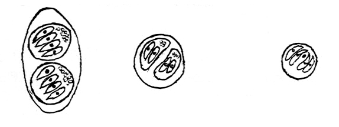
</td>

</tr>

</tbody>

</table>

**Figures 13 et 14 (gr x 660) : oocystes d'*Isospora belli***  
Oocyste à un sporoblaste (fig. 13). Examen direct sans coloration.  Au centre du cliché on  remarque : la forme allongée en ballon de rugby de l’oocyste d’*Isospora belli*. La coccidie est de grande taille, ici 28 µm. La coque est lisse plus ou moins réfringente. Une extrémité est effilée et l’autre montre souvent une légère striction à un des pôles, Le sporoblaste arrondi et granuleux occupe la partie centrale ; il est visible à l’état frais et après concentration et c’est lui que l’on repère même au faible grossissement ; ensuite en faisant varier la mise au point du microscope on voit la coque.  
Oocystes à 2 sporoblastes (fig. 14). Examen direct sans coloration. Cette forme parasitaire peut se rencontrer dans les selles si l’examen parasitologique a été différé. Le sporoblaste se divise alors en 2 masses arrondies de taille identique.

<table>

<tbody>

<tr>

<td colspan="2">Figures 13 et 14 (gr x 600) : Oocystes d'I<em>sospora belli</em></td>

</tr>

<tr>

<td>Figure 13</td>

<td>Figure 14</td>

</tr>

<tr>

<td>
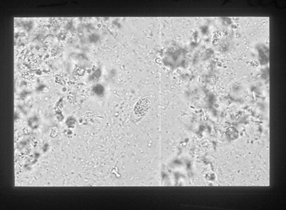
</td>

<td>  
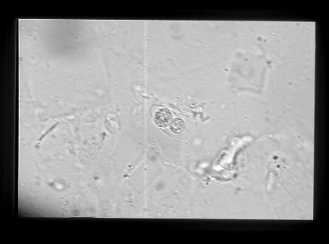
</td>

</tr>

<tr>

<td class="rtecenter" colspan="2" style="">

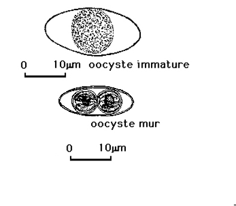

</td>

</tr>

</tbody>

</table>

*Clichés Dr. A.M. Deluol*
