

Les trématodes sont des vers plats non segmentés, qui comprennent les schistosomes et les douves. Cependant, ces deux parasites s’opposent sur plusieurs points. En effet, les schistosomes sont sexués et situés dans les vaisseaux alors que les douves sont hermaphrodites et localisées dans les voies biliaires. L’infestation s’effectue par voie transcutanée (schistosomes) ou buccale (douves). Enfin, ces zoonoses ont un cycle passant par un hôte intermédiaire : un mollusque (schistosomes) ou deux hôtes intermédiaires : un mollusque puis une plante ou un poisson (douves).

## I. Bilharzioses

Les bilharzioses ou schistosomiases (ou encore schistosomoses) sont des maladies très fréquentes en pays tropical, dues à des trématodes.

### 1. Epidémiologie

Les  parasites sont des trématodes blanchâtres. Le mâle (13 x 1 mm) est replié sur lui-même pour former un canal gynécophore pour accueillir la femelle filiforme (16 x 1 mm). Les vers adultes vivent environ 20  
ans.  
Il en existe cinq espèces différentes, dont les 3 premières en Afrique, avec une répartition géographique différente (figure 1) :

- *Schistosoma mansoni (S.m)* : agent de la bilharziose intestinale (cycle 3),
- *Schistosoma haematobium (S.h.)* : agent de la bilharziose urinaire (cycle 1),
- *Schistosoma intercalatum (S.i.)* : agent de la bilharziose rectale,
- *Schistosoma japonicum (S.j.)* : agent de la bilharziose artério-veineuse, (cycle 2)
- *Schistosoma mekongi (S.mk.)* : agent de la bilharziose artério-veineuse.

**Figure 1 : répartition géographique des bilharzioses**

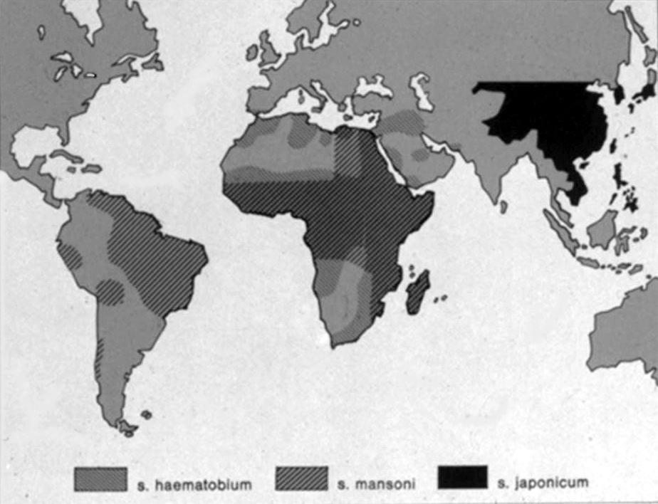

Le cycle passe par des mollusques spécifiques. Le malade  élimine  des œufs par ses excréta (selles ou urines selon le cas) (figure 2).

**Figure 2 : cycle général des bilharzioses**

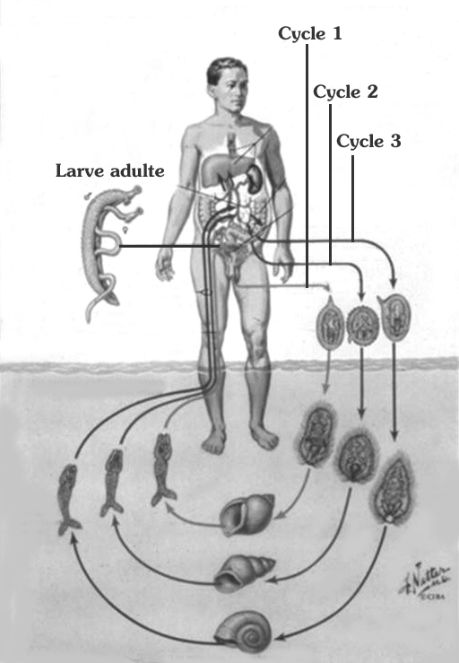

Ces œufs contiennent des embryons ciliés ou *miracidiums*. Dans  l'eau douce, les œufs éclosent ; les *miracidiums* sortent et vont  chercher les mollusques hôtes intermédiaires correspondant (figure 3) (Tableau I).

**Figure 3 : cycle de la bilharziose intestinale**

De ces mollusques, vont sortir des furcocercaires (de 500 microns de long) (figure 4) qui vont nager dans l'eau à la rencontre de l'hôte définitif (homme ou animal).

**Figure 4 : furcocercaires de schistosomes**

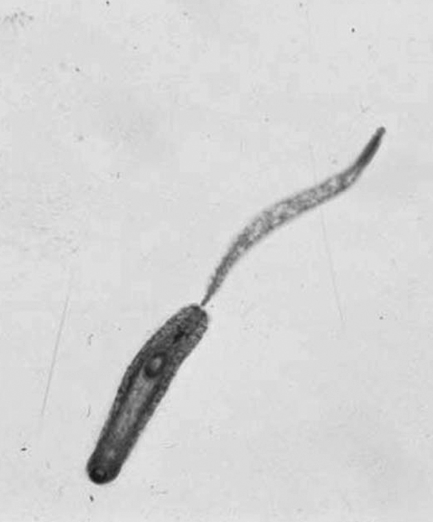

L’homme s’infeste lors de bains en eau douce (figure 5). Chez l'hôte définitif, seules les têtes des furcocercaires traversent la peau et deviennent des schistosomules qui gagnent alors les vaisseaux lymphatiques, le cœur droit, les poumons, le coeur gauche puis la grande circulation et enfin, les vaisseaux hépatiques.  
Au cours de cette migration, les larves muent et deviennent adultes dans le foie. Après l'accouplement, les vers adultes migrent dans leur territoire d'élection : vaisseaux de l'intestin pour S.m., S.i., S.j., S.mk et vaisseaux de la vessie pour S.h. Les œufs sont alors pondus et éliminés par les selles ou les urines.

**Figure 5 : mode de contamination**

### 2. Clinique

La pénétration des furcocercaires à travers la peau se manifeste par des réactions cutanées allergiques  transitoires (dermatite des nageurs).  Puis, la phase d'invasion est paucisymptomatique ou parfois marquée par un état infectieux : asthénie,  fièvre... ("fièvre des safaris"). Mais le plus souvent, les bilharzioses restent longtemps asymptomatiques.  
A la période d'état, les symptômes sont différents selon l'espèce en cause. Les patients sont plus souvent, même à ce stade, asymptomatiques. Toutefois, les signes les plus fréquents sont les suivants :

- *Schistosoma mansoni* : troubles digestifs (diarrhée, douleurs abdominales),
- *Schistosoma intercalatum* : diarrhées  sanglantes, rectite (évoquant une amibiase aigüe),
- *Schistosoma japonicum et S. mekongi* : troubles digestifs intenses (surtout chez l'enfant),
- *Schistosoma haematobium* : l'hématurie (terminale ou totale), symptôme fondamental, est indolore et considérée comme “physiologique” en Afrique (figure 6).

**Figure 6 : oeuf de *Schistosoma haematobium* dans une urine hématurique**

Des complications sont possibles, dues aux “granulomes bilharziens” formés par des réactions à corps étrangers autour des œufs (figure 7) :

- *Schistosoma mansoni* : hypertension portale ("cirrhose bilharzienne",)
- *Schistosoma japonicum* et *S. mekongi* : hypertension portale de survenue précoce, "cirrhose de l'enfant", en raison de la ponte de ces vers, environ 10 fois plus importante que les autres espèces,
- *Schistosoma haematobium* : tous les étages de l'arbre urinaire peuvent être touchés : perforation de l'urètre, tumeur vésicale (cancer de la vessie ?), sténose et dilatation des uretères, hydronéphrose, au maximum insuffisance rénale.

**Figure 7 : granulomes bilharziens dans un foie**

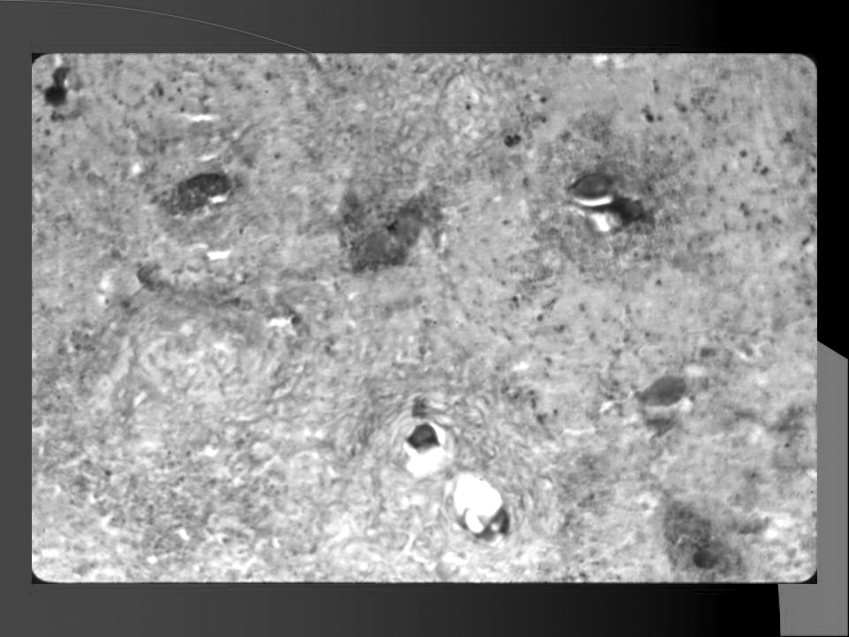

L'atteinte des organes génitaux est fréquente : induration de la prostate (éjaculation sanglante), salpingite, endométrite, vaginite, pouvant être responsable de stérilité. D'autres localisations sont possibles : thoracique,  pulmonaire,  myocardique ou neurologique (épilepsie, myélite), par migration erratique des œufs.

"Toute hématurie chez un africain doit faire évo quer une bilharziose urinaire".  
Le diagnostic direct de bilharziose est établi par l’examen parasitologique des selles et des urines, dans lesquels on identifie facilement les oeufs. Pour les urines, il est utile de faire sautiller le malade avant la miction.

- Dans les selles, *Schistosoma mansoni* : œuf ovale (110 x 60 microns), éperon latéral.
- *Schistosoma intercalatum* : œuf ovale (200 x 70 microns), éperon terminal important et recourbé.
- *Schistosoma japonicum* et *S. mekongi* : œuf arrondi (70 x 50 microns), éperon très court.
- Dans les urines, *Schistosoma haematobium* : œuf ovale (150 x 60 microns), éperon terminal.
- La biopsie rectale permet de retrouver les 4 espèces.

Le diagnostic indirect comprend l’hyperéosinophilie et  la  positivité  du  sérodiagnostic : électrosynérèse, hémagglutination, immunofluorescence, ELISA.  
Pour évaluer les conséquences de la maladie il est important de pratiquer les examens suivants :

- **Bilharziose urinaire** : bilan rénal, urée, créatinine, examen cytobactériologique des  urines, hématies-leucocytes-minute, échographie abdominale, urographie  intrveineuse (au maximum : "vessie porcelaine"). La cystoscopie doit être réservée au bilan pré-opératoire.
- **Bilharziose intestinale** : échographie abdominale.

### 4. Traitement

Les bilharzioses non compliquées, les plus fréquentes,  se traitent par le praziquantel à la dose de 40 mg/kg en 1 fois pour ***Schistosoma haematobium***, ***mansoni*** et ***intercalatum*** et 70 mg/kg en 1 fois pour ***Schistosoma japonicum*** et ***mekongi***.

Les anciens traitements par le niridazole, l’oxamniquine, le metrifonate sont devenus obsolètes.  
En cas de complications comme l'hypertension portale, la chirurgie est la même que celle de la cirrhose alcoolique (dérivation porto-cave). La chirurgie des complications urinaires consiste à remplacer la vessie inutilisable par une greffe d'intestin, sur laquelle on réimplante les uretères.

### 5. Prophylaxie

L'idéal est de couper le cycle afin d'éradiquer la maladie, mais cela est illusoire. Toutefois, plusieurs méthodes peuvent faire diminuer l'incidence de la maladie : 

- traitement des malades et des porteurs asymptomatiques,
- lutte contre les mollusques (hôtes-intermédiaires),
- développement de l'hygiène par l'éducation sanitaire. Empêcher les sujets atteints d'émettre leurs excréta près des points d'eau est idéaliste,
- la destruction des mollusques (avec des produits détruisant la flore et la faune) est anti-écologique.

La bilharziose est en voie d'extension, car la mise en valeur des territoires tropicaux entraîne une extension des surfaces irriguées, et donc des mollusques, avec une extension concomitante de la population agricole.

<table>
<caption>Tableau I : caractéristiques des différentes bilharzioses</caption>

<thead>

<tr>

<th class="rteleft" scope="col" style="">Espèces</th>

<th class="rteleft" scope="col" style=""><em>Schistosoma</em>  
<em>haematobium</em></th>

<th class="rteleft" scope="col" style=""><em>Schistosoma  
mansoni</em></th>

<th class="rteleft" scope="col" style=""><em>Schistosoma  
intercalatum</em></th>

<th class="rteleft" scope="col" style=""><em>Schistosoma  
japonicum</em></th>

<th class="rteleft" scope="col" style=""><em>Schistosoma  
mekongi</em></th>

</tr>

</thead>

<tbody>

<tr>

<td>Répartition  
géographique</td>

<td>Afrique  
Moyen-Orient</td>

<td>Afrique, Amérique centrale,  
Amérique du sud,  
Antilles</td>

<td>Afrique équatoriale</td>

<td>Extrême-Orient</td>

<td>Laos, Vietnam, Thaïlande, Cambodge</td>

</tr>

<tr>

<td>Mollusque</td>

<td>Bulin</td>

<td>Planorbe</td>

<td>Bulin</td>

<td>Oncomelania</td>

<td>Tricula</td>

</tr>

<tr>

<td>Hôte définitif</td>

<td>Homme</td>

<td>Homme, rongeurs</td>

<td>Homme</td>

<td>Homme  
Animaux</td>

<td>Homme  
Animaux ?</td>

</tr>

<tr>

<td>Localisation</td>

<td>Veine mésentérique inférieure  
Plexus hypogastrique</td>

<td>Veine mésentérique inférieure  
Plexus péricolique</td>

<td>Veine mésentérique inférieure  
Plexus rectal</td>

<td>Veine mésentérique supérieure</td>

<td>Veine mésentérique supérieure</td>

</tr>

<tr>

<td>Pathogénicité</td>

<td>Urinaire</td>

<td>Intestinale</td>

<td>Rectale</td>

<td>Hépatique</td>

<td>Hépatique</td>

</tr>

<tr>

<td>Complications</td>

<td>Dilatation et sténose urinaire</td>

<td>

Hypertension portale   
+/- tardive

</td>

<td>Rare</td>

<td>Hypertension portale précoce</td>

<td>Hypertension portale précoce</td>

</tr>

<tr>

<td>Traitement</td>

<td>Biltricide  
Chirurgie</td>

<td>Biltricide  
Chirurgie</td>

<td>Biltricide</td>

<td>Biltricide  
Chirurgie</td>

<td>Biltricide  
Chirurgie</td>

</tr>

</tbody>

</table>

## II. Distomatoses

Les distomatoses sont des parasitoses dues à des vers plats appelés les douves.  Une seule distomatose est cosmopolite : la distomatose hépatique à grande douve (*Fasciola hepatica*). Il existe aussi des douves de l’intestin et des poumons. Ces distomatoses sont toutes des zoonoses, maladies humaines et animales, qui évoluent dans la nature selon un cycle nécessitant le passage par deux hôtes intermédiaires.

### 1. Distomatoses à grande douve : *Fasciola hepatica*

#### a. Epidémiologie

Le parasite, *Fasciola hepatica*, est un ver de 3 cm, hermaphrodite, ovipare (Figure 8).

**Figure 8 : douve adulte**

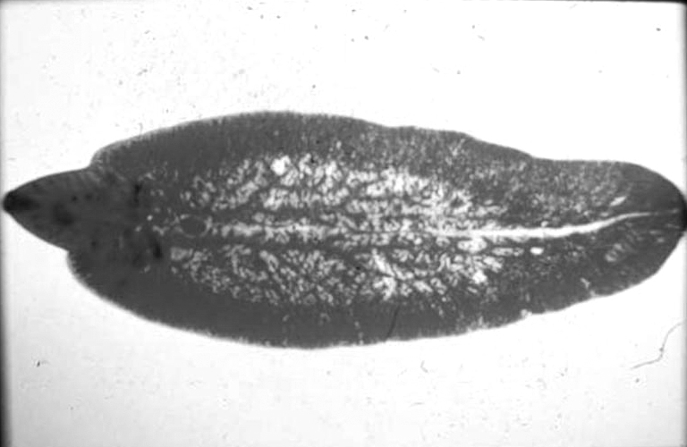  
         

Il atteint fréquemment les ovins et les bovins et accidentellement l'homme. Le var adulte vit dans les voies biliaires de l'animal (hôte définitif ) et émet des œufs qui sont éliminés avec les  fécès.  De l'œuf operculé s'échappe, en milieu aquatique, un embryon cilié ou miracidium, qui nage dans l'eau jusqu' à un mollusque d'eau douce :  la limnée (premier hôte intermédiaire). Après modifications et maturation, il en sort des cercaires ( figure 9) qui vont s'enkyster sur un    support végétal  (deuxième hôte intermédiaire) sous forme de métacercaire.

**Figure 9 : cercaires de douve**

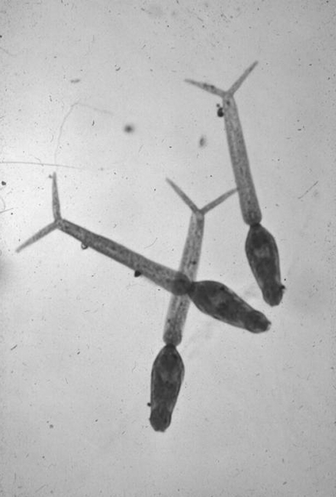

L'hôte définitif se contamine en consommant le végétal aquatique (cresson, mâche ou pissenlit) sur lequel sont fixés les métacercaires infestantes (figure 10).

**Figure 10 : cycle de la grande douve**

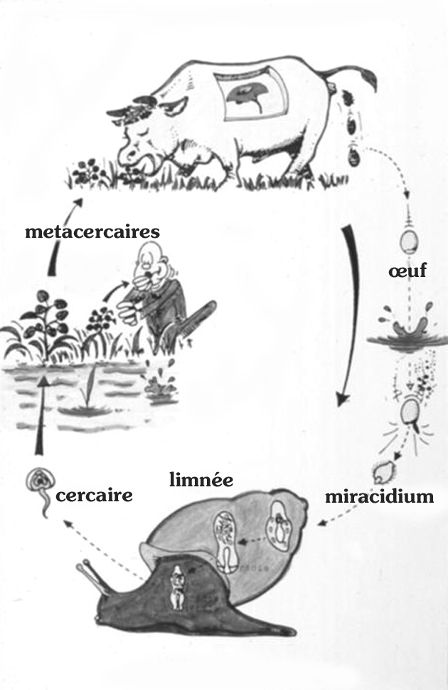

Dans l'estomac, l'enveloppe de la métacercaire est lysée par les ferments gastriques. La larve libérée, traverse les parois du tube digestif, gagne le foie, en perforant la capsule de Glisson et chemine dans le parenchyme hépatique jusqu'à un canal biliaire, son habitat définitif  (figure  11).

**Figure 11 : coupe de douves dans un foie**

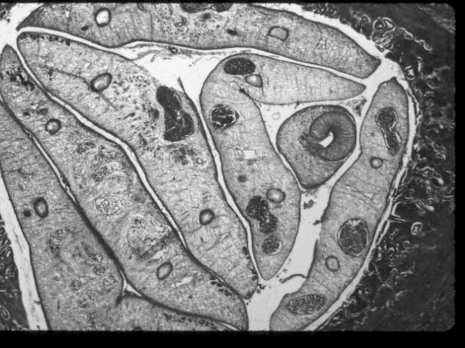

Elle s'y fixe, devient adulte et émet des œufs qui apparaîtront dans les selles, 3 mois après la contamination. Les  téguments de la douve étant pourvus d’aspérités (figure 12), irritent la paroi des voies biliaires qui réagit par une prolifération exubérante et  formations d’adénomes. La pathogénicité des douves est donc multifactorielle (spoliatrice,  mécanique, inflammatoire et toxique.

**Figure 12 : téguments externes d'une douve**

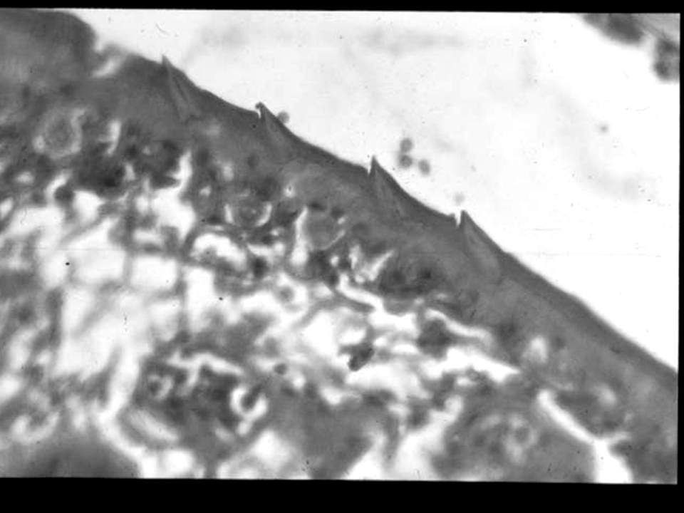

#### b. Clinique

La maladie évolue en deux phases, séparées par une accalmie relative :

- **La phase d'invasion toxi-infectieuse** correspond à la migration intra-hépatique de la larve, qui provoque quelques hématomes visibles à  l’échographie  hépatique (figure 13).

**Figure 13 : hématomes intra-hépatiques   
dus au passage des parasites**

**​**

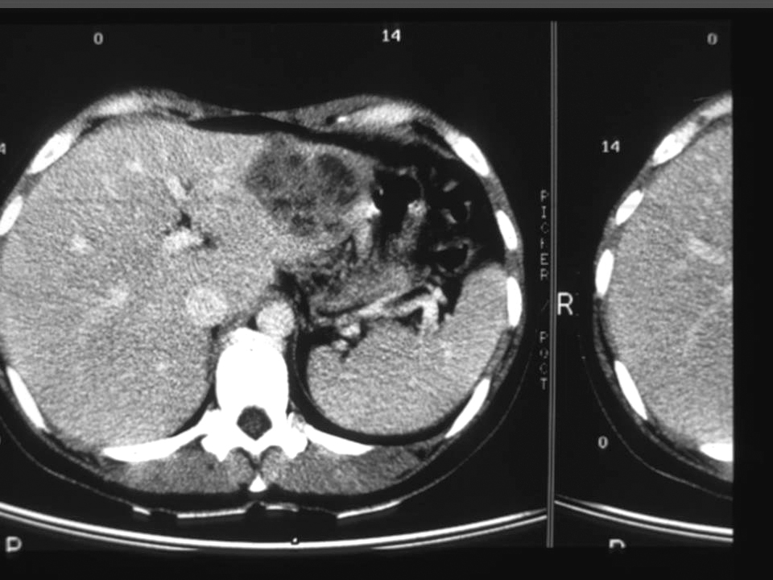

La phase d'invasion toxi-infectieuse débute une à plusieurs semaines après le repas infestant et dure plusieurs mois. Le traitement étant surtout efficace à ce stade, il est essentiel d'évoquer une distomatose devant les 4 signes suivants :

- des douleurs de l'hypocondre droit, avec irradiations vers  l'épigastre et l'épaule droite, parfois transfixiantes ;
- une fièvre irrégulière, autour de 38° C avec parfois des poussées à 40° C ;
- des signes allergiques : prurit, urticaire, dermographisme,  myalgies, arthralgies, parfois oedème de Quincke ;
- une hépatomégalie, fréquente, mais modérée.

D'autre part, l'état général du malade est altéré : asthénie, anorexie, amaigrissement, pâleur ou teint subictérique, avec parfois des signes congestifs de la base pulmonaire droite (la radiographie montre un  comblement  du  cul-de-sac  pleural  droit).  Ces troubles durent 2  à  3  mois  puis  s'estompent,  laissant  un  malade "convalescent," amaigri et  asthénique

- **La phase d’état** apparaît à partir du 3ème mois. Le parasite a alors achevé sa migration tissulaire et se trouve, au stade adulte, dans les canaux biliaires, d'où il commence à émettre des œufs.  
  A ce stade, on peut voir :
  - un  tableau d'angiocholite aiguë marqué par des douleurs avec  une défense de l'hypocondre droit, des vomissements, une  diarrhée, et des accès fébriles avec grandes oscillations thermiques et frissons ;
  - des crises de coliques hépatiques, pseudo-lithiasiques.  Ces  accidents sont répétés, simulant des rechutes de la lithiase hépatique. Ils évoluent sur plusieurs années si le diagnostic n'est pas fait (une douve peut vivre 10 ans  !), exposant le malade à  des complications infectieuses graves.

#### c. Diagnostic

A la **phase d'invasion** : le diagnostic à ce stade est posé grâce à l’hyperéosinophilie   et au sérodiagnostic (hémagglutination, électrosynérèse).  
A la **phase d'angiocholite**, la douve adulte émet des oeufs confirmant le diagnostic.  L’hyperéosinophilie et le sérodiagnostic sont encore positifs. On peut également retrouver des oeufs dans le liquide de tubage duodénal.  
Les examens sérologiques permettent de suivre l'évolution.

#### d. Traitement

A la phase d'invasion, le meilleur traitement actuel est le triclabendazole (10 mg/kg en une prise).  
A la phase d'état, le traitement est encore le  triclabendazole.  Mais bien souvent,  ces  malades sont vus en  chirurgie  pour  une obstruction mécanique des voies biliaires, évoquant un calcul des voies biliaires, le chirurgien y retrouve alors les douves.

### 2. Autres distomatoses

#### a.  Distomatoses hépatiques

- **En Europe :**  
  La petite douve du foie, Dicrocoelium dendriticum, très répandue chez le mouton est rare chez l'homme. Son cycle nécessite un mollusque terrestre (*Hellicella, Zebrina*) comme premier hôte intermédiaire et une fourmi  comme  2 ème hôte. L'infestation se fait par absorption accidentelle de fourmis,  en  particulier chez les enfants jouant dans la campagne.  Les  signes  cliniques  sont  d'intensité variable : troubles digestifs, manifestations neurologiques,  fièvre, altération de l'état général. Le  traitement repose sur le praziquantel  aux mêmes doses que pour la douve de Chine (cf. plus loin). L'absorption de pâté de foie parasité peut être à l'origine d'élimination d'œufs "en transit" dans les selles. Ces œufs sont cuits (marrons foncés) et sont nettement  plus petits que ceux de la grande douve (figure 14). Ils ne sont pas infestants et ne nécessitent donc aucune thérapeutique. Ce phénomène est assez fréquent.

**Figure 14 : œufs de grandes et petites douves**

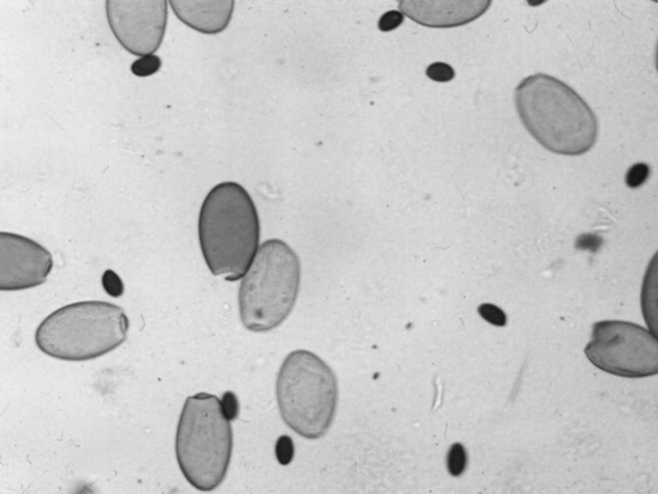

- **Outre-Mer :  
  *Fasciola gigantica*** est présente en Afrique. Le cycle et les signes cliniques sont  identiques à ceux de Fasciola hepatica. Seule différence, la dimension plus grande du parasite (jusqu'à 7 cm de long).

  **Douve de Chine** (***Clonorchis sinensis***)  
  Presque inconnue en Europe, il y a quelques années, elle est         maintenant assez souvent diagnostiquée chez les réfugiés du Sud-Est Asiatique (Viet-Nam, Cambodge, Laos).  
  Présente exclusivement en Extrême Orient, *Clonorchis sinensis*, dont la taille ne dépasse pas 1 cm, vit dans les voies biliaires de l'homme et de nombreux  
  animaux : chien, chat, porc et rat. Les œufs éliminés avec les selles libèrent, après éclosion en eau douce, un miracidium. Le premier hôte intermédiaire  est  un mollusque du genre Bithynia. Les cercaires vont ensuite s'enkyster chez des poissons cyprinidés ("poissons rouges"). L'homme se contamine en ingérant ces poissons d'eau douce, crus ou insuffisamment cuits (l’assaisonnement avec différentes sauces n’est pas l’équivalent d’une cuisson). Environ un mois après le repas infestant, les douves devenues adultes dans le foie, commencent à pondre.

  Les signes cliniques sont fonction de l'intensité du parasitisme, les infestations modérées sont bien tolérées, voire complètement  asymptomatiques. Mais la présence de plusieurs centaines de douves  provoque une symptomatologie évoquant une lithiase biliaire : crises de colique hépatique, poussées d'angiocholite, ictère rétentionnel douloureux et fébrile à rechutes. L'évolution peut être sévère et se compliquer d'une cirrhose biliaire et de  cholangiocarcinome. Le diagnostic est établi facilement par l'examen parasitologique des selles qui révèle les œufs caractéristiques. La sérologie,  peu  spécifique,  n'est  pas  utilisée  en  pratique. Le traitement sur une seule journée par le praziquantel, en trois prises de 25 mg/kg, donne d'excellents  résultats.  L'homme peut héberger d'autres douves de la même famille.

  ***Opistorchis viverrini*** : répandue surtout au Laos et en Thaïlande. Son hôte définitif est la civette. L'homme s'infeste en ingérant des carpes parasitées. La symptomatologie et le traitement sont identiques à ceux de *Clonorchis sinensis*, mais le diagnostic différentiel sur l'aspect des oeufs est pratiquement impossible.

- ***Opistorchis  felineus***,  ou douve des félidés, parasite l'homme, le chien, le chat et la loutre. Sa répartition géographique est plus répandue : Asie, Inde, Russie, et Europe Centrale.

#### b. Distomatoses intestinales

- ***Fasciolopsis buski*** (Asie), transmise par la "châtaigne d'eau" (Trapa natans) atteint l'homme et le porc.
- ***Metagonimus  yokogawaï***  (Asie),  transmise  par  les poissons d'eau  douce, atteint  l'homme, le chien, le chat, le rat...
- ***Heterophyes heterophyes*** : Sa répartition est très éten-  
  due  (Asie,  Egypte).  Il  s'enkyste sur les poissons des estuaires (Mugil). En Egypte, il est transmis par le "fessikh" (mulet mariné).

Toutes ces douves,  en cas d'infestation importante, peuvent donner des troubles digestifs avec une altération de l'état général. Le traitement est facile, par les  
antihelmintiques classiques (dont le niclosamide).

#### c. Distomatoses pulmonaires

Elles sont dues à des Paragonimus et sévissent surtout en Asie, un peu en Amérique (Nord et Sud), et sont mal connues en Afrique.

- les hôtes définitifs sont nombreux : homme, chien, chat, porc, tigre, panthère, loup, loutre, rat...
- l’hôte intermédiaire est un  mollusque (Melania),
- l’hôte d'enkystement est un crustacé d'eau douce (crabe ou écrevisse),
- les symptômes sont pulmonaires (toux, expectoration, hémoptysie),  les  parasites étant localisés au niveau des poumons ( figure 15).

Les  œufs  sont  recherchés  dans  l'expectoration.  Ils sont souvent régurgités et  retrouvés aussi dans les selles).

**Figure 15 : coupe de *Paragonimus* dans un poumon**

### 3. Prophylaxie des distomatoses

Cette prophylaxie commence par la connaissance précise du cycle de chaque douve. Le cycle connu, on essaye de l'interrompre :

1.  Contre la dissémination des œufs : dans la nature on peut difficilement lutter : une grande partie du bétail est parasitée et entraîne la perpétuation du cycle. L'homme joue un rôle négligeable dans ce cycle.
2.  Contre les hôtes intermédiaires : la lutte contre les mollusques se heurte à de grandes difficultés, les problèmes écologiques posés sont très complexes. On peut essayer le désherbage, la mise à sec, (mais les mollusques s'enfoncent dans la  terre pour attendre le retour de l'humidité),  et les poissons molluscophages.
3.  Contre les hôtes d'enkystement des métacercaires, qu'il s'agisse de végétaux ou d'animaux : cette destruction  est  irréalisable  puisqu'il  s'agit  d'aliments souvent indispensables aux populations locales.
4.  Les mesures les plus efficaces en principe seraient d'empêcher la consommation de ces hôtes crus ou mal cuits. Mais il s'agit généralement de pratiques ancestrales qu'il est difficile de modifier.

*Développement et Santé, N° 185, 2007*
