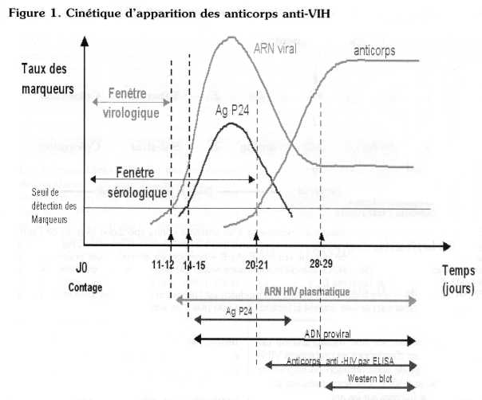
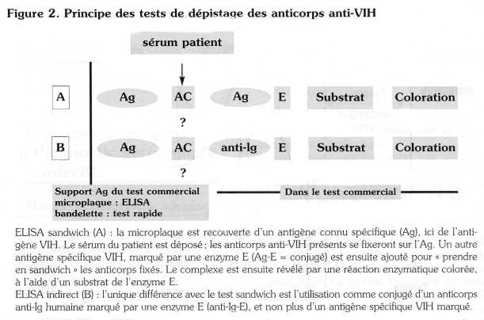
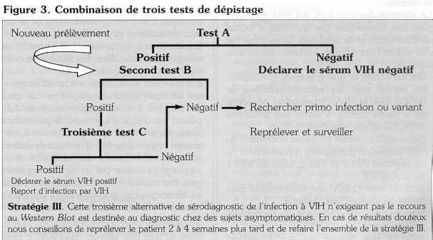
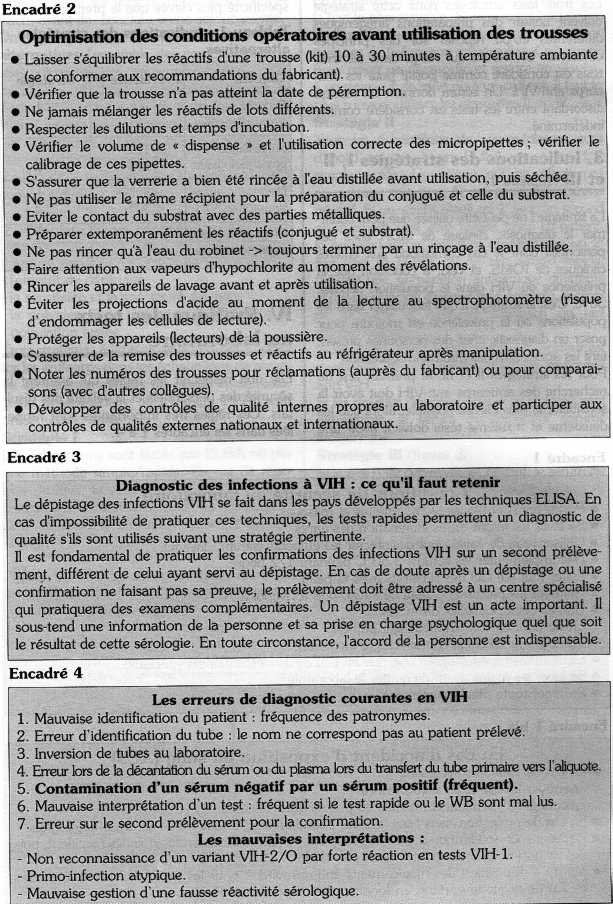

**Diagnostic sérologique des infections à VIH**

**Jean-Christophe Plantier et François Simon**

Laboratoire de virologie CHU Charles Nicolle 76031 ROUEN

[Francois.Simon@chu-rouen.fr](mailto:Francois.Simon@chu-rouen.fr)

**I. Principes et moyens** **du diagnostic sérologique** **des infections à VIH**

**1. Bases du diagnostic sérologique**

Le diagnostic des infections à VIH repose, chez l'adulte, sur la détection des anticorps. Le développement des techniques de biologie moléculaire ne permet pas, pour l'heure, de remplacer les techniques sérologiques qui restent partout dans le monde les techniques de référence pour le dépistage et la confirmation des infections à VIH de l'adulte. Seul le diagnostic précoce dans les premiers mois de vie chez l'enfant né de mère séropositive nécessite la mise en évidence du virus, de ses composants ou de son génome.

**Cinétique des anticorps anti-VIH :**

Une bonne connaissance de la cinétique des anticorps et de l'antigène p24 est indispensable à l'interprétation des tests VIH. La _figure 1_ résume les différentes situations. Après la contamination, le virus est délectable, sous sa forme d'acide ribonucléique (ARN) dès le 10-12e jour et sous sa forme d'antigène p24 représentant juste une fraction du virus, vers le 12-14e jour. Les premiers anticorps sont délectables vers le 21e jour. Cette cinétique peut varier en fonction de chaque patient et aussi de la souche infectante. La positivité des tests de dépistage dépend donc de l'apparition des anticorps. Actuellement, les tests de dépistage utilisés en Occident sont le plus souvent capables de détecter, en plus des anticorps, simultanément, la fraction "antigène p24". L'utilisation de ces tests raccourcit donc la période de "silence" sérologique lors de la primo-infection. Une fois produits par la réponse immune, les anticorps anti-VIH persisteront toute la vie du patient.

**La diversité des VIH complique le** **diagnostic sérologique**

Il existe deux types d'infection, par VIH-1 et VIH-2, qui ont une prise en charge spécifique. Le diagnostic de différenciation entre les deux types est fondamental. Ces virus proviennent de passages accidentels de virus de singes (SIV) dans l'espèce humaine.

*   Le VIH-1 est divisé en 3 groupes, M, N et O. Le groupe M (pour Majeur) est responsable de la pandémie actuelle, les autres groupes étant rares. Le groupe Majeur est subdivisé en une dizaine de sous-types (nommé de A à K) et souches recombinantes. Le sous-type B est le plus répandu en Occident, dans les populations homosexuelles et toxicomanes. En Afrique centrale, tous les sous-types sont représentés. Le sous-type A et la forme recombinante entre sous-types A et G, dite CRF02, sont responsables d'un grand nombre d'infections en Afrique de l'Ouest. Les sous-types C et D sont majoritaires en Afrique de l'Est et en Afrique du Sud. Les virus du groupe O (pour Outlier), peu fréquents, sont trouvés presque exclusivement en Afrique centrale (Cameroun, Gabon, Guinée-Equatoriale).  
*   Pour le VIH-2, plusieurs sous-types ont été décrits. Seuls les sous-types A (Cap-Vert, Guinée-Bissau, Guinée, Sénégal) et les sous-types B (Côte-d'Ivoire, Mali et Burkina-Faso) ont une diffusion épidémique.

Les tests de dépistage, basés sur des antigènes du VIH-1 de sous-type B d'Occident et du VIH-2 de sous-type A peuvent présenter une sensibilité moindre pour la reconnaissance des autres sous-types, particulièrement lors de la primo-infection ou d'infection par des variants très "distants", comme les VIH-1 du groupe O.

**2. Principes des tests de dépistage**

Le dépistage des anticorps anti-VIH-1 et anti-VIH-2 s'effectue le plus souvent par des tests dits ELISA (_enzyme-linked immunosorbent assay_) ou par des tests simples/rapides utilisant comme antigènes des lysats viraux ou des protéines recombinantes ou synthétiques.

Ces protéines correspondent aux épitopes immuno-dominants des deux virus, VIH-1 et VIH-2. Ces tests "mixtes" sont donc capables de dépister les anticorps anti-VIH-1 et antiVIH-2.

**Deux types de tests ELISA sont utilisés** **pour le dépistage :**

*   **Tests ELISA " sandwich " :** la révélation de la réaction entre antigènes de la trousse (kit) et les anticorps anti-VIH du patient se fait, par un antigène marqué, se fixant sur les sites anticorps restés libres _(figure 2)_ Ce sont les tests les plus sensibles pour la détection des anticorps anti-VIH et la spécificité est également excellente. Ils sont les plus utilisés dans le cadre du dépistage des dons du sang. Ces tests ELISA sandwich peuvent être utilisés aussi pour la détection en plus des anticorps présents chez le patient, d'une fraction du virus appelé antigène p24 lorsque cette fraction est présente dans le plasma (test combiné). Cela est particulièrement intéressant lors des premiers jours de la primo-infection quand seule cette fraction antigène p24 peut être détectée par les tests sérologiques.

*   **Les tests ELISA "indirects"** ou la fixation des anticorps du patient sur les antigènes de la trousse est révélée par une anti-globuline humaine anti-IgG marquée par une enzyme (_figure 2)_ Ce sont des tests robustes, peu sensibles aux variations antigéniques du VIH. Ils manquent de sensibilité lors de la primo-infection et leur spécificité est médiocre (nombreux résultats faussement positifs).

**Tests simples/rapides**

Ce sont le plus souvent des tests dits par immunochromatographie, avec une filtration ou une migration du sérum sur une membrane ou un support recouvert d'antigènes recombinants VIH-1 et VIH-2. Lors de cette filtration ou migration, les anticorps anti-VIH, s'ils sont présents dans l'échantillon, se fixeront sur les antigènes présents sur le support. La révélation de cette liaison antigène-anticorps se fait généralement par un conjugué. Le test se réalise en une dizaine de minutes en général et se fait de façon unitaire.

Cette simplicité d'emploi leur assure une large diffusion dans les pays en développement.

Les tests simples/rapides par agglutination sont également de réalisation simple, mais l'interprétation peut être parfois difficile. Des antigènes viraux sont déposés sur des micro-particules fournies par la trousse. Mis en présence d'un sérum contenant des anticorps anti-VIH, les micro-particules s'agglutinent en donnant une réaction visible à l'oeil nu.

Pour l'ensemble de ces tests, l'absence de résultats quantifiés et enregistrés sur support papier est un obstacle à la traçabilité des manipulations.

**3. Tests de confirmation**

**Le test de confirmation doit obligatoirement s'effectuer, quelle que soit la technique, sur un prélèvement différent de** **celui ayant servi au dépistage.**

En effet de nombreux artefacts peuvent venir du prélèvement ayant servi au dépistage (contamination, erreur d'enregistrement, fausse réactivité). Aussi, pour rendre un diagnostic de séropositivité vis-à-vis du VIH, il faut s'assurer que le patient a été reprélevé et que le ou les test(s) de confirmation ont été réalisés sur le second prélèvement.

**La technique du _Western Blot_** (WB) est une méthode de référence, mais son interprétation peut être délicate. Le WB est une technique de transfert sur nitrocellulose, après migration électrophorétique en gel de polyacrylamide, de protéines d'un lysat viral VIH-1 ou VIH-2. Sur la bandelette de WB, différentes protéines constitutives des virus seront reconnues par des anticorps spécifiques anti-VIH-1 ou VIH-2. Le recours au WB pour une confirmation de sérologie VIH positive n'est pas systématique dans tous les pays, y compris dans les pays industrialisés. Il porte, en toute rigueur, sur un second prélèvement sérique, pour se mettre à l'abri d'une éventuelle erreur d'étiquetage du premier prélèvement. Il permet parfois d'évoquer une séroconversion récente ou une infection par des variants lors de profils incomplets. En cas d'infection à VIH, le WB sera le plus souvent pleinement réactif et donnera peu d'information complémentaire. Inversement, en cas de "non infection", des réactivités non spécifiques sont fréquentes et d'interprétation difficile. Aussi, des alternatives au WB sont nécessaires pour éviter un recours systématique à cet examen coûteux et pas toujours très informatif.

*   **Les immunoblots utilisant des protéines** **de synthèse :** ces tests de commercialisation récente et d'un coût aussi élevé que le WB disposent différentes protéines recombinantes ou peptides de synthèse sur bandelette ou sur support plastique. Ces tests ne sont qu'une présentation sur un format différent des antigènes utilisés lors des examens de dépistage et ils n'apportent ainsi aucune information complémentaire.  
*   **Il. Tests disponibles**

Les tests mis à la disposition des laboratoires soutenus par le ministère des affaires étrangères dans le cadre des programmes de soutien et de coopération sont des tests disponibles utilisés en France, ayant donc reçu l'agrément de l'AFSSAPS et régulièrement réévalués.

La sélection des tests dans des pays étrangers peut être compliquée par les réseaux locaux de distribution et de stockage. En tout cas, on doit exiger pour choisir des tests, les critères suivants :

- une sensibilité et une spécificité maximales, en accord avec les recommandations de l'ONUSIDA et de l'Organisation Mondiale de la Santé (OMS), à savoir une sensibilité > 99,5 % et une spécificité > 99 %,

- des réactifs couvrant au mieux la diversité du VIH (utilisation d'antigènes recombinants ou de peptides VIH-1 et VIH-2, voire de VIH-1 du groupe O),

- pour les tests ELISA, une compatibilité avec toutes les chaînes "microplaque",

- pour les tests simples/rapides, la capacité de différencier VIH-1 et VIH-2,

- enfin, il faut pouvoir disposer facilement d'au moins trois tests différents pour effectuer les stratégies alternatives.

La liste actualisée des différents réactifs agréés par l'AFSSAPS sera publiée prochainement_._ Les deux sites internet sur les tests de dépistage _(voir ci-dessous)_ renseignent sur les trousses disponibles et leur performance

<table>

<tbody>

<tr>

<td valign="top">Site OMS :

http:/www.who.int/bct/Main_areas_of_work/BTS/HIV_Diagnostics/Evaluation_reports/Opérational%20Characteristics_HIV%20Report11.pdf

</td>

</tr>

<tr>

<td valign="top">Site AFSSAPS : http:/afssaps.sante.fr</td>

</tr>

</tbody>

</table>

**III. Stratégies alternatives** **pour la confirmation** **des infections à VIH en condition de terrain**

**1. Principes**

Deux points sont fondamentaux lors d'une démarche de dépistage et de confirmation :

- l'examen de confirmation, quelle que soit la technique ou la stratégie choisie, se fera exclusivement sur un prélèvement sanguin différent de celui sur lequel le dépistage a été réalisé. En effet, des erreurs involontaires d'identification des prélèvements, voire volontaires, sont possibles. Enfin, les contaminations de sérum sont fréquentes, et ce d'autant plus qu'un grand nombre de prélèvements positifs est manipulé comme dans les laboratoires des régions de forte prévalence VIH.

- lorsqu'un test de dépistage est positif et que le test de confirmation est négatif, on ne peut pas conclure à la non-infection et un suivi du patient est obligatoire. En cas de persistance d'une discordance (dépistage positif et confirmation négative) au-delà d'un mois de suivi et en l'absence de facteur de risque VIH ou de suspicion d'infection par un variant, le patient peut être considéré comme faussement réactif au dépistage et on peut conclure à une "non infection" VIH. Si une infection par un variant est suspectée, il faut savoir imposer un suivi long, d'au moins six mois en cas de discordances entre les tests de dépistage/confirmation, avant de conclure à une séronégativité. On regroupe sous le terme de **stratégies** **alternatives** l'ensemble des combinaisons de tests qui permettent, dans une situation épidémiologique et clinique donnée, de porter le diagnostic d'infection ou de "non infection" à VIH. Ces stratégies reposent sur la détection des anticorps et ont pour objectif d'obtenir des valeurs prédictives positives ou négatives égales à celles de la stratégie classique utilisant le WB comme test de confirmation.

**2. Choix d'une stratégie**

Il repose sur :

- l'objectif du dépistage

- la sensibilité et la spécificité des tests

- la prévalence de l'infection à VIH dans la population testée.

Trois stratégies adaptées de l'OMS pour détecter les anticorps dans les échantillons de sérum ou de plasma (extraits du relevé épidémiologique hebdomadaire du 21 mars 1997) sont présentées ci-après :

**Stratégie I**

Les échantillons sont testés par ELISA ou par une méthode simple/rapide. En cas de réaction positive, le sérum est considéré comme positif pour les anticorps anti-VIH. En l'absence de réaction, le sérum est considéré comme négatif.

En transfusion sanguine, il convient de choisir le test le plus sensible. Si le résultat est positif, le don de sang doit être éliminé selon les mesures de précaution universelles. Cela étant, pour poser un diagnostic et rendre un résultat à un donneur de sang ou à un patient, il faut le plus souvent utiliser les stratégies Il ou III.

**Stratégie Il**

Tous les échantillons de sérum/plasma sont d'abord soumis à un ELISA ou à un test simple/rapide. Un sérum qui ne réagit pas au premier test (test A) est considéré comme négatif. Si un sérum réagit au 1e test, un second prélèvement doit être réalisé chez le patient, le nouveau sérum doit être analysé avec un 2e test (test B) ELISA ou un test simple/rapide, utilisant une préparation antigénique différente et/ou un principe différent (par exemple, méthode indirecte et méthode sandwich ou test simple/rapide).

Si les 2 tests A et B sont positifs, le porteur est considéré comme positif pour les anticorps anti-VIH.

Si les résultats des deux tests A et B demeurent discordants, le sérum est considéré comme indéterminé.

**Stratégie III** _(figure 3)_

Si le test A de dépistage est négatif, le sérum est déclaré négatif. En cas de positivité du test A, comme pour la stratégie II, un nouveau prélèvement est réalisé. Si ce sérum réagit au 2e test B, la stratégie III fait appel à un 3e test (test C).

Les trois tests employés dans cette stratégie doivent utiliser des préparations antigéniques différentes et/ou reposer sur des principes différents. Un sérum qui réagit dans les trois tests est considéré comme positif pour les anticorps anti-VIH. Un sérum donnant un résultat discordant entre les tests est considéré comme indéterminé.

**3. Indications des stratégies I, Il et 111** _(Tableau 1)_

La stratégie I ne peut être utilisée que pour confirmer le diagnostic clinique de SIDA chez des personnes dont le cas correspond aux critères cliniques de l'OMS, et cela, à condition que la prévalence du \AH dans la population dépasse 30 %. C'est la stratégie Il qu'il faut utiliser dans les populations où la prévalence est moindre pour poser un diagnostic chez des personnes présentant les signes cliniques d'immuno-dépression.

Pour les stratégies Il et III, le premier test de recherche des anticorps anti-VIH doit avoir la sensibilité la plus élevée possible, alors que les deuxième et troisième tests doivent avoir une spécificité plus élevée que le premier test.

**IV. Pratique des tests** **au laboratoire**

Elle doit respecter les règles qui assurent la sécurité des personnels et la validité des résultats. Ces règles très importantes sont rappelées dans les encadrés 1 à 4.

_Développement et Santé, n°162, décembre 2002_