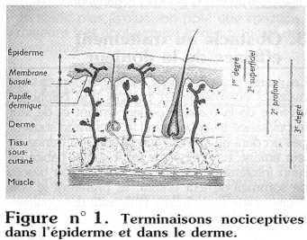
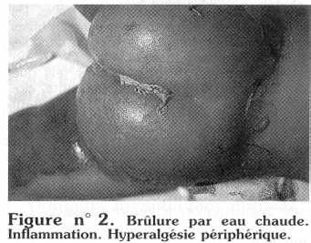
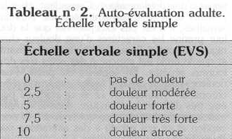

Les brûlures sont une des pathologies les plus douloureuses qu'il soit possible à un individu de subir :

- parce que la douleur continue dont elles sont responsables et la douleur intermittente due aux actes thérapeutiques peuvent atteindre des niveaux d'intensité extrêmement élevés;

- parce que la répétition de ces actes, pendant plusieurs semaines, peut être ressentie comme une véritable torture.

## **Pourquoi traiter la douleur du brûlé ?**

En dehors de préoccupations purement humanitaires, il est maintenant bien démontré que la douleur du brûlé ne lui fait pas de bien :

- elle constitue un facteur d'hypermétabolisme donc de dénutrition et de moindre résistance aux infections ;

- elle peut entraîner des troubles psychiques, qui peuvent gêner la thérapeutique au stade aigu, et qui peuvent retarder la rééducation ultérieurement.

## **Mécanismes de la douleur du brûlé**

### **1. Nociception**

La douleur du brûlé est due à la stimulation des nocicepteurs cutanés présents dans l'épiderme et aussi assez profondément dans le derme _(figure n° 1)_. Ceux qui ont été détruits sont inactifs, jusqu'à ce qu'ils commencent à régénérer ; ceux qui sont intacts ou seulement partiellement lésés continueront à générer des influx douloureux.

### **2. Hyperalgésie**

Immédiatement après la brûlure, la réponse inflammatoire sensibilise les nocicepteurs actifs _(figure n° 2)_ et ceci de façon durable, puisque l'inflammation persistera au niveau de la lésion tant que la cicatrisation ne sera pas complète et même parfois au-delà. Cette hyperalgésie périphérique peut se compléter d'une hyperalgésie centrale, lorsque des actes nociceptifs répétés comme les pansements, ne sont pas contrôlés par une analgésie suffisante. On peut alors assister à de véritables embrasements des systèmes de transmission centraux de la douleur, le moindre stimulus au niveau de la lésion ou même à distance, devenant intolérable.

#### **Caractéristiques cliniques de la douleur du brûlé**

_La douleur continue_ : elle est ressentie au niveau de la brûlure, mais aussi des sites donneurs de greffes. Elle est relativement peu intense et assez facilement contrôlée par l'immobilisation et la thérapeutique.

_Les douleurs dues aux actes thérapeutiques_ ce sont non seulement les pansements mais toutes les procédures qui impliquent des mouvements ou des contacts, notamment la kinésithérapie. Les niveaux très élevés de douleur atteints lors de ces traitements et le fait qu'ils soient infligés de façon répétitive, font de la brûlure une des pires expériences douloureuses possible.

#### **Douleur après cicatrisation**

La prévention et le traitement des cicatrices hypertrophiques pendant la phase de réhabilitation sont l'occasion de nouveaux types de douleur ; plus tardivement, les brûlures cicatrisées peuvent être le siège de douleurs neuropathiques ayant une symptomatologie voisine des douleurs post-zoostériennes.

#### **Intensité**

L'intensité de la douleur du brûlé est par essence extrêmement variable :

- d'un instant à l'autre, pour un même patient,

- d'un patient à l'autre, pour des lésions apparemment identiques.

Il est donc très difficile de la prédire, d'autant plus qu'elle n'a aucune relation avec le sexe, l'âge, ou les caractères socio-démographiques, contrairement à certaines idées reçues.

#### **Evolution**

Initialement, la douleur du brûlé a les caractéristiques d'une douleur aiguë. Cependant, chez les patients dont le traitement nécessite plusieurs semaines, il n'est pas exceptionnel que la douleur prenne les caractères d'une douleur chronique, surtout si l'analgésie n'est pas suffisante et que le brûlé est exposé à des actes très douloureux répétés. En somme, on passe d'une douleur " aiguë aiguë " à une douleur " aiguë chronique " _(tableau n° 1)._ À ce stade, il peut être très difficile de distinguer, dans la symptomatologie douloureuse, ce qui revient à la nociception et ce qui est dû à des altérations psychiques, ce qui peut conduire à des aberrations thérapeutiques comme une insuffisance d'analgésie et un excès de psychotropes, et vice versa.

#### **Traitement**

**Principes**

1) Traiter et évaluer séparément la douleur continue et la douleur due aux actes.

2) Utiliser un petit nombre de médicaments compatibles les uns avec les autres, dont on connaîtra parfaitement la pharmacologie.

3) Prévoir des protocoles écrits permettant une adaptation aux grandes variations qui

peuvent exister dans l'intensité de la douleur.

Ceci n'est possible qu'avec :

4) Une évaluation systématique de la douleur.

**Brûlés ambulatoires**

_- Pansements_ : on peut faire une prémédication par de la morphine en solution, avec une dose de départ de 1 mg/kg de poids, administrée une heure avant. Si l'analgésie n'est pas suffisante, il faudra pour le pansement suivant augmenter cette dose de 50 % au moins.

_- Douleur continue :_ à domicile :

*   Prendre régulièrement toutes les 4 heures du paracétamol jusqu'à 100 mg/kg/24 heures) ou/et un anti-inflammatoire (aspirine jusqu'à 50 mg/kg/24 heures).
*   Si cela ne suffit pas, y associer toutes les 4 heures un morphinique du pallier 2, comme le dextropropoxiphène ou la codéine.

**Brûlés hospitalisés**

_- Douleur continue_ : utiliser la morphine sous toutes ses formes.

*   Voie parentérale : cette voie est très utile pendant les 48 premières heures, après admission, et en période postopératoire, car elle permet un ajustement rapide des doses nécessaires. Commencer avec 50 ?g/kg/h en rajoutant des bolus ?gaux ? 50 % de la dose horaire, avec un maximum de 3 par heure. Si ces doses ne sont pas suffisantes, augmenter la dose horaire de 100 %. Ce protocole est plus facile à administrer avec une PCA.
*   La voie sous-cutanée est très intéressante chez le malade non perfusé, ne disposant pas de voie veineuse ou chez les enfants. On peut très bien l'utiliser en infusion continue, à condition de s'abstenir de faire des bolus trop importants de surcroît.
*   Voie orale : on passe de la voie parentérale à la voie orale en multipliant les doses par deux. Par exemple: si le patient a reçu 60 mg de morphine/24 heures, par voie parentérale, on donnera un comprimé de morphine à libération prolongée à 60 mg toutes les 12 heures, ou 20 mg de morphine en solution orale toutes les 4 heures.

**Douleur due aux actes**

*   Voie orale _(figure n° 3)_ : comme en ambulatoire, certains pansements, relativement peu douloureux, peuvent être réalisés avec une prémédication par de la morphine orale (commencer avec une dose de 1 mg/kg une heure avant). Augmenter par pallier de 50 % si l'analgésie est insuffisante.

_- Voie parentérale (figure n°4):_ on dispose actuellement de morphiniques puissants, d'action très courte, comme l'alfentanil ou le remifentanil. Ils sont idéaux pour les pansements des brûlés, car la dépression respiratoire qu'ils peuvent entraîner en cas de surdosage n'est jamais prolongée ni retardée, donc facilement traitée. Toutefois, en fonction des possibilités, on peut utiliser la pentazocine ou la kétamine.

_Les enfants_ : il faut les traiter exactement comme les adultes ! Et d'autant mieux qu'il est parfaitement prouvé actuellement qu'ils sont d'autant plus sensibles à la douleur qu'ils sont plus petits. Attention cependant avant 3 mois, où les doses de morphiniques doivent être divisées par 3 en raison de l'immaturation de leur métabolisme.

_Les vieillards_ : attention aussi ! Les morphiniques peuvent avoir chez eux de fâcheuses conséquences respiratoires (encombrement) car ils dépriment la toux et l'amplitude respiratoire, surtout dans le traitement de la douleur continue. Il faudra donc réduire les doses et utiliser des adjuvants ayant un effet d'épargne en opiacés comme le paracétamol et les anti-inflammatoires.

**Évaluation**

Un traitement de la douleur efficace ne peut être réalisé en toute sécurité sans évaluation. Il faut pour cela utiliser des méthodes simples.

_Pour les adultes_ : une auto évaluation par l'échelle verbale numérique (donner une note de 0 à 10 à la douleur) ou une échelle verbale simple faisant appel au langage (_tableau_ _n° 2_) ou encore des représentations graphiques adaptées.

Pour _les enfants_ : l'auto évaluation est possible après 5 ans ; avant 5 ans, utiliser une échelle d'hétéro-évaluation comme l'échelle CHEOPS.

Toutes ces méthodes sont très suffisantes et très faciles à appliquer à condition de les administrer en routine, ce qui est souvent extraordinairement difficile à obtenir dans une unité de soins ni ne l'a jamais fait. Parmi toutes les mesures organisation et de formation, qui sont nécessaires, il est particulièrement fondamental d'intégrer l'évaluation de la douleur de façon écrite dans la feuille de surveillance des patients, au même titre que la tension, le pouls ou la diurèse ! De même est-il très important que les protocoles écrits dont disposent les infirmières soient suffisamment souples pour leur permettre d'adapter elles-mêmes la thérapeutique nécessaire en fonction de l'évaluation de la douleur.

### **Conclusion**

La douleur du brûlé n'est pas une fatalité. Son éradication est parfaitement possible sans effet iatrogène. Son contrôle est essentiel pour la qualité des soins au stade aigu. Il est aussi indispensable à la prévention des troubles psychiques qui peuvent survenir à la suite de ce traumatisme, particulièrement mutilant.

_Développement et santé, n° 131, octobre 1997_